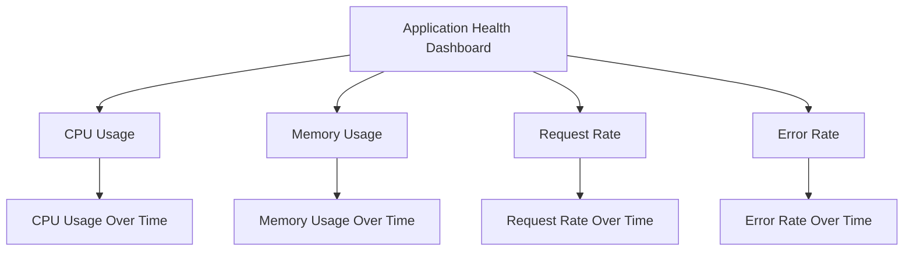

## 26.6. Monitoring Application Health

In the world of software engineering, ensuring the health and robustness of applications is paramount. For Elixir applications, which often power critical systems, monitoring application health is not just a best practice—it's a necessity. This section will guide you through the essential components of monitoring application health in Elixir, including health checks, logging, metrics, and alerting systems.

### Health Checks

Health checks are a fundamental aspect of monitoring application health. They provide a mechanism to verify that your application is running correctly and can respond to requests. Health checks are typically implemented as endpoints that report the status of the application.

#### Implementing Health Check Endpoints

To implement a health check endpoint in Elixir, you can create a simple Phoenix controller that responds with the application's status. Here's an example:

```elixir
defmodule MyAppWeb.HealthCheckController do
  use MyAppWeb, :controller

  def index(conn, _params) do
    # Perform checks to determine application health
    if application_healthy?() do
      json(conn, %{status: "ok"})
    else
      conn
      |> put_status(:service_unavailable)
      |> json(%{status: "unavailable"})
    end
  end

  defp application_healthy? do
    # Add logic to check application components
    true
  end
end
```

In this example, the `application_healthy?/0` function should contain logic to check the health of various components, such as database connections, external service availability, and internal process health.

#### Integrating with Load Balancers and Orchestration Tools

Health checks are often used by load balancers and orchestration tools to determine the availability of application instances. By integrating health check endpoints with these tools, you can automate recovery processes, such as restarting failed instances or rerouting traffic to healthy nodes.

For example, in Kubernetes, you can define a readiness probe that uses your health check endpoint:

```yaml
apiVersion: v1
kind: Pod
metadata:
  name: myapp
spec:
  containers:
  - name: myapp
    image: myapp:latest
    readinessProbe:
      httpGet:
        path: /health
        port: 4000
      initialDelaySeconds: 5
      periodSeconds: 10
```

### Logging and Metrics

Logging and metrics are crucial for understanding the behavior of your application and diagnosing issues. Elixir provides powerful tools for structured logging and metrics collection.

#### Using Logger for Structured Logging

Elixir's built-in `Logger` module allows you to log messages with different levels of severity, such as `:debug`, `:info`, `:warn`, and `:error`. Structured logging involves adding metadata to log messages to provide context.

Here's an example of using `Logger` with metadata:

```elixir
require Logger

defmodule MyApp.Worker do
  def perform(task) do
    Logger.metadata(task_id: task.id)
    Logger.info("Starting task")

    # Perform the task
    result = do_work(task)

    Logger.info("Task completed", result: result)
  end

  defp do_work(task) do
    # Simulate work
    :ok
  end
end
```

By adding metadata, you can filter and search logs more effectively, making it easier to diagnose issues.

#### Collecting Metrics with Telemetry

Telemetry is a dynamic dispatching library for metrics collection in Elixir. It allows you to instrument your code and collect metrics without being tied to a specific monitoring system.

To use Telemetry, you need to define events and attach handlers. Here's a basic example:

```elixir
defmodule MyApp.Metrics do
  use Telemetry.Metrics

  def metrics do
    [
      counter("http.request.count"),
      summary("http.request.duration", unit: {:native, :millisecond})
    ]
  end
end

defmodule MyAppWeb.Endpoint do
  use Phoenix.Endpoint, otp_app: :my_app

  plug Plug.Telemetry, event_prefix: [:phoenix, :endpoint]

  # Other plugs and configurations
end
```

You can then attach handlers to these events to send metrics to a monitoring system like AppSignal or New Relic.

### Alerting Systems

Alerting systems notify you of errors, downtime, and performance issues, allowing you to respond quickly to problems.

#### Setting Up Notifications

To set up notifications, you need to define thresholds and escalation policies. For example, you might want to receive an alert if the error rate exceeds a certain threshold or if a service is unavailable for more than a few minutes.

Tools like Prometheus and Grafana can be used to define alerting rules and send notifications via email, Slack, or other channels.

#### Defining Thresholds and Escalation Policies

When defining thresholds, consider the impact of different types of failures on your application. For example, a temporary spike in response time might not warrant an immediate alert, but a sustained increase could indicate a problem.

Escalation policies determine how alerts are handled. For example, you might start with a notification to the on-call engineer and escalate to a wider team if the issue is not resolved within a certain timeframe.

### Visualizing Application Health

Visualizing application health can help you quickly identify trends and anomalies. Tools like Grafana provide dashboards that display metrics and logs in real-time.

#### Example Dashboard

Here's an example of a simple dashboard layout:



This dashboard provides an overview of key metrics, allowing you to monitor the health of your application at a glance.

### Try It Yourself

To get hands-on experience with monitoring application health in Elixir, try implementing the following:

1. **Create a Health Check Endpoint:** Implement a health check endpoint in your application and integrate it with a load balancer or orchestration tool.

2. **Instrument Your Code with Telemetry:** Add Telemetry events to your application and send metrics to a monitoring system.

3. **Set Up Alerts:** Define alerting rules and escalation policies for your application.

4. **Build a Dashboard:** Use Grafana or a similar tool to create a dashboard that visualizes your application's health.

### Knowledge Check

- What are the benefits of implementing health check endpoints?
- How can structured logging improve the debugging process?
- What is the role of Telemetry in metrics collection?
- Why is it important to define thresholds and escalation policies for alerts?

### Summary

Monitoring application health is a critical aspect of maintaining robust and reliable systems. By implementing health checks, logging, metrics, and alerting systems, you can ensure that your Elixir applications remain healthy and performant. Remember, this is just the beginning. As you progress, you'll build more complex monitoring solutions. Keep experimenting, stay curious, and enjoy the journey!

## Quiz: Monitoring Application Health



### What is the primary purpose of a health check endpoint?

- [x] To verify that the application is running correctly and can respond to requests.
- [ ] To log all incoming requests.
- [ ] To manage application configurations.
- [ ] To handle user authentication.

> **Explanation:** Health check endpoints are used to verify the application's status and ensure it can respond to requests.

### Which Elixir module is used for structured logging?

- [ ] Telemetry
- [x] Logger
- [ ] Phoenix
- [ ] Ecto

> **Explanation:** The `Logger` module in Elixir is used for structured logging, allowing developers to log messages with different levels of severity.

### What is Telemetry used for in Elixir applications?

- [ ] Managing database connections
- [ ] Handling HTTP requests
- [x] Collecting metrics
- [ ] Performing authentication

> **Explanation:** Telemetry is a library for metrics collection in Elixir, allowing developers to instrument their code and collect metrics.

### How can alerting systems help in application monitoring?

- [x] By notifying you of errors, downtime, and performance issues.
- [ ] By optimizing database queries.
- [ ] By managing user sessions.
- [ ] By compiling Elixir code.

> **Explanation:** Alerting systems notify developers of errors, downtime, and performance issues, enabling quick response to problems.

### What should be considered when defining thresholds for alerts?

- [x] The impact of different types of failures on the application.
- [ ] The number of developers in the team.
- [ ] The size of the application codebase.
- [ ] The version of Elixir being used.

> **Explanation:** When defining thresholds, it's important to consider the impact of failures on the application to determine appropriate alerting levels.

### What is the role of a load balancer in application health monitoring?

- [x] To distribute traffic based on the health of application instances.
- [ ] To compile Elixir code.
- [ ] To manage user authentication.
- [ ] To handle database migrations.

> **Explanation:** Load balancers use health check endpoints to distribute traffic to healthy application instances.

### How can Grafana be used in monitoring application health?

- [x] By providing dashboards that display metrics and logs in real-time.
- [ ] By managing application configurations.
- [ ] By compiling Elixir code.
- [ ] By handling user authentication.

> **Explanation:** Grafana provides dashboards for visualizing metrics and logs, helping developers monitor application health.

### What is the benefit of using metadata in logging?

- [x] It provides context, making it easier to filter and search logs.
- [ ] It reduces the size of log files.
- [ ] It speeds up the logging process.
- [ ] It encrypts log messages.

> **Explanation:** Metadata adds context to log messages, making it easier to filter and search logs for debugging.

### Why is it important to integrate health checks with orchestration tools?

- [x] To automate recovery processes and ensure application availability.
- [ ] To compile Elixir code.
- [ ] To manage user sessions.
- [ ] To handle database migrations.

> **Explanation:** Integrating health checks with orchestration tools automates recovery processes, ensuring application availability.

### True or False: Telemetry is tied to a specific monitoring system.

- [ ] True
- [x] False

> **Explanation:** Telemetry is not tied to a specific monitoring system; it allows developers to instrument their code and collect metrics dynamically.


