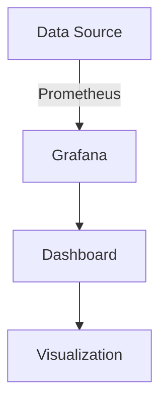

## 26.6. Monitoring Application Health

In the world of software engineering, ensuring the health and performance of your applications is paramount. This section delves into the intricacies of monitoring application health in Elixir, a language known for its robustness and concurrency capabilities. We'll explore how to implement effective health checks, utilize logging and metrics, and set up alerting systems to maintain optimal application performance.

### Health Checks

Health checks are a critical component of application monitoring, providing insights into the status and performance of your system. They serve as the first line of defense in identifying issues before they escalate into critical failures.

#### Implementing Endpoints for Application Status

One of the most effective ways to monitor application health is by implementing dedicated endpoints that report the status of your application. These endpoints can be queried by external services, such as load balancers or orchestration tools, to determine whether your application is running smoothly.

```elixir
defmodule MyAppWeb.HealthController do
  use MyAppWeb, :controller

  def index(conn, _params) do
    # Perform checks to determine application health
    health_status = check_application_health()

    case health_status do
      :ok -> send_resp(conn, 200, "Healthy")
      :error -> send_resp(conn, 500, "Unhealthy")
    end
  end

  defp check_application_health do
    # Example checks: database connection, external service availability
    if database_connected?() and external_service_available?() do
      :ok
    else
      :error
    end
  end
end
```

In this example, a simple health check endpoint is implemented using Phoenix. The `check_application_health/0` function performs necessary checks, such as verifying database connectivity and external service availability, to determine the application's health status.

#### Integrating with Load Balancers and Orchestration Tools

Once you have a health check endpoint, it's crucial to integrate it with load balancers and orchestration tools. This integration allows these systems to automatically redirect traffic away from unhealthy instances and initiate recovery procedures.

- **Load Balancers**: Configure your load balancer to periodically query the health check endpoint. If the endpoint returns an unhealthy status, the load balancer can reroute traffic to healthy instances.
- **Orchestration Tools**: Tools like Kubernetes can use health checks to manage application deployments. By defining readiness and liveness probes, Kubernetes can ensure that only healthy pods receive traffic.

### Logging and Metrics

Logging and metrics are indispensable for understanding application behavior and diagnosing issues. They provide a wealth of information that can be used to improve performance and reliability.

#### Using Logger for Structured Logging

Elixir's built-in `Logger` module is a powerful tool for capturing structured logs. Structured logging allows you to capture detailed information about application events, making it easier to analyze and search logs.

```elixir
require Logger

defmodule MyApp.LoggerExample do
  def log_event do
    Logger.info("User logged in", user_id: 123, action: "login")
  end
end
```

In this example, we're using `Logger.info/2` to log a structured message. The additional metadata (`user_id` and `action`) provides context, making it easier to filter and analyze logs.

#### Collecting Metrics with Telemetry

Telemetry is a dynamic dispatching library for metrics collection in Elixir. It allows you to instrument your code and collect metrics without introducing tight coupling between your application and the metrics library.

```elixir
defmodule MyApp.Metrics do
  use Telemetry.Metrics

  def metrics do
    [
      counter("http.request.count"),
      summary("http.request.duration", unit: {:native, :millisecond})
    ]
  end
end
```

With Telemetry, you can define custom metrics, such as request counts and durations. These metrics can be collected and visualized using tools like Prometheus or Grafana.

#### Integrating with AppSignal or New Relic

For more advanced monitoring capabilities, consider integrating with third-party services like AppSignal or New Relic. These services offer comprehensive monitoring solutions, including error tracking, performance metrics, and alerting features.

- **AppSignal**: Provides real-time insights into application performance, with features like error tracking and performance monitoring.
- **New Relic**: Offers a wide range of monitoring tools, including distributed tracing and infrastructure monitoring.

### Alerting Systems

Alerting systems are essential for notifying you of potential issues before they impact users. By setting up alerts, you can respond quickly to errors, downtime, and performance issues.

#### Setting Up Notifications

To set up notifications, you'll need to define the conditions under which alerts should be triggered. Common conditions include error rates exceeding a certain threshold, application downtime, and performance degradation.

- **Email Alerts**: Configure your monitoring tools to send email alerts to your team when an issue is detected.
- **SMS Alerts**: For critical issues, consider using SMS alerts to ensure immediate attention.

#### Defining Thresholds and Escalation Policies

It's important to define thresholds for triggering alerts. These thresholds should be based on historical data and the specific needs of your application.

- **Thresholds**: Set thresholds for metrics like response time, error rate, and resource utilization. For example, trigger an alert if the error rate exceeds 5% over a 10-minute period.
- **Escalation Policies**: Define escalation policies to ensure that alerts are addressed promptly. For example, if an alert is not acknowledged within 10 minutes, escalate it to a higher-level engineer.

### Visualizing Application Health

Visualizing application health is crucial for understanding the overall state of your system. By using dashboards and charts, you can quickly identify trends and anomalies.

#### Creating Dashboards with Grafana

Grafana is a powerful open-source platform for visualizing metrics. It allows you to create custom dashboards that display real-time data from various sources.


```mermaid
graph TD;
    A[Data Source] -->|Prometheus| B[Grafana];
    B --> C[Dashboard];
    C --> D[Visualization];
```

In this diagram, data is collected from various sources and sent to Grafana via Prometheus. Grafana then displays the data on a custom dashboard, providing real-time visualizations.

#### Using Heatmaps and Charts

Heatmaps and charts are effective tools for visualizing application health. They allow you to see patterns and trends in your data, making it easier to identify potential issues.

- **Heatmaps**: Use heatmaps to visualize metrics like CPU usage and response times. Heatmaps can help you identify periods of high load or performance degradation.
- **Charts**: Use line charts or bar charts to visualize metrics over time. These charts can help you track changes in application performance and identify trends.

### Knowledge Check

- Explain the importance of health checks in application monitoring.
- Demonstrate how to implement a health check endpoint in Elixir.
- Provide examples of how to use Elixir's Logger for structured logging.
- Describe how to collect metrics using Telemetry.
- Explain the role of alerting systems in maintaining application health.

### Embrace the Journey

Monitoring application health is an ongoing process that requires constant attention and refinement. By implementing effective health checks, logging, metrics, and alerting systems, you can ensure that your applications run smoothly and efficiently. Remember, this is just the beginning. As you continue to monitor and optimize your applications, you'll gain valuable insights that will help you build more reliable and performant systems. Keep experimenting, stay curious, and enjoy the journey!

### Try It Yourself

- Modify the health check endpoint to include additional checks, such as checking the status of a third-party API.
- Experiment with different logging levels in Elixir's Logger to see how they affect log output.
- Create a custom metric using Telemetry and visualize it using Grafana.

## Quiz Time!



### What is the primary purpose of a health check endpoint?

- [x] To report the status and health of an application
- [ ] To perform database migrations
- [ ] To authenticate users
- [ ] To deploy new code

> **Explanation:** Health check endpoints are used to report the status and health of an application, allowing external services to monitor its performance.

### Which Elixir module is used for structured logging?

- [x] Logger
- [ ] Telemetry
- [ ] Ecto
- [ ] Phoenix

> **Explanation:** The `Logger` module in Elixir is used for structured logging, allowing developers to capture detailed information about application events.

### What is Telemetry used for in Elixir?

- [x] Collecting and dispatching metrics
- [ ] Sending email notifications
- [ ] Managing database connections
- [ ] Handling HTTP requests

> **Explanation:** Telemetry is used for collecting and dispatching metrics in Elixir applications.

### What tool can be used to visualize metrics collected by Telemetry?

- [x] Grafana
- [ ] Ecto
- [ ] Phoenix
- [ ] Logger

> **Explanation:** Grafana is a powerful platform for visualizing metrics collected by Telemetry and other sources.

### Which of the following is a benefit of using structured logging?

- [x] Easier to analyze and search logs
- [ ] Reduces application memory usage
- [ ] Increases application speed
- [ ] Simplifies database queries

> **Explanation:** Structured logging makes it easier to analyze and search logs by providing detailed context for each log entry.

### What should you define to trigger alerts in an alerting system?

- [x] Thresholds
- [ ] Database schemas
- [ ] User roles
- [ ] API endpoints

> **Explanation:** Thresholds are defined to trigger alerts when certain conditions are met, such as high error rates or performance issues.

### What is an escalation policy in the context of alerting systems?

- [x] A strategy for addressing alerts that are not acknowledged
- [ ] A method for deploying code updates
- [ ] A process for authenticating users
- [ ] A technique for optimizing database queries

> **Explanation:** An escalation policy is a strategy for addressing alerts that are not acknowledged within a specified time frame.

### Which tool can be used for real-time insights into application performance?

- [x] AppSignal
- [ ] Ecto
- [ ] Logger
- [ ] Phoenix

> **Explanation:** AppSignal provides real-time insights into application performance, including error tracking and performance monitoring.

### What type of chart is useful for visualizing CPU usage over time?

- [x] Heatmap
- [ ] Pie chart
- [ ] Scatter plot
- [ ] Histogram

> **Explanation:** Heatmaps are useful for visualizing metrics like CPU usage over time, helping identify periods of high load or degradation.

### True or False: Health checks can be used to automatically redirect traffic away from unhealthy instances.

- [x] True
- [ ] False

> **Explanation:** Health checks can be integrated with load balancers and orchestration tools to automatically redirect traffic away from unhealthy instances.


