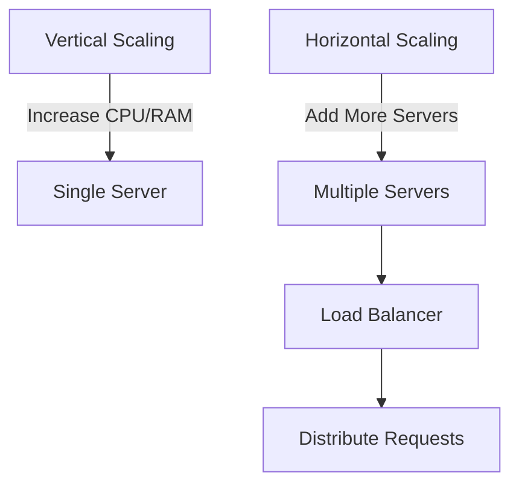

## 26.7. Scaling Applications Horizontally and Vertically

In the world of software development, scalability is a critical factor that determines the success of an application. As user demand grows, applications must be able to handle increased loads without compromising performance. In this section, we will delve into the concepts of scaling applications both horizontally and vertically, with a focus on Elixir's unique capabilities that make it an excellent choice for building scalable systems.

### Understanding Scalability

Scalability refers to an application's ability to handle increased load by adding resources. There are two primary types of scalability:

- **Vertical Scaling**: Involves increasing the resources (CPU, RAM) of a single server. This is often the simplest form of scaling but is limited by the maximum capacity of the server.
- **Horizontal Scaling**: Involves adding more servers or instances to distribute the load. This approach is more complex but offers greater scalability potential.

Let's explore each of these in detail.

### Vertical Scaling

Vertical scaling, also known as "scaling up," involves enhancing the capacity of a single machine. This can be achieved by adding more powerful CPUs, increasing RAM, or upgrading storage. While vertical scaling can provide immediate performance improvements, it has its limitations.

#### Advantages of Vertical Scaling

- **Simplicity**: Vertical scaling is often easier to implement as it involves upgrading existing hardware.
- **No Code Changes Required**: Applications can continue to run without modification, as the underlying infrastructure remains the same.

#### Limitations of Vertical Scaling

- **Hardware Limits**: There's a physical limit to how much a single machine can be upgraded.
- **Single Point of Failure**: Relying on a single machine increases the risk of downtime if that machine fails.
- **Cost**: High-performance hardware can be expensive.

### Horizontal Scaling

Horizontal scaling, or "scaling out," involves adding more machines to a system. This approach is more complex but offers significant advantages in terms of scalability and fault tolerance.

#### Advantages of Horizontal Scaling

- **Unlimited Growth Potential**: By adding more machines, you can theoretically scale indefinitely.
- **Fault Tolerance**: Distributing the load across multiple machines reduces the risk of a single point of failure.
- **Cost-Effective**: Using commodity hardware can be more cost-effective than investing in high-end machines.

#### Designing for Horizontal Scaling

To effectively scale horizontally, applications must be designed to be stateless, meaning they do not rely on local storage or session data. This allows any instance to handle any request, making it easier to distribute the load.

#### Stateless Architecture in Elixir

Elixir, with its functional programming paradigm and immutable data structures, naturally lends itself to stateless architecture. By leveraging Elixir's features, such as processes and message passing, developers can build applications that are inherently scalable.

### Load Balancing

Load balancing is a critical component of horizontal scaling. It involves distributing incoming requests evenly across multiple servers to ensure no single server is overwhelmed.

#### Load Balancing Techniques

- **Round Robin**: Distributes requests sequentially across servers.
- **Least Connections**: Directs traffic to the server with the fewest active connections.
- **IP Hash**: Routes requests based on the client's IP address, ensuring consistent server assignment.

#### Tools for Load Balancing

- **Nginx**: A popular open-source web server that also functions as a load balancer.
- **HAProxy**: A high-performance TCP/HTTP load balancer.
- **Cloud-Native Solutions**: Many cloud providers offer built-in load balancing services.

### Auto-Scaling

Auto-scaling is the process of automatically adjusting the number of running instances based on current demand. This ensures optimal resource utilization and cost efficiency.

#### Implementing Auto-Scaling

- **Define Metrics**: Identify key performance indicators (KPIs) that trigger scaling events, such as CPU usage or request latency.
- **Set Thresholds**: Establish thresholds for when to add or remove instances.
- **Use Cloud Services**: Most cloud providers offer auto-scaling features that can be configured to meet specific needs.

### Elixir's Unique Features for Scalability

Elixir's concurrency model, based on the Actor Model, provides robust tools for building scalable applications. The following features are particularly beneficial:

- **Lightweight Processes**: Elixir processes are lightweight and can be spawned in large numbers, making them ideal for handling concurrent requests.
- **OTP Framework**: The Open Telecom Platform (OTP) provides a set of libraries and design principles for building fault-tolerant systems.
- **Distributed Computing**: Elixir's built-in support for distributed computing allows applications to run across multiple nodes seamlessly.

### Code Example: Stateless Elixir Application

Let's look at a simple example of a stateless Elixir application that can be easily scaled horizontally.

```elixir
defmodule MyApp.Router do
  use Plug.Router

  plug :match
  plug :dispatch

  get "/hello" do
    send_resp(conn, 200, "Hello, world!")
  end

  match _ do
    send_resp(conn, 404, "Oops! Not found.")
  end
end

# Start the Plug server
{:ok, _} = Plug.Cowboy.http(MyApp.Router, [])
```

In this example, the application responds to HTTP requests without maintaining any state. This makes it easy to add more instances and distribute the load.

### Try It Yourself

Experiment with the code example by deploying multiple instances of the application and using a load balancer to distribute requests. Observe how the application handles increased traffic.

### Visualizing Scaling Strategies

Below is a diagram illustrating the differences between vertical and horizontal scaling.



### Knowledge Check

- **What are the key differences between vertical and horizontal scaling?**
- **How does Elixir's concurrency model facilitate scalability?**
- **What are the benefits of using a stateless architecture for horizontal scaling?**

### Summary

Scaling applications is a critical aspect of modern software development. By understanding the differences between vertical and horizontal scaling, and leveraging Elixir's unique features, developers can build applications that are both scalable and resilient. Remember, this is just the beginning. As you progress, you'll build more complex and interactive systems. Keep experimenting, stay curious, and enjoy the journey!

## Quiz: Scaling Applications Horizontally and Vertically



### What is vertical scaling?

- [x] Increasing resources (CPU, RAM) on existing servers.
- [ ] Adding more instances to distribute load.
- [ ] Using a load balancer to distribute requests.
- [ ] Automatically adjusting resources based on demand.

> **Explanation:** Vertical scaling involves enhancing the capacity of a single machine by adding more powerful CPUs, increasing RAM, or upgrading storage.

### What is horizontal scaling?

- [ ] Increasing resources (CPU, RAM) on existing servers.
- [x] Adding more instances to distribute load.
- [ ] Using a load balancer to distribute requests.
- [ ] Automatically adjusting resources based on demand.

> **Explanation:** Horizontal scaling involves adding more servers or instances to distribute the load, allowing for greater scalability potential.

### Which of the following is a load balancing technique?

- [x] Round Robin
- [ ] Vertical Scaling
- [ ] Auto-Scaling
- [ ] Stateless Architecture

> **Explanation:** Round Robin is a load balancing technique that distributes requests sequentially across servers.

### What is a key advantage of horizontal scaling?

- [ ] Simplicity
- [x] Fault Tolerance
- [ ] No Code Changes Required
- [ ] Hardware Limits

> **Explanation:** Horizontal scaling offers fault tolerance by distributing the load across multiple machines, reducing the risk of a single point of failure.

### What does auto-scaling involve?

- [ ] Increasing resources (CPU, RAM) on existing servers.
- [ ] Adding more instances to distribute load.
- [ ] Using a load balancer to distribute requests.
- [x] Automatically adjusting resources based on demand.

> **Explanation:** Auto-scaling involves automatically adjusting the number of running instances based on current demand to ensure optimal resource utilization.

### What is a limitation of vertical scaling?

- [x] Hardware Limits
- [ ] Unlimited Growth Potential
- [ ] Fault Tolerance
- [ ] Cost-Effective

> **Explanation:** Vertical scaling is limited by the maximum capacity of the server, as there's a physical limit to how much a single machine can be upgraded.

### How does Elixir's concurrency model facilitate scalability?

- [x] By using lightweight processes that can be spawned in large numbers.
- [ ] By relying on a single machine for all requests.
- [ ] By maintaining state in local storage.
- [ ] By using high-performance hardware.

> **Explanation:** Elixir's concurrency model, based on lightweight processes, allows for handling concurrent requests efficiently, facilitating scalability.

### What is a benefit of using a stateless architecture for horizontal scaling?

- [x] Easier distribution of load across instances.
- [ ] Increased reliance on local storage.
- [ ] Single point of failure.
- [ ] Limited growth potential.

> **Explanation:** Stateless architecture allows any instance to handle any request, making it easier to distribute the load across multiple instances.

### Which tool is commonly used for load balancing?

- [x] Nginx
- [ ] Elixir
- [ ] Plug
- [ ] Cowboy

> **Explanation:** Nginx is a popular open-source web server that also functions as a load balancer, distributing incoming requests evenly across servers.

### True or False: Elixir's OTP framework is beneficial for building fault-tolerant systems.

- [x] True
- [ ] False

> **Explanation:** The OTP framework provides a set of libraries and design principles for building fault-tolerant systems, making it beneficial for scalable applications.


