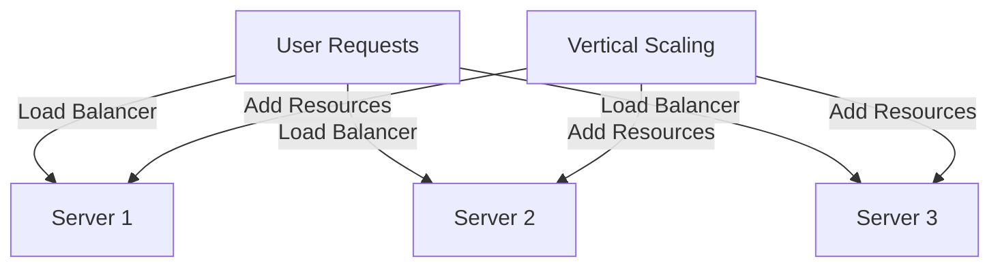

## 26.7. Scaling Applications Horizontally and Vertically

In the realm of modern software architecture, scalability is a crucial factor that determines an application's ability to handle growth. As applications grow in user base and complexity, they must be able to scale efficiently to meet increasing demands. In this section, we will delve into the strategies for scaling applications horizontally and vertically, with a focus on Elixir applications. We'll explore the concepts of load balancing and auto-scaling, providing practical insights and examples to help you design scalable and resilient systems.

### Vertical Scaling

Vertical scaling, often referred to as "scaling up," involves increasing the resources of a single server. This can mean adding more CPU power, memory (RAM), or storage to an existing machine. Vertical scaling is straightforward and can provide immediate performance improvements, but it comes with limitations.

#### Key Considerations for Vertical Scaling

- **Resource Limits**: Each machine has a finite capacity. Once you reach the maximum resources a single machine can handle, further scaling is not possible.
- **Cost Implications**: Upgrading to more powerful hardware can be costly, especially when dealing with high-end servers.
- **Downtime**: Scaling vertically often requires downtime to upgrade hardware, which can affect availability.

#### When to Use Vertical Scaling

Vertical scaling is suitable for applications with predictable workloads and where latency is a critical factor. It is often used as a short-term solution or in scenarios where the application architecture does not easily support horizontal scaling.

### Horizontal Scaling

Horizontal scaling, or "scaling out," involves adding more instances of an application to distribute the load. This approach is more flexible and can handle larger increases in demand.

#### Key Considerations for Horizontal Scaling

- **Statelessness**: Applications should be designed to be stateless, meaning they do not store session information locally. This allows any instance to handle any request, facilitating load distribution.
- **Load Balancing**: Essential for distributing incoming requests evenly across instances. Tools like Nginx, HAProxy, or cloud-native solutions are commonly used.
- **Database Scaling**: Databases can be a bottleneck in horizontal scaling. Consider strategies like sharding, replication, and using distributed databases.

#### When to Use Horizontal Scaling

Horizontal scaling is ideal for applications with fluctuating workloads and those that require high availability. It allows for scaling without downtime and can be more cost-effective in the long run.

### Load Balancing

Load balancing is a critical component of horizontal scaling. It involves distributing incoming network traffic across multiple servers to ensure no single server becomes overwhelmed.

#### Types of Load Balancers

- **Hardware Load Balancers**: Physical devices that provide high performance but can be expensive.
- **Software Load Balancers**: Applications like Nginx and HAProxy that can be run on standard hardware.
- **Cloud Load Balancers**: Services provided by cloud providers like AWS Elastic Load Balancing, which offer scalability and integration with other cloud services.

#### Implementing Load Balancing in Elixir

In Elixir, load balancing can be implemented using various strategies. Let's explore a simple example using Nginx as a reverse proxy to distribute traffic to multiple Elixir nodes.

```nginx
# Nginx configuration for load balancing
upstream my_elixir_app {
    server 127.0.0.1:4001;
    server 127.0.0.1:4002;
    server 127.0.0.1:4003;
}

server {
    listen 80;

    location / {
        proxy_pass http://my_elixir_app;
        proxy_set_header Host $host;
        proxy_set_header X-Real-IP $remote_addr;
        proxy_set_header X-Forwarded-For $proxy_add_x_forwarded_for;
        proxy_set_header X-Forwarded-Proto $scheme;
    }
}
```

In this configuration, Nginx distributes incoming requests to three Elixir nodes running on different ports.

### Auto-Scaling

Auto-scaling is the process of automatically adjusting the number of active servers based on current demand. It ensures that resources are used efficiently and that applications can handle sudden spikes in traffic.

#### Setting Up Auto-Scaling

Auto-scaling can be achieved using cloud services like AWS Auto Scaling, Google Cloud's Autoscaler, or Azure's Virtual Machine Scale Sets. These services monitor your application and adjust resources based on predefined rules and thresholds.

#### Example of Auto-Scaling Rules

- **CPU Utilization**: Scale out when CPU usage exceeds 70% for more than 5 minutes.
- **Memory Usage**: Scale in when memory usage drops below 30% for more than 10 minutes.
- **Request Rate**: Scale out when the number of requests per second exceeds a certain threshold.

### Designing Scalable Elixir Applications

To effectively scale Elixir applications, consider the following design principles:

#### Stateless Design

Ensure that your application is stateless. Use external storage solutions like Redis or databases to manage session data and state.

#### Distributed System Design

Leverage Elixir's strengths in building distributed systems. Use OTP (Open Telecom Platform) principles to manage processes and fault tolerance.

#### Monitoring and Observability

Implement monitoring and observability tools to gain insights into application performance and identify bottlenecks. Tools like Prometheus, Grafana, and AppSignal can be integrated with Elixir applications.

#### Continuous Integration and Deployment

Adopt CI/CD practices to automate testing and deployment. This ensures that scaling changes are deployed smoothly and without manual intervention.

### Try It Yourself

Experiment with the provided Nginx configuration by adding more Elixir nodes or changing the load balancing strategy. Observe how the system handles increased load and adjust the configuration as needed.

### Visualizing Scaling Strategies

To better understand the concepts of horizontal and vertical scaling, let's visualize them using a diagram.


```mermaid
graph TD;
    A[User Requests] -->|Load Balancer| B[Server 1];
    A -->|Load Balancer| C[Server 2];
    A -->|Load Balancer| D[Server 3];
    E[Vertical Scaling] -->|Add Resources| B;
    E -->|Add Resources| C;
    E -->|Add Resources| D;
```

**Figure 1**: This diagram illustrates how a load balancer distributes user requests across multiple servers, and how vertical scaling adds resources to each server.

### Knowledge Check

- **Why is statelessness important for horizontal scaling?**
- **What are the benefits of using cloud load balancers?**
- **How does auto-scaling improve resource utilization?**

### Key Takeaways

- **Vertical Scaling**: Increases resources on existing servers but is limited by hardware capacity.
- **Horizontal Scaling**: Adds more instances to distribute load, ideal for high availability.
- **Load Balancing**: Distributes incoming requests evenly, essential for horizontal scaling.
- **Auto-Scaling**: Automatically adjusts resources based on demand, optimizing resource usage.

### Embrace the Journey

Remember, scaling is an ongoing process that requires monitoring and adjustments as your application grows. Keep experimenting with different strategies, stay curious, and enjoy the journey of building scalable and resilient systems.

## Quiz Time!



### What is vertical scaling?

- [x] Increasing resources like CPU and RAM on existing servers
- [ ] Adding more instances to distribute load
- [ ] Using load balancers to distribute traffic
- [ ] Automatically adjusting resources based on demand

> **Explanation:** Vertical scaling involves increasing the resources of a single server, such as CPU and RAM.

### Why is statelessness important for horizontal scaling?

- [x] It allows any instance to handle any request
- [ ] It reduces the need for load balancing
- [ ] It increases the capacity of individual machines
- [ ] It simplifies vertical scaling

> **Explanation:** Statelessness ensures that any instance can handle any request, which is crucial for distributing load evenly in horizontal scaling.

### What is the primary role of a load balancer?

- [x] Distributing incoming requests evenly across servers
- [ ] Increasing the resources of a single server
- [ ] Automatically adjusting resources based on demand
- [ ] Managing database connections

> **Explanation:** Load balancers distribute incoming requests evenly across servers to prevent any single server from being overwhelmed.

### Which of the following is a benefit of using cloud load balancers?

- [x] Integration with other cloud services
- [ ] Requires physical hardware
- [ ] Limited scalability
- [ ] Increases server downtime

> **Explanation:** Cloud load balancers offer scalability and integration with other cloud services, making them a flexible option for managing traffic.

### What is auto-scaling?

- [x] Automatically adjusting resources based on demand
- [ ] Increasing resources on existing servers
- [ ] Adding more instances to distribute load
- [ ] Using load balancers to distribute traffic

> **Explanation:** Auto-scaling involves automatically adjusting the number of active servers based on current demand.

### Which tool is commonly used for load balancing in Elixir applications?

- [x] Nginx
- [ ] Redis
- [ ] Prometheus
- [ ] Grafana

> **Explanation:** Nginx is commonly used as a reverse proxy and load balancer for distributing traffic in Elixir applications.

### What is a key limitation of vertical scaling?

- [x] Finite capacity of a single machine
- [ ] Complexity in application design
- [ ] Difficulty in distributing load
- [ ] Requires stateless design

> **Explanation:** Vertical scaling is limited by the finite capacity of a single machine, making it less scalable than horizontal scaling.

### How does auto-scaling improve resource utilization?

- [x] By adjusting resources based on demand
- [ ] By increasing resources on existing servers
- [ ] By distributing requests evenly
- [ ] By managing database connections

> **Explanation:** Auto-scaling improves resource utilization by automatically adjusting resources based on demand, ensuring efficient use of resources.

### What is a common strategy for database scaling in horizontal scaling?

- [x] Sharding and replication
- [ ] Increasing CPU and RAM
- [ ] Using load balancers
- [ ] Implementing CI/CD practices

> **Explanation:** Sharding and replication are common strategies for scaling databases in horizontal scaling to prevent bottlenecks.

### True or False: Horizontal scaling is more suitable for applications with fluctuating workloads.

- [x] True
- [ ] False

> **Explanation:** Horizontal scaling is ideal for applications with fluctuating workloads as it allows for scaling without downtime and can handle sudden spikes in traffic.


