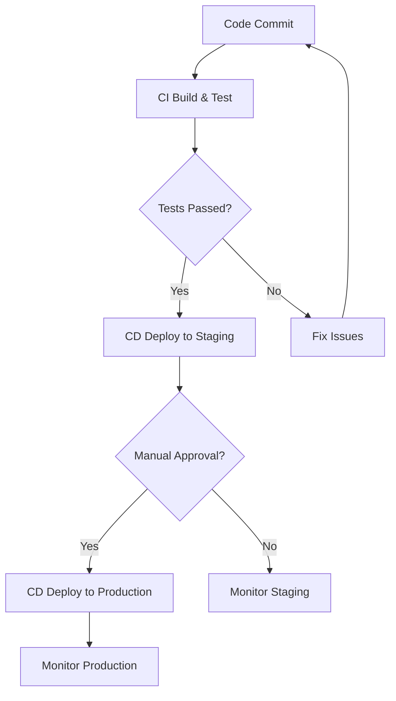

## 26.8. Automating Deployment Pipelines

In the fast-paced world of software development, automating deployment pipelines is crucial for maintaining efficiency, reliability, and speed. This section delves into the core concepts of Continuous Integration (CI), Continuous Deployment (CD), and Infrastructure as Code (IaC), providing expert insights and practical examples for implementing these practices in Elixir projects.

### Continuous Integration (CI)

Continuous Integration is a development practice where developers integrate code into a shared repository frequently, ideally several times a day. Each integration can then be verified by an automated build and automated tests. CI aims to detect errors quickly and improve software quality.

#### Key Concepts of CI

1. **Automating Code Testing and Validation**: Automate the process of testing and validating code changes to ensure that new commits do not break existing functionality. This involves setting up a CI server to run tests automatically on every commit.

2. **Tools for CI**: Utilize tools like Jenkins, Travis CI, and GitHub Actions to automate the CI process. These tools provide a platform to define workflows that automatically build and test your code.

3. **Integration with Version Control Systems**: Ensure that your CI tools are integrated with your version control system (e.g., Git) to trigger builds and tests on code changes.

#### Implementing CI in Elixir

To implement CI in an Elixir project, follow these steps:

1. **Set Up a CI Server**: Choose a CI tool that fits your project needs. For example, GitHub Actions is a popular choice for projects hosted on GitHub.

2. **Define a Workflow**: Create a workflow file that specifies the steps to build and test your Elixir application. Here's an example using GitHub Actions:

   ```yaml
   name: Elixir CI

   on:
     push:
       branches: [main]
     pull_request:
       branches: [main]

   jobs:
     build:
       runs-on: ubuntu-latest

       steps:
       - uses: actions/checkout@v2
       - name: Set up Elixir
         uses: actions/setup-elixir@v1
         with:
           elixir-version: '1.12'
           otp-version: '24'
       - name: Install dependencies
         run: mix deps.get
       - name: Run tests
         run: mix test
   ```

   This workflow triggers on pushes and pull requests to the `main` branch, sets up Elixir and OTP, installs dependencies, and runs tests.

3. **Monitor and Maintain**: Regularly monitor your CI builds and address any failures promptly. Keep your CI configuration up-to-date with changes in your project.

### Continuous Deployment (CD)

Continuous Deployment extends CI by automatically deploying code changes to production environments once they pass all tests and checks. This practice ensures that software can be released to production at any time, reducing the time between development and release.

#### Key Concepts of CD

1. **Automating the Release Process**: Automate the steps required to deploy your application to production, including building, testing, and deploying.

2. **Ensuring Code Quality**: Implement checks and balances to ensure that only code that passes all tests and quality checks is deployed.

3. **Rollback Mechanisms**: Implement mechanisms to quickly roll back deployments in case of issues, ensuring minimal downtime and disruption.

#### Implementing CD in Elixir

To implement CD in an Elixir project, consider the following:

1. **Define Deployment Pipelines**: Use tools like GitLab CI/CD or Jenkins to define pipelines that automate the deployment process. Here's an example pipeline configuration for GitLab CI/CD:

   ```yaml
   stages:
     - build
     - test
     - deploy

   build:
     stage: build
     script:
       - mix deps.get
       - mix compile

   test:
     stage: test
     script:
       - mix test

   deploy:
     stage: deploy
     script:
       - mix release
       - ./deploy.sh
     only:
       - main
   ```

   This pipeline includes stages for building, testing, and deploying the application. The `deploy.sh` script handles the deployment to production.

2. **Automate Infrastructure Changes**: Use Infrastructure as Code (IaC) tools to automate infrastructure changes alongside application deployments.

3. **Monitor Deployments**: Implement monitoring and alerting to track the health of your deployments and quickly respond to issues.

### Infrastructure as Code (IaC)

Infrastructure as Code is the practice of managing and provisioning computing infrastructure through machine-readable definition files, rather than physical hardware configuration or interactive configuration tools.

#### Key Concepts of IaC

1. **Defining Infrastructure Configurations**: Use code to define and manage your infrastructure, ensuring consistency and repeatability.

2. **Version-Controlled Infrastructure**: Store infrastructure code in version control systems alongside application code to track changes and collaborate effectively.

3. **Tools for IaC**: Utilize tools like Terraform and Ansible to define and manage infrastructure as code.

#### Implementing IaC in Elixir

To implement IaC in an Elixir project, follow these steps:

1. **Choose an IaC Tool**: Select a tool that fits your infrastructure needs. Terraform is a popular choice for managing cloud infrastructure.

2. **Define Infrastructure**: Write configuration files that define your infrastructure resources. Here's an example Terraform configuration for deploying an Elixir application on AWS:

   ```hcl
   provider "aws" {
     region = "us-west-2"
   }

   resource "aws_instance" "web" {
     ami           = "ami-0c55b159cbfafe1f0"
     instance_type = "t2.micro"

     tags = {
       Name = "ElixirApp"
     }
   }
   ```

   This configuration defines an AWS EC2 instance for running your Elixir application.

3. **Integrate with CI/CD**: Integrate your IaC tool with your CI/CD pipelines to automate infrastructure changes alongside application deployments.

### Best Practices for Automating Deployment Pipelines

1. **Implement Rollback Mechanisms**: Ensure that you can quickly roll back deployments in case of issues. Use versioning and backups to facilitate rollbacks.

2. **Keep Pipelines Secure and Auditable**: Implement security measures to protect your deployment pipelines from unauthorized access and ensure that all changes are auditable.

3. **Regularly Review and Update Pipelines**: Regularly review your deployment pipelines to ensure they remain efficient and effective. Update them as needed to accommodate changes in your project or infrastructure.

4. **Collaborate and Communicate**: Foster collaboration and communication among team members to ensure that everyone is aligned on deployment processes and practices.

### Visualizing Deployment Pipelines

To better understand the flow of a deployment pipeline, let's visualize it using a Mermaid.js diagram.



**Diagram Description**: This diagram illustrates a typical deployment pipeline. It starts with a code commit, followed by CI build and test. If tests pass, the code is deployed to a staging environment. After manual approval, it is deployed to production. Monitoring occurs at both staging and production stages.

### Try It Yourself

Experiment with the provided code examples by modifying them to fit your specific project needs. For instance, try changing the Elixir version in the GitHub Actions workflow or adding additional stages to the GitLab CI/CD pipeline. Explore different IaC tools and configurations to find the best fit for your infrastructure.

### Knowledge Check

- What are the key benefits of automating deployment pipelines?
- How does Continuous Integration differ from Continuous Deployment?
- What role does Infrastructure as Code play in deployment automation?
- Why is it important to implement rollback mechanisms in deployment pipelines?
- How can you ensure the security and auditability of your deployment pipelines?

### Embrace the Journey

Remember, automating deployment pipelines is an ongoing journey. As you gain experience, you'll discover new tools and techniques to enhance your processes. Stay curious, keep experimenting, and enjoy the journey of mastering deployment automation with Elixir!

## Quiz: Automating Deployment Pipelines



### What is the primary goal of Continuous Integration (CI)?

- [x] To detect errors quickly and improve software quality
- [ ] To automate infrastructure provisioning
- [ ] To deploy code changes to production
- [ ] To manage version control

> **Explanation:** Continuous Integration aims to detect errors quickly and improve software quality by integrating code frequently and running automated tests.

### Which tool is commonly used for Infrastructure as Code (IaC)?

- [ ] Jenkins
- [ ] GitHub Actions
- [x] Terraform
- [ ] ExUnit

> **Explanation:** Terraform is a popular tool for managing infrastructure as code, allowing you to define and provision infrastructure using configuration files.

### What is a key benefit of Continuous Deployment (CD)?

- [ ] It eliminates the need for automated testing
- [x] It reduces the time between development and release
- [ ] It requires manual approval for all deployments
- [ ] It focuses on infrastructure management

> **Explanation:** Continuous Deployment reduces the time between development and release by automating the deployment process for code changes that pass all tests and checks.

### Why is it important to implement rollback mechanisms in deployment pipelines?

- [x] To quickly revert deployments in case of issues
- [ ] To automate infrastructure provisioning
- [ ] To eliminate the need for manual testing
- [ ] To manage version control

> **Explanation:** Rollback mechanisms allow you to quickly revert deployments in case of issues, minimizing downtime and disruption.

### Which of the following is a best practice for keeping deployment pipelines secure?

- [x] Implementing security measures to protect against unauthorized access
- [ ] Eliminating all manual approvals
- [ ] Using only open-source tools
- [ ] Avoiding version control

> **Explanation:** Implementing security measures to protect against unauthorized access is crucial for keeping deployment pipelines secure and auditable.

### What is the role of version control in Infrastructure as Code (IaC)?

- [x] To track changes and collaborate effectively
- [ ] To automate deployment processes
- [ ] To eliminate the need for manual testing
- [ ] To manage production environments

> **Explanation:** Version control allows you to track changes and collaborate effectively on infrastructure code, ensuring consistency and repeatability.

### How can you integrate Infrastructure as Code (IaC) with CI/CD pipelines?

- [x] By automating infrastructure changes alongside application deployments
- [ ] By eliminating all manual approvals
- [ ] By using only open-source tools
- [ ] By avoiding version control

> **Explanation:** Integrating IaC with CI/CD pipelines involves automating infrastructure changes alongside application deployments, ensuring consistency and efficiency.

### What is a common trigger for a CI build?

- [x] A code commit to a version control system
- [ ] A manual approval
- [ ] A production deployment
- [ ] A rollback mechanism

> **Explanation:** A code commit to a version control system is a common trigger for a CI build, initiating automated testing and validation.

### Which stage typically follows a successful CI build?

- [ ] Rollback
- [x] Deployment to a staging environment
- [ ] Manual approval
- [ ] Infrastructure provisioning

> **Explanation:** Deployment to a staging environment typically follows a successful CI build, allowing further testing and validation before production deployment.

### True or False: Continuous Deployment (CD) requires manual approval for all deployments.

- [ ] True
- [x] False

> **Explanation:** Continuous Deployment automates the deployment process and does not require manual approval for all deployments, although some organizations may choose to include it as an additional safeguard.


