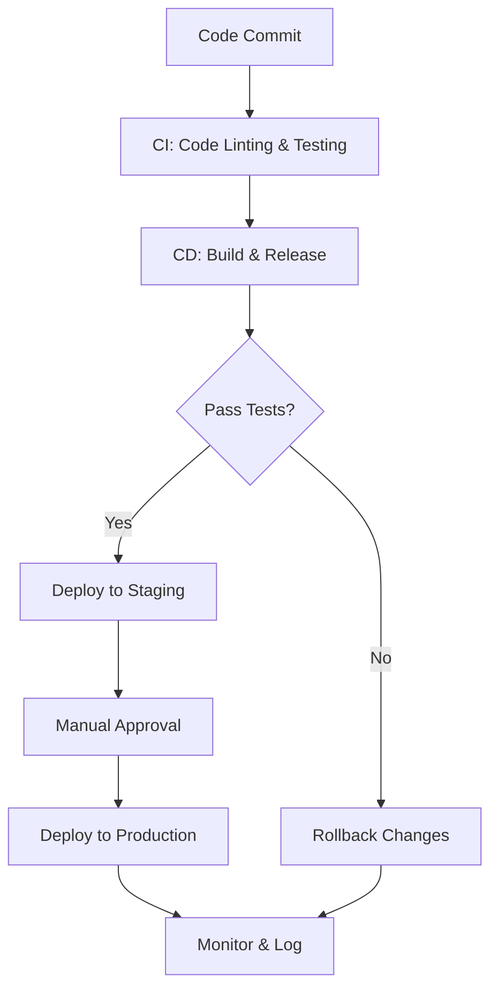

## 26.8. Automating Deployment Pipelines

In today's fast-paced software development environment, automating deployment pipelines is essential for delivering high-quality software efficiently. This section will guide you through the intricacies of automating deployment pipelines for Elixir applications, focusing on Continuous Integration (CI), Continuous Deployment (CD), and Infrastructure as Code (IaC).

### Introduction to Deployment Pipelines

Deployment pipelines are a series of automated processes that take code from version control to production. They ensure that every change is validated, tested, and deployed in a consistent and reliable manner. Automating these pipelines reduces human error, increases deployment speed, and enhances the overall quality of the software.

### Continuous Integration (CI)

Continuous Integration is a practice where developers frequently integrate code into a shared repository. Each integration is verified by an automated build and test process, allowing teams to detect problems early.

#### Key Concepts of CI

- **Automating Code Testing and Validation:** Ensure that every commit triggers a series of automated tests to validate the code's functionality and performance.
- **Tools for CI:** Popular tools include Jenkins, Travis CI, and GitHub Actions, each offering unique features for automating testing and integration processes.

#### Implementing CI for Elixir

To implement CI for Elixir applications, follow these steps:

1. **Choose a CI Tool:** Select a CI tool that integrates well with your version control system and supports Elixir. GitHub Actions is a popular choice due to its seamless integration with GitHub repositories.

2. **Configure the CI Pipeline:** Define the steps your CI pipeline will execute. This typically includes:
   - **Code Linting:** Use tools like Credo to ensure code quality.
   - **Unit Testing:** Run tests using ExUnit to validate code functionality.
   - **Static Code Analysis:** Use Dialyzer for type checking and finding discrepancies.

3. **Automate the CI Process:** Set up your CI tool to automatically trigger the pipeline on every commit or pull request. This ensures that all code changes are validated before merging.

```yaml
# Example GitHub Actions Workflow for Elixir CI
name: Elixir CI

on:
  push:
    branches:
      - main
  pull_request:
    branches:
      - main

jobs:
  build:
    runs-on: ubuntu-latest

    steps:
    - name: Checkout code
      uses: actions/checkout@v2

    - name: Set up Elixir
      uses: actions/setup-elixir@v1
      with:
        elixir-version: '1.12'
        otp-version: '24.0'

    - name: Install dependencies
      run: mix deps.get

    - name: Run tests
      run: mix test
```

### Continuous Deployment (CD)

Continuous Deployment automates the release of software to production environments. It ensures that only code that passes all tests and checks is deployed, reducing the risk of errors in production.

#### Key Concepts of CD

- **Automating the Release Process:** Use tools like Jenkins or GitLab CI/CD to automate deployment tasks.
- **Ensuring Code Quality:** Implement checks and balances to ensure only high-quality code is deployed.

#### Implementing CD for Elixir

To implement CD for Elixir applications, follow these steps:

1. **Define Deployment Environments:** Identify the environments (e.g., staging, production) where your application will be deployed.

2. **Set Up Deployment Automation:** Use tools like Distillery or Mix Releases to package your Elixir application for deployment. Automate the deployment process using CI/CD tools.

3. **Implement Rollback Mechanisms:** Ensure that you have a strategy in place to roll back deployments in case of failures. This could involve maintaining previous versions of the application or using feature flags to disable problematic features.

```yaml
# Example GitHub Actions Workflow for Elixir CD
name: Elixir CD

on:
  push:
    branches:
      - main

jobs:
  deploy:
    runs-on: ubuntu-latest

    steps:
    - name: Checkout code
      uses: actions/checkout@v2

    - name: Set up Elixir
      uses: actions/setup-elixir@v1
      with:
        elixir-version: '1.12'
        otp-version: '24.0'

    - name: Install dependencies
      run: mix deps.get

    - name: Build release
      run: mix release

    - name: Deploy to production
      run: ./deploy.sh
```

### Infrastructure as Code (IaC)

Infrastructure as Code is a practice where infrastructure configurations are defined and managed using code. This allows for version control, automation, and consistency across environments.

#### Key Concepts of IaC

- **Defining Infrastructure with Code:** Use tools like Terraform or Ansible to define infrastructure configurations.
- **Version Control:** Store infrastructure code in version control systems like Git, allowing for tracking and rollback of changes.

#### Implementing IaC for Elixir

To implement IaC for Elixir applications, follow these steps:

1. **Choose an IaC Tool:** Select a tool that suits your infrastructure needs. Terraform is a popular choice for cloud infrastructure management.

2. **Define Infrastructure Configurations:** Write code to define your infrastructure, including servers, databases, and networking.

3. **Automate Infrastructure Provisioning:** Use your IaC tool to automate the provisioning and management of infrastructure. This can be integrated into your CI/CD pipeline for seamless deployments.

```hcl
# Example Terraform Configuration for Elixir Application
provider "aws" {
  region = "us-west-2"
}

resource "aws_instance" "elixir_app" {
  ami           = "ami-0c55b159cbfafe1f0"
  instance_type = "t2.micro"

  tags = {
    Name = "ElixirApp"
  }
}
```

### Best Practices for Automating Deployment Pipelines

1. **Implement Rollback Mechanisms:** Always have a plan to revert deployments if something goes wrong. This can be achieved through versioning, backups, and automated rollback scripts.

2. **Keep Pipelines Secure:** Ensure that your deployment pipelines are secure and auditable. Use secure credentials management and restrict access to sensitive operations.

3. **Monitor and Log Deployments:** Implement monitoring and logging to track deployment activities and performance. This helps in identifying issues and improving the deployment process.

4. **Regularly Update and Maintain Pipelines:** Keep your CI/CD tools and scripts up to date to leverage new features and security patches.

5. **Collaborate with Teams:** Work closely with development, operations, and security teams to ensure that the deployment pipeline meets the needs of all stakeholders.

### Visualizing the Deployment Pipeline

Below is a diagram that illustrates a typical deployment pipeline for an Elixir application, incorporating CI, CD, and IaC.


```mermaid
flowchart TD
    A[Code Commit] --> B[CI: Code Linting & Testing]
    B --> C[CD: Build & Release]
    C --> D{Pass Tests?}
    D -->|Yes| E[Deploy to Staging]
    E --> F[Manual Approval]
    F --> G[Deploy to Production]
    D -->|No| H[Rollback Changes]
    G --> I[Monitor & Log]
    H --> I
```

**Diagram Description:** This flowchart represents the automated deployment pipeline for an Elixir application. It starts with a code commit, followed by CI processes like code linting and testing. If tests pass, the CD process builds and releases the application, deploying it to staging and then to production upon approval. If tests fail, a rollback is initiated. Monitoring and logging occur throughout the process.

### Try It Yourself

Experiment with the example workflows and configurations provided. Try modifying the CI/CD pipeline to include additional steps, such as integration tests or security scans. Customize the IaC configuration to provision different resources or environments.

### Knowledge Check

- What are the key benefits of automating deployment pipelines?
- How does Continuous Integration differ from Continuous Deployment?
- Why is Infrastructure as Code important in modern software development?
- What are some best practices for maintaining secure deployment pipelines?

### Summary

Automating deployment pipelines is a crucial practice for delivering reliable and high-quality software. By implementing CI/CD and IaC, you can streamline the deployment process, reduce errors, and improve collaboration across teams. Remember, this is just the beginning. As you progress, you'll refine your pipelines and adapt them to meet the evolving needs of your projects.

## Quiz Time!



### What is the primary goal of Continuous Integration (CI)?

- [x] To automate code testing and validation on every commit.
- [ ] To automate the release process to production environments.
- [ ] To define infrastructure configurations using code.
- [ ] To ensure manual testing of code changes.

> **Explanation:** Continuous Integration focuses on automating the testing and validation of code changes as they are integrated into a shared repository.

### Which tool is commonly used for Infrastructure as Code?

- [x] Terraform
- [ ] Jenkins
- [ ] GitHub Actions
- [ ] ExUnit

> **Explanation:** Terraform is a popular tool for defining and managing infrastructure as code.

### What is a key benefit of Continuous Deployment (CD)?

- [x] Automating the release process to production environments.
- [ ] Manual approval of code changes.
- [ ] Ensuring code passes all tests and checks before deployment.
- [ ] Defining infrastructure configurations using code.

> **Explanation:** Continuous Deployment automates the release of code to production environments, ensuring that only code that passes all tests is deployed.

### What is the purpose of rollback mechanisms in deployment pipelines?

- [x] To revert deployments in case of failures.
- [ ] To automate code testing and validation.
- [ ] To define infrastructure configurations using code.
- [ ] To monitor and log deployment activities.

> **Explanation:** Rollback mechanisms allow for reverting deployments if issues arise, ensuring stability and reliability.

### Which of the following is a best practice for secure deployment pipelines?

- [x] Implementing secure credentials management.
- [ ] Allowing unrestricted access to deployment operations.
- [ ] Skipping monitoring and logging.
- [ ] Using outdated CI/CD tools.

> **Explanation:** Secure credentials management is crucial for maintaining the security and integrity of deployment pipelines.

### What does Infrastructure as Code (IaC) allow developers to do?

- [x] Define and manage infrastructure configurations using code.
- [ ] Automate code testing and validation.
- [ ] Manually configure infrastructure.
- [ ] Release code to production environments.

> **Explanation:** IaC enables developers to define and manage infrastructure configurations using code, ensuring consistency and version control.

### How can you integrate IaC into your CI/CD pipeline?

- [x] By automating infrastructure provisioning and management.
- [ ] By manually configuring infrastructure.
- [ ] By skipping infrastructure management.
- [ ] By using only manual deployment processes.

> **Explanation:** Integrating IaC into CI/CD pipelines involves automating the provisioning and management of infrastructure.

### What is a common tool for automating CI processes?

- [x] GitHub Actions
- [ ] Terraform
- [ ] ExUnit
- [ ] Ansible

> **Explanation:** GitHub Actions is a popular tool for automating CI processes, including testing and validation.

### What is the role of monitoring and logging in deployment pipelines?

- [x] To track deployment activities and performance.
- [ ] To automate code testing and validation.
- [ ] To define infrastructure configurations using code.
- [ ] To skip manual approval processes.

> **Explanation:** Monitoring and logging help track deployment activities, identify issues, and improve the deployment process.

### True or False: Continuous Deployment (CD) requires manual approval for every deployment.

- [ ] True
- [x] False

> **Explanation:** Continuous Deployment automates the release process, eliminating the need for manual approval for each deployment.




