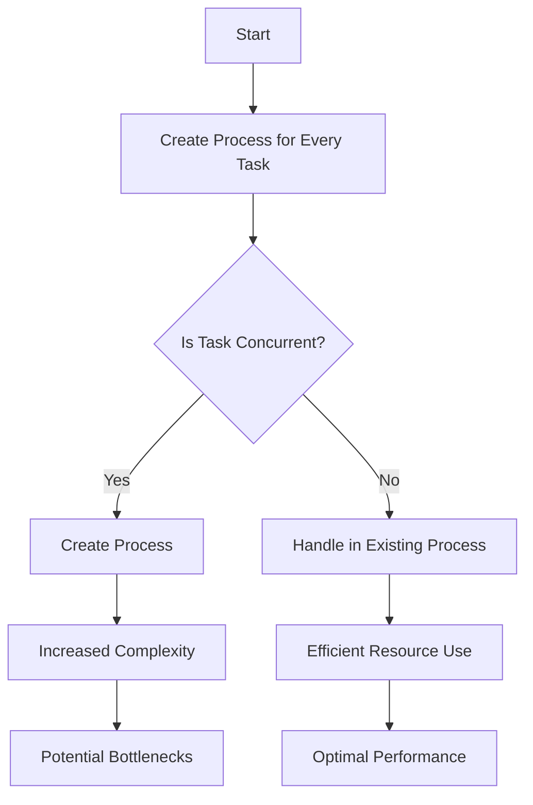

## 27.1. Recognizing Anti-Patterns in Elixir

In the world of software development, design patterns are often celebrated as best practices that guide developers toward effective solutions. However, the flip side of this coin is the concept of anti-patterns. These are patterns that may initially seem like a good idea but ultimately lead to poor outcomes. In this section, we'll delve into recognizing anti-patterns in Elixir, a functional programming language known for its concurrency and fault-tolerance capabilities. We'll explore how these anti-patterns can hinder development and the importance of staying vigilant to maintain code quality and system performance.

### Definition and Impact

#### Understanding Anti-Patterns

Anti-patterns are common responses to recurring problems that are ineffective and counterproductive. They often arise from a misunderstanding or misapplication of design principles. In Elixir, anti-patterns can manifest in various forms, such as inefficient use of processes, improper error handling, or over-reliance on certain language features.

#### Impact on Development

The impact of anti-patterns can be significant. They can lead to code that is difficult to maintain, systems that are hard to scale, and applications that are prone to errors. Recognizing and avoiding these anti-patterns is crucial for any Elixir developer aiming to build robust and efficient systems.

### Importance of Awareness

#### Maintaining Code Quality

Awareness of anti-patterns is essential for maintaining high code quality. By understanding what constitutes an anti-pattern, developers can make informed decisions that lead to cleaner, more maintainable code.

#### Ensuring System Performance

Anti-patterns can also negatively impact system performance. For example, inefficient use of processes can lead to bottlenecks, while poor error handling can result in unexpected crashes. By staying vigilant and recognizing these anti-patterns, developers can ensure their systems perform optimally.

### Common Anti-Patterns in Elixir

Let's explore some of the most common anti-patterns in Elixir and how to recognize them.

#### 1. Overusing Processes

**Description:** Elixir's lightweight processes are one of its most powerful features, enabling concurrent and parallel execution. However, overusing processes can lead to unnecessary complexity and resource consumption.

**Example:**

```elixir
# Anti-pattern: Creating a process for every small task
defmodule TaskManager do
  def start_task(task) do
    spawn(fn -> execute_task(task) end)
  end

  defp execute_task(task) do
    # Task execution logic
  end
end
```

**Solution:** Use processes judiciously. Consider whether a task truly benefits from being run concurrently or if it can be handled within an existing process.

**Corrected Example:**

```elixir
# Improved: Use processes only when necessary
defmodule TaskManager do
  def execute_task(task) do
    # Task execution logic
  end
end
```

#### 2. Ignoring OTP Principles

**Description:** Elixir's OTP framework provides powerful abstractions for building fault-tolerant applications. Ignoring these principles can lead to fragile systems.

**Example:**

```elixir
# Anti-pattern: Manually managing process state
defmodule StateManager do
  def start_link(initial_state) do
    {:ok, spawn(fn -> loop(initial_state) end)}
  end

  defp loop(state) do
    receive do
      {:get, caller} -> send(caller, state)
      {:set, new_state} -> loop(new_state)
    end
  end
end
```

**Solution:** Leverage OTP behaviors like GenServer to manage state and handle messages.

**Corrected Example:**

```elixir
# Improved: Use GenServer for state management
defmodule StateManager do
  use GenServer

  def start_link(initial_state) do
    GenServer.start_link(__MODULE__, initial_state, name: __MODULE__)
  end

  def init(initial_state) do
    {:ok, initial_state}
  end

  def handle_call(:get, _from, state) do
    {:reply, state, state}
  end

  def handle_cast({:set, new_state}, _state) do
    {:noreply, new_state}
  end
end
```

#### 3. Poor Error Handling

**Description:** Elixir encourages a "let it crash" philosophy, but this doesn't mean ignoring error handling. Poor error handling can lead to ungraceful failures.

**Example:**

```elixir
# Anti-pattern: Not handling errors
defmodule FileReader do
  def read_file(path) do
    {:ok, content} = File.read(path)
    content
  end
end
```

**Solution:** Use pattern matching and error tuples to handle errors gracefully.

**Corrected Example:**

```elixir
# Improved: Handle errors using pattern matching
defmodule FileReader do
  def read_file(path) do
    case File.read(path) do
      {:ok, content} -> {:ok, content}
      {:error, reason} -> {:error, reason}
    end
  end
end
```

#### 4. Overusing Macros

**Description:** Macros are a powerful feature in Elixir, allowing for metaprogramming. However, overusing them can lead to code that is difficult to understand and maintain.

**Example:**

```elixir
# Anti-pattern: Using macros for simple tasks
defmodule MyMacros do
  defmacro add(a, b) do
    quote do
      unquote(a) + unquote(b)
    end
  end
end
```

**Solution:** Use functions for simple tasks and reserve macros for cases where they provide significant benefits.

**Corrected Example:**

```elixir
# Improved: Use functions for simple operations
defmodule MyFunctions do
  def add(a, b), do: a + b
end
```

#### 5. Shared Mutable State

**Description:** Elixir promotes immutability, but shared mutable state can still occur, leading to race conditions and unpredictable behavior.

**Example:**

```elixir
# Anti-pattern: Using ETS for shared mutable state
defmodule SharedState do
  def start_link do
    :ets.new(:state, [:named_table, :public])
  end

  def set(key, value) do
    :ets.insert(:state, {key, value})
  end

  def get(key) do
    case :ets.lookup(:state, key) do
      [{^key, value}] -> value
      [] -> nil
    end
  end
end
```

**Solution:** Use processes to encapsulate state and ensure consistency.

**Corrected Example:**

```elixir
# Improved: Use a GenServer to manage state
defmodule SharedState do
  use GenServer

  def start_link do
    GenServer.start_link(__MODULE__, %{}, name: __MODULE__)
  end

  def init(state) do
    {:ok, state}
  end

  def set(key, value) do
    GenServer.cast(__MODULE__, {:set, key, value})
  end

  def get(key) do
    GenServer.call(__MODULE__, {:get, key})
  end

  def handle_cast({:set, key, value}, state) do
    {:noreply, Map.put(state, key, value)}
  end

  def handle_call({:get, key}, _from, state) do
    {:reply, Map.get(state, key), state}
  end
end
```

### Visualizing Anti-Patterns

To better understand how these anti-patterns can affect your Elixir applications, let's visualize the impact of overusing processes and ignoring OTP principles.



**Diagram Description:** This flowchart illustrates the decision-making process when considering whether to create a new process for a task. Overusing processes can lead to increased complexity and potential bottlenecks, while handling tasks within existing processes can result in efficient resource use and optimal performance.

### References and Links

- [Elixir Lang](https://elixir-lang.org/) - Official Elixir website with documentation and resources.
- [Learn You Some Erlang](http://learnyousomeerlang.com/) - A comprehensive guide to Erlang, which underpins Elixir.
- [Elixir School](https://elixirschool.com/) - A community-driven site with lessons and tutorials on Elixir.

### Knowledge Check

To reinforce your understanding of recognizing anti-patterns in Elixir, consider the following questions:

1. What are anti-patterns, and how do they differ from design patterns?
2. Why is it important to recognize and avoid anti-patterns in Elixir?
3. How can overusing processes negatively impact an Elixir application?
4. What are some common pitfalls when handling errors in Elixir?
5. How can macros be misused, and what are the consequences?

### Embrace the Journey

Remember, recognizing anti-patterns is just the beginning. As you continue to develop your skills in Elixir, you'll become more adept at identifying and avoiding these pitfalls. Keep experimenting, stay curious, and enjoy the journey!

### Quiz: Recognizing Anti-Patterns in Elixir



### What is an anti-pattern?

- [x] A common response to a recurring problem that is ineffective and counterproductive
- [ ] A best practice for solving a specific problem
- [ ] A design pattern that is widely accepted
- [ ] A feature of the Elixir language

> **Explanation:** An anti-pattern is a common response to a recurring problem that is ineffective and counterproductive.

### Why is it important to recognize anti-patterns in Elixir?

- [x] To maintain code quality and system performance
- [ ] To increase the complexity of the code
- [ ] To ensure all features of Elixir are used
- [ ] To avoid using OTP principles

> **Explanation:** Recognizing anti-patterns helps maintain code quality and system performance by avoiding ineffective solutions.

### What is a potential consequence of overusing processes in Elixir?

- [x] Increased complexity and potential bottlenecks
- [ ] Improved system performance
- [ ] Simplified code structure
- [ ] Enhanced error handling

> **Explanation:** Overusing processes can lead to increased complexity and potential bottlenecks in the system.

### How should errors be handled in Elixir?

- [x] Using pattern matching and error tuples
- [ ] Ignoring them to follow the "let it crash" philosophy
- [ ] Using macros to handle errors
- [ ] By creating a new process for each error

> **Explanation:** Errors should be handled using pattern matching and error tuples to ensure graceful failure.

### What is a common misuse of macros in Elixir?

- [x] Using them for simple tasks that can be handled by functions
- [ ] Using them for metaprogramming
- [ ] Using them to create domain-specific languages
- [ ] Avoiding them entirely

> **Explanation:** Macros should not be used for simple tasks that can be handled by functions, as this can lead to difficult-to-maintain code.

### What is the impact of shared mutable state in Elixir?

- [x] It can lead to race conditions and unpredictable behavior
- [ ] It simplifies state management
- [ ] It enhances system performance
- [ ] It follows the principles of functional programming

> **Explanation:** Shared mutable state can lead to race conditions and unpredictable behavior, which is contrary to the principles of functional programming.

### How can shared mutable state be avoided in Elixir?

- [x] By using processes to encapsulate state
- [ ] By using ETS for state management
- [ ] By ignoring state changes
- [ ] By using macros to manage state

> **Explanation:** Using processes to encapsulate state ensures consistency and avoids shared mutable state.

### What is the role of OTP in Elixir?

- [x] To provide abstractions for building fault-tolerant applications
- [ ] To increase the complexity of the code
- [ ] To handle errors using macros
- [ ] To manage shared mutable state

> **Explanation:** OTP provides powerful abstractions for building fault-tolerant applications in Elixir.

### What is a key benefit of using GenServer in Elixir?

- [x] It simplifies state management and message handling
- [ ] It increases the complexity of the code
- [ ] It requires manual state management
- [ ] It is only used for error handling

> **Explanation:** GenServer simplifies state management and message handling, making it easier to build robust applications.

### True or False: Overusing macros can lead to code that is difficult to understand and maintain.

- [x] True
- [ ] False

> **Explanation:** Overusing macros can indeed lead to code that is difficult to understand and maintain, as they can obscure the logic of the code.




