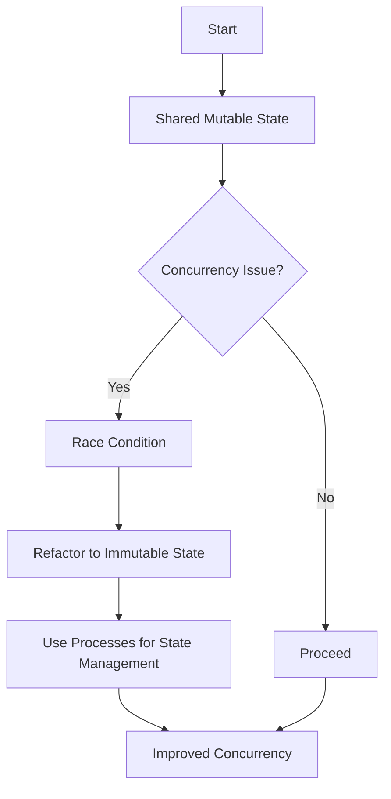

## 27.1. Recognizing Anti-Patterns in Elixir

### Introduction

In the world of software development, especially within the Elixir ecosystem, it is crucial to recognize and avoid anti-patterns—recurring solutions to common problems that are ineffective and counterproductive. Anti-patterns often arise from misapplying concepts or failing to adapt to the idiomatic practices of a language. In this section, we will explore various anti-patterns that can emerge in Elixir development, understand their impact, and learn strategies to avoid them to maintain code quality and system performance.

### Definition and Impact

#### Understanding Anti-Patterns

Anti-patterns are essentially poor solutions to recurring problems. They often seem like a good idea at first but lead to less maintainable, less efficient, or more error-prone code. In Elixir, a language built on functional programming principles and the Erlang VM, anti-patterns can hinder the benefits of concurrency, fault tolerance, and scalability.

#### Recognizing Misapplications

Anti-patterns often emerge from misapplying concepts, such as trying to use object-oriented design patterns in a functional language like Elixir. Recognizing these misapplications is essential to prevent them from becoming entrenched in your codebase.

#### Impact on Development

The impact of anti-patterns can be significant, leading to increased technical debt, reduced performance, and more challenging maintenance. By understanding and avoiding these pitfalls, developers can ensure their Elixir applications remain robust and efficient.

### Importance of Awareness

#### Maintaining Code Quality

Staying vigilant against anti-patterns is crucial for maintaining high code quality. This involves regularly reviewing code, adhering to best practices, and fostering a culture of continuous improvement within development teams.

#### Ensuring System Performance

Anti-patterns can degrade system performance, particularly in a concurrent environment like Elixir's. By recognizing and addressing these patterns early, developers can ensure their systems remain performant and scalable.

### Common Anti-Patterns in Elixir

#### 1. Overusing Macros and Metaprogramming

**Definition:** Macros in Elixir allow for powerful metaprogramming capabilities, enabling developers to write code that generates code. However, overusing macros can lead to complex, hard-to-understand code that is difficult to debug and maintain.

**Impact:** Excessive use of macros can obscure the logic of your application, making it hard for other developers (or even your future self) to understand what the code is doing. It can also introduce subtle bugs that are difficult to trace.

**Solution:** Use macros sparingly and only when necessary. Prefer using functions for most tasks and reserve macros for cases where you need to manipulate the abstract syntax tree (AST) directly.

```elixir
# Example of a simple macro
defmodule MyMacros do
  defmacro say_hello do
    quote do
      IO.puts("Hello, world!")
    end
  end
end

# Usage
defmodule Greeter do
  require MyMacros
  MyMacros.say_hello()
end
```

**Try It Yourself:** Modify the macro to accept a name as an argument and print a personalized greeting.

#### 2. Shared Mutable State and Process Networking

**Definition:** Elixir encourages immutable data, but developers coming from other paradigms might accidentally introduce shared mutable state, leading to race conditions and unpredictable behavior.

**Impact:** Shared mutable state can lead to concurrency issues, making it difficult to reason about the state of your application and leading to bugs that are hard to reproduce and fix.

**Solution:** Embrace immutability and use processes to encapsulate state. Use message passing to communicate between processes, ensuring that state changes are controlled and predictable.

```elixir
# Example of using processes to manage state
defmodule Counter do
  def start_link(initial_value) do
    spawn_link(fn -> loop(initial_value) end)
  end

  defp loop(value) do
    receive do
      {:increment, caller} ->
        send(caller, value + 1)
        loop(value + 1)
    end
  end
end

# Usage
{:ok, pid} = Counter.start_link(0)
send(pid, {:increment, self()})
receive do
  new_value -> IO.puts("New value: #{new_value}")
end
```

**Try It Yourself:** Extend the counter to handle decrement messages and reset the state.

#### 3. Inefficient Use of Recursion

**Definition:** Recursion is a common pattern in functional programming, but inefficient use can lead to stack overflow errors and poor performance.

**Impact:** Without proper tail call optimization, recursive functions can consume large amounts of stack space, leading to crashes or slow performance.

**Solution:** Use tail-recursive functions to ensure that the Elixir compiler can optimize the recursion, preventing stack overflow and improving performance.

```elixir
# Tail-recursive factorial function
defmodule Math do
  def factorial(n), do: factorial(n, 1)

  defp factorial(0, acc), do: acc
  defp factorial(n, acc), do: factorial(n - 1, n * acc)
end
```

**Try It Yourself:** Implement a tail-recursive function to calculate the Fibonacci sequence.

#### 4. Blocking Operations in Concurrent Processes

**Definition:** Blocking operations, such as long-running computations or I/O operations, can block the entire process, reducing the concurrency benefits of Elixir.

**Impact:** Blocking operations in a process can lead to reduced throughput and responsiveness, especially in systems that rely on concurrency for performance.

**Solution:** Use asynchronous tasks or separate processes to handle blocking operations, allowing other processes to continue executing.

```elixir
# Example of using Task for asynchronous operations
defmodule ImageProcessor do
  def process_images(image_list) do
    image_list
    |> Enum.map(&Task.async(fn -> process_image(&1) end))
    |> Enum.map(&Task.await/1)
  end

  defp process_image(image) do
    # Simulate a long-running operation
    :timer.sleep(1000)
    IO.puts("Processed image: #{image}")
  end
end
```

**Try It Yourself:** Modify the `process_images` function to handle errors gracefully using `Task.yield/2`.

#### 5. Poor Error Handling and Lack of Supervision

**Definition:** Elixir's "let it crash" philosophy encourages developers to let processes fail and rely on supervisors to restart them. However, failing to implement proper supervision can lead to system instability.

**Impact:** Without proper supervision, a crashing process can take down the entire application, leading to downtime and data loss.

**Solution:** Use supervisors to manage process lifecycles, ensuring that crashes are handled gracefully and processes are restarted automatically.

```elixir
# Example of a simple supervisor
defmodule MyApp.Supervisor do
  use Supervisor

  def start_link(_) do
    Supervisor.start_link(__MODULE__, :ok, name: __MODULE__)
  end

  def init(:ok) do
    children = [
      {MyWorker, []}
    ]

    Supervisor.init(children, strategy: :one_for_one)
  end
end
```

**Try It Yourself:** Add a second worker to the supervisor and experiment with different restart strategies.

#### 6. Ignoring OTP Principles

**Definition:** The Open Telecom Platform (OTP) provides a set of design principles and libraries for building robust, fault-tolerant applications. Ignoring these principles can lead to less reliable systems.

**Impact:** Failing to leverage OTP can result in applications that are harder to scale, less fault-tolerant, and more difficult to maintain.

**Solution:** Embrace OTP principles, such as using GenServers for stateful processes and Supervisors for fault tolerance. Leverage OTP libraries to build robust applications.

```elixir
# Example of a GenServer
defmodule MyGenServer do
  use GenServer

  def start_link(_) do
    GenServer.start_link(__MODULE__, :ok, name: __MODULE__)
  end

  def init(:ok) do
    {:ok, %{}}
  end

  def handle_call(:get_state, _from, state) do
    {:reply, state, state}
  end

  def handle_cast({:set_state, new_state}, _state) do
    {:noreply, new_state}
  end
end
```

**Try It Yourself:** Implement a GenServer that manages a simple key-value store.

### Visualizing Anti-Patterns

To better understand the impact of anti-patterns, let's visualize a common scenario where an anti-pattern might occur and how it can be resolved.


```mermaid
flowchart TD
    A[Start] --> B[Shared Mutable State]
    B --> C{Concurrency Issue?}
    C -->|Yes| D[Race Condition]
    C -->|No| E[Proceed]
    D --> F[Refactor to Immutable State]
    F --> G[Use Processes for State Management]
    G --> H[Improved Concurrency]
    E --> H
```

**Diagram Description:** This flowchart illustrates the potential pitfalls of shared mutable state leading to concurrency issues and race conditions. By refactoring to immutable state and using processes for state management, we can improve concurrency and system reliability.

### References and Links

- [Elixir Lang Documentation](https://elixir-lang.org/docs.html)
- [Functional Programming Principles in Elixir](https://elixirschool.com/en/lessons/advanced/otp/)
- [Understanding Concurrency in Elixir](https://medium.com/@elixirlang/understanding-concurrency-in-elixir-8a7b7a4e2c0f)

### Knowledge Check

- What are anti-patterns, and why are they detrimental to Elixir development?
- How can overusing macros affect code maintainability?
- Why is shared mutable state problematic in concurrent systems?
- What is the significance of tail call optimization in recursion?
- How can blocking operations impact concurrent processes?

### Embrace the Journey

Remember, recognizing and avoiding anti-patterns is an ongoing journey. As you continue to develop in Elixir, keep experimenting, stay curious, and enjoy the process of refining your skills. By staying aware of these pitfalls, you'll be better equipped to build robust, efficient, and maintainable applications.

### Quiz Time!



### What is an anti-pattern in software development?

- [x] A common but ineffective solution to a recurring problem
- [ ] A best practice for solving complex problems
- [ ] A design pattern that improves code quality
- [ ] A technique for optimizing performance

> **Explanation:** An anti-pattern is a common but ineffective solution to a recurring problem, often leading to poor code quality and maintainability.

### Why is overusing macros considered an anti-pattern in Elixir?

- [x] It can lead to complex and hard-to-understand code
- [ ] It improves code performance significantly
- [ ] It simplifies the codebase
- [ ] It is a recommended practice in Elixir

> **Explanation:** Overusing macros can lead to complex and hard-to-understand code, making it difficult to maintain and debug.

### What is the impact of shared mutable state in Elixir?

- [x] It can lead to concurrency issues and race conditions
- [ ] It enhances the performance of the application
- [ ] It simplifies state management
- [ ] It is the preferred way to handle state in Elixir

> **Explanation:** Shared mutable state can lead to concurrency issues and race conditions, making it difficult to reason about the state of the application.

### How can inefficient use of recursion affect an Elixir application?

- [x] It can lead to stack overflow errors and poor performance
- [ ] It improves the readability of the code
- [ ] It enhances the application's scalability
- [ ] It is always optimized by the Elixir compiler

> **Explanation:** Inefficient use of recursion can lead to stack overflow errors and poor performance, especially if tail call optimization is not used.

### What is the solution for handling blocking operations in concurrent processes?

- [x] Use asynchronous tasks or separate processes
- [ ] Use synchronous operations to ensure consistency
- [ ] Block the entire process to simplify control flow
- [ ] Avoid using processes altogether

> **Explanation:** Using asynchronous tasks or separate processes allows other processes to continue executing, improving concurrency and responsiveness.

### What is the role of supervisors in Elixir?

- [x] To manage process lifecycles and handle crashes gracefully
- [ ] To provide a user interface for the application
- [ ] To optimize the performance of the application
- [ ] To simplify the codebase

> **Explanation:** Supervisors manage process lifecycles and handle crashes gracefully, ensuring that processes are restarted automatically.

### Why is it important to embrace OTP principles in Elixir?

- [x] To build robust, fault-tolerant, and scalable applications
- [ ] To reduce the complexity of the codebase
- [ ] To improve the application's user interface
- [ ] To avoid using processes and concurrency

> **Explanation:** Embracing OTP principles helps build robust, fault-tolerant, and scalable applications by leveraging the power of the Erlang VM.

### What is a key benefit of using tail-recursive functions in Elixir?

- [x] They prevent stack overflow and improve performance
- [ ] They make the code more readable
- [ ] They simplify error handling
- [ ] They are easier to write than non-tail-recursive functions

> **Explanation:** Tail-recursive functions prevent stack overflow and improve performance by allowing the Elixir compiler to optimize the recursion.

### How can we improve concurrency in Elixir applications?

- [x] By using processes to encapsulate state and message passing for communication
- [ ] By using shared mutable state for faster access
- [ ] By avoiding the use of processes altogether
- [ ] By using blocking operations to ensure consistency

> **Explanation:** Using processes to encapsulate state and message passing for communication improves concurrency by ensuring controlled and predictable state changes.

### True or False: Anti-patterns can lead to increased technical debt and reduced performance in Elixir applications.

- [x] True
- [ ] False

> **Explanation:** Anti-patterns can lead to increased technical debt and reduced performance, making it crucial to recognize and avoid them in Elixir applications.



By recognizing and addressing these anti-patterns, you can enhance your Elixir development skills and build more robust, efficient, and maintainable applications. Keep learning, experimenting, and refining your approach to become a more proficient Elixir developer.
