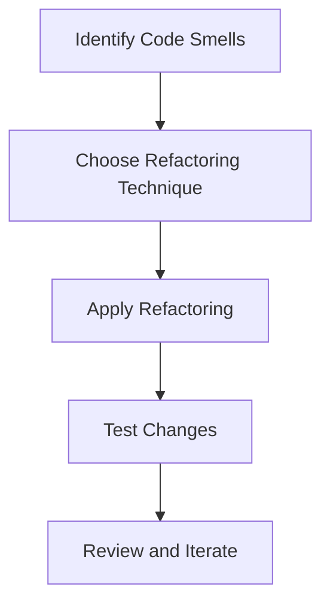

## 27.10. Refactoring Strategies and Avoiding Common Pitfalls in Elixir

Refactoring is an essential practice in software development, especially in a dynamic language like Elixir. It involves restructuring existing code without changing its external behavior to improve its readability, maintainability, and performance. In this section, we will explore strategies to refactor Elixir code effectively and avoid common pitfalls that can lead to technical debt and software rot.

### Understanding the Need for Refactoring

Refactoring is not just about cleaning up code; it's about enhancing the design and architecture of your software. As systems evolve, codebases can become cluttered with redundant, inefficient, or poorly structured code. Regular refactoring helps maintain code quality and ensures that the software remains adaptable to future changes.

#### Key Benefits of Refactoring

- **Improved Readability**: Clean and well-structured code is easier to understand and maintain.
- **Enhanced Performance**: Optimizing code can lead to better performance and resource utilization.
- **Reduced Complexity**: Simplifying complex code structures makes it easier to debug and extend.
- **Increased Reusability**: Modular and well-organized code can be reused across different parts of the application.

### Regular Reviews

Conducting regular code reviews and refactoring sessions is crucial for maintaining a healthy codebase. These reviews should focus on identifying areas of improvement and ensuring that the code adheres to best practices.

#### Code Review Process

1. **Set Clear Objectives**: Define what you want to achieve with the code review, such as improving performance, readability, or adherence to coding standards.
2. **Use Checklists**: Create checklists to ensure consistency in reviews. Include items like code readability, adherence to design patterns, and error handling.
3. **Encourage Collaboration**: Involve multiple team members in the review process to gain diverse perspectives and insights.
4. **Focus on Learning**: Use reviews as an opportunity for team members to learn from each other and improve their coding skills.

### Automated Tools

Automated tools can significantly aid in the refactoring process by identifying potential issues and suggesting improvements. In Elixir, tools like Credo and Dialyzer are invaluable for maintaining code quality.

#### Using Credo

Credo is a static code analysis tool for Elixir that helps you enforce consistent coding standards and identify potential issues.

```elixir
# Run Credo to analyze your codebase
mix credo

# Example output highlighting issues
# [C] → Refactor this function to reduce its complexity
# [F] → Avoid using functions with side effects
```

- **Configuration**: Customize Credo's configuration to suit your project's needs by modifying the `.credo.exs` file.
- **Integration**: Integrate Credo into your CI/CD pipeline to ensure code quality is maintained across all stages of development.

#### Leveraging Dialyzer

Dialyzer is a static analysis tool that identifies type discrepancies and potential bugs in your Elixir code.

```elixir
# Run Dialyzer to check for type inconsistencies
mix dialyzer

# Example output highlighting type issues
# Function call with wrong argument types
```

- **Type Specifications**: Use typespecs to define expected types for functions, aiding Dialyzer in its analysis.
- **Continuous Integration**: Regularly run Dialyzer as part of your build process to catch issues early.

### Continuous Learning

Staying updated on best practices and language features is essential for effective refactoring. Elixir is a rapidly evolving language, and keeping abreast of new developments can help you write better code.

#### Resources for Continuous Learning

- **Elixir Forum**: Engage with the community to learn from others' experiences and share your own insights.
- **Books and Tutorials**: Read books like "Elixir in Action" and follow online tutorials to deepen your understanding of Elixir.
- **Conferences and Meetups**: Attend events like ElixirConf to network with other developers and learn about the latest trends and techniques.

### Common Pitfalls and How to Avoid Them

Avoiding common pitfalls is as important as refactoring itself. Here are some pitfalls to watch out for and strategies to avoid them:

#### Overusing Macros

While macros are powerful, overusing them can lead to complex and hard-to-maintain code. Use macros judiciously and prefer functions whenever possible.

#### Shared Mutable State

Elixir's functional nature encourages immutability, but shared mutable state can still creep in, especially when interfacing with external systems. Use processes and message passing to manage state safely.

#### Inefficient Use of Recursion

Recursion is a common pattern in functional programming, but inefficient recursion can lead to performance issues. Use tail call optimization to ensure your recursive functions are efficient.

```elixir
# Example of tail-recursive function
defmodule Factorial do
  def calculate(n), do: calculate(n, 1)

  defp calculate(0, acc), do: acc
  defp calculate(n, acc), do: calculate(n - 1, n * acc)
end
```

#### Blocking Operations in Concurrent Processes

Blocking operations can hinder the performance of concurrent systems. Use asynchronous tasks and non-blocking I/O to keep your processes responsive.

### Refactoring Techniques

Refactoring involves a variety of techniques, each suited to different types of code improvements. Here are some common refactoring techniques:

#### Extract Method

Extracting methods involves breaking down large functions into smaller, more manageable ones. This improves readability and makes the code easier to test.

```elixir
defmodule OrderProcessor do
  def process_order(order) do
    validate_order(order)
    calculate_total(order)
    apply_discount(order)
    finalize_order(order)
  end

  defp validate_order(order), do: # Validation logic
  defp calculate_total(order), do: # Calculation logic
  defp apply_discount(order), do: # Discount logic
  defp finalize_order(order), do: # Finalization logic
end
```

#### Inline Method

Inline methods are the opposite of extract methods. They involve removing unnecessary method calls by incorporating their logic directly into the calling method.

#### Rename Method

Renaming methods can improve code readability by making method names more descriptive and indicative of their functionality.

#### Replace Magic Numbers with Constants

Magic numbers are hard-coded values that can make code difficult to understand. Replace them with named constants to improve clarity.

```elixir
defmodule Circle do
  @pi 3.14159

  def area(radius), do: @pi * radius * radius
end
```

### Visualizing Refactoring Processes

To better understand the refactoring process, let's visualize a typical refactoring workflow using a flowchart.



- **Identify Code Smells**: Recognize areas of the code that need improvement.
- **Choose Refactoring Technique**: Select the appropriate technique based on the identified issues.
- **Apply Refactoring**: Implement the chosen refactoring technique.
- **Test Changes**: Ensure that the refactored code behaves as expected.
- **Review and Iterate**: Continuously review and refine the code.

### Try It Yourself

Experiment with the refactoring techniques discussed in this section. Take a piece of code from your current project and apply one or more refactoring techniques. Observe how these changes affect the readability, maintainability, and performance of the code.

### Knowledge Check

- What are some benefits of refactoring?
- How can automated tools like Credo and Dialyzer aid in the refactoring process?
- What are some common pitfalls in Elixir development, and how can they be avoided?

### Summary

Refactoring is a crucial practice for maintaining high-quality code in Elixir. By conducting regular code reviews, leveraging automated tools, and continuously learning, you can ensure that your codebase remains clean, efficient, and adaptable. Avoiding common pitfalls and applying effective refactoring techniques will help you build robust and maintainable software.

### Embrace the Journey

Remember, refactoring is an ongoing process. As you gain experience and learn new techniques, you'll become more adept at identifying areas for improvement and applying the right strategies. Keep experimenting, stay curious, and enjoy the journey of mastering Elixir development!

## Quiz: Strategies to Refactor and Avoid Pitfalls



### What is the primary goal of refactoring?

- [x] To improve code readability and maintainability
- [ ] To add new features to the codebase
- [ ] To increase the code's execution speed
- [ ] To reduce the number of lines of code

> **Explanation:** The primary goal of refactoring is to improve the readability and maintainability of the code without changing its external behavior.

### Which tool is used in Elixir for static code analysis?

- [x] Credo
- [ ] ExUnit
- [ ] Mix
- [ ] Phoenix

> **Explanation:** Credo is a static code analysis tool for Elixir that helps enforce coding standards and identify potential issues.

### What is a common pitfall when using macros in Elixir?

- [x] Overusing them, leading to complex and hard-to-maintain code
- [ ] Not using them enough, resulting in verbose code
- [ ] Using them for simple arithmetic operations
- [ ] Avoiding them entirely

> **Explanation:** Overusing macros can lead to complex and hard-to-maintain code, so they should be used judiciously.

### What is the benefit of using tail call optimization in recursive functions?

- [x] It prevents stack overflow by reusing the current function's stack frame
- [ ] It increases the readability of the code
- [ ] It allows for parallel execution of recursive calls
- [ ] It simplifies the function's logic

> **Explanation:** Tail call optimization prevents stack overflow by reusing the current function's stack frame, making recursive functions more efficient.

### What is the purpose of using typespecs in Elixir?

- [x] To define expected types for functions and aid in static analysis
- [ ] To increase the execution speed of the code
- [ ] To reduce the size of the compiled code
- [ ] To enable dynamic typing

> **Explanation:** Typespecs are used to define expected types for functions, aiding tools like Dialyzer in static analysis.

### What is a magic number in programming?

- [x] A hard-coded value that lacks context or explanation
- [ ] A number that is used in cryptographic algorithms
- [ ] A number that automatically adjusts based on input
- [ ] A number that is generated randomly

> **Explanation:** A magic number is a hard-coded value that lacks context or explanation, making the code difficult to understand.

### Which of the following is a benefit of conducting regular code reviews?

- [x] Improved code quality and team collaboration
- [ ] Increased code execution speed
- [ ] Reduced number of lines of code
- [ ] Faster deployment times

> **Explanation:** Regular code reviews improve code quality and foster team collaboration by allowing team members to learn from each other.

### What is the role of Dialyzer in Elixir development?

- [x] To identify type discrepancies and potential bugs
- [ ] To compile Elixir code into bytecode
- [ ] To manage dependencies in Elixir projects
- [ ] To run unit tests

> **Explanation:** Dialyzer is a static analysis tool that identifies type discrepancies and potential bugs in Elixir code.

### What should be the focus of a code review?

- [x] Code readability, adherence to design patterns, and error handling
- [ ] Reducing the number of lines of code
- [ ] Increasing the execution speed of the code
- [ ] Adding new features to the codebase

> **Explanation:** A code review should focus on code readability, adherence to design patterns, and error handling to ensure high-quality code.

### True or False: Refactoring should only be done when adding new features.

- [ ] True
- [x] False

> **Explanation:** Refactoring should be an ongoing process, not limited to when new features are added. It helps maintain code quality and adaptability.




