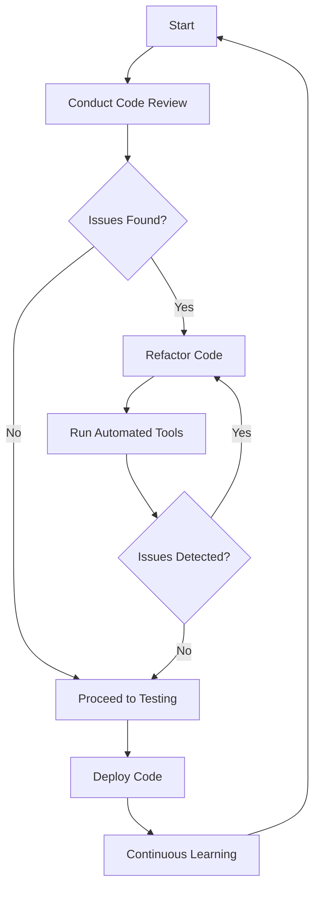

## 27.10. Strategies to Refactor and Avoid Pitfalls

As expert software engineers and architects, we understand that writing code is only the beginning of the software development lifecycle. Maintaining and improving that code is where the real challenge lies. In this section, we will delve into effective strategies for refactoring and avoiding common pitfalls in Elixir development. We'll explore regular reviews, the use of automated tools, and the importance of continuous learning to ensure our code remains clean, efficient, and maintainable.

### Regular Reviews

#### Conducting Code Reviews

Code reviews are an essential practice for maintaining code quality and fostering a culture of continuous improvement. They provide an opportunity for team members to share knowledge, identify potential issues, and ensure adherence to coding standards.

**Steps for Effective Code Reviews:**

1. **Set Clear Objectives:** Define what you aim to achieve with the code review. This could include ensuring code readability, verifying functionality, or checking for potential performance issues.

2. **Establish Guidelines:** Create a set of guidelines that reviewers should follow. These should cover coding standards, architectural principles, and any specific practices relevant to your project.

3. **Encourage Constructive Feedback:** Foster an environment where feedback is given constructively and focused on the code, not the coder. This encourages open communication and learning.

4. **Use Tools to Facilitate Reviews:** Platforms like GitHub, GitLab, or Bitbucket offer built-in code review tools that allow for inline comments and discussions.

5. **Regularly Schedule Reviews:** Make code reviews a regular part of your development process. This ensures that issues are caught early and knowledge is continuously shared.

#### Refactoring Sessions

Refactoring is the process of restructuring existing code without changing its external behavior. It is a critical practice for improving code quality and maintainability.

**Key Refactoring Techniques:**

- **Extract Method:** Simplify complex methods by breaking them into smaller, more manageable pieces.
  
- **Rename Variables:** Use descriptive names for variables and functions to improve code readability.
  
- **Remove Dead Code:** Identify and eliminate code that is no longer used or necessary.

- **Simplify Conditionals:** Refactor complex conditional statements to make them easier to understand.

- **Optimize Loops:** Replace loops with more efficient constructs, such as using `Enum` or `Stream` functions in Elixir.

**Example of Refactoring in Elixir:**

```elixir
# Original code with complex conditional logic
def calculate_discount(price, customer_type) do
  if customer_type == :premium do
    price * 0.9
  else
    if price > 100 do
      price * 0.95
    else
      price
    end
  end
end

# Refactored code using pattern matching
def calculate_discount(price, :premium), do: price * 0.9
def calculate_discount(price, _) when price > 100, do: price * 0.95
def calculate_discount(price, _), do: price
```

### Automated Tools

#### Using Linters like Credo

Automated tools can help detect issues in your code that might be overlooked during manual reviews. Credo is a popular static code analysis tool for Elixir that can identify code smells, complexity, and style violations.

**Benefits of Using Credo:**

- **Consistency:** Ensures that your codebase adheres to a consistent style and structure.
  
- **Efficiency:** Quickly identifies potential issues, allowing developers to focus on more complex tasks.
  
- **Customization:** Credo can be configured to suit the specific needs of your project, allowing you to enforce your team's coding standards.

**Example of Credo Configuration:**

```elixir
# .credo.exs configuration file
%{
  configs: [
    %{
      name: "default",
      checks: [
        {Credo.Check.Readability.MaxLineLength, max_length: 80},
        {Credo.Check.Refactor.CyclomaticComplexity, max_complexity: 10},
        {Credo.Check.Warning.IoInspect}
      ]
    }
  ]
}
```

#### Continuous Integration (CI) Tools

Integrating tools like Credo into your CI pipeline ensures that code quality checks are performed automatically with every commit. This helps catch issues early and maintain a high standard of code quality.

**Setting Up CI with Credo:**

1. **Choose a CI Platform:** Select a CI service such as GitHub Actions, Travis CI, or CircleCI.

2. **Configure Your Pipeline:** Set up your CI configuration to run Credo as part of your build process.

3. **Automate Feedback:** Ensure that feedback from Credo is provided to developers through the CI platform, allowing them to address issues promptly.

### Continuous Learning

#### Staying Updated on Best Practices

The field of software development is constantly evolving, and staying updated on best practices is crucial for maintaining code quality and avoiding pitfalls.

**Strategies for Continuous Learning:**

- **Participate in Conferences and Meetups:** Engage with the Elixir community by attending conferences, meetups, and webinars.

- **Follow Thought Leaders:** Keep up with blogs, podcasts, and social media accounts of thought leaders in the Elixir community.

- **Contribute to Open Source:** Participate in open source projects to gain exposure to different coding styles and practices.

- **Read Books and Articles:** Regularly read books and articles on Elixir and software development best practices.

#### Leveraging Elixir's Unique Features

Elixir offers unique features that can help you write cleaner and more efficient code. Understanding and leveraging these features is key to avoiding common pitfalls.

**Key Elixir Features:**

- **Pattern Matching:** Use pattern matching to simplify your code and make it more expressive.

- **Immutability:** Embrace immutability to avoid side effects and make your code easier to reason about.

- **Concurrency:** Take advantage of Elixir's concurrency model to build scalable and fault-tolerant applications.

- **Metaprogramming:** Use macros judiciously to reduce boilerplate code, but be cautious of overuse, which can lead to complexity.

### Visualizing Refactoring and Code Quality

To further enhance our understanding, let's visualize the process of refactoring and maintaining code quality using a flowchart.


```mermaid
graph TD;
    A[Start] --> B[Conduct Code Review]
    B --> C{Issues Found?}
    C -->|Yes| D[Refactor Code]
    C -->|No| E[Proceed to Testing]
    D --> F[Run Automated Tools]
    F --> G{Issues Detected?}
    G -->|Yes| D
    G -->|No| E
    E --> H[Deploy Code]
    H --> I[Continuous Learning]
    I --> A
```

**Diagram Explanation:**

- **Start:** Initiate the process with a code review.
- **Conduct Code Review:** Review the code for potential issues.
- **Issues Found?:** Determine if there are any issues that need addressing.
- **Refactor Code:** If issues are found, refactor the code to improve quality.
- **Run Automated Tools:** Use tools like Credo to detect any remaining issues.
- **Issues Detected?:** Check if automated tools detect any issues.
- **Proceed to Testing:** If no issues are found, proceed to testing.
- **Deploy Code:** Deploy the code once it passes all checks.
- **Continuous Learning:** Engage in continuous learning to stay updated on best practices.

### Knowledge Check

Let's pause for a moment and reflect on what we've learned. Consider the following questions:

- How can code reviews contribute to maintaining code quality?
- What are some benefits of using automated tools like Credo?
- How can continuous learning help you avoid common pitfalls in Elixir development?

### Embrace the Journey

Remember, refactoring and maintaining code quality is an ongoing journey. As you gain experience, you'll develop your own strategies and techniques for writing clean, efficient, and maintainable code. Keep experimenting, stay curious, and enjoy the process of continuous improvement.

### Conclusion

In this section, we've explored strategies for refactoring and avoiding pitfalls in Elixir development. By conducting regular reviews, utilizing automated tools, and engaging in continuous learning, we can maintain high standards of code quality and ensure our applications are robust and maintainable.

## Quiz Time!



### What is the primary goal of a code review?

- [x] To ensure code quality and adherence to standards
- [ ] To increase the number of lines of code
- [ ] To replace the need for automated testing
- [ ] To reduce the development time

> **Explanation:** The primary goal of a code review is to ensure code quality and adherence to coding standards, not to increase code quantity or replace testing.

### Which tool is commonly used for static code analysis in Elixir?

- [x] Credo
- [ ] JSLint
- [ ] SonarQube
- [ ] ESLint

> **Explanation:** Credo is a popular static code analysis tool specifically for Elixir, helping to identify code smells and style violations.

### What is a benefit of using automated tools in your CI pipeline?

- [x] They help catch issues early
- [ ] They eliminate the need for code reviews
- [ ] They increase the complexity of the code
- [ ] They slow down the development process

> **Explanation:** Automated tools in the CI pipeline help catch issues early, ensuring code quality before deployment.

### What is a key feature of Elixir that aids in writing cleaner code?

- [x] Pattern Matching
- [ ] Mutable State
- [ ] Global Variables
- [ ] Goto Statements

> **Explanation:** Pattern matching is a key feature of Elixir that simplifies code and makes it more expressive.

### Which of the following is a refactoring technique?

- [x] Extract Method
- [ ] Increase Cyclomatic Complexity
- [ ] Add More Global Variables
- [ ] Use More Nested Loops

> **Explanation:** Extract Method is a refactoring technique used to simplify complex methods by breaking them into smaller pieces.

### Why is continuous learning important in software development?

- [x] To stay updated on best practices and language features
- [ ] To avoid writing any new code
- [ ] To focus only on legacy systems
- [ ] To increase the number of bugs

> **Explanation:** Continuous learning helps developers stay updated on best practices and language features, which is crucial for maintaining code quality.

### How can you leverage Elixir's concurrency model?

- [x] To build scalable and fault-tolerant applications
- [ ] To create more global variables
- [ ] To increase the use of mutable state
- [ ] To avoid using pattern matching

> **Explanation:** Elixir's concurrency model allows developers to build scalable and fault-tolerant applications.

### What should you do if automated tools detect issues in your code?

- [x] Refactor the code to address the issues
- [ ] Ignore the issues and proceed to deployment
- [ ] Add more complexity to the code
- [ ] Remove all tests

> **Explanation:** If automated tools detect issues, you should refactor the code to address them before proceeding.

### What is the purpose of using linters like Credo?

- [x] To ensure code consistency and detect issues
- [ ] To replace manual testing
- [ ] To increase the number of lines of code
- [ ] To slow down the development process

> **Explanation:** Linters like Credo ensure code consistency and help detect issues, contributing to overall code quality.

### True or False: Refactoring changes the external behavior of the code.

- [ ] True
- [x] False

> **Explanation:** Refactoring involves restructuring existing code without changing its external behavior.


