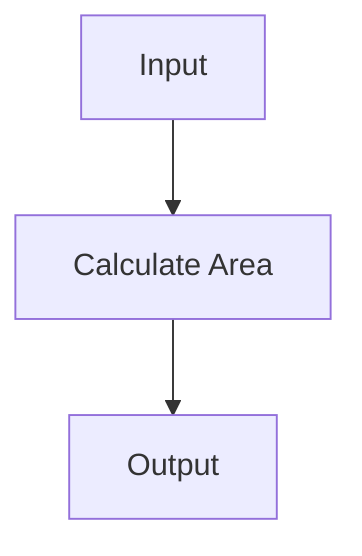
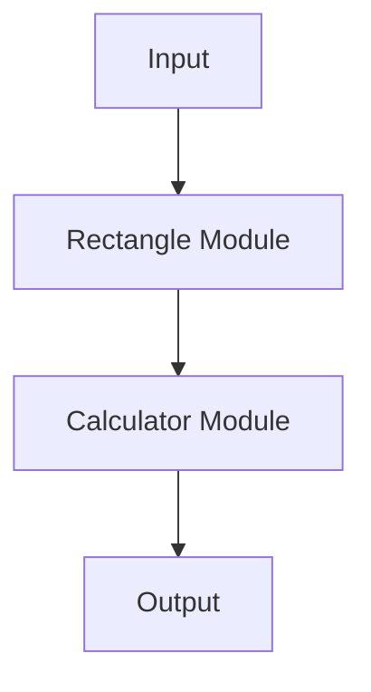

## 27.11. Overcomplicating with Unnecessary Abstractions

In the realm of software engineering, abstraction is a powerful tool. It allows us to hide complexity, create reusable components, and build systems that are easier to understand and maintain. However, like any tool, abstraction can be misused. Overcomplicating with unnecessary abstractions is a common pitfall that can lead to bloated, difficult-to-maintain codebases. In this section, we will explore the dangers of over-abstraction, how to recognize when abstraction is unnecessary, and guidelines for applying abstraction effectively in Elixir.

### The KISS Principle

The KISS principle, an acronym for "Keep It Simple, Stupid," is a design philosophy that emphasizes simplicity. The idea is to avoid overengineering by keeping systems as simple as possible. This principle is particularly relevant when considering abstraction in software design.

- **Simplicity Over Complexity**: Aim to solve problems with the simplest solution that works. Avoid adding complexity unless it is necessary to meet the requirements.
- **Avoiding Overengineering**: Resist the temptation to build elaborate systems that anticipate every possible future need. Focus on the current requirements and design for flexibility where it is needed.

### When Abstraction Hurts

Abstraction becomes a problem when it adds layers that do not provide tangible benefits. This can manifest in several ways:

- **Unnecessary Layers**: Introducing layers of abstraction that do not simplify the code or improve its readability.
- **Obscured Logic**: Hiding important logic behind multiple layers of abstraction, making it difficult to understand the flow of the program.
- **Increased Complexity**: Adding abstractions that increase the cognitive load required to understand the system.

#### Example: Over-Abstracting a Simple Function

Consider a simple function that calculates the area of a rectangle:

```elixir
defmodule Geometry do
  def area_of_rectangle(length, width) do
    length * width
  end
end
```

An unnecessary abstraction might involve creating multiple modules and functions to achieve the same result:

```elixir
defmodule Geometry do
  defmodule Rectangle do
    defstruct length: 0, width: 0

    def area(%Rectangle{length: length, width: width}) do
      Calculator.multiply(length, width)
    end
  end

  defmodule Calculator do
    def multiply(a, b), do: a * b
  end
end
```

In this example, the additional modules and functions do not provide any real benefit and only serve to complicate the code.

### Guidelines for Effective Abstraction

To avoid unnecessary abstractions, consider the following guidelines:

- **Assess the Need**: Before introducing an abstraction, ask whether it simplifies the code or makes it easier to understand.
- **Focus on Readability**: Abstractions should make the code more readable, not less. If an abstraction obscures the logic, it may not be necessary.
- **Design for Flexibility**: Use abstractions to create flexible systems that can adapt to change, but avoid overgeneralizing.
- **Refactor with Purpose**: Refactor code to introduce abstractions only when they provide clear benefits, such as reducing duplication or improving maintainability.

### Code Examples and Best Practices

Let's explore some code examples that demonstrate both effective and ineffective use of abstraction in Elixir.

#### Effective Abstraction with Protocols

Protocols in Elixir provide a way to achieve polymorphism. They allow you to define a set of functions that can be implemented by different data types.

```elixir
defprotocol Area do
  def calculate(shape)
end

defimpl Area, for: Rectangle do
  def calculate(%Rectangle{length: length, width: width}) do
    length * width
  end
end

defimpl Area, for: Circle do
  def calculate(%Circle{radius: radius}) do
    :math.pi() * radius * radius
  end
end
```

In this example, the abstraction provided by protocols allows us to calculate the area for different shapes without duplicating code. This is a case where abstraction simplifies the code and makes it more flexible.

#### Ineffective Abstraction with Overuse of Macros

Macros in Elixir are powerful tools for metaprogramming, but they can lead to overcomplicated code if used unnecessarily.

```elixir
defmodule MyMacros do
  defmacro define_area_function(shape) do
    quote do
      def area(unquote(shape)) do
        # Complex logic here
      end
    end
  end
end

defmodule Geometry do
  require MyMacros

  MyMacros.define_area_function(:rectangle)
  MyMacros.define_area_function(:circle)
end
```

In this example, using macros to define simple functions adds unnecessary complexity. The same functionality could be achieved with straightforward function definitions.

### Visualizing Abstraction Layers

To better understand the impact of abstraction layers, let's visualize the difference between a simple and an overcomplicated system using Mermaid.js diagrams.

#### Simple System



#### Overcomplicated System



In the overcomplicated system, additional modules add complexity without providing significant benefits.

### Elixir's Unique Features for Abstraction

Elixir offers several unique features that can aid in creating effective abstractions:

- **Pattern Matching**: Use pattern matching to simplify function definitions and reduce the need for complex control structures.
- **Pipelines**: Leverage the pipe operator (`|>`) to create clear and readable data transformations.
- **Protocols and Behaviours**: Utilize protocols and behaviours to define flexible interfaces that can be implemented by different modules.

### Differences and Similarities with Other Languages

Elixir's approach to abstraction is influenced by its functional programming paradigm, which differs from object-oriented languages like Java or C#. In Elixir, abstraction often focuses on functions and data transformations rather than objects and classes.

- **Functional vs. Object-Oriented**: In functional languages, abstraction is often achieved through higher-order functions and data transformations, while object-oriented languages use classes and inheritance.
- **Immutability**: Elixir's immutable data structures encourage a different approach to abstraction, focusing on transformations rather than state changes.

### Knowledge Check

Before we conclude, let's reinforce what we've learned with a few questions:

1. What is the KISS principle, and why is it important in software design?
2. How can unnecessary abstraction hurt a software project?
3. What are some guidelines for implementing effective abstractions in Elixir?
4. How do protocols in Elixir help achieve polymorphism?
5. Why might overusing macros lead to overcomplicated code?

### Try It Yourself

To deepen your understanding, try modifying the code examples provided:

- Simplify the overcomplicated rectangle area calculation example by removing unnecessary modules.
- Implement a new protocol for calculating the perimeter of different shapes.

### Embrace the Journey

Remember, mastering abstraction is a journey. As you continue to develop your skills, focus on creating systems that are simple, flexible, and easy to understand. Keep experimenting, stay curious, and enjoy the process of learning and growing as a software engineer.

## Quiz: Overcomplicating with Unnecessary Abstractions



### What is the KISS principle in software design?

- [x] Keep It Simple, Stupid
- [ ] Keep It Secure, Stupid
- [ ] Keep It Structured, Stupid
- [ ] Keep It Scalable, Stupid

> **Explanation:** The KISS principle stands for "Keep It Simple, Stupid," emphasizing simplicity in design.

### How can unnecessary abstraction negatively impact a project?

- [x] By adding complexity without benefits
- [ ] By improving code readability
- [ ] By reducing code duplication
- [ ] By enhancing system flexibility

> **Explanation:** Unnecessary abstraction can add complexity without providing tangible benefits, making the system harder to understand.

### What is a guideline for effective abstraction?

- [x] Implement abstractions only when they simplify code
- [ ] Use macros for all function definitions
- [ ] Always abstract future requirements
- [ ] Avoid using protocols

> **Explanation:** Effective abstractions should simplify code and aid understanding.

### How do protocols in Elixir help achieve polymorphism?

- [x] By defining a set of functions that can be implemented by different data types
- [ ] By using macros to generate code
- [ ] By creating multiple modules for each function
- [ ] By using inheritance

> **Explanation:** Protocols allow different data types to implement the same set of functions, achieving polymorphism.

### Why might overusing macros lead to overcomplicated code?

- [x] They can obscure logic and add unnecessary complexity
- [ ] They simplify code by reducing duplication
- [ ] They improve code readability
- [ ] They enhance system flexibility

> **Explanation:** Overusing macros can obscure logic and add unnecessary complexity, making the code harder to understand.

### What is an effective use of abstraction in Elixir?

- [x] Using protocols to define flexible interfaces
- [ ] Using macros for all function definitions
- [ ] Creating multiple modules for simple functions
- [ ] Avoiding pattern matching

> **Explanation:** Protocols provide a flexible way to define interfaces that can be implemented by different modules.

### What is a potential downside of over-abstraction?

- [x] Increased cognitive load
- [ ] Improved system performance
- [ ] Enhanced code readability
- [ ] Reduced code duplication

> **Explanation:** Over-abstraction can increase the cognitive load required to understand the system.

### What is a benefit of using the pipe operator in Elixir?

- [x] It creates clear and readable data transformations
- [ ] It adds complexity to the code
- [ ] It obscures the logic of the program
- [ ] It requires additional modules

> **Explanation:** The pipe operator creates clear and readable data transformations, enhancing code readability.

### How can pattern matching simplify function definitions?

- [x] By reducing the need for complex control structures
- [ ] By adding layers of abstraction
- [ ] By requiring additional modules
- [ ] By using macros

> **Explanation:** Pattern matching simplifies function definitions by reducing the need for complex control structures.

### True or False: Abstraction should always be used to anticipate future requirements.

- [ ] True
- [x] False

> **Explanation:** Abstraction should be used to simplify current requirements, not to anticipate every possible future need.




