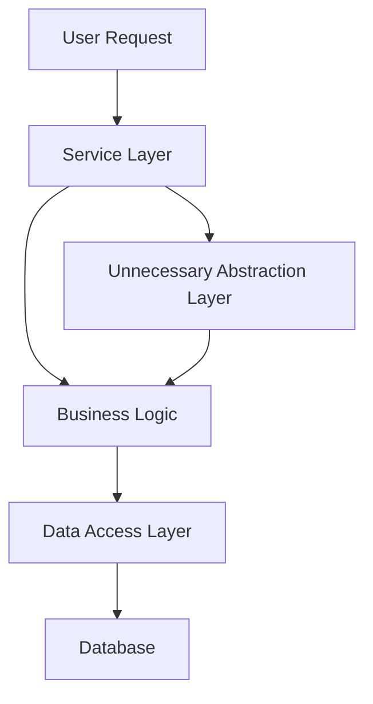

## 27.11. Overcomplicating with Unnecessary Abstractions

In the world of software engineering, abstraction is a double-edged sword. While it can simplify complex systems and promote code reuse, it can also lead to overengineering, making systems unnecessarily complex and difficult to maintain. In this section, we will explore the pitfalls of overcomplicating Elixir applications with unnecessary abstractions, and how to avoid these traps by adhering to the KISS principle: "Keep It Simple, Stupid."

### KISS Principle

The KISS principle is a design philosophy that emphasizes simplicity. It suggests that systems work best when they are kept simple rather than made complex. This principle is especially relevant in Elixir, where the language's functional nature and powerful concurrency model can tempt developers to create intricate abstractions that ultimately hinder rather than help.

#### Why Simplicity Matters

1. **Maintainability**: Simple code is easier to understand, modify, and extend. This is crucial in a fast-paced development environment where requirements often change.
2. **Performance**: Overly abstracted code can introduce unnecessary layers of computation, leading to performance bottlenecks.
3. **Collaboration**: Simple code is easier for team members to comprehend, facilitating better collaboration and knowledge transfer.

### When Abstraction Hurts

Abstraction becomes detrimental when it adds layers that do not provide tangible benefits. This often happens when developers abstract for abstraction's sake, without a clear understanding of the problem they are trying to solve.

#### Common Scenarios of Over-Abstraction

- **Premature Optimization**: Abstracting code in anticipation of future requirements that may never materialize.
- **Over-Engineering**: Creating complex class hierarchies or module structures when simpler solutions would suffice.
- **Misplaced Generalization**: Generalizing code to handle cases that are unlikely to occur, leading to convoluted logic.

#### Example: Over-Abstraction in Elixir

Consider a simple task of fetching user data from a database. An overcomplicated approach might involve multiple layers of abstraction:

```elixir
defmodule UserFetcher do
  def fetch_user(id), do: DatabaseClient.get_user(id)
end

defmodule DatabaseClient do
  def get_user(id), do: QueryBuilder.build_user_query(id) |> execute_query()
end

defmodule QueryBuilder do
  def build_user_query(id), do: "SELECT * FROM users WHERE id = #{id}"
end

def execute_query(query), do: # Imagine this executes the query
```

While each module has a single responsibility, the overall design is unnecessarily complex for such a simple task. A more straightforward approach could be:

```elixir
defmodule UserFetcher do
  def fetch_user(id) do
    query = "SELECT * FROM users WHERE id = #{id}"
    execute_query(query)
  end

  defp execute_query(query), do: # Imagine this executes the query
end
```

### Guidelines for Effective Abstraction

To avoid the pitfalls of unnecessary abstraction, follow these guidelines:

1. **Implement Abstractions Only When Necessary**: Abstractions should simplify code and aid understanding. If an abstraction does not achieve these goals, it may not be necessary.

2. **Favor Composition Over Inheritance**: In Elixir, leveraging composition through modules and functions is often more flexible and understandable than complex inheritance hierarchies.

3. **Use Abstraction to Encapsulate Complexity**: When a problem is inherently complex, abstraction can be used to hide that complexity from the rest of the system.

4. **Validate the Need for Abstraction**: Before abstracting, ask whether the abstraction will be used in multiple places or if it simplifies the codebase.

5. **Iterate on Abstractions**: As the system evolves, revisit abstractions to ensure they still serve their intended purpose.

### Code Examples

Let's explore some code examples to illustrate these principles.

#### Example 1: Avoiding Premature Abstraction

Imagine we need to implement a function to calculate the sum of a list of numbers. A premature abstraction might involve creating a generic `Calculator` module:

```elixir
defmodule Calculator do
  def sum(list), do: Enum.reduce(list, 0, &(&1 + &2))
end
```

While this abstraction might seem useful, it's unnecessary for such a simple task. Instead, we can leverage Elixir's powerful standard library:

```elixir
def sum(list), do: Enum.sum(list)
```

#### Example 2: Using Composition

Suppose we have a system that processes various types of payments. Instead of creating a complex hierarchy of payment classes, we can use composition:

```elixir
defmodule PaymentProcessor do
  def process_payment(payment) do
    payment
    |> validate()
    |> authorize()
    |> capture()
  end

  defp validate(payment), do: # validation logic
  defp authorize(payment), do: # authorization logic
  defp capture(payment), do: # capture logic
end
```

This approach keeps the code simple and flexible, allowing us to easily add new payment types or processing steps.

### Visualizing Over-Abstraction

To better understand the impact of over-abstraction, let's use a diagram to illustrate how unnecessary layers can complicate a system.


```mermaid
graph TD;
    A[User Request] --> B[Service Layer];
    B --> C[Business Logic];
    C --> D[Data Access Layer];
    D --> E[Database];

    B --> F[Unnecessary Abstraction Layer];
    F --> C;
```

**Diagram Explanation**: In this diagram, the unnecessary abstraction layer adds complexity without providing additional value. Removing it simplifies the flow from user request to database interaction.

### Knowledge Check

Before we move on, let's pose a few questions to reinforce what we've learned:

1. What is the main goal of the KISS principle in software design?
2. Can you identify a scenario where abstraction might be beneficial?
3. How can we determine if an abstraction is unnecessary?

### Try It Yourself

To solidify your understanding, try modifying the provided code examples. Experiment with removing unnecessary layers or adding abstractions where they might be beneficial. Observe how these changes affect the code's readability and maintainability.

### References and Further Reading

- [Elixir School: Abstractions](https://elixirschool.com/en/lessons/advanced/abstractions/)
- [Functional Programming Principles in Elixir](https://pragprog.com/titles/elixir16/programming-elixir-1-6/)
- [The Pragmatic Programmer: Your Journey to Mastery](https://pragprog.com/titles/tpp20/the-pragmatic-programmer-20th-anniversary-edition/)

### Conclusion

Overcomplicating with unnecessary abstractions is a common pitfall in software design, particularly in a language as expressive as Elixir. By adhering to the KISS principle and carefully evaluating the need for abstraction, we can create systems that are both powerful and maintainable. Remember, simplicity is not the absence of complexity, but the art of managing it effectively.

## Quiz Time!



### What is the primary benefit of the KISS principle in software design?

- [x] Simplifies code for easier maintenance
- [ ] Increases code complexity for flexibility
- [ ] Ensures maximum use of design patterns
- [ ] Guarantees performance optimization

> **Explanation:** The KISS principle emphasizes simplicity, which makes code easier to maintain and understand.

### When does abstraction become detrimental in software design?

- [x] When it adds unnecessary complexity
- [ ] When it simplifies the codebase
- [ ] When it improves performance
- [ ] When it enhances code reuse

> **Explanation:** Abstraction is detrimental when it adds layers that complicate the system without providing clear benefits.

### Which approach is generally preferred in Elixir: composition or inheritance?

- [x] Composition
- [ ] Inheritance
- [ ] Both are equally preferred
- [ ] Neither is preferred

> **Explanation:** Elixir favors composition over inheritance, as it provides more flexibility and simplicity.

### What should you consider before implementing an abstraction?

- [x] Whether it simplifies the codebase
- [ ] Whether it adds complexity
- [ ] Whether it uses advanced techniques
- [ ] Whether it is commonly used

> **Explanation:** An abstraction should be implemented only if it simplifies the code and adds value.

### How can over-abstraction affect performance?

- [x] By introducing unnecessary computation layers
- [ ] By eliminating redundant operations
- [ ] By optimizing data flow
- [ ] By reducing memory usage

> **Explanation:** Over-abstraction can introduce unnecessary computation layers, leading to performance bottlenecks.

### What is a common pitfall when abstracting code?

- [x] Premature optimization
- [ ] Delayed optimization
- [ ] Avoiding design patterns
- [ ] Overusing design patterns

> **Explanation:** Premature optimization often leads to unnecessary abstractions that complicate the code.

### Why is it important to iterate on abstractions?

- [x] To ensure they still serve their intended purpose
- [ ] To add more complexity
- [ ] To remove all abstractions
- [ ] To increase code size

> **Explanation:** Iterating on abstractions ensures they remain relevant and beneficial as the system evolves.

### What does the KISS principle stand for?

- [x] Keep It Simple, Stupid
- [ ] Keep It Super Simple
- [ ] Keep It Simply Smart
- [ ] Keep It Stupidly Simple

> **Explanation:** The KISS principle stands for "Keep It Simple, Stupid," emphasizing simplicity in design.

### What is a potential downside of using too many abstractions?

- [x] Reduced code readability
- [ ] Enhanced code readability
- [ ] Increased code reuse
- [ ] Improved performance

> **Explanation:** Too many abstractions can reduce code readability by adding unnecessary complexity.

### True or False: Abstractions should always be used in software design.

- [ ] True
- [x] False

> **Explanation:** Abstractions should be used judiciously and only when they add value to the codebase.



Remember, this is just the beginning. As you progress in your Elixir journey, you'll learn to balance abstraction with simplicity, creating systems that are both elegant and efficient. Keep experimenting, stay curious, and enjoy the journey!
