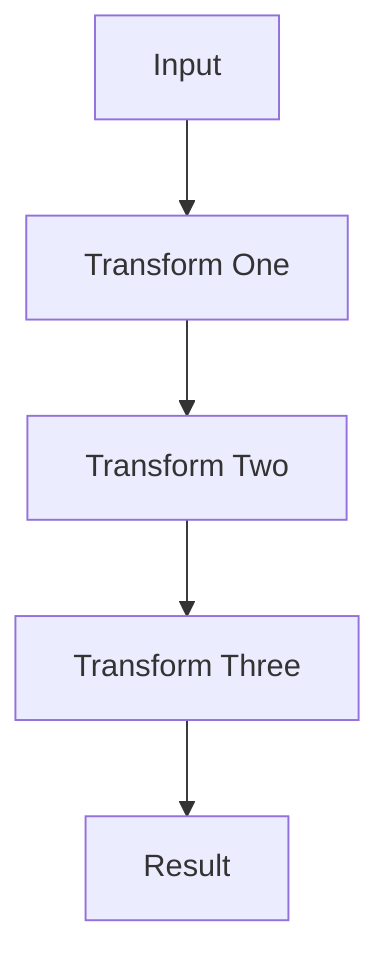

## 27.12. Misusing the Pipe Operator

The pipe operator (`|>`) is one of the most powerful and beloved features of Elixir, allowing developers to write clean, readable, and expressive code by chaining function calls. However, like any powerful tool, it can be misused, leading to code that is difficult to understand and maintain. In this section, we will explore common pitfalls associated with the pipe operator and provide best practices to ensure your pipelines enhance, rather than hinder, code clarity.

### Clarity Over Cleverness

The primary goal of using the pipe operator is to improve code readability by expressing a sequence of transformations in a linear and intuitive manner. However, this goal can be undermined if pipelines become overly complex or obscure the underlying logic.

#### Example of Clear vs. Clever Code

Consider the following example:

```elixir
# Clear and readable
result =
  input
  |> transform_one()
  |> transform_two()
  |> transform_three()

# Clever but obscure
result = transform_three(transform_two(transform_one(input)))
```

In the first example, the sequence of transformations is clear and easy to follow. In the second example, the nested function calls make it harder to understand the order of operations.

### Common Misuses

#### Overlong Pipelines

One of the most common misuses of the pipe operator is creating pipelines that are too long. While it's tempting to chain many operations together, excessively long pipelines can become difficult to read and understand.

##### Example of an Overlong Pipeline

```elixir
# Overlong pipeline
result =
  input
  |> step_one()
  |> step_two()
  |> step_three()
  |> step_four()
  |> step_five()
  |> step_six()
  |> step_seven()
```

In this example, the pipeline is so long that it becomes challenging to grasp the overall logic at a glance. Each step should be meaningful and contribute to the overall transformation.

#### Using Anonymous Functions Unnecessarily

Another common misuse is the unnecessary use of anonymous functions within pipelines. While anonymous functions can be useful, they can also obscure the intent of the code if overused.

##### Example of Unnecessary Anonymous Functions

```elixir
# Unnecessary anonymous functions
result =
  input
  |> (fn x -> transform_one(x) end).()
  |> (fn x -> transform_two(x) end).()
```

In this example, the use of anonymous functions adds unnecessary complexity. Instead, you can directly call the functions:

```elixir
# Improved version
result =
  input
  |> transform_one()
  |> transform_two()
```

### Best Practices

#### Limiting Pipeline Length

To maintain readability, it's important to limit the length of your pipelines. As a general rule, try to keep pipelines to around 3-5 steps. If a pipeline becomes too long, consider breaking it into smaller, more manageable pieces.

##### Example of Breaking Down a Long Pipeline

```elixir
# Breaking down a long pipeline
step_one_result = input |> step_one() |> step_two()
step_two_result = step_one_result |> step_three() |> step_four()
result = step_two_result |> step_five() |> step_six()
```

By breaking down the pipeline, each part becomes easier to understand and maintain.

#### Ensuring Each Step is Meaningful and Self-Explanatory

Each step in a pipeline should be meaningful and self-explanatory. Avoid using the pipe operator to chain together operations that don't logically belong together.

##### Example of Meaningful Steps

```elixir
# Meaningful steps
result =
  input
  |> validate_input()
  |> process_data()
  |> format_output()
```

In this example, each step in the pipeline represents a distinct and meaningful operation.

### Visualizing the Pipe Operator

To better understand how the pipe operator works, let's visualize the flow of data through a pipeline using a Mermaid.js diagram.



This diagram illustrates the linear flow of data through a series of transformations, highlighting the clarity and simplicity that the pipe operator can bring to your code.

### Elixir Unique Features

Elixir's pipe operator is unique in its ability to seamlessly integrate with the language's functional programming paradigm. It allows developers to write code that is both expressive and efficient, leveraging Elixir's powerful pattern matching and immutability features.

### Differences and Similarities

The pipe operator in Elixir is similar to method chaining in object-oriented languages, but with a functional twist. Unlike method chaining, which relies on objects and methods, the pipe operator focuses on functions and data transformations, making it a natural fit for functional programming.

### Design Considerations

When using the pipe operator, consider the following design considerations:

- **Function Arity**: Ensure that the functions you are piping into have the correct arity. The pipe operator passes the result of the previous function as the first argument to the next function.
- **Error Handling**: Consider how errors will be handled within a pipeline. Use pattern matching and error tuples to gracefully handle errors.
- **Performance**: While the pipe operator can improve readability, be mindful of performance implications, especially in performance-critical code.

### Try It Yourself

To get hands-on experience with the pipe operator, try modifying the following code example:

```elixir
# Original code
result =
  input
  |> transform_one()
  |> transform_two()
  |> transform_three()

# Try adding a new transformation step
```

Experiment with adding a new transformation step to the pipeline and observe how it affects the overall logic.

### Knowledge Check

- What is the primary goal of using the pipe operator in Elixir?
- Why is it important to limit the length of pipelines?
- How can you avoid unnecessary complexity when using anonymous functions in pipelines?

### Embrace the Journey

Remember, mastering the pipe operator is just one step in your journey to becoming an expert Elixir developer. As you continue to explore the language, you'll discover new ways to write clean, expressive, and efficient code. Keep experimenting, stay curious, and enjoy the journey!

## Quiz: Misusing the Pipe Operator



### What is the primary goal of using the pipe operator in Elixir?

- [x] To improve code readability by expressing a sequence of transformations in a linear and intuitive manner.
- [ ] To increase the performance of function calls.
- [ ] To reduce the number of lines of code.
- [ ] To enable parallel processing of data.

> **Explanation:** The pipe operator is primarily used to improve code readability by allowing developers to express a sequence of transformations in a linear and intuitive manner.

### Why is it important to limit the length of pipelines?

- [x] To maintain readability and ensure that each step is meaningful and self-explanatory.
- [ ] To reduce the memory usage of the program.
- [ ] To prevent errors in the code.
- [ ] To improve the performance of the pipeline.

> **Explanation:** Limiting the length of pipelines helps maintain readability and ensures that each step in the pipeline is meaningful and self-explanatory.

### How can you avoid unnecessary complexity when using anonymous functions in pipelines?

- [x] By directly calling functions instead of wrapping them in anonymous functions.
- [ ] By using more anonymous functions to simplify the code.
- [ ] By nesting anonymous functions within each other.
- [ ] By avoiding the use of the pipe operator altogether.

> **Explanation:** Avoiding unnecessary complexity can be achieved by directly calling functions instead of wrapping them in anonymous functions, which can obscure the intent of the code.

### What is a common misuse of the pipe operator?

- [x] Creating pipelines that are too long and difficult to read.
- [ ] Using the pipe operator to chain together unrelated operations.
- [ ] Using the pipe operator to improve performance.
- [ ] Using the pipe operator to reduce the number of lines of code.

> **Explanation:** A common misuse of the pipe operator is creating pipelines that are too long, making them difficult to read and understand.

### What should each step in a pipeline represent?

- [x] A distinct and meaningful operation.
- [ ] A random transformation of data.
- [ ] An anonymous function call.
- [ ] A performance optimization.

> **Explanation:** Each step in a pipeline should represent a distinct and meaningful operation, contributing to the overall transformation of the data.

### What is a key consideration when using the pipe operator?

- [x] Ensuring that the functions being piped into have the correct arity.
- [ ] Ensuring that the pipeline is as long as possible.
- [ ] Ensuring that anonymous functions are used frequently.
- [ ] Ensuring that the pipe operator is used in every function call.

> **Explanation:** A key consideration when using the pipe operator is ensuring that the functions being piped into have the correct arity, as the pipe operator passes the result of the previous function as the first argument to the next function.

### How can you handle errors within a pipeline?

- [x] By using pattern matching and error tuples to gracefully handle errors.
- [ ] By ignoring errors and continuing the pipeline.
- [ ] By using anonymous functions to catch errors.
- [ ] By avoiding the use of the pipe operator in error-prone code.

> **Explanation:** Errors within a pipeline can be handled by using pattern matching and error tuples to gracefully handle errors, ensuring that the pipeline can continue or fail gracefully.

### What is a similarity between the pipe operator in Elixir and method chaining in object-oriented languages?

- [x] Both allow for chaining operations in a linear fashion.
- [ ] Both improve the performance of the code.
- [ ] Both reduce the number of lines of code.
- [ ] Both require the use of anonymous functions.

> **Explanation:** The pipe operator in Elixir and method chaining in object-oriented languages both allow for chaining operations in a linear fashion, improving code readability.

### What is a unique feature of the pipe operator in Elixir?

- [x] It seamlessly integrates with the functional programming paradigm.
- [ ] It requires the use of anonymous functions.
- [ ] It improves the performance of function calls.
- [ ] It reduces the number of lines of code.

> **Explanation:** A unique feature of the pipe operator in Elixir is its seamless integration with the functional programming paradigm, allowing for expressive and efficient code.

### True or False: The pipe operator is primarily used to improve the performance of function calls.

- [ ] True
- [x] False

> **Explanation:** False. The pipe operator is primarily used to improve code readability by expressing a sequence of transformations in a linear and intuitive manner, not to improve performance.




