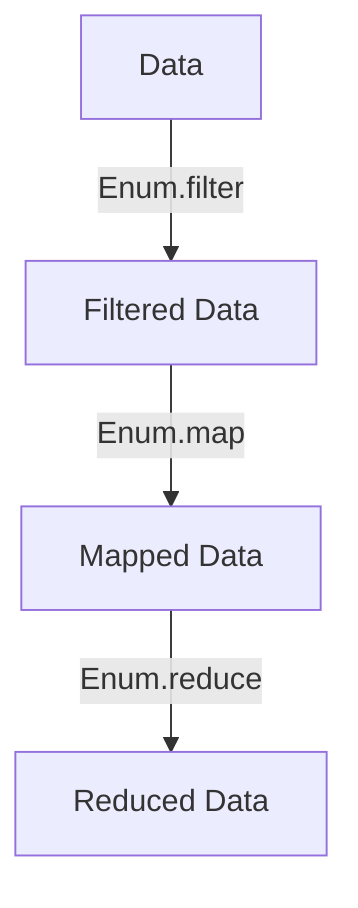

## 27.12. Misusing the Pipe Operator

The pipe operator (`|>`) is one of the most powerful and expressive features in Elixir, allowing for clear and concise code by chaining function calls. However, its misuse can lead to code that is difficult to read and maintain. In this section, we will explore the common pitfalls associated with the pipe operator, provide best practices for its use, and demonstrate how to harness its full potential to write idiomatic and effective Elixir code.

### Clarity Over Cleverness

The primary goal of using the pipe operator is to enhance code readability. It allows developers to express a sequence of transformations on data in a linear and intuitive manner. However, overusing or misusing the pipe operator can lead to code that is clever but difficult to understand. Let's delve into how we can maintain clarity over cleverness.

#### Understanding the Pipe Operator

The pipe operator (`|>`) takes the result of an expression on its left and passes it as the first argument to the function on its right. This can make code more readable by reducing the need for nested function calls.

**Example:**

```elixir
# Without the pipe operator
result = Enum.map(Enum.filter(list, &(&1 > 0)), &(&1 * 2))

# With the pipe operator
result = list
|> Enum.filter(&(&1 > 0))
|> Enum.map(&(&1 * 2))
```

In the above example, the pipe operator helps to express the sequence of operations in a top-down manner, improving readability.

#### Common Misuses

While the pipe operator can greatly enhance readability, it can also be misused in several ways:

1. **Overlong Pipelines**: Long pipelines can become difficult to follow, especially if they span multiple lines or involve complex logic.

2. **Using Anonymous Functions Unnecessarily**: Introducing anonymous functions within a pipeline can obscure the logic and make the code harder to read.

3. **Inconsistent Data Flow**: When the data flow is not consistent or logical, it can confuse readers of the code.

4. **Lack of Intermediate Results**: Not breaking down complex pipelines into intermediate results can make debugging and understanding the code more challenging.

#### Best Practices

To avoid these pitfalls, consider the following best practices:

- **Limit Pipeline Length**: Keep pipelines short and focused. If a pipeline is becoming too long, consider breaking it into smaller, named functions.

- **Ensure Each Step is Meaningful**: Each step in a pipeline should perform a clear and meaningful transformation. Avoid using the pipe operator for trivial operations.

- **Use Descriptive Function Names**: Descriptive names can enhance the readability of each step in a pipeline.

- **Introduce Intermediate Variables**: For complex pipelines, introducing intermediate variables can make the code easier to understand and debug.

- **Avoid Unnecessary Anonymous Functions**: Use named functions instead of anonymous functions when possible, to make the code more self-explanatory.

### Code Examples

Let's explore some code examples to illustrate these concepts.

#### Example 1: Overlong Pipeline

**Problematic Code:**

```elixir
# A long and complex pipeline
result = data
|> Enum.map(&process/1)
|> Enum.filter(&filter_criteria/1)
|> Enum.reduce(%{}, &accumulate/2)
|> Enum.map(&transform/1)
|> Enum.reject(&reject_criteria/1)
|> Enum.sort()
|> Enum.uniq()
```

**Improved Code:**

```elixir
# Breaking down the pipeline into smaller functions
processed_data = data |> Enum.map(&process/1)
filtered_data = processed_data |> Enum.filter(&filter_criteria/1)
accumulated_data = filtered_data |> Enum.reduce(%{}, &accumulate/2)
transformed_data = accumulated_data |> Enum.map(&transform/1)
final_result = transformed_data |> Enum.reject(&reject_criteria/1) |> Enum.sort() |> Enum.uniq()
```

By breaking down the pipeline into intermediate steps, the code becomes more readable and easier to debug.

#### Example 2: Unnecessary Anonymous Functions

**Problematic Code:**

```elixir
# Using anonymous functions unnecessarily
result = data
|> Enum.map(fn x -> x * 2 end)
|> Enum.filter(fn x -> x > 10 end)
```

**Improved Code:**

```elixir
# Using named functions for clarity
defmodule MyModule do
  def double(x), do: x * 2
  def greater_than_ten?(x), do: x > 10
end

result = data
|> Enum.map(&MyModule.double/1)
|> Enum.filter(&MyModule.greater_than_ten?/1)
```

Named functions make the code more self-explanatory and easier to maintain.

### Visualizing the Pipe Operator

To better understand how the pipe operator works, let's visualize the flow of data through a pipeline.


```mermaid
graph TD;
    A[Data] -->|Enum.filter| B[Filtered Data];
    B -->|Enum.map| C[Mapped Data];
    C -->|Enum.reduce| D[Reduced Data];
```

This diagram illustrates how data flows through a series of transformations, with each step building upon the previous one.

### References and Links

For further reading on the pipe operator and functional programming in Elixir, consider the following resources:

- [Elixir Lang Documentation](https://elixir-lang.org/docs.html)
- [Learn Functional Programming with Elixir](https://pragprog.com/titles/cdc-elixir/learn-functional-programming-with-elixir/)

### Knowledge Check

Let's test your understanding of the pipe operator with a few questions:

1. What is the primary benefit of using the pipe operator in Elixir?
2. How can overlong pipelines affect code readability?
3. Why is it important to use descriptive function names in a pipeline?
4. What are the benefits of breaking down a complex pipeline into intermediate variables?

### Embrace the Journey

Remember, mastering the pipe operator is just one step in becoming proficient in Elixir. As you continue to learn and experiment, you'll discover new ways to write clean, efficient, and maintainable code. Keep exploring, stay curious, and enjoy the journey!

### Quiz Time!



### What is the primary benefit of using the pipe operator in Elixir?

- [x] Enhancing code readability by reducing nested function calls
- [ ] Increasing code execution speed
- [ ] Simplifying error handling
- [ ] Automatically optimizing memory usage

> **Explanation:** The pipe operator enhances code readability by allowing a linear flow of data transformations, reducing the need for nested function calls.

### How can overlong pipelines affect code readability?

- [x] They can become difficult to follow and understand
- [ ] They always improve performance
- [ ] They make debugging easier
- [ ] They automatically document the code

> **Explanation:** Overlong pipelines can make code difficult to follow, as the sequence of transformations may become complex and hard to understand.

### Why is it important to use descriptive function names in a pipeline?

- [x] To enhance readability and make each step self-explanatory
- [ ] To increase the speed of execution
- [ ] To reduce memory usage
- [ ] To automatically handle errors

> **Explanation:** Descriptive function names enhance readability by clearly indicating what each step in the pipeline does.

### What are the benefits of breaking down a complex pipeline into intermediate variables?

- [x] Easier to understand and debug
- [ ] Increases code execution speed
- [ ] Reduces memory usage
- [ ] Automatically optimizes the code

> **Explanation:** Breaking down a complex pipeline into intermediate variables makes the code easier to understand and debug.

### Which of the following is a common misuse of the pipe operator?

- [x] Using anonymous functions unnecessarily
- [ ] Using it for data transformations
- [ ] Passing data to functions
- [ ] Chaining simple operations

> **Explanation:** Using anonymous functions unnecessarily within a pipeline can obscure the logic and make the code harder to read.

### How can you avoid making a pipeline too long?

- [x] By breaking it into smaller, named functions
- [ ] By using more anonymous functions
- [ ] By avoiding intermediate variables
- [ ] By adding more steps to the pipeline

> **Explanation:** Breaking a long pipeline into smaller, named functions helps maintain readability and manageability.

### What is the effect of inconsistent data flow in a pipeline?

- [x] It can confuse readers of the code
- [ ] It always improves performance
- [ ] It simplifies error handling
- [ ] It reduces code length

> **Explanation:** Inconsistent data flow can confuse readers, as it disrupts the logical sequence of transformations.

### Which of the following should be avoided to maintain clarity in a pipeline?

- [x] Overusing anonymous functions
- [ ] Using named functions
- [ ] Breaking pipelines into smaller functions
- [ ] Using descriptive function names

> **Explanation:** Overusing anonymous functions can make the code less clear and harder to understand.

### What is a key advantage of using intermediate variables in a pipeline?

- [x] They make the code easier to debug and understand
- [ ] They increase execution speed
- [ ] They reduce memory usage
- [ ] They automatically handle errors

> **Explanation:** Intermediate variables make the code easier to debug and understand by breaking down complex transformations into simpler steps.

### True or False: The pipe operator automatically optimizes code performance.

- [ ] True
- [x] False

> **Explanation:** The pipe operator does not automatically optimize code performance; its primary benefit is enhancing readability and maintainability.


