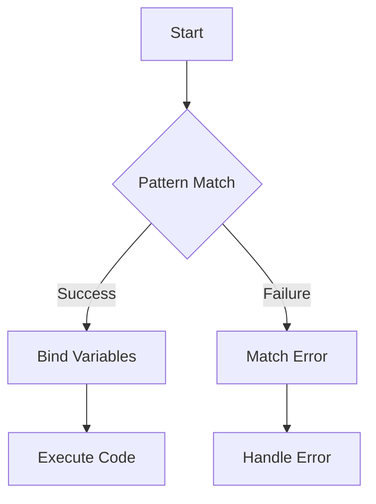

## 27.13. Common Mistakes with Pattern Matching

Pattern matching is one of the most powerful features in Elixir, offering a concise and expressive way to destructure data and control program flow. However, even experienced developers can fall into common pitfalls when using pattern matching. In this section, we will explore these mistakes, provide clear examples, and offer recommendations to help you harness the full potential of pattern matching in Elixir.

### Understanding Pattern Matching

Before diving into the common mistakes, let's briefly revisit what pattern matching is in Elixir. Pattern matching allows you to compare a value against a pattern. If the value fits the pattern, the match succeeds, and variables in the pattern are bound to corresponding parts of the value. This mechanism is deeply integrated into Elixir, influencing everything from variable assignment to function definitions.

```elixir
# Basic pattern matching example
{a, b} = {1, 2}
IO.puts(a) # Outputs: 1
IO.puts(b) # Outputs: 2
```

### Match Errors

#### Failing to Account for All Possible Patterns

One of the most common mistakes is failing to account for all possible patterns, leading to match errors. This often occurs when developers assume that a function will only receive certain types of inputs.

```elixir
defmodule Calculator do
  def add({:ok, a}, {:ok, b}), do: {:ok, a + b}
end

# This will cause a match error
Calculator.add({:ok, 1}, {:error, "Invalid number"})
```

**Recommendation:** Always consider using a catch-all pattern to handle unexpected inputs gracefully.

```elixir
defmodule Calculator do
  def add({:ok, a}, {:ok, b}), do: {:ok, a + b}
  def add(_, _), do: {:error, "Invalid input"}
end
```

#### Overcomplicating Patterns

Creating overly complex and brittle matches can make your code difficult to read and maintain. Complex patterns can also lead to subtle bugs if not all cases are handled correctly.

```elixir
# Overly complex pattern
defmodule User do
  def greet(%{name: name, age: age, location: %{city: city, country: country}}) do
    "Hello #{name} from #{city}, #{country}!"
  end
end
```

**Recommendation:** Break down complex patterns into simpler components. Consider using helper functions to manage complexity.

```elixir
defmodule User do
  def greet(user) do
    name = get_name(user)
    location = get_location(user)
    "Hello #{name} from #{location}!"
  end

  defp get_name(%{name: name}), do: name
  defp get_location(%{location: %{city: city, country: country}}), do: "#{city}, #{country}"
end
```

### Recommendations for Effective Pattern Matching

#### Using Default Clauses

Incorporating default clauses in your pattern matching can help prevent match errors and make your code more robust.

```elixir
defmodule Greeter do
  def greet(%{name: name}), do: "Hello, #{name}!"
  def greet(_), do: "Hello, stranger!"
end
```

#### Breaking Down Complex Patterns

When faced with complex data structures, break down the pattern matching into smaller, manageable parts. This not only improves readability but also makes it easier to debug and maintain.

```elixir
defmodule Order do
  def process(%{items: items, total: total}) do
    items |> Enum.each(&process_item/1)
    "Total: #{total}"
  end

  defp process_item(%{name: name, price: price}) do
    IO.puts("Processing item: #{name} - $#{price}")
  end
end
```

### Visualizing Pattern Matching

To better understand how pattern matching works, let's visualize the process using a flowchart. This diagram illustrates the decision-making process when matching patterns in Elixir.



**Description:** This flowchart demonstrates the flow of pattern matching in Elixir. If the pattern match is successful, variables are bound, and the code executes. If it fails, a match error occurs, which should be handled appropriately.

### Elixir Unique Features

Elixir's pattern matching is unique due to its integration with the language's functional nature and its ability to destructure complex data types seamlessly. The use of pattern matching in function heads and case expressions is particularly powerful.

#### Function Heads

Elixir allows you to define multiple function clauses with different patterns, enabling clean and expressive code.

```elixir
defmodule Shape do
  def area({:circle, radius}), do: 3.14 * radius * radius
  def area({:rectangle, width, height}), do: width * height
end
```

#### Case Expressions

Case expressions provide a way to match patterns against a value, offering a clear and concise way to handle different scenarios.

```elixir
defmodule TrafficLight do
  def action(color) do
    case color do
      :red -> "Stop"
      :yellow -> "Caution"
      :green -> "Go"
      _ -> "Invalid color"
    end
  end
end
```

### Differences and Similarities with Other Languages

Pattern matching in Elixir is similar to destructuring in JavaScript or pattern matching in Scala, but it is more pervasive and integrated into the language. Unlike switch statements in languages like Java or C++, Elixir's pattern matching is not limited to simple value comparisons and can destructure complex data types.

### Knowledge Check

Let's reinforce what we've learned with some questions and exercises.

- **Question:** What happens if a pattern match fails in Elixir?
- **Exercise:** Modify the `Calculator` module to handle more complex input scenarios, such as nested tuples or lists.

### Embrace the Journey

Remember, mastering pattern matching in Elixir is a journey. As you continue to explore and experiment, you'll discover new ways to leverage this powerful feature. Keep practicing, stay curious, and enjoy the process!

### Quiz: Common Mistakes with Pattern Matching



### What is a common mistake when using pattern matching in Elixir?

- [x] Failing to account for all possible patterns
- [ ] Using too many variables
- [ ] Avoiding pattern matching altogether
- [ ] Overusing default clauses

> **Explanation:** Failing to account for all possible patterns can lead to match errors, which are a common mistake in Elixir.

### How can you prevent match errors in Elixir?

- [x] Use catch-all patterns
- [ ] Avoid using pattern matching
- [ ] Use only simple patterns
- [ ] Ignore errors

> **Explanation:** Using catch-all patterns helps handle unexpected inputs and prevents match errors.

### What is a recommended practice when dealing with complex patterns?

- [x] Break them down into simpler components
- [ ] Use as many variables as possible
- [ ] Avoid pattern matching
- [ ] Use complex patterns for all scenarios

> **Explanation:** Breaking down complex patterns into simpler components improves readability and maintainability.

### What is the result of a failed pattern match?

- [x] A match error occurs
- [ ] The program continues without error
- [ ] Variables are set to nil
- [ ] A warning is issued

> **Explanation:** A failed pattern match results in a match error, which needs to be handled appropriately.

### Which of the following is a unique feature of Elixir's pattern matching?

- [x] Integration with function heads
- [ ] Limited to simple value comparisons
- [ ] Only works with lists
- [ ] Requires explicit variable declarations

> **Explanation:** Elixir's pattern matching is uniquely integrated with function heads, allowing for expressive and clean code.

### How does Elixir's pattern matching differ from switch statements in other languages?

- [x] It can destructure complex data types
- [ ] It is limited to integers
- [ ] It requires a default case
- [ ] It is less expressive

> **Explanation:** Unlike switch statements, Elixir's pattern matching can destructure complex data types, offering more flexibility.

### What is the purpose of using default clauses in pattern matching?

- [x] To handle unexpected inputs
- [ ] To avoid using pattern matching
- [ ] To simplify patterns
- [ ] To make code more complex

> **Explanation:** Default clauses help handle unexpected inputs, making the code more robust.

### What should you do if you encounter a match error?

- [x] Handle it with a catch-all pattern
- [ ] Ignore it
- [ ] Use more complex patterns
- [ ] Avoid pattern matching

> **Explanation:** Handling match errors with a catch-all pattern ensures that unexpected inputs are managed gracefully.

### What is the benefit of using pattern matching in function heads?

- [x] It allows for clean and expressive code
- [ ] It makes code more complex
- [ ] It limits the use of variables
- [ ] It requires more lines of code

> **Explanation:** Pattern matching in function heads allows for clean and expressive code by enabling multiple function clauses.

### True or False: Pattern matching in Elixir is limited to simple value comparisons.

- [ ] True
- [x] False

> **Explanation:** False. Pattern matching in Elixir is not limited to simple value comparisons; it can destructure complex data types.



By understanding and avoiding these common mistakes, you can leverage pattern matching in Elixir to write more robust, maintainable, and expressive code. Keep experimenting and refining your skills, and you'll find pattern matching to be an invaluable tool in your Elixir programming journey.
