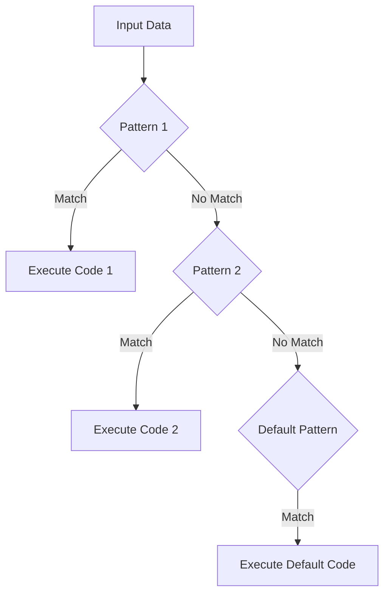

## 27.13. Common Mistakes with Pattern Matching in Elixir

Pattern matching is one of the most powerful features of Elixir, allowing developers to write concise, expressive code. However, even experienced developers can fall into common pitfalls when using pattern matching. In this guide, we will explore these pitfalls and provide practical advice on how to avoid them.

### Understanding Pattern Matching in Elixir

Before diving into the common mistakes, let's briefly revisit what pattern matching is. In Elixir, pattern matching is a mechanism that allows you to destructure data and bind variables to specific parts of that data. It is used extensively in variable assignments, function definitions, and control structures like `case` and `cond`.

```elixir
# Simple pattern matching example
{a, b} = {1, 2}
IO.inspect(a) # Outputs: 1
IO.inspect(b) # Outputs: 2
```

In this example, the tuple `{1, 2}` is matched against the pattern `{a, b}`, binding `a` to `1` and `b` to `2`.

### Common Mistakes with Pattern Matching

#### Match Errors

One of the most frequent mistakes is failing to account for all possible patterns, leading to match errors. This often happens when developers assume certain inputs without validating them.

**Example:**

```elixir
defmodule Calculator do
  def add({a, b}) do
    a + b
  end
end

# This will raise a MatchError
Calculator.add({1, 2, 3})
```

**Solution:**

To avoid match errors, consider using default clauses or guards to handle unexpected patterns.

```elixir
defmodule Calculator do
  def add({a, b}) when is_number(a) and is_number(b) do
    a + b
  end
  def add(_), do: {:error, "Invalid input"}
end

# Now it returns an error tuple instead of crashing
Calculator.add({1, 2, 3}) # Outputs: {:error, "Invalid input"}
```

#### Overcomplicating Patterns

Another common mistake is creating overly complex and brittle matches. This can make the code difficult to read and maintain.

**Example:**

```elixir
defmodule ComplexPattern do
  def process({:ok, %{data: %{user: %{name: name}}}}) do
    "Hello, #{name}!"
  end
end

# This works
ComplexPattern.process({:ok, %{data: %{user: %{name: "Alice"}}}})

# But this will raise a MatchError
ComplexPattern.process({:ok, %{data: %{user: %{}}}})
```

**Solution:**

Break down complex patterns into simpler components and use helper functions to improve readability and maintainability.

```elixir
defmodule ComplexPattern do
  def process({:ok, data}) do
    case extract_name(data) do
      {:ok, name} -> "Hello, #{name}!"
      {:error, _} -> "Name not found"
    end
  end

  defp extract_name(%{data: %{user: %{name: name}}}) when is_binary(name), do: {:ok, name}
  defp extract_name(_), do: {:error, "Invalid structure"}
end

# Now it handles missing names gracefully
ComplexPattern.process({:ok, %{data: %{user: %{}}}}) # Outputs: "Name not found"
```

### Recommendations for Effective Pattern Matching

#### Use Default Clauses

Always provide a default clause to handle unexpected patterns. This can prevent runtime errors and make your functions more robust.

```elixir
defmodule SafeCalculator do
  def subtract({a, b}) when is_number(a) and is_number(b), do: a - b
  def subtract(_), do: {:error, "Invalid input"}
end
```

#### Break Down Complex Patterns

Simplify complex patterns by breaking them into smaller, more manageable pieces. This not only improves readability but also makes it easier to test and debug.

#### Use Guards

Guards are a powerful tool in Elixir that allow you to add additional conditions to pattern matches. Use them to enforce constraints on your matches.

```elixir
defmodule GuardedCalculator do
  def multiply({a, b}) when is_integer(a) and is_integer(b), do: a * b
  def multiply(_), do: {:error, "Invalid input"}
end
```

#### Consider the Order of Patterns

The order of patterns matters in Elixir. The first pattern that matches will be executed, so order your patterns from most specific to least specific.

```elixir
defmodule OrderedPatterns do
  def check({:ok, _} = result), do: {:success, result}
  def check(:error), do: {:failure, "An error occurred"}
  def check(_), do: {:unknown, "Unknown result"}
end
```

### Visualizing Pattern Matching Flow

To better understand how pattern matching flows in Elixir, consider the following diagram:


```mermaid
graph TD;
    A[Input Data] --> B{Pattern 1}
    B -- Match --> C[Execute Code 1]
    B -- No Match --> D{Pattern 2}
    D -- Match --> E[Execute Code 2]
    D -- No Match --> F{Default Pattern}
    F -- Match --> G[Execute Default Code]
```

This flowchart illustrates how Elixir evaluates each pattern in order, executing the corresponding code block when a match is found.

### Try It Yourself

Experiment with the following code snippets by modifying the patterns and observing how the output changes. Try adding more patterns or using guards to refine the matching logic.

```elixir
defmodule Experiment do
  def test({:ok, value}) when is_integer(value), do: "Integer: #{value}"
  def test({:ok, value}) when is_binary(value), do: "String: #{value}"
  def test(_), do: "Unknown format"
end

IO.inspect(Experiment.test({:ok, 42}))      # Outputs: "Integer: 42"
IO.inspect(Experiment.test({:ok, "Hello"})) # Outputs: "String: Hello"
IO.inspect(Experiment.test({:error, "Oops"})) # Outputs: "Unknown format"
```

### Knowledge Check

- What happens if a pattern match fails in Elixir?
- How can you use guards to refine pattern matching?
- Why is it important to consider the order of patterns?

### Key Takeaways

- **Account for All Patterns**: Always handle unexpected patterns to prevent runtime errors.
- **Simplify Complex Patterns**: Break down complex patterns into simpler components for better readability.
- **Use Guards and Default Clauses**: Leverage guards to enforce constraints and default clauses to handle unmatched patterns.
- **Order Matters**: Arrange patterns from most specific to least specific to ensure correct matching.

### Embrace the Journey

Pattern matching is a powerful feature, but it requires careful consideration to use effectively. Remember, this is just the beginning. As you progress, you'll become more adept at crafting elegant and efficient pattern matches. Keep experimenting, stay curious, and enjoy the journey!

## Quiz Time!



### What is a common mistake when using pattern matching in Elixir?

- [x] Failing to account for all possible patterns
- [ ] Using too many guards
- [ ] Using pattern matching in function definitions
- [ ] Using pattern matching in variable assignments

> **Explanation:** Failing to account for all possible patterns can lead to match errors.

### How can you prevent match errors in Elixir?

- [x] Use default clauses
- [ ] Avoid using pattern matching
- [ ] Use only simple patterns
- [ ] Use pattern matching only in variable assignments

> **Explanation:** Default clauses can handle unexpected patterns and prevent match errors.

### What is the benefit of breaking down complex patterns?

- [x] Improves readability and maintainability
- [ ] Makes the code run faster
- [ ] Reduces the number of lines of code
- [ ] Ensures no match errors occur

> **Explanation:** Breaking down complex patterns improves readability and maintainability.

### Why should you use guards in pattern matching?

- [x] To add additional conditions to pattern matches
- [ ] To reduce the number of patterns
- [ ] To make code execution faster
- [ ] To avoid using default clauses

> **Explanation:** Guards allow you to enforce additional conditions on pattern matches.

### What happens if no pattern matches in a `case` expression?

- [x] A MatchError is raised
- [ ] The code continues to the next line
- [ ] A warning is logged
- [ ] The last pattern is executed

> **Explanation:** If no pattern matches, a MatchError is raised.

### How should patterns be ordered in Elixir?

- [x] From most specific to least specific
- [ ] From least specific to most specific
- [ ] In alphabetical order
- [ ] In reverse alphabetical order

> **Explanation:** Patterns should be ordered from most specific to least specific to ensure correct matching.

### What is a benefit of using default clauses?

- [x] They handle unexpected patterns gracefully
- [ ] They make the code run faster
- [ ] They reduce the number of lines of code
- [ ] They ensure no match errors occur

> **Explanation:** Default clauses handle unexpected patterns gracefully.

### What is the purpose of the `when` keyword in pattern matching?

- [x] To introduce guards
- [ ] To define default clauses
- [ ] To order patterns
- [ ] To simplify patterns

> **Explanation:** The `when` keyword is used to introduce guards in pattern matching.

### What is a potential downside of overcomplicating patterns?

- [x] The code becomes difficult to read and maintain
- [ ] The code runs slower
- [ ] The code becomes too short
- [ ] The code cannot be compiled

> **Explanation:** Overcomplicating patterns makes the code difficult to read and maintain.

### True or False: Pattern matching can be used in variable assignments, function definitions, and control structures.

- [x] True
- [ ] False

> **Explanation:** Pattern matching is versatile and can be used in variable assignments, function definitions, and control structures.


