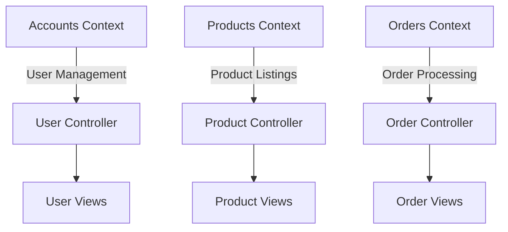

## 27.14. Avoiding Monolithic Contexts in Phoenix

In the world of software development, maintaining a clean and scalable architecture is crucial for the long-term success of any application. In the Phoenix framework, which is built on Elixir, avoiding monolithic contexts is a key strategy to achieve this goal. In this section, we will delve into the problems associated with monolithic contexts, explore the concept of separation of concerns, and discuss the benefits of adopting a more modular approach.

### Problems with Monoliths

Monolithic architectures, where all components of an application are tightly coupled, can lead to several challenges:

- **Difficult to Maintain and Evolve**: As the application grows, the complexity of the codebase increases, making it harder to understand, maintain, and evolve. Changes in one part of the system can have unintended consequences in other areas, leading to a fragile codebase.
- **Limited Scalability**: Monolithic applications can be difficult to scale, as they often require scaling the entire application rather than individual components. This can lead to inefficient use of resources and increased costs.
- **Slower Development Cycles**: With a monolithic architecture, development teams may face longer development cycles due to the complexity of the codebase and the need for extensive testing to ensure changes do not break existing functionality.
- **Deployment Challenges**: Deploying a monolithic application can be challenging, as any change requires redeploying the entire application, increasing the risk of downtime and deployment failures.

### Separation of Concerns

To address these challenges, it's essential to adopt a design approach that emphasizes separation of concerns. This involves dividing the application into distinct contexts, each responsible for a specific domain or functionality. In Phoenix, this can be achieved by leveraging the concept of bounded contexts.

#### Bounded Contexts

A bounded context is a logical boundary within which a particular domain model is defined and applicable. By dividing an application into bounded contexts, you can isolate different parts of the system, allowing them to evolve independently. This approach aligns with the principles of Domain-Driven Design (DDD) and helps maintain a clean architecture.

**Key Benefits of Bounded Contexts:**

- **Improved Code Organization**: By organizing code into bounded contexts, you can create a more modular and organized codebase. Each context can have its own models, controllers, and views, reducing the complexity of the overall system.
- **Easier Testing and Refactoring**: With clear boundaries between contexts, testing and refactoring become more manageable. You can focus on individual contexts without worrying about unintended side effects on other parts of the system.
- **Enhanced Collaboration**: Bounded contexts facilitate collaboration among development teams by providing clear ownership and responsibility for different parts of the application.

### Implementing Bounded Contexts in Phoenix

Let's explore how to implement bounded contexts in a Phoenix application. We'll use a hypothetical e-commerce application as an example, with contexts such as `Accounts`, `Products`, and `Orders`.

#### Step 1: Define Contexts

Start by identifying the different domains within your application. For our e-commerce example, we can define the following contexts:

- **Accounts**: Responsible for user authentication, registration, and profile management.
- **Products**: Manages product listings, categories, and inventory.
- **Orders**: Handles order creation, payment processing, and order tracking.

#### Step 2: Create Context Modules

In Phoenix, contexts are typically represented as modules. Each context module encapsulates the business logic and data access for a specific domain. Here's an example of how to define the `Accounts` context:

```elixir
defmodule MyApp.Accounts do
  alias MyApp.Repo
  alias MyApp.Accounts.User

  def list_users do
    Repo.all(User)
  end

  def get_user!(id) do
    Repo.get!(User, id)
  end

  def create_user(attrs \\ %{}) do
    %User{}
    |> User.changeset(attrs)
    |> Repo.insert()
  end

  def update_user(%User{} = user, attrs) do
    user
    |> User.changeset(attrs)
    |> Repo.update()
  end

  def delete_user(%User{} = user) do
    Repo.delete(user)
  end
end
```

In this example, the `Accounts` context provides functions for listing, retrieving, creating, updating, and deleting users. The context encapsulates the data access logic, making it easier to manage and test.

#### Step 3: Organize Code by Context

Organize your codebase by creating separate directories for each context. This helps maintain a clear separation of concerns and makes it easier to navigate the codebase. For example:

```
lib/my_app/
  accounts/
    accounts.ex
    user.ex
  products/
    products.ex
    product.ex
  orders/
    orders.ex
    order.ex
```

#### Step 4: Use Contexts in Controllers

In Phoenix, controllers are responsible for handling HTTP requests and responses. Use contexts to encapsulate the business logic and data access within controllers. Here's an example of how to use the `Accounts` context in a controller:

```elixir
defmodule MyAppWeb.UserController do
  use MyAppWeb, :controller

  alias MyApp.Accounts

  def index(conn, _params) do
    users = Accounts.list_users()
    render(conn, "index.html", users: users)
  end

  def show(conn, %{"id" => id}) do
    user = Accounts.get_user!(id)
    render(conn, "show.html", user: user)
  end

  def create(conn, %{"user" => user_params}) do
    case Accounts.create_user(user_params) do
      {:ok, user} ->
        conn
        |> put_flash(:info, "User created successfully.")
        |> redirect(to: Routes.user_path(conn, :show, user))

      {:error, %Ecto.Changeset{} = changeset} ->
        render(conn, "new.html", changeset: changeset)
    end
  end
end
```

In this example, the `UserController` uses the `Accounts` context to handle user-related actions. This approach keeps the controller focused on request handling, while the context manages the business logic.

### Visualizing Context Separation

To better understand the concept of context separation, let's visualize the architecture of our e-commerce application using a Mermaid.js diagram.



**Diagram Description**: This diagram illustrates the separation of concerns in our e-commerce application. Each context (Accounts, Products, Orders) is responsible for a specific domain and interacts with its corresponding controller and views.

### Design Considerations

When implementing bounded contexts in Phoenix, consider the following design considerations:

- **Context Boundaries**: Clearly define the boundaries of each context to avoid overlap and ensure a clean separation of concerns.
- **Data Sharing**: Minimize data sharing between contexts to maintain independence. Use well-defined interfaces or APIs for communication between contexts.
- **Context Ownership**: Assign ownership of each context to specific development teams to enhance collaboration and accountability.
- **Scalability**: Design contexts to be scalable and independently deployable, allowing for efficient resource utilization and cost savings.

### Elixir Unique Features

Elixir offers several unique features that can enhance the implementation of bounded contexts:

- **Concurrency**: Leverage Elixir's concurrency model to handle parallel processing within contexts, improving performance and scalability.
- **Fault Tolerance**: Use Elixir's fault-tolerant design to build resilient contexts that can recover from failures without affecting the entire application.
- **Pattern Matching**: Utilize pattern matching to simplify data processing and enhance code readability within contexts.

### Differences and Similarities

It's important to distinguish bounded contexts from other architectural patterns, such as microservices. While both approaches emphasize modularity, bounded contexts are typically implemented within a single application, whereas microservices involve separate, independently deployable services.

### Try It Yourself

To reinforce your understanding of bounded contexts, try implementing them in your own Phoenix application. Start by identifying the different domains within your application and defining contexts for each. Experiment with organizing your codebase and using contexts in controllers. Consider the following exercises:

1. **Exercise 1**: Identify and define contexts for a blogging platform, such as `Posts`, `Comments`, and `Users`.
2. **Exercise 2**: Refactor an existing monolithic Phoenix application to use bounded contexts. Focus on separating business logic and data access into distinct modules.
3. **Exercise 3**: Implement communication between contexts using well-defined interfaces or APIs. Explore different strategies for data sharing and synchronization.

### Knowledge Check

- **Question 1**: What are the main challenges associated with monolithic architectures?
- **Question 2**: How do bounded contexts help improve code organization and maintainability?
- **Question 3**: What are some design considerations when implementing bounded contexts in Phoenix?
- **Question 4**: How does Elixir's concurrency model enhance the implementation of bounded contexts?

### Summary

In this section, we've explored the pitfalls of monolithic contexts in Phoenix applications and discussed the benefits of adopting a more modular approach through bounded contexts. By leveraging separation of concerns, you can create scalable, maintainable systems that are easier to test and evolve. Remember, this is just the beginning. As you progress, you'll build more complex and interactive applications. Keep experimenting, stay curious, and enjoy the journey!

## Quiz: Avoiding Monolithic Contexts in Phoenix



### What is a key challenge of monolithic architectures?

- [x] Difficult to maintain and evolve
- [ ] Easy to scale
- [ ] Simple to deploy
- [ ] Fast development cycles

> **Explanation:** Monolithic architectures are difficult to maintain and evolve due to their tightly coupled components.

### What is a bounded context?

- [x] A logical boundary within which a particular domain model is defined
- [ ] A physical server boundary
- [ ] A database schema
- [ ] A user interface component

> **Explanation:** A bounded context is a logical boundary within which a particular domain model is defined and applicable.

### How do bounded contexts improve code organization?

- [x] By creating a more modular and organized codebase
- [ ] By increasing code duplication
- [ ] By merging all functionalities into a single module
- [ ] By removing all interfaces

> **Explanation:** Bounded contexts improve code organization by creating a more modular and organized codebase.

### What is a design consideration when implementing bounded contexts?

- [x] Clearly define the boundaries of each context
- [ ] Share all data between contexts
- [ ] Avoid using interfaces
- [ ] Merge contexts frequently

> **Explanation:** Clearly defining the boundaries of each context is crucial to avoid overlap and ensure a clean separation of concerns.

### How does Elixir's concurrency model benefit bounded contexts?

- [x] By handling parallel processing within contexts
- [ ] By increasing code complexity
- [ ] By reducing fault tolerance
- [ ] By limiting scalability

> **Explanation:** Elixir's concurrency model allows for handling parallel processing within contexts, improving performance and scalability.

### What is the main difference between bounded contexts and microservices?

- [x] Bounded contexts are typically implemented within a single application
- [ ] Microservices are always faster
- [ ] Bounded contexts require separate deployments
- [ ] Microservices are less modular

> **Explanation:** Bounded contexts are typically implemented within a single application, whereas microservices involve separate, independently deployable services.

### What is a benefit of using contexts in controllers?

- [x] Keeps the controller focused on request handling
- [ ] Increases the complexity of the controller
- [ ] Merges business logic with data access
- [ ] Reduces code readability

> **Explanation:** Using contexts in controllers keeps the controller focused on request handling, while the context manages the business logic.

### What is a key feature of Elixir that enhances bounded contexts?

- [x] Pattern matching
- [ ] Global variables
- [ ] Synchronous processing
- [ ] Monolithic design

> **Explanation:** Pattern matching is a key feature of Elixir that simplifies data processing and enhances code readability within contexts.

### What is an exercise to try with bounded contexts?

- [x] Refactor an existing monolithic Phoenix application to use bounded contexts
- [ ] Merge all contexts into a single module
- [ ] Remove all interfaces between contexts
- [ ] Avoid using pattern matching

> **Explanation:** Refactoring an existing monolithic Phoenix application to use bounded contexts helps reinforce understanding and improve code organization.

### True or False: Bounded contexts facilitate collaboration among development teams.

- [x] True
- [ ] False

> **Explanation:** Bounded contexts facilitate collaboration among development teams by providing clear ownership and responsibility for different parts of the application.




