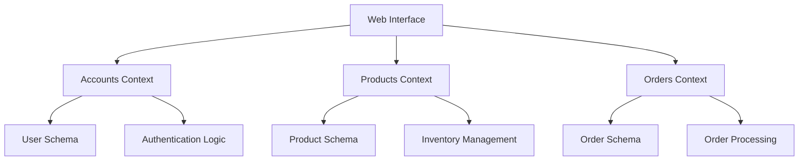

## 27.14. Avoiding Monolithic Contexts in Phoenix

As expert developers and architects, we often face the challenge of structuring applications to be scalable, maintainable, and efficient. One common pitfall is the creation of monolithic contexts, especially in a framework like Phoenix. In this section, we will explore the problems associated with monolithic contexts, the importance of separation of concerns, and the benefits of dividing contexts by bounded domains.

### Problems with Monoliths

Monolithic contexts can lead to several issues that hinder the growth and adaptability of an application. Here are some common problems:

- **Complexity in Maintenance:** As the application grows, a monolithic structure becomes increasingly difficult to maintain. Changes in one part of the application can have unforeseen consequences in another, leading to a fragile codebase.
- **Scalability Challenges:** Scaling a monolithic application can be complex and resource-intensive. It often requires scaling the entire application rather than individual components, leading to inefficient resource utilization.
- **Limited Flexibility:** Monoliths often limit the ability to adopt new technologies or frameworks, as changes need to be applied across the entire application.
- **Deployment Bottlenecks:** Deploying updates or new features requires redeploying the entire application, increasing the risk of downtime and deployment errors.

### Separation of Concerns

To address these issues, it is essential to apply the principle of separation of concerns. This involves dividing the application into distinct contexts, each responsible for a specific domain or functionality.

#### Dividing Contexts by Bounded Domains

A bounded context is a logical boundary within which a particular domain model is defined and applicable. By dividing contexts by bounded domains, we can achieve:

- **Clearer Domain Models:** Each context has its own domain model, reducing complexity and improving understanding.
- **Improved Code Organization:** Code is organized around specific functionalities, making it easier to navigate and maintain.
- **Enhanced Collaboration:** Teams can work on different contexts independently, reducing bottlenecks and improving productivity.

### Benefits of Avoiding Monolithic Contexts

By avoiding monolithic contexts and embracing a more modular approach, we can achieve several benefits:

- **Improved Code Organization:** Code is more organized and easier to understand, leading to faster development and fewer bugs.
- **Easier Testing and Refactoring:** Smaller, well-defined contexts are easier to test and refactor, leading to more reliable applications.
- **Scalability and Flexibility:** Applications can be scaled more efficiently by focusing on individual contexts, and new technologies can be adopted more easily.

### Implementing Contexts in Phoenix

Phoenix provides several tools and patterns to help implement contexts effectively. Let's explore some of these strategies.

#### Using Phoenix Contexts

Phoenix contexts are a way to group related functionality and data, providing a clear API for interacting with that part of the application. Here's how to implement contexts in Phoenix:

```elixir
# Define a context module
defmodule MyApp.Accounts do
  alias MyApp.Repo
  alias MyApp.Accounts.User

  # Public API for creating a user
  def create_user(attrs \\ %{}) do
    %User{}
    |> User.changeset(attrs)
    |> Repo.insert()
  end

  # Public API for fetching a user by ID
  def get_user!(id), do: Repo.get!(User, id)
end

# Define a schema within the context
defmodule MyApp.Accounts.User do
  use Ecto.Schema
  import Ecto.Changeset

  schema "users" do
    field :name, :string
    field :email, :string
    timestamps()
  end

  def changeset(user, attrs) do
    user
    |> cast(attrs, [:name, :email])
    |> validate_required([:name, :email])
  end
end
```

In this example, the `Accounts` context encapsulates all logic related to user accounts, providing a clear API for creating and fetching users.

#### Structuring Contexts for Scalability

When structuring contexts, consider the following best practices:

- **Define Clear Boundaries:** Each context should have a well-defined boundary, focusing on a specific domain or functionality.
- **Limit Dependencies:** Minimize dependencies between contexts to reduce coupling and improve modularity.
- **Use Explicit APIs:** Define explicit APIs for interacting with each context, hiding internal implementation details.

### Visualizing Contexts in Phoenix

To better understand how contexts can be structured, let's visualize a sample application with multiple contexts.


```mermaid
graph TD;
  A[Web Interface] --> B[Accounts Context];
  A --> C[Products Context];
  A --> D[Orders Context];
  B --> E[User Schema];
  C --> F[Product Schema];
  D --> G[Order Schema];
  B --> H[Authentication Logic];
  C --> I[Inventory Management];
  D --> J[Order Processing];
```

In this diagram, the application is divided into three main contexts: Accounts, Products, and Orders. Each context has its own schemas and logic, ensuring a clean separation of concerns.

### Elixir Unique Features

Elixir offers several unique features that can enhance the implementation of contexts:

- **Pattern Matching:** Use pattern matching to define clear and concise APIs within contexts.
- **Immutability:** Leverage immutability to ensure data consistency across contexts.
- **Concurrency:** Utilize Elixir's concurrency model to handle operations across multiple contexts efficiently.

### Differences and Similarities with Other Patterns

Contexts in Phoenix can be compared to microservices in that they both aim to separate concerns and improve modularity. However, contexts are typically implemented within a single application, while microservices are separate applications that communicate over a network.

### Design Considerations

When implementing contexts, consider the following:

- **Identify Bounded Contexts Early:** Identify and define bounded contexts early in the development process to guide the architecture.
- **Balance Granularity:** Avoid creating too many small contexts, as this can lead to unnecessary complexity. Aim for a balance that aligns with the application's domain.
- **Refactor Regularly:** Regularly refactor contexts to adapt to changing requirements and improve maintainability.

### Try It Yourself

To deepen your understanding, try modifying the code examples provided. For instance, add new fields to the `User` schema or implement additional functions in the `Accounts` context. Experiment with creating new contexts for other domains in your application.

### Knowledge Check

To reinforce your learning, consider the following questions:

- What are the main problems associated with monolithic contexts?
- How do Phoenix contexts help in organizing code?
- What are the benefits of dividing contexts by bounded domains?

### Embrace the Journey

Remember, avoiding monolithic contexts is just the beginning. As you continue to develop and refine your applications, you'll discover new ways to leverage Phoenix's powerful features to build scalable and maintainable systems. Keep experimenting, stay curious, and enjoy the journey!

### References and Links

- [Phoenix Framework Documentation](https://hexdocs.pm/phoenix/overview.html)
- [Domain-Driven Design](https://www.domainlanguage.com/ddd/)
- [Elixir Lang](https://elixir-lang.org/)

## Quiz Time!



### What is a primary problem with monolithic contexts?

- [x] Difficult to maintain and evolve.
- [ ] Easier to scale.
- [ ] Simplifies deployment.
- [ ] Reduces complexity.

> **Explanation:** Monolithic contexts become difficult to maintain and evolve as the application grows, leading to a fragile codebase.

### How does separation of concerns benefit an application?

- [x] Improved code organization.
- [x] Easier testing and refactoring.
- [ ] Increases deployment time.
- [ ] Reduces the need for version control.

> **Explanation:** Separation of concerns leads to improved code organization and easier testing and refactoring, making the application more maintainable.

### What is a bounded context?

- [x] A logical boundary within which a particular domain model is defined.
- [ ] A physical server boundary.
- [ ] A network protocol.
- [ ] A user interface component.

> **Explanation:** A bounded context is a logical boundary that defines where a particular domain model is applicable.

### Which of the following is a benefit of using Phoenix contexts?

- [x] Provides a clear API for interacting with specific parts of the application.
- [ ] Increases the complexity of the codebase.
- [ ] Requires more hardware resources.
- [ ] Limits the use of pattern matching.

> **Explanation:** Phoenix contexts provide a clear API for interacting with specific parts of the application, improving modularity and maintainability.

### What is a key consideration when structuring contexts?

- [x] Define clear boundaries for each context.
- [x] Limit dependencies between contexts.
- [ ] Maximize the number of contexts.
- [ ] Avoid using explicit APIs.

> **Explanation:** Defining clear boundaries and limiting dependencies are key considerations for structuring contexts effectively.

### How can Elixir's concurrency model benefit contexts?

- [x] Handle operations across multiple contexts efficiently.
- [ ] Increase the number of monolithic contexts.
- [ ] Reduce the need for pattern matching.
- [ ] Limit the use of immutability.

> **Explanation:** Elixir's concurrency model allows for efficient handling of operations across multiple contexts, enhancing performance and scalability.

### What is a similarity between contexts and microservices?

- [x] Both aim to separate concerns and improve modularity.
- [ ] Both are separate applications that communicate over a network.
- [ ] Both are implemented within a single application.
- [ ] Both reduce the need for bounded contexts.

> **Explanation:** Contexts and microservices both aim to separate concerns and improve modularity, although they are implemented differently.

### Why should bounded contexts be identified early?

- [x] To guide the architecture and development process.
- [ ] To increase the number of deployments.
- [ ] To reduce the need for refactoring.
- [ ] To simplify user interface design.

> **Explanation:** Identifying bounded contexts early helps guide the architecture and development process, ensuring a well-structured application.

### What is a potential downside of creating too many small contexts?

- [x] It can lead to unnecessary complexity.
- [ ] It simplifies the codebase.
- [ ] It reduces the need for testing.
- [ ] It increases deployment speed.

> **Explanation:** Creating too many small contexts can lead to unnecessary complexity, making the application harder to manage.

### True or False: Monolithic contexts make it easier to adopt new technologies.

- [ ] True
- [x] False

> **Explanation:** Monolithic contexts limit the ability to adopt new technologies, as changes need to be applied across the entire application.




