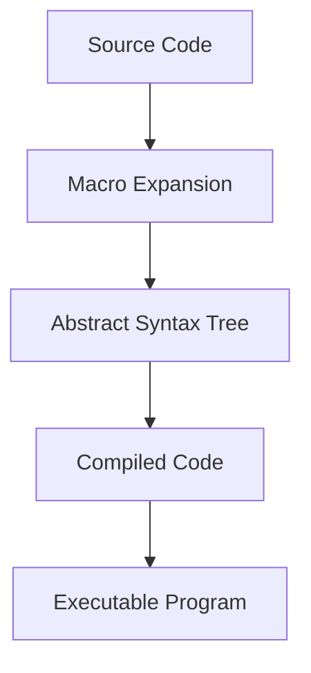

## 27.2. Overusing Macros and Metaprogramming

In the world of Elixir, macros and metaprogramming offer powerful tools for developers to extend the language and create dynamic code. However, with great power comes great responsibility. Overusing these features can lead to code that is difficult to understand, maintain, and debug. In this section, we will explore the temptations and dangers of overusing macros and metaprogramming, discuss their drawbacks, and provide best practices to ensure your code remains clean and maintainable.

### Temptations and Dangers

Macros in Elixir allow developers to write code that writes code. This can be incredibly tempting, as it provides a way to abstract away complexity and create highly reusable components. However, this abstraction can also introduce obscurity, making it difficult for others (or even yourself at a later date) to understand what the code is doing.

#### Example of Macro Temptation

Consider a scenario where you want to create a series of functions that perform similar operations. A macro might seem like the perfect solution:

```elixir
defmodule MathOperations do
  defmacro create_operation(name, operation) do
    quote do
      def unquote(name)(a, b) do
        a unquote(operation) b
      end
    end
  end

  create_operation(:add, :+)
  create_operation(:subtract, :-)
end
```

In this example, the `create_operation` macro generates functions for addition and subtraction. While this might seem efficient, it can quickly become confusing, especially as the number of operations grows or the operations themselves become more complex.

### Drawbacks

#### Harder to Debug and Maintain

One of the primary drawbacks of overusing macros is that they can make your codebase harder to debug and maintain. Macros operate at compile time, which means that errors can be more challenging to track down. The generated code is not always immediately visible, leading to potential confusion about what the code is actually doing.

#### Potential for Unexpected Side Effects

Macros can also introduce unexpected side effects. Because they manipulate the abstract syntax tree (AST) directly, they can inadvertently affect other parts of your code. This can lead to bugs that are difficult to diagnose and fix.

### Best Practices

To avoid the pitfalls of overusing macros and metaprogramming, consider the following best practices:

#### Use Macros Sparingly

Only use macros when absolutely necessary. If a task can be accomplished with functions and modules, prefer those approaches. Macros should be reserved for cases where they provide a clear advantage, such as reducing boilerplate code or implementing domain-specific languages (DSLs).

#### Favor Functions and Modules for Code Reuse

Functions and modules are the building blocks of Elixir applications. They are easier to understand, test, and maintain compared to macros. Whenever possible, use functions and modules to achieve code reuse and abstraction.

#### Provide Clear Documentation

When you do use macros, ensure that they are well-documented. Explain what the macro does, how it should be used, and any potential side effects. This will help other developers (and your future self) understand the purpose and functionality of the macro.

#### Test Generated Code

Testing is crucial when working with macros. Ensure that the code generated by your macros is thoroughly tested. This will help catch any errors or unexpected behavior early in the development process.

### Code Examples

Let's explore a more complex example to illustrate these concepts:

```elixir
defmodule LoggerMacro do
  defmacro log_message(level, message) do
    quote do
      IO.puts("[#{unquote(level)}] #{unquote(message)}")
    end
  end
end

defmodule MyApp do
  require LoggerMacro

  def run do
    LoggerMacro.log_message(:info, "Application started")
    LoggerMacro.log_message(:error, "An error occurred")
  end
end
```

In this example, the `LoggerMacro` module defines a macro `log_message` that logs messages with a specified level. While this might seem like a useful abstraction, it can quickly become problematic if the logging logic needs to change or if additional functionality is required.

### Visualizing Macros and Metaprogramming

To better understand how macros work, let's visualize the process using a diagram:



**Diagram Explanation:** This diagram illustrates the process of macro expansion in Elixir. The source code is first expanded by the macro, which generates an abstract syntax tree (AST). The AST is then compiled into executable code.

### Knowledge Check

Before we move on, let's test your understanding of macros and metaprogramming:

- **What are some potential drawbacks of using macros in Elixir?**
- **When should you consider using a macro instead of a function?**
- **How can you ensure that your macros are maintainable and easy to understand?**

### Try It Yourself

Now that we've covered the basics, try modifying the `LoggerMacro` example to include a timestamp with each log message. Experiment with different logging levels and see how the macro behaves.

### References and Further Reading

- [Elixir Macros Guide](https://elixir-lang.org/getting-started/meta/macros.html)
- [Metaprogramming Elixir: Write Less Code, Get More Done (and Have Fun!)](https://pragprog.com/titles/cmelixir/metaprogramming-elixir/)
- [Elixir School: Metaprogramming](https://elixirschool.com/en/lessons/advanced/metaprogramming/)

### Conclusion

Macros and metaprogramming are powerful tools in Elixir, but they should be used judiciously. By understanding the potential pitfalls and following best practices, you can harness their power without sacrificing code clarity and maintainability. Remember, the goal is to write code that is not only functional but also easy to understand and maintain.

## Quiz: Overusing Macros and Metaprogramming



### What is a primary drawback of overusing macros in Elixir?

- [x] They can make code harder to debug and maintain.
- [ ] They always improve code readability.
- [ ] They are faster than functions.
- [ ] They are easier to test.

> **Explanation:** Macros can make code harder to debug and maintain due to their complexity and the fact that they operate at compile time.

### When should you consider using a macro in Elixir?

- [x] When you need to reduce boilerplate code.
- [ ] When you want to make code more complex.
- [ ] When functions are not available.
- [ ] When you want to avoid using modules.

> **Explanation:** Macros are useful for reducing boilerplate code and implementing DSLs, but should be used sparingly.

### How can you ensure that your macros are maintainable?

- [x] Provide clear documentation and test generated code.
- [ ] Avoid using comments.
- [ ] Use macros for all code reuse.
- [ ] Ignore potential side effects.

> **Explanation:** Clear documentation and thorough testing help ensure that macros are maintainable and understandable.

### What is a potential danger of using macros?

- [x] They can introduce unexpected side effects.
- [ ] They simplify error handling.
- [ ] They always improve performance.
- [ ] They eliminate the need for functions.

> **Explanation:** Macros can introduce unexpected side effects due to their manipulation of the AST.

### What should you favor over macros for code reuse?

- [x] Functions and modules.
- [ ] More macros.
- [ ] Global variables.
- [ ] Inline code.

> **Explanation:** Functions and modules are preferred for code reuse as they are easier to understand and maintain.

### What is the role of the abstract syntax tree (AST) in macros?

- [x] It represents the code structure that macros manipulate.
- [ ] It is the final executable code.
- [ ] It is used only for error handling.
- [ ] It is not related to macros.

> **Explanation:** The AST represents the code structure that macros manipulate to generate new code.

### How can you test the code generated by macros?

- [x] By writing tests for the functions that use the macros.
- [ ] By ignoring the generated code.
- [ ] By avoiding tests altogether.
- [ ] By using only manual testing.

> **Explanation:** Writing tests for functions that use macros helps ensure that the generated code behaves as expected.

### What is a common temptation when using macros?

- [x] To abstract away complexity.
- [ ] To simplify code readability.
- [ ] To improve performance.
- [ ] To reduce testing.

> **Explanation:** Macros can abstract away complexity, but this can lead to obscurity and maintenance challenges.

### What is a best practice when using macros?

- [x] Use them sparingly and document thoroughly.
- [ ] Use them for all code reuse.
- [ ] Avoid documenting their use.
- [ ] Ignore potential side effects.

> **Explanation:** Using macros sparingly and documenting them thoroughly helps maintain code clarity and prevent issues.

### True or False: Macros should be used whenever possible to improve code efficiency.

- [ ] True
- [x] False

> **Explanation:** Macros should be used sparingly and only when they provide a clear advantage, as they can complicate code maintenance and debugging.



Remember, this is just the beginning. As you progress, you'll build more complex and interactive applications. Keep experimenting, stay curious, and enjoy the journey!
