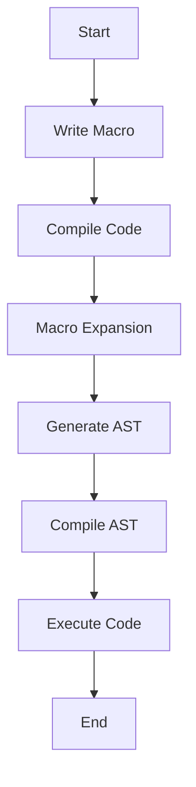

## 27.2. Overusing Macros and Metaprogramming

In the world of Elixir, macros and metaprogramming offer powerful tools that can transform how we write and think about code. However, with great power comes great responsibility. Overusing these features can lead to complex, unreadable, and unmaintainable code. In this section, we will explore the temptations and dangers of overusing macros and metaprogramming, discuss their drawbacks, and provide best practices to ensure their effective use.

### Understanding Macros and Metaprogramming

Macros in Elixir allow us to write code that generates other code at compile time. This can be incredibly powerful for creating domain-specific languages (DSLs), optimizing performance, and reducing boilerplate. Metaprogramming, on the other hand, is a broader concept that includes macros but also encompasses runtime code generation and manipulation.

#### Key Concepts

- **Abstract Syntax Tree (AST):** The representation of code structure that macros manipulate.
- **Compile-Time Code Generation:** The process of generating code during compilation, as opposed to runtime.
- **Domain-Specific Languages (DSLs):** Specialized mini-languages tailored to a specific problem domain.

### Temptations and Dangers

#### Abstraction vs. Obscurity

Macros can abstract away complexity, creating elegant and concise code. However, this abstraction can lead to obscurity, making it difficult for developers to understand what the code is doing, especially if they are not familiar with the macro's implementation.

```elixir
defmodule MyMacro do
  defmacro unless(condition, do: expression) do
    quote do
      if !unquote(condition), do: unquote(expression)
    end
  end
end

# Usage
require MyMacro
MyMacro.unless true, do: IO.puts("This will not print")
```

In this example, the `unless` macro provides a more readable way to express a common pattern. However, if overused or misused, it can lead to confusion.

#### Debugging Challenges

Macros can make debugging more challenging because they transform code before it is executed. This transformation can obscure the source of an error, making it difficult to trace back to the original code.

### Drawbacks of Overusing Macros

#### Harder to Debug and Maintain

Macros can introduce unexpected side effects, especially if they manipulate the AST in complex ways. This can lead to code that is difficult to debug and maintain.

- **Unexpected Behavior:** Macros can change how code is executed, leading to behavior that is difficult to predict.
- **Code Complexity:** As macros become more complex, they can lead to a tangled web of code that is difficult to unravel.

#### Potential for Unexpected Side Effects

Macros can inadvertently introduce side effects if they are not carefully designed. These side effects can propagate through the codebase, leading to bugs that are difficult to diagnose and fix.

### Best Practices for Using Macros

#### Use Macros Sparingly

Macros should be used sparingly and only when necessary. Before reaching for a macro, consider whether a function or module could achieve the same result with less complexity.

- **Favor Functions and Modules:** Functions and modules are generally easier to understand and maintain than macros.
- **Limit Scope:** Limit the scope of macros to specific, well-defined tasks.

#### Ensure Clarity and Maintainability

When using macros, ensure that their purpose and behavior are clear. Provide documentation and examples to help other developers understand how to use them effectively.

- **Document Macros Thoroughly:** Include detailed documentation and usage examples for each macro.
- **Test Macros Rigorously:** Write comprehensive tests to ensure that macros behave as expected.

#### Avoid Complex Logic

Avoid embedding complex logic within macros. Instead, use macros to generate simple, straightforward code that is easy to understand and maintain.

- **Keep It Simple:** Focus on generating simple code structures that are easy to reason about.
- **Separate Concerns:** Use macros to handle repetitive tasks, but separate complex logic into functions or modules.

### Code Examples

Let's explore some code examples that demonstrate the effective use of macros and highlight potential pitfalls.

#### Example 1: Simple Macro for Logging

```elixir
defmodule LoggerMacro do
  defmacro log(message) do
    quote do
      IO.puts("Log: #{unquote(message)}")
    end
  end
end

# Usage
require LoggerMacro
LoggerMacro.log("This is a log message")
```

- **Explanation:** This macro provides a simple way to log messages. It is straightforward and easy to understand, making it a good candidate for a macro.

#### Example 2: Complex Macro with Potential Pitfalls

```elixir
defmodule ComplexMacro do
  defmacro complex_logic(data) do
    quote do
      Enum.map(unquote(data), fn x -> x * 2 end)
    end
  end
end

# Usage
require ComplexMacro
ComplexMacro.complex_logic([1, 2, 3])
```

- **Pitfall:** This macro introduces complexity by embedding logic within the macro. It would be better to use a function for this task, as it would be easier to understand and maintain.

### Visualizing Macros and Metaprogramming

To better understand how macros work, let's visualize the process of macro expansion using a flowchart.


```mermaid
flowchart TD
    A[Start] --> B[Write Macro]
    B --> C[Compile Code]
    C --> D[Macro Expansion]
    D --> E[Generate AST]
    E --> F[Compile AST]
    F --> G[Execute Code]
    G --> H[End]
```

- **Diagram Explanation:** This flowchart illustrates the process of macro expansion in Elixir. The macro is written and included in the code, which is then compiled. During compilation, the macro is expanded, generating an AST that is compiled and executed.

### Knowledge Check

- **What are the key benefits of using macros in Elixir?**
- **How can overusing macros lead to code obscurity?**
- **What are some best practices for using macros effectively?**

### Embrace the Journey

Remember, mastering macros and metaprogramming in Elixir is a journey. As you progress, you'll learn to harness their power effectively while avoiding common pitfalls. Keep experimenting, stay curious, and enjoy the journey!

### References and Links

- [Elixir Lang - Macros](https://elixir-lang.org/getting-started/meta/macros.html)
- [Metaprogramming Elixir Book](https://pragprog.com/titles/cmelixir/metaprogramming-elixir/)

## Quiz Time!



### What is a key benefit of using macros in Elixir?

- [x] They allow for compile-time code generation.
- [ ] They simplify runtime code execution.
- [ ] They eliminate the need for functions.
- [ ] They automatically optimize code performance.

> **Explanation:** Macros allow for compile-time code generation, enabling developers to create more efficient and concise code.

### What is a potential drawback of overusing macros?

- [x] It can lead to code that is difficult to debug.
- [ ] It improves code readability.
- [ ] It reduces code complexity.
- [ ] It simplifies error handling.

> **Explanation:** Overusing macros can make code difficult to debug due to the complexity they introduce.

### How can macros lead to unexpected side effects?

- [x] They manipulate the AST, which can change code behavior.
- [ ] They execute code at runtime.
- [ ] They automatically handle errors.
- [ ] They simplify function calls.

> **Explanation:** Macros manipulate the AST, which can change how code behaves, potentially leading to unexpected side effects.

### What is a best practice when using macros?

- [x] Use them sparingly and only when necessary.
- [ ] Use them for all code generation tasks.
- [ ] Avoid documenting their usage.
- [ ] Embed complex logic within them.

> **Explanation:** Macros should be used sparingly and only when necessary to avoid complexity and maintain readability.

### What should you do to ensure macros are maintainable?

- [x] Document them thoroughly and provide examples.
- [ ] Avoid testing them.
- [ ] Use them to replace all functions.
- [ ] Embed as much logic as possible within them.

> **Explanation:** Thorough documentation and examples help ensure that macros are maintainable and understandable.

### What is the primary purpose of macros in Elixir?

- [x] To generate code at compile-time.
- [ ] To execute code at runtime.
- [ ] To replace functions.
- [ ] To simplify error handling.

> **Explanation:** The primary purpose of macros is to generate code at compile-time, allowing for more efficient and concise code.

### How can you avoid the pitfalls of macros?

- [x] Favor functions and modules over macros.
- [ ] Use macros for all code generation.
- [ ] Avoid documenting their usage.
- [ ] Embed complex logic within them.

> **Explanation:** Favoring functions and modules over macros can help avoid the complexity and pitfalls associated with macros.

### What is a common pitfall of overusing macros?

- [x] They can make code difficult to understand.
- [ ] They improve code readability.
- [ ] They reduce code complexity.
- [ ] They simplify error handling.

> **Explanation:** Overusing macros can make code difficult to understand due to the complexity they introduce.

### How can macros affect code maintainability?

- [x] They can make code harder to maintain if overused.
- [ ] They automatically improve maintainability.
- [ ] They simplify all code structures.
- [ ] They eliminate the need for documentation.

> **Explanation:** Overusing macros can make code harder to maintain due to the complexity and obscurity they introduce.

### True or False: Macros should be used for all code generation tasks.

- [ ] True
- [x] False

> **Explanation:** Macros should be used sparingly and only when necessary, as overusing them can lead to complexity and maintainability issues.


