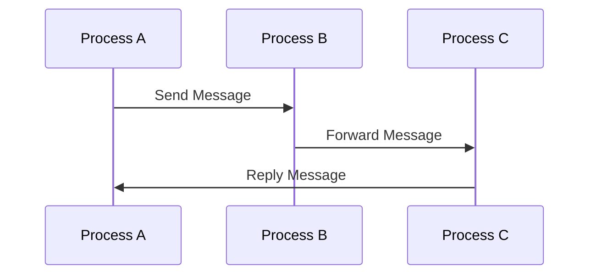

## 27.3. Shared Mutable State and Process Networking

In the realm of concurrent programming, shared mutable state is often a source of complexity and bugs. Elixir, with its functional programming paradigm and actor-based concurrency model, offers a unique approach to managing state and process networking. In this section, we will delve into the risks associated with shared mutable state, explore Elixir's approach to mitigating these risks, and provide practical examples to illustrate these concepts.

### Risks of Shared Mutable State

Shared mutable state refers to a scenario where multiple processes or threads can access and modify the same data. This can lead to several issues:

- **Race Conditions**: Occur when the outcome of a program depends on the sequence or timing of uncontrollable events.
- **Deadlocks**: Happen when two or more processes are unable to proceed because each is waiting for the other to release resources.
- **Inconsistent Data**: Arises when multiple processes read and write to shared data without proper synchronization, leading to unpredictable results.

### Problems with Shared State

The problems associated with shared mutable state are well-documented in computer science. Let's explore these issues in more detail:

#### Race Conditions

Race conditions occur when two or more processes attempt to modify shared data simultaneously. This can lead to unexpected behavior and bugs that are difficult to reproduce and fix.

```elixir
# Example of a race condition
defmodule Counter do
  def start_link(initial_value) do
    Agent.start_link(fn -> initial_value end, name: __MODULE__)
  end

  def increment do
    Agent.update(__MODULE__, &(&1 + 1))
  end

  def get do
    Agent.get(__MODULE__, & &1)
  end
end

# In a concurrent environment, multiple processes calling Counter.increment
# can lead to race conditions.
```

#### Deadlocks

Deadlocks occur when two or more processes are waiting for each other to release resources, resulting in a standstill.

```elixir
# Example of a potential deadlock
defmodule Resource do
  def acquire(resource1, resource2) do
    :ok = lock(resource1)
    :ok = lock(resource2)
    # Do some work
    unlock(resource1)
    unlock(resource2)
  end

  defp lock(resource), do: :ok
  defp unlock(resource), do: :ok
end

# If two processes try to acquire resources in different orders, a deadlock can occur.
```

#### Inconsistent Data

Inconsistent data can result from unsynchronized access to shared mutable state, leading to data corruption and unpredictable behavior.

```elixir
# Example of inconsistent data
defmodule BankAccount do
  def start_link(balance) do
    Agent.start_link(fn -> balance end, name: __MODULE__)
  end

  def deposit(amount) do
    Agent.update(__MODULE__, &(&1 + amount))
  end

  def withdraw(amount) do
    Agent.update(__MODULE__, &(&1 - amount))
  end

  def balance do
    Agent.get(__MODULE__, & &1)
  end
end

# Concurrent deposits and withdrawals can lead to inconsistent balances.
```

### Elixir's Approach

Elixir addresses the challenges of shared mutable state by emphasizing immutability and message passing. Let's explore these concepts:

#### Immutability

In Elixir, data is immutable, meaning once a data structure is created, it cannot be changed. This eliminates many of the issues associated with shared mutable state.

```elixir
# Example of immutability
list = [1, 2, 3]
new_list = [0 | list]

# The original list remains unchanged
IO.inspect(list)     # Output: [1, 2, 3]
IO.inspect(new_list) # Output: [0, 1, 2, 3]
```

#### Message Passing

Elixir uses the actor model for concurrency, where processes communicate by sending messages to each other. This isolates state within processes and avoids the pitfalls of shared mutable state.

```elixir
# Example of message passing
defmodule EchoServer do
  def start_link do
    spawn(fn -> loop() end)
  end

  defp loop do
    receive do
      {:echo, msg, sender} ->
        send(sender, {:ok, msg})
        loop()
    end
  end
end

# Start the server and send a message
pid = EchoServer.start_link()
send(pid, {:echo, "Hello, world!", self()})

# Receive the echoed message
receive do
  {:ok, msg} -> IO.puts("Received: #{msg}")
end
```

### Isolating State Within Processes

Elixir processes are lightweight and designed to run concurrently. By isolating state within processes, Elixir avoids the issues associated with shared mutable state.

```elixir
# Example of isolating state within a process
defmodule Counter do
  def start_link(initial_value) do
    spawn(fn -> loop(initial_value) end)
  end

  defp loop(value) do
    receive do
      {:increment, sender} ->
        send(sender, value + 1)
        loop(value + 1)
    end
  end
end

# Start the counter process
pid = Counter.start_link(0)

# Increment the counter
send(pid, {:increment, self()})

# Receive the new value
receive do
  new_value -> IO.puts("New value: #{new_value}")
end
```

### Visualizing Process Networking

To better understand how Elixir handles process networking, let's visualize the communication between processes using a Mermaid.js diagram.



**Diagram Description**: This diagram illustrates a simple process networking scenario where Process A sends a message to Process B, which forwards it to Process C. Process C then replies to Process A, demonstrating the message-passing model in Elixir.

### Try It Yourself

To gain a deeper understanding of these concepts, try modifying the code examples provided. Experiment with different message-passing scenarios, or introduce intentional race conditions to observe their effects. This hands-on approach will reinforce your understanding of Elixir's concurrency model.

### References and Links

For further reading on Elixir's concurrency model and handling shared mutable state, consider the following resources:

- [Elixir's Official Documentation](https://elixir-lang.org/docs.html)
- [Programming Elixir ≥ 1.6](https://pragprog.com/titles/elixir16/programming-elixir-1-6/)
- [The Little Elixir & OTP Guidebook](https://www.manning.com/books/the-little-elixir-and-otp-guidebook)

### Knowledge Check

1. Explain the risks associated with shared mutable state.
2. Describe how Elixir's immutability helps mitigate these risks.
3. Provide an example of message passing in Elixir.
4. What is the actor model, and how does it relate to Elixir's concurrency?
5. How can race conditions be avoided in Elixir?

### Embrace the Journey

Remember, mastering Elixir's approach to concurrency and state management is a journey. As you continue to explore these concepts, you'll gain a deeper understanding of how to build robust, fault-tolerant systems. Keep experimenting, stay curious, and enjoy the process!

### Quiz: Shared Mutable State and Process Networking



### What is a race condition?

- [x] A situation where the outcome depends on the sequence or timing of uncontrollable events.
- [ ] A type of deadlock.
- [ ] A method for synchronizing processes.
- [ ] An immutable data structure.

> **Explanation:** A race condition occurs when the outcome of a program depends on the sequence or timing of uncontrollable events, often leading to unpredictable behavior.

### How does Elixir handle shared mutable state?

- [x] By isolating state within processes and using message passing.
- [ ] By using locks and semaphores.
- [ ] By allowing direct access to shared memory.
- [ ] By using global variables.

> **Explanation:** Elixir isolates state within processes and uses message passing to avoid the pitfalls of shared mutable state.

### What is the actor model?

- [x] A concurrency model where processes communicate by sending messages.
- [ ] A design pattern for object-oriented programming.
- [ ] A method for optimizing memory usage.
- [ ] A type of database architecture.

> **Explanation:** The actor model is a concurrency model where processes communicate by sending messages, which is central to Elixir's approach to concurrency.

### What is immutability?

- [x] A property of data structures that cannot be changed after creation.
- [ ] A method for optimizing performance.
- [ ] A type of variable scope.
- [ ] A way to handle exceptions.

> **Explanation:** Immutability refers to data structures that cannot be changed after creation, which helps prevent issues related to shared mutable state.

### How can deadlocks be avoided?

- [x] By ensuring processes do not wait indefinitely for resources.
- [ ] By using more threads.
- [ ] By increasing memory allocation.
- [ ] By using global variables.

> **Explanation:** Deadlocks can be avoided by ensuring that processes do not wait indefinitely for resources, often by designing systems to avoid circular dependencies.

### What is the main advantage of message passing in Elixir?

- [x] It avoids the need for shared mutable state.
- [ ] It increases memory usage.
- [ ] It simplifies global variable management.
- [ ] It allows direct access to hardware.

> **Explanation:** Message passing in Elixir avoids the need for shared mutable state, reducing the risk of concurrency issues.

### What is a deadlock?

- [x] A situation where two or more processes are unable to proceed because each is waiting for the other to release resources.
- [ ] A type of race condition.
- [ ] A method for optimizing performance.
- [ ] A way to handle exceptions.

> **Explanation:** A deadlock occurs when two or more processes are unable to proceed because each is waiting for the other to release resources.

### How does Elixir's immutability help with concurrency?

- [x] It prevents data from being changed by multiple processes simultaneously.
- [ ] It increases memory usage.
- [ ] It simplifies global variable management.
- [ ] It allows direct access to hardware.

> **Explanation:** Elixir's immutability prevents data from being changed by multiple processes simultaneously, reducing the risk of concurrency issues.

### What is inconsistent data?

- [x] Data that results from unsynchronized access to shared mutable state.
- [ ] Data that is always correct.
- [ ] Data that is immutable.
- [ ] Data that is stored in a database.

> **Explanation:** Inconsistent data results from unsynchronized access to shared mutable state, leading to data corruption and unpredictable behavior.

### True or False: Elixir uses global variables to manage state.

- [ ] True
- [x] False

> **Explanation:** False. Elixir avoids global variables and instead manages state through isolated processes and message passing.


