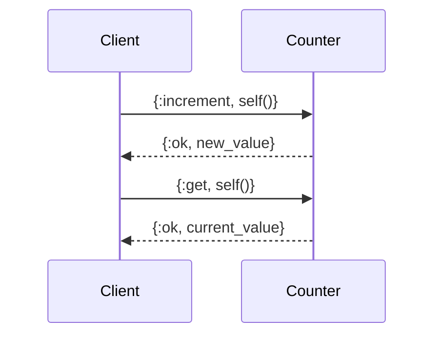

## 27.3. Shared Mutable State and Process Networking

In the realm of concurrent programming, shared mutable state is often cited as a major source of complexity and bugs. In this section, we will delve into the risks associated with shared mutable state, particularly in the context of Elixir, and explore how Elixir's process model and emphasis on immutability can help mitigate these risks.

### Understanding Shared Mutable State

Shared mutable state occurs when multiple threads or processes have access to the same memory location and can modify it. This can lead to several concurrency issues:

- **Race Conditions**: Occur when two or more processes attempt to modify shared data simultaneously, leading to unpredictable results.
- **Deadlocks**: Happen when two or more processes are waiting indefinitely for resources held by each other.
- **Inconsistent Data**: Results from unsynchronized updates to shared state, causing data to be in an unexpected or incorrect state.

#### Risks of Shared State

The primary risks associated with shared mutable state include:

- **Non-deterministic Behavior**: The outcome of operations can vary depending on the timing of process execution.
- **Difficult Debugging**: Concurrency issues can be challenging to reproduce and diagnose.
- **Scalability Challenges**: Shared state can become a bottleneck, limiting the scalability of the application.

### Elixir's Approach to Concurrency

Elixir, built on the Erlang VM (BEAM), takes a unique approach to concurrency that minimizes the risks associated with shared mutable state. It emphasizes:

- **Immutability**: Data structures in Elixir are immutable, meaning they cannot be changed once created. This reduces the risk of unintended side effects.
- **Message Passing**: Processes communicate by sending messages to each other, avoiding shared memory.
- **Process Isolation**: Each process has its own state, isolated from others, reducing the risk of interference.

#### Isolating State Within Processes

In Elixir, processes are lightweight and designed to encapsulate state. This isolation ensures that state changes in one process do not affect others. Let's explore how this works with a simple example.

```elixir
defmodule Counter do
  def start_link(initial_value) do
    spawn_link(fn -> loop(initial_value) end)
  end

  defp loop(current_value) do
    receive do
      {:increment, caller} ->
        new_value = current_value + 1
        send(caller, {:ok, new_value})
        loop(new_value)

      {:get, caller} ->
        send(caller, {:ok, current_value})
        loop(current_value)
    end
  end
end

# Usage
{:ok, counter} = Counter.start_link(0)
send(counter, {:increment, self()})
receive do
  {:ok, new_value} -> IO.puts("New value: #{new_value}")
end
```

In this example, the `Counter` module encapsulates its state within a process. It listens for messages to increment its value or return the current value. This approach ensures that the state is not shared and can only be modified through controlled message passing.

### Process Networking in Elixir

Process networking in Elixir refers to the way processes interact and communicate. This is primarily done through message passing, which offers several advantages:

- **Decoupling**: Processes do not need to know about each other's internal state, leading to more modular code.
- **Fault Tolerance**: If a process crashes, it does not affect others, thanks to the isolation of state.
- **Scalability**: Processes can be distributed across multiple nodes, allowing applications to scale horizontally.

#### Message Passing and Concurrency

Elixir's concurrency model relies heavily on message passing. Here's a deeper look into how it works:

- **Asynchronous Communication**: Processes send messages asynchronously, allowing them to continue executing without waiting for a response.
- **Pattern Matching**: Messages are received and handled using pattern matching, providing a clear and concise way to manage different types of messages.

Let's expand our previous example to include more complex interactions between processes.

```elixir
defmodule BankAccount do
  def start_link(initial_balance) do
    spawn_link(fn -> loop(initial_balance) end)
  end

  defp loop(balance) do
    receive do
      {:deposit, amount, caller} ->
        new_balance = balance + amount
        send(caller, {:ok, new_balance})
        loop(new_balance)

      {:withdraw, amount, caller} ->
        if balance >= amount do
          new_balance = balance - amount
          send(caller, {:ok, new_balance})
          loop(new_balance)
        else
          send(caller, {:error, :insufficient_funds})
          loop(balance)
        end

      {:balance, caller} ->
        send(caller, {:ok, balance})
        loop(balance)
    end
  end
end

# Usage
{:ok, account} = BankAccount.start_link(1000)
send(account, {:deposit, 200, self()})
receive do
  {:ok, new_balance} -> IO.puts("New balance: #{new_balance}")
end
```

In this example, the `BankAccount` module manages a bank account's balance through message passing. It handles deposits, withdrawals, and balance inquiries, ensuring that all operations are atomic and isolated from other processes.

### Visualizing Process Communication

To better understand process communication in Elixir, let's visualize it using a sequence diagram.


```mermaid
sequenceDiagram
    participant Client
    participant Counter
    Client->>Counter: {:increment, self()}
    Counter-->>Client: {:ok, new_value}
    Client->>Counter: {:get, self()}
    Counter-->>Client: {:ok, current_value}
```

This diagram illustrates the interaction between a client process and the `Counter` process. The client sends messages to increment the counter and retrieve its value, while the counter responds with the updated or current value.

### Best Practices for Avoiding Shared Mutable State

To avoid the pitfalls of shared mutable state, consider the following best practices:

- **Leverage Immutability**: Use immutable data structures to prevent unintended modifications.
- **Encapsulate State**: Isolate state within processes to ensure that it is only modified through controlled interfaces.
- **Use Supervisors**: Employ supervisors to monitor and restart processes in case of failure, enhancing fault tolerance.
- **Design for Message Passing**: Structure your application around message passing to decouple processes and improve modularity.

### Try It Yourself

To solidify your understanding, try modifying the `BankAccount` example to include a transfer operation between two accounts. Ensure that the transfer is atomic and handles insufficient funds appropriately.

### References and Further Reading

- [Elixir's Official Documentation](https://elixir-lang.org/docs.html)
- [Concurrency in Elixir](https://elixir-lang.org/getting-started/processes.html)
- [The BEAM Book](https://github.com/happi/theBeamBook)

### Knowledge Check

- What are the primary risks associated with shared mutable state?
- How does Elixir's process model mitigate these risks?
- What are the advantages of using message passing in Elixir?
- How can you ensure that state changes are atomic in Elixir?

### Embrace the Journey

As you continue to explore Elixir and its concurrency model, remember that practice and experimentation are key. By embracing immutability and process networking, you can build robust, scalable, and fault-tolerant applications. Keep experimenting, stay curious, and enjoy the journey!

## Quiz Time!



### What is a primary risk of shared mutable state?

- [x] Race conditions
- [ ] Improved performance
- [ ] Simplified debugging
- [ ] Increased scalability

> **Explanation:** Shared mutable state can lead to race conditions, where multiple processes attempt to modify the same data simultaneously, causing unpredictable results.

### How does Elixir mitigate the risks of shared mutable state?

- [x] Emphasizing immutability and message passing
- [ ] Using global variables
- [ ] Allowing direct memory access
- [ ] Encouraging shared memory

> **Explanation:** Elixir uses immutability and message passing to prevent shared mutable state, ensuring that processes communicate without directly sharing memory.

### What is the main advantage of process isolation in Elixir?

- [x] Fault tolerance
- [ ] Increased complexity
- [ ] Shared state
- [ ] Direct memory access

> **Explanation:** Process isolation in Elixir enhances fault tolerance by ensuring that the failure of one process does not affect others.

### What is the role of a supervisor in Elixir?

- [x] Monitoring and restarting processes
- [ ] Sharing state between processes
- [ ] Directly modifying process memory
- [ ] Simplifying code

> **Explanation:** Supervisors in Elixir monitor and restart processes in case of failure, enhancing the application's fault tolerance.

### What is a benefit of message passing in Elixir?

- [x] Decoupling processes
- [ ] Sharing memory
- [ ] Direct memory access
- [ ] Increased complexity

> **Explanation:** Message passing in Elixir decouples processes, allowing them to communicate without sharing memory, leading to more modular code.

### What is a common issue with shared mutable state?

- [x] Deadlocks
- [ ] Simplified debugging
- [ ] Improved performance
- [ ] Increased scalability

> **Explanation:** Shared mutable state can lead to deadlocks, where processes are waiting indefinitely for resources held by each other.

### How does Elixir's immutability help with concurrency?

- [x] Prevents unintended modifications
- [ ] Allows direct memory access
- [ ] Encourages shared state
- [ ] Simplifies debugging

> **Explanation:** Immutability in Elixir prevents unintended modifications, reducing the risk of concurrency issues like race conditions.

### What is an advantage of using immutable data structures?

- [x] Reduced risk of unintended side effects
- [ ] Increased complexity
- [ ] Direct memory access
- [ ] Shared state

> **Explanation:** Immutable data structures reduce the risk of unintended side effects, as they cannot be changed once created.

### What does the `receive` block do in Elixir?

- [x] Handles incoming messages
- [ ] Modifies process memory
- [ ] Shares state between processes
- [ ] Directly accesses memory

> **Explanation:** The `receive` block in Elixir handles incoming messages, allowing processes to respond to communication.

### True or False: Elixir processes share memory by default.

- [ ] True
- [x] False

> **Explanation:** False. Elixir processes do not share memory by default; they communicate through message passing, ensuring isolation.


