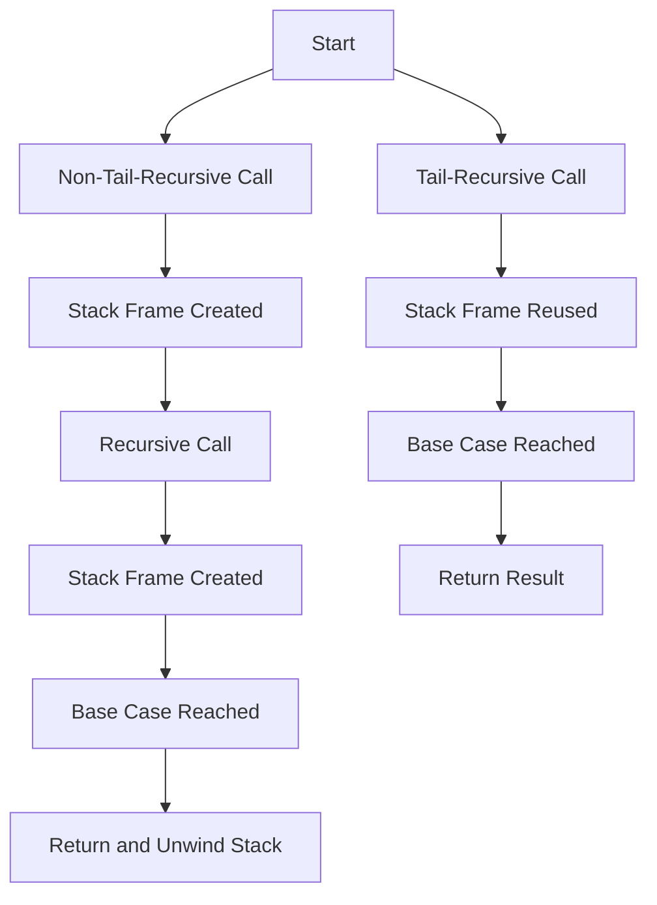

## 27.4. Inefficient Use of Recursion

Recursion is a fundamental concept in functional programming, and Elixir, as a functional language, leverages recursion extensively. However, inefficient use of recursion can lead to significant performance issues, including stack overflows and excessive memory consumption. In this section, we will explore the common pitfalls associated with recursion in Elixir and provide strategies to optimize recursive functions for better performance.

### Understanding Recursion in Elixir

Recursion involves a function calling itself to solve a problem. It is a powerful tool for breaking down complex problems into simpler sub-problems. However, recursion can be inefficient if not implemented correctly, especially in languages like Elixir that run on the BEAM virtual machine.

#### Stack Overflows

One of the primary issues with inefficient recursion is stack overflow. This occurs when a recursive function consumes too much stack space, leading to a crash. Non-tail-recursive functions are particularly prone to this problem because they do not release stack frames until the recursion completes.

#### Performance Issues

Inefficient recursion can also lead to performance bottlenecks. Recursive functions that are not optimized can consume excessive memory and execute slowly, especially when dealing with large datasets or deep recursion levels.

### Tail-Call Optimization

Tail-call optimization (TCO) is a technique used to optimize recursive functions by reusing stack frames. In a tail-recursive function, the recursive call is the last operation performed, allowing the function to execute in constant stack space.

#### Implementing Tail-Call Optimization

To implement tail-call optimization in Elixir, ensure that the recursive call is the last operation in the function. This allows the BEAM VM to optimize the recursion and prevent stack overflow.

```elixir
defmodule Factorial do
  # Tail-recursive factorial function
  def calculate(n), do: calculate(n, 1)

  defp calculate(0, acc), do: acc
  defp calculate(n, acc) when n > 0 do
    calculate(n - 1, n * acc)
  end
end

IO.puts Factorial.calculate(5) # Output: 120
```

In the example above, the `calculate/2` function is tail-recursive because the recursive call to `calculate/2` is the last operation performed.

### Iterative Approaches

In some cases, iterative approaches can be more efficient than recursion. Iteration avoids the overhead of recursive calls and can be easier to understand and maintain.

#### Converting Recursion to Iteration

Consider converting recursive functions to iterative ones when dealing with large datasets or when performance is a concern. Here's an example of converting a recursive factorial function to an iterative one:

```elixir
defmodule Factorial do
  # Iterative factorial function
  def calculate(n) do
    Enum.reduce(1..n, 1, &*/2)
  end
end

IO.puts Factorial.calculate(5) # Output: 120
```

The iterative version uses `Enum.reduce/3` to calculate the factorial, which is often more efficient for large inputs.

### Visualizing Recursion and Tail-Call Optimization

To better understand the differences between non-tail-recursive and tail-recursive functions, let's visualize the stack usage with a diagram.



In the diagram, the non-tail-recursive call creates a new stack frame for each recursive call, leading to potential stack overflow. In contrast, the tail-recursive call reuses the stack frame, optimizing memory usage.

### Key Considerations for Efficient Recursion

When implementing recursive functions in Elixir, consider the following best practices to ensure efficiency:

- **Use Tail-Call Optimization**: Whenever possible, structure your recursive functions to be tail-recursive to take advantage of TCO.
- **Consider Iterative Solutions**: For problems that can be solved iteratively, consider using loops or higher-order functions like `Enum.reduce/3`.
- **Limit Recursion Depth**: Be mindful of the recursion depth and avoid deep recursion that can lead to stack overflow.
- **Profile and Optimize**: Use profiling tools to identify performance bottlenecks and optimize recursive functions accordingly.

### Elixir's Unique Features for Recursion

Elixir provides several unique features that can aid in writing efficient recursive functions:

- **Pattern Matching**: Use pattern matching to simplify recursive function definitions and handle base cases elegantly.
- **Guards**: Employ guards to enforce constraints and ensure that recursive functions are called with valid arguments.
- **Higher-Order Functions**: Leverage Elixir's higher-order functions to replace recursion with iteration when appropriate.

### Differences and Similarities with Other Languages

Recursion in Elixir shares similarities with other functional languages like Haskell and Lisp, but there are key differences due to the BEAM VM:

- **Tail-Call Optimization**: Unlike some languages, Elixir's BEAM VM supports TCO, making tail-recursive functions more efficient.
- **Pattern Matching**: Elixir's pattern matching is more powerful than many other languages, allowing for concise and expressive recursive functions.
- **Concurrency**: Elixir's concurrency model can be leveraged to parallelize recursive computations, improving performance.

### Try It Yourself: Experimenting with Recursion

To deepen your understanding of recursion in Elixir, try modifying the provided examples:

- **Modify the Tail-Recursive Factorial**: Change the base case or the accumulator to see how it affects the result.
- **Convert Other Recursive Functions**: Take a recursive function you have written and convert it to an iterative version using `Enum` or `Stream`.
- **Profile Recursive Functions**: Use Elixir's profiling tools to measure the performance of recursive functions and identify areas for optimization.

### Knowledge Check

- **What is the primary issue with non-tail-recursive functions?**
- **How does tail-call optimization improve recursion performance?**
- **When should you consider using iterative approaches over recursion?**

### Summary

Recursion is a powerful tool in Elixir, but it must be used wisely to avoid performance pitfalls. By understanding the differences between tail-recursive and non-tail-recursive functions, leveraging Elixir's unique features, and considering iterative alternatives, you can write efficient and maintainable recursive functions.

Remember, this is just the beginning. As you progress, you'll build more complex and interactive applications. Keep experimenting, stay curious, and enjoy the journey!

## Quiz: Inefficient Use of Recursion



### What is a common issue with non-tail-recursive functions?

- [x] Stack overflow
- [ ] Memory leaks
- [ ] Deadlocks
- [ ] Race conditions

> **Explanation:** Non-tail-recursive functions can lead to stack overflow because they do not release stack frames until the recursion completes.

### How does tail-call optimization benefit recursive functions?

- [x] It reuses stack frames
- [ ] It increases memory usage
- [ ] It slows down execution
- [ ] It causes stack overflow

> **Explanation:** Tail-call optimization allows the function to reuse stack frames, preventing stack overflow and optimizing memory usage.

### When should you consider using iterative approaches over recursion?

- [x] When dealing with large datasets
- [ ] When recursion is more readable
- [ ] When performance is not a concern
- [ ] When stack space is unlimited

> **Explanation:** Iterative approaches can be more efficient for large datasets, avoiding the overhead of recursive calls.

### What is a key feature of Elixir that aids in writing recursive functions?

- [x] Pattern matching
- [ ] Global variables
- [ ] Mutable state
- [ ] Dynamic typing

> **Explanation:** Pattern matching in Elixir simplifies recursive function definitions and handles base cases elegantly.

### What is the last operation in a tail-recursive function?

- [x] The recursive call
- [ ] A return statement
- [ ] A print statement
- [ ] A variable assignment

> **Explanation:** In a tail-recursive function, the recursive call is the last operation, allowing for tail-call optimization.

### Which Elixir feature can replace recursion with iteration?

- [x] Higher-order functions
- [ ] Global variables
- [ ] Dynamic typing
- [ ] Mutable state

> **Explanation:** Higher-order functions like `Enum.reduce/3` can replace recursion with iteration, improving performance.

### What should you be mindful of when using recursion?

- [x] Recursion depth
- [ ] Variable names
- [ ] Code comments
- [ ] Function signatures

> **Explanation:** Be mindful of recursion depth to avoid stack overflow and performance issues.

### What is a benefit of using pattern matching in recursive functions?

- [x] Simplifies function definitions
- [ ] Increases code complexity
- [ ] Reduces readability
- [ ] Causes stack overflow

> **Explanation:** Pattern matching simplifies recursive function definitions and handles base cases elegantly.

### How can you optimize recursive functions in Elixir?

- [x] Use tail-call optimization
- [ ] Use global variables
- [ ] Avoid pattern matching
- [ ] Increase recursion depth

> **Explanation:** Tail-call optimization allows the function to reuse stack frames, preventing stack overflow and optimizing memory usage.

### True or False: Elixir's BEAM VM supports tail-call optimization.

- [x] True
- [ ] False

> **Explanation:** Elixir's BEAM VM supports tail-call optimization, making tail-recursive functions more efficient.




