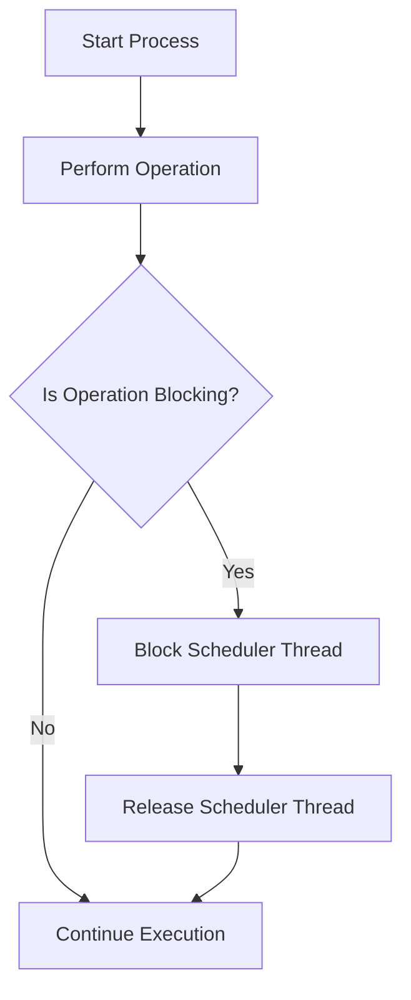

## 27.5. Blocking Operations in Concurrent Processes

In the world of concurrent programming, especially within the Elixir ecosystem, understanding and managing blocking operations is crucial for building efficient and responsive applications. This section delves into the intricacies of blocking operations in concurrent processes, the impact on the Elixir runtime, and strategies to mitigate these effects.

### Understanding the Scheduler

Elixir runs on the BEAM (Bogdan/Björn's Erlang Abstract Machine) virtual machine, which is designed to handle massive concurrency with lightweight processes. The BEAM scheduler is responsible for managing these processes, distributing CPU time among them efficiently. However, blocking operations can disrupt this balance, leading to performance bottlenecks.

#### How Blocking Operations Affect the Entire VM

Blocking operations occur when a process is unable to proceed until a particular task is completed. This can be due to long-running computations or synchronous I/O operations. When a process blocks, it holds onto its scheduler thread, preventing other processes from being scheduled. This can lead to reduced throughput and increased latency across the entire system.

**Key Points:**
- **Scheduler Threads:** Each CPU core typically runs its own scheduler thread. A blocked process can monopolize a scheduler thread, reducing the effective concurrency.
- **Latency and Throughput:** Blocking operations increase latency and decrease throughput, as other processes must wait for the blocked process to release the scheduler thread.
- **System Responsiveness:** The overall responsiveness of the system can degrade, affecting user experience and system reliability.

### Examples of Blocking

To better understand blocking operations, let's explore some common scenarios where blocking can occur.

#### Long-Running Computations

Long-running computations can block a process if they are not managed properly. For example, performing complex mathematical calculations or data processing tasks within a single process can lead to blocking.

```elixir
defmodule LongComputation do
  def calculate_factorial(n) when n > 0 do
    Enum.reduce(1..n, 1, &*/2)
  end
end

# This computation can block the process for large values of n
result = LongComputation.calculate_factorial(100_000)
```

#### Synchronous I/O Without Timeouts

Synchronous I/O operations, such as reading from a file or making a network request, can block a process if they do not complete quickly. Without timeouts, these operations can indefinitely hold a scheduler thread.

```elixir
defmodule BlockingIO do
  def read_file(file_path) do
    File.read(file_path)
  end
end

# This operation can block if the file is large or the disk is slow
{:ok, content} = BlockingIO.read_file("large_file.txt")
```

### Mitigation Strategies

To mitigate the impact of blocking operations, several strategies can be employed. These strategies focus on offloading heavy tasks, using asynchronous APIs, and setting appropriate timeouts.

#### Spawning Separate Processes for Heavy Tasks

One effective strategy is to offload heavy computations or blocking I/O operations to separate processes. This ensures that the main process remains responsive.

```elixir
defmodule OffloadTask do
  def start_task do
    Task.async(fn -> perform_heavy_computation() end)
  end

  defp perform_heavy_computation do
    # Simulate a heavy computation
    :timer.sleep(5000)
    :ok
  end
end

# Start the task in a separate process
task = OffloadTask.start_task()
```

#### Using Asynchronous APIs and Setting Timeouts

Leveraging asynchronous APIs and setting timeouts can prevent processes from blocking indefinitely. This approach is particularly useful for I/O operations.

```elixir
defmodule AsyncIO do
  def fetch_data(url) do
    HTTPoison.get(url, [], recv_timeout: 5000)
  end
end

# Fetch data with a timeout to prevent blocking
{:ok, response} = AsyncIO.fetch_data("http://example.com")
```

### Visualizing Blocking Operations

To better understand the impact of blocking operations, let's visualize the process flow using a Mermaid.js diagram.



**Diagram Description:** This flowchart illustrates the decision-making process when a blocking operation is encountered. If an operation is blocking, it holds the scheduler thread until it completes, after which the thread is released, allowing execution to continue.

### Key Takeaways

- **Blocking operations can significantly impact system performance** by monopolizing scheduler threads and reducing concurrency.
- **Long-running computations and synchronous I/O operations** are common sources of blocking.
- **Mitigation strategies include offloading tasks to separate processes, using asynchronous APIs, and setting timeouts** to prevent indefinite blocking.
- **Visualizing process flow can aid in understanding the impact of blocking operations** and the importance of mitigation strategies.

### Embrace the Journey

Remember, understanding and managing blocking operations is just one aspect of building efficient concurrent systems in Elixir. As you continue to explore the world of Elixir, keep experimenting with different strategies, stay curious, and enjoy the journey of mastering concurrency!

### References and Links

- [Elixir Official Documentation](https://elixir-lang.org/docs.html)
- [BEAM VM and Concurrency](https://erlang.org/doc/efficiency_guide/processes.html)
- [HTTPoison Library](https://hexdocs.pm/httpoison/HTTPoison.html)

## Quiz: Blocking Operations in Concurrent Processes



### What is the primary impact of blocking operations on the BEAM scheduler?

- [x] They monopolize scheduler threads, reducing concurrency.
- [ ] They increase memory usage significantly.
- [ ] They improve system responsiveness.
- [ ] They enhance throughput.

> **Explanation:** Blocking operations hold onto scheduler threads, preventing other processes from being scheduled and reducing concurrency.

### Which of the following is a common source of blocking operations?

- [x] Long-running computations
- [x] Synchronous I/O without timeouts
- [ ] Asynchronous API calls
- [ ] Lightweight processes

> **Explanation:** Long-running computations and synchronous I/O without timeouts can block processes, while asynchronous API calls and lightweight processes are designed to avoid blocking.

### How can you mitigate the impact of blocking operations?

- [x] Offload tasks to separate processes
- [x] Use asynchronous APIs
- [x] Set timeouts for operations
- [ ] Increase the number of scheduler threads

> **Explanation:** Offloading tasks, using asynchronous APIs, and setting timeouts are effective strategies to mitigate blocking. Increasing scheduler threads does not directly address blocking issues.

### What happens when a process blocks a scheduler thread?

- [x] Other processes must wait for the blocked process to release the thread.
- [ ] The system automatically terminates the blocked process.
- [ ] The blocked process is moved to a different scheduler thread.
- [ ] The system's memory usage decreases.

> **Explanation:** When a process blocks a scheduler thread, other processes must wait for it to release the thread, leading to reduced concurrency.

### Which Elixir feature helps in managing long-running computations?

- [x] Task module
- [ ] GenServer
- [ ] Supervisor
- [ ] Agent

> **Explanation:** The Task module allows you to offload long-running computations to separate processes, helping to manage blocking operations.

### What is a key benefit of using asynchronous APIs?

- [x] They prevent processes from blocking indefinitely.
- [ ] They increase memory usage.
- [ ] They reduce the need for error handling.
- [ ] They improve code readability.

> **Explanation:** Asynchronous APIs allow operations to proceed without blocking processes, preventing indefinite blocking and improving system responsiveness.

### Why is setting timeouts important for I/O operations?

- [x] To prevent processes from blocking indefinitely
- [ ] To increase the speed of I/O operations
- [ ] To reduce memory usage
- [ ] To enhance code readability

> **Explanation:** Setting timeouts ensures that I/O operations do not block processes indefinitely, allowing the system to remain responsive.

### What is the role of the BEAM scheduler in Elixir?

- [x] Managing process scheduling and concurrency
- [ ] Handling memory allocation
- [ ] Managing network connections
- [ ] Compiling Elixir code

> **Explanation:** The BEAM scheduler is responsible for managing process scheduling and concurrency, ensuring efficient use of CPU resources.

### True or False: Blocking operations can improve system performance.

- [ ] True
- [x] False

> **Explanation:** Blocking operations reduce concurrency and system responsiveness, negatively impacting performance.

### Which strategy is NOT effective for mitigating blocking operations?

- [ ] Offloading tasks to separate processes
- [ ] Using asynchronous APIs
- [ ] Setting timeouts
- [x] Ignoring blocking issues

> **Explanation:** Ignoring blocking issues does not mitigate their impact and can lead to performance bottlenecks.


