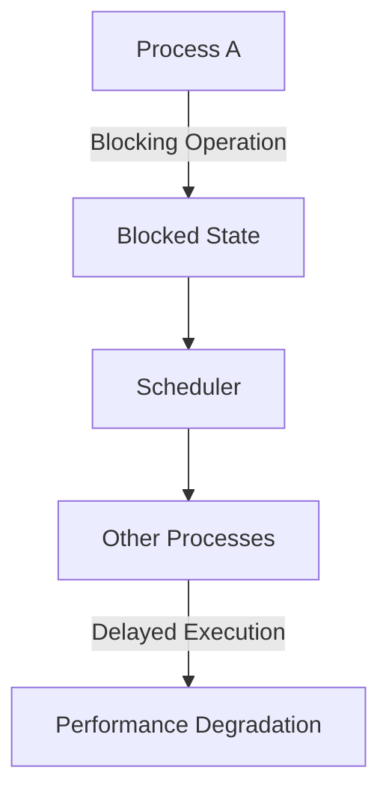
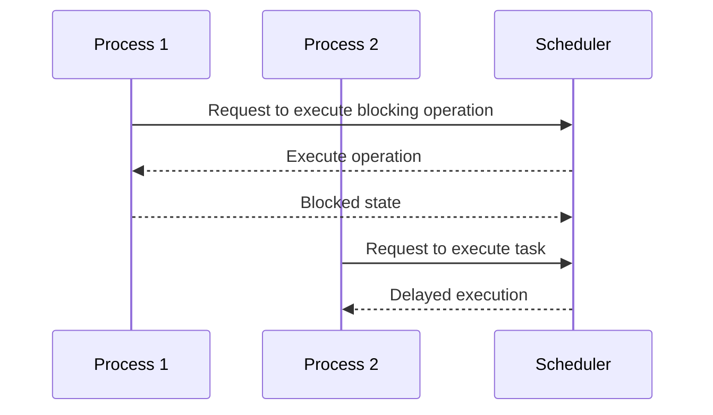

## 27.5. Blocking Operations in Concurrent Processes

Concurrency is a powerful feature of Elixir, enabling developers to build scalable and fault-tolerant applications. However, with great power comes great responsibility. One of the critical challenges in concurrent programming is managing blocking operations. In this section, we will explore how blocking operations can affect the Elixir VM, provide examples of common blocking scenarios, and discuss strategies to mitigate their impact.

### Understanding the Scheduler

Elixir runs on the BEAM virtual machine, which is designed to handle massive concurrency. The BEAM scheduler is responsible for distributing work across multiple CPU cores, allowing processes to run concurrently. However, when a process performs a blocking operation, it can prevent the scheduler from efficiently managing other processes.

#### How Blocking Operations Affect the VM

Blocking operations can lead to several issues:

- **Reduced Concurrency**: If a process is blocked, it cannot yield control to other processes, reducing the overall concurrency of the system.
- **Resource Starvation**: Blocking operations can cause other processes to wait indefinitely, leading to resource starvation.
- **Performance Degradation**: The overall performance of the application can degrade as blocked processes consume valuable CPU time.

In the following diagram, we visualize how a blocking operation can affect the BEAM scheduler:


```mermaid
graph TD;
    A[Process A] -->|Blocking Operation| B[Blocked State];
    B --> C[Scheduler];
    C --> D[Other Processes];
    D -->|Delayed Execution| E[Performance Degradation];
```

**Diagram Explanation**: Process A enters a blocked state due to a blocking operation, causing the scheduler to delay the execution of other processes, leading to performance degradation.

### Examples of Blocking

Let's examine some common scenarios where blocking operations can occur in Elixir applications.

#### Long-Running Computations

Long-running computations can block the scheduler if they are not properly managed. For example, a process that performs complex mathematical calculations without yielding control can prevent other processes from executing.

```elixir
defmodule LongComputation do
  def calculate do
    # Simulate a long-running computation
    Enum.reduce(1..1_000_000, 0, fn x, acc -> x + acc end)
  end
end
```

**Key Point**: In the above example, the `calculate` function performs a computation that could block the scheduler if executed in a single process.

#### Synchronous IO Without Timeouts

Synchronous IO operations, such as reading from a file or making a network request, can block if they do not include timeouts. This can lead to processes waiting indefinitely for an IO operation to complete.

```elixir
defmodule FileReader do
  def read_file(file_path) do
    File.read(file_path) # Blocking IO operation
  end
end
```

**Key Point**: The `read_file` function performs a blocking IO operation that can impact the scheduler if the file read takes longer than expected.

### Mitigation Strategies

To prevent blocking operations from affecting the concurrency of your Elixir application, consider the following strategies:

#### Spawning Separate Processes for Heavy Tasks

One effective way to handle blocking operations is to offload them to separate processes. This allows the main process to remain responsive while the heavy task is executed concurrently.

```elixir
defmodule TaskManager do
  def start_long_task do
    Task.start(fn -> LongComputation.calculate() end)
  end
end
```

**Explanation**: By using `Task.start/1`, we spawn a new process to handle the long computation, allowing the main process to continue executing other tasks.

#### Using Asynchronous APIs and Setting Timeouts

Whenever possible, use asynchronous APIs that allow you to set timeouts for operations. This ensures that a process does not remain blocked indefinitely.

```elixir
defmodule NetworkClient do
  def fetch_data(url) do
    HTTPoison.get(url, [], recv_timeout: 5_000) # Set a timeout of 5 seconds
  end
end
```

**Explanation**: The `fetch_data` function uses the `HTTPoison` library to make a network request with a specified timeout, preventing indefinite blocking.

### Visualizing Blocking Operations

To further illustrate the impact of blocking operations, let's use a sequence diagram to show the interaction between processes and the scheduler:


```mermaid
sequenceDiagram
    participant P1 as Process 1
    participant P2 as Process 2
    participant S as Scheduler
    P1->>S: Request to execute blocking operation
    S-->>P1: Execute operation
    P1-->>S: Blocked state
    P2->>S: Request to execute task
    S-->>P2: Delayed execution
```

**Diagram Explanation**: Process 1 requests a blocking operation, causing it to enter a blocked state. The scheduler delays the execution of Process 2, illustrating how blocking operations can affect concurrency.

### Try It Yourself

To deepen your understanding, try modifying the code examples provided:

1. **Experiment with Timeouts**: Adjust the timeout values in the `NetworkClient` module to see how they affect the responsiveness of your application.
2. **Parallelize Computations**: Modify the `LongComputation` module to split the computation across multiple processes using `Task.async/1` and `Task.await/1`.

### References and Links

- [Elixir's Task Module](https://hexdocs.pm/elixir/Task.html)
- [HTTPoison Library](https://hexdocs.pm/httpoison/HTTPoison.html)
- [Understanding the BEAM Scheduler](https://www.erlang-solutions.com/blog/understanding-the-erlang-scheduler.html)

### Knowledge Check

To ensure you've grasped the concepts, consider the following questions:

- What are the potential impacts of blocking operations on the BEAM scheduler?
- How can you mitigate the effects of blocking operations in Elixir?
- Why is it important to set timeouts for IO operations?

### Embrace the Journey

Remember, mastering concurrency in Elixir is a journey. As you continue to experiment and learn, you'll develop more efficient and responsive applications. Keep pushing the boundaries of what's possible with Elixir, and enjoy the journey!

## Quiz Time!



### What is a primary consequence of blocking operations in Elixir?

- [x] Reduced concurrency
- [ ] Increased memory usage
- [ ] Faster execution
- [ ] Enhanced security

> **Explanation:** Blocking operations reduce concurrency by preventing the scheduler from efficiently managing other processes.

### How can long-running computations affect the BEAM scheduler?

- [x] They can block the scheduler, reducing overall concurrency.
- [ ] They can enhance the scheduler's efficiency.
- [ ] They have no impact on the scheduler.
- [ ] They always improve performance.

> **Explanation:** Long-running computations can block the scheduler, preventing it from managing other processes effectively.

### What is a strategy to mitigate blocking operations?

- [x] Spawning separate processes for heavy tasks
- [ ] Increasing the process priority
- [ ] Using synchronous IO without timeouts
- [ ] Ignoring the issue

> **Explanation:** Spawning separate processes for heavy tasks allows the main process to remain responsive.

### Why is it important to set timeouts for IO operations?

- [x] To prevent processes from waiting indefinitely
- [ ] To increase the complexity of the code
- [ ] To reduce memory usage
- [ ] To enhance security

> **Explanation:** Setting timeouts prevents processes from waiting indefinitely for IO operations to complete.

### Which Elixir module can be used to spawn separate processes?

- [x] Task
- [ ] Enum
- [ ] String
- [ ] File

> **Explanation:** The `Task` module can be used to spawn separate processes for concurrent execution.

### What is the role of the BEAM scheduler?

- [x] To distribute work across multiple CPU cores
- [ ] To manage memory allocation
- [ ] To enhance security
- [ ] To perform garbage collection

> **Explanation:** The BEAM scheduler distributes work across CPU cores, enabling concurrency.

### How can you visualize the impact of blocking operations?

- [x] Using sequence diagrams
- [ ] By writing more code
- [ ] By ignoring the issue
- [ ] By increasing process priority

> **Explanation:** Sequence diagrams can illustrate the interaction between processes and the scheduler.

### What is a common scenario for blocking operations?

- [x] Synchronous IO without timeouts
- [ ] Asynchronous computation
- [ ] Efficient memory usage
- [ ] Enhanced security

> **Explanation:** Synchronous IO without timeouts can lead to blocking operations.

### What is a benefit of using asynchronous APIs?

- [x] They prevent processes from blocking indefinitely.
- [ ] They increase memory usage.
- [ ] They enhance security.
- [ ] They reduce code complexity.

> **Explanation:** Asynchronous APIs prevent processes from blocking indefinitely by allowing timeouts.

### Blocking operations can lead to resource starvation.

- [x] True
- [ ] False

> **Explanation:** Blocking operations can cause other processes to wait indefinitely, leading to resource starvation.


