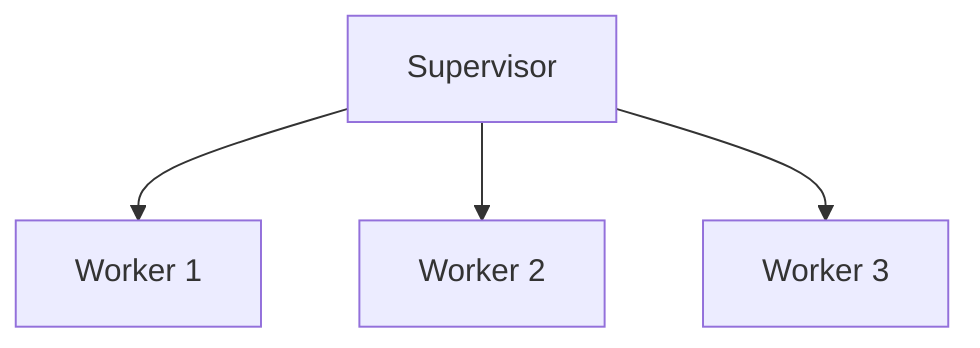

## 27.6. Poor Error Handling and Lack of Supervision

In the world of Elixir, effective error handling and supervision are crucial for building resilient and fault-tolerant systems. This section delves into the consequences of poor error handling, the importance of supervision trees, and best practices for managing errors in Elixir applications.

### Consequences of Poor Error Handling

Poor error handling can lead to a cascade of issues in your application. Here are some of the potential consequences:

- **Unhandled Exceptions Leading to Process Crashes:** In Elixir, processes are lightweight and isolated, which means that an unhandled exception in one process can cause it to crash without affecting others. However, if not properly managed, these crashes can lead to unexpected behavior and system instability.
- **Loss of Critical Data:** If a process crashes without saving its state or data, you may lose important information, leading to data inconsistency and potential system failures.
- **Increased Downtime:** Frequent crashes and restarts can lead to increased downtime, affecting the overall availability and reliability of your application.
- **Difficulty in Diagnosing Issues:** Without proper error logging and handling, diagnosing the root cause of issues becomes challenging, leading to longer resolution times.

### Supervision Trees

Supervision trees are a fundamental concept in Elixir's fault-tolerant design. They provide a structured way to monitor and manage processes, ensuring that your application can recover gracefully from failures.

#### What is a Supervision Tree?

A supervision tree is a hierarchical structure of supervisors and worker processes. Supervisors are responsible for starting, stopping, and monitoring their child processes. If a child process crashes, the supervisor can restart it according to a predefined strategy.

#### Key Components of a Supervision Tree

- **Supervisor:** A process that oversees other processes, known as its children. It implements a supervision strategy to determine how to handle child process failures.
- **Worker:** A process that performs the actual work in your application. Workers are typically the processes that can crash and need supervision.
- **Supervision Strategy:** Defines how a supervisor should respond to child process failures. Common strategies include `:one_for_one`, `:one_for_all`, `:rest_for_one`, and `:simple_one_for_one`.

#### Example of a Supervision Tree

Let's look at a simple example of a supervision tree in Elixir:

```elixir
defmodule MyApp.Supervisor do
  use Supervisor

  def start_link(init_arg) do
    Supervisor.start_link(__MODULE__, init_arg, name: __MODULE__)
  end

  def init(_init_arg) do
    children = [
      {MyApp.Worker, []}
    ]

    Supervisor.init(children, strategy: :one_for_one)
  end
end

defmodule MyApp.Worker do
  use GenServer

  def start_link(_) do
    GenServer.start_link(__MODULE__, %{}, name: __MODULE__)
  end

  def init(state) do
    {:ok, state}
  end
end
```

In this example, `MyApp.Supervisor` is a supervisor that starts and monitors `MyApp.Worker`. The supervision strategy `:one_for_one` means that if the worker crashes, only that worker is restarted.

### Best Practices for Error Handling

Implementing proper error handling within processes is essential for building robust Elixir applications. Here are some best practices to consider:

#### Use Try-Catch for Error Handling

Elixir provides the `try-catch` construct for handling exceptions. Use it to catch and handle errors gracefully:

```elixir
defmodule MyApp.ErrorHandler do
  def safe_divide(a, b) do
    try do
      a / b
    rescue
      ArithmeticError -> {:error, "Division by zero"}
    end
  end
end
```

In this example, we catch an `ArithmeticError` and return an error tuple instead of letting the process crash.

#### Log Errors for Diagnosis

Logging is crucial for diagnosing issues in your application. Use Elixir's `Logger` module to log errors and other important information:

```elixir
defmodule MyApp.LoggerExample do
  require Logger

  def log_error(message) do
    Logger.error("An error occurred: #{message}")
  end
end
```

Ensure that your logs are detailed enough to provide context for the errors, making it easier to trace and resolve issues.

#### Leverage the "Let It Crash" Philosophy

Elixir embraces the "let it crash" philosophy, which encourages developers to let processes fail and rely on supervision trees to handle recovery. This approach simplifies error handling by delegating recovery to supervisors.

#### Use Supervisors for Fault Tolerance

Supervisors are the backbone of fault tolerance in Elixir. Use them to monitor and restart processes, ensuring that your application can recover from failures automatically.

#### Implement Circuit Breakers

For external dependencies, consider implementing a circuit breaker pattern to prevent cascading failures. A circuit breaker monitors the health of an external service and temporarily blocks requests if the service is deemed unhealthy.

### Visualizing Supervision Trees

To better understand supervision trees, let's visualize a simple supervision tree using Mermaid.js:



In this diagram, the supervisor oversees three worker processes. If any worker crashes, the supervisor can restart it based on the defined strategy.

### Try It Yourself

To reinforce your understanding, try modifying the code examples provided:

- Change the supervision strategy in the `MyApp.Supervisor` module and observe how it affects the behavior of the supervision tree.
- Introduce an error in the `MyApp.Worker` module and see how the supervisor handles the crash.
- Experiment with different logging levels in the `MyApp.LoggerExample` module to see how they affect the output.

### Knowledge Check

- What are the consequences of poor error handling in Elixir applications?
- How do supervision trees contribute to fault tolerance in Elixir?
- What are some best practices for error handling in Elixir?

### Summary

In this section, we've explored the importance of effective error handling and supervision in Elixir applications. By understanding the consequences of poor error management, leveraging supervision trees, and following best practices, you can build robust, fault-tolerant systems that gracefully recover from failures.

Remember, this is just the beginning. As you progress, you'll build more complex and resilient applications. Keep experimenting, stay curious, and enjoy the journey!

## Quiz: Poor Error Handling and Lack of Supervision



### What is a consequence of poor error handling in Elixir applications?

- [x] Unhandled exceptions leading to process crashes
- [ ] Improved system performance
- [ ] Enhanced data consistency
- [ ] Increased application security

> **Explanation:** Poor error handling can lead to unhandled exceptions, causing process crashes and system instability.

### What is the role of a supervisor in a supervision tree?

- [x] To monitor and restart failed processes
- [ ] To perform the actual work in the application
- [ ] To handle user authentication
- [ ] To manage database connections

> **Explanation:** A supervisor monitors and manages child processes, restarting them if they fail.

### Which supervision strategy restarts only the crashed process?

- [x] :one_for_one
- [ ] :one_for_all
- [ ] :rest_for_one
- [ ] :simple_one_for_one

> **Explanation:** The `:one_for_one` strategy restarts only the crashed process, leaving others unaffected.

### What is the "let it crash" philosophy in Elixir?

- [x] Allowing processes to fail and relying on supervisors for recovery
- [ ] Preventing all process failures at any cost
- [ ] Manually handling all errors within each process
- [ ] Avoiding the use of supervisors

> **Explanation:** The "let it crash" philosophy encourages allowing processes to fail and using supervisors to handle recovery.

### How can you log errors in Elixir?

- [x] Using the Logger module
- [ ] Using the IO module
- [ ] Using the File module
- [ ] Using the Enum module

> **Explanation:** The Logger module is used for logging errors and other important information in Elixir.

### What is a circuit breaker pattern used for?

- [x] Preventing cascading failures in external dependencies
- [ ] Improving database performance
- [ ] Enhancing user authentication
- [ ] Managing application configuration

> **Explanation:** A circuit breaker pattern is used to monitor external services and prevent cascading failures.

### What is a key component of a supervision tree?

- [x] Supervisor
- [ ] Database
- [ ] Network
- [ ] User Interface

> **Explanation:** A supervisor is a key component of a supervision tree, responsible for managing child processes.

### What does the `try-catch` construct do in Elixir?

- [x] Handles exceptions gracefully
- [ ] Optimizes code performance
- [ ] Manages database connections
- [ ] Enhances user interface design

> **Explanation:** The `try-catch` construct is used to handle exceptions gracefully in Elixir.

### What is the purpose of logging errors?

- [x] To diagnose and resolve issues
- [ ] To improve application performance
- [ ] To enhance user experience
- [ ] To manage application configuration

> **Explanation:** Logging errors helps diagnose and resolve issues by providing context and information about the error.

### True or False: Supervisors are optional in Elixir applications.

- [ ] True
- [x] False

> **Explanation:** Supervisors are essential for building fault-tolerant Elixir applications, as they manage and recover from process failures.


