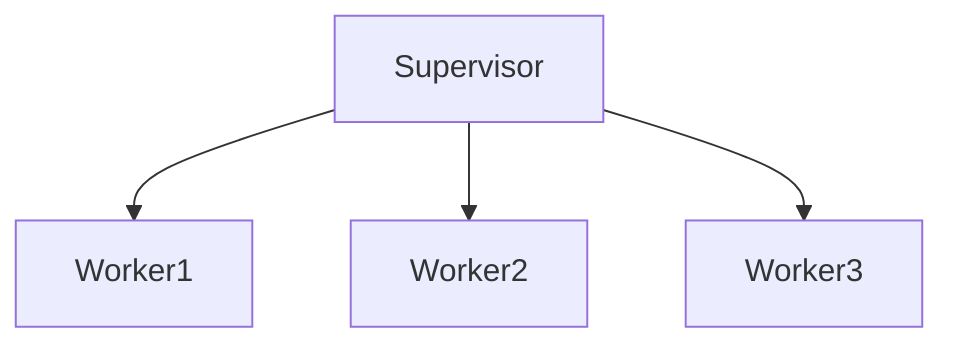

## 27.6. Poor Error Handling and Lack of Supervision

In the world of Elixir, a language built on the Erlang VM (BEAM), the philosophy of "let it crash" is a core tenet. However, this philosophy can lead to pitfalls if not properly managed, especially when it comes to error handling and supervision. In this section, we will explore the consequences of poor error handling, the importance of supervision trees, and best practices for implementing robust error management in your Elixir applications.

### Consequences of Poor Error Handling

Poor error handling can lead to a myriad of issues in any software system, and Elixir is no exception. Let's delve into some of the specific consequences:

- **Unhandled Exceptions Leading to Process Crashes**: In Elixir, each process is isolated, meaning that a crash in one process does not directly affect others. However, if exceptions are not handled properly, it can lead to unexpected process terminations, potentially disrupting the flow of your application.

- **Loss of Critical Data**: When a process crashes without proper error handling, any unsaved data or state is lost. This can be particularly detrimental in applications that rely on real-time data processing or persistent state management.

- **Increased Complexity in Debugging**: Without proper logging and error handling, identifying the root cause of a crash can become a daunting task. This increases the time and effort required for debugging and maintenance.

- **Reduced System Reliability**: Frequent crashes and unhandled errors can lead to a perception of unreliability, affecting user trust and satisfaction.

### Supervision Trees

One of the key features of Elixir is its ability to create robust, fault-tolerant systems through the use of supervision trees. A supervision tree is a hierarchical structure that manages processes, ensuring that they are restarted in case of failure. Let's explore how supervision trees work and why they are essential:

- **Utilizing Supervisors to Monitor and Restart Failed Processes**: Supervisors are special processes whose primary role is to monitor other processes, known as worker processes. When a worker process crashes, the supervisor can restart it according to a specified strategy.

- **Supervision Strategies**: Elixir provides several supervision strategies, including `:one_for_one`, `:one_for_all`, `:rest_for_one`, and `:simple_one_for_one`. Each strategy dictates how the supervisor should respond to a process failure. For example, in a `:one_for_one` strategy, only the failed process is restarted, whereas in a `:one_for_all` strategy, all child processes are restarted.

- **Building a Supervision Tree**: A supervision tree is composed of supervisors and workers. By organizing your processes into a tree structure, you can create a resilient system that can recover from failures gracefully.

#### Example: Implementing a Supervision Tree

Let's consider a simple example of implementing a supervision tree in Elixir:

```elixir
defmodule MyApp.Worker do
  use GenServer

  # Client API
  def start_link(initial_state) do
    GenServer.start_link(__MODULE__, initial_state, name: __MODULE__)
  end

  # Server Callbacks
  def init(initial_state) do
    {:ok, initial_state}
  end

  def handle_call(:get_state, _from, state) do
    {:reply, state, state}
  end

  def handle_cast({:update_state, new_state}, _state) do
    {:noreply, new_state}
  end
end

defmodule MyApp.Supervisor do
  use Supervisor

  def start_link() do
    Supervisor.start_link(__MODULE__, :ok, name: __MODULE__)
  end

  def init(:ok) do
    children = [
      {MyApp.Worker, [:initial_state]}
    ]

    Supervisor.init(children, strategy: :one_for_one)
  end
end
```

In this example, `MyApp.Worker` is a simple GenServer that maintains some state. `MyApp.Supervisor` is a supervisor that manages the worker process. The `:one_for_one` strategy ensures that if the worker crashes, it will be restarted without affecting other processes.

### Best Practices for Error Handling

Implementing proper error handling is crucial for building robust Elixir applications. Here are some best practices to consider:

- **Implementing Proper Error Handling Within Processes**: Use `try...catch` blocks to handle exceptions within processes. This allows you to gracefully recover from errors without crashing the process.

- **Logging Errors for Diagnosis**: Implement comprehensive logging to capture error details. This is invaluable for diagnosing issues and understanding the context in which an error occurred.

- **Using `:ok` and `:error` Tuples**: In Elixir, it's common to return `{:ok, result}` or `{:error, reason}` tuples from functions. This pattern allows you to handle success and failure cases explicitly.

- **Leveraging the `with` Construct**: The `with` construct is useful for chaining multiple operations that may fail, allowing you to handle errors in a concise and readable manner.

#### Example: Error Handling with `try...catch` and `with`

```elixir
defmodule MyApp.ErrorHandling do
  def safe_divide(a, b) do
    try do
      {:ok, a / b}
    catch
      :error, _ -> {:error, "Division by zero"}
    end
  end

  def process_data(data) do
    with {:ok, processed_data} <- process_step1(data),
         {:ok, final_data} <- process_step2(processed_data) do
      {:ok, final_data}
    else
      {:error, reason} -> {:error, reason}
    end
  end

  defp process_step1(data) do
    # Simulate a processing step
    {:ok, data + 1}
  end

  defp process_step2(data) do
    # Simulate another processing step
    {:ok, data * 2}
  end
end
```

In this example, `safe_divide/2` uses `try...catch` to handle division by zero errors, while `process_data/1` uses the `with` construct to chain multiple processing steps and handle errors gracefully.

### Visualizing Supervision Trees

To better understand how supervision trees work, let's visualize a simple supervision tree structure:


```mermaid
graph TD;
    Supervisor --> Worker1;
    Supervisor --> Worker2;
    Supervisor --> Worker3;
```

**Diagram Description**: This diagram represents a supervision tree with a single supervisor managing three worker processes. If any of the workers crash, the supervisor will restart them according to the specified strategy.

### Elixir Unique Features

Elixir offers several unique features that make it particularly well-suited for building fault-tolerant systems:

- **Lightweight Processes**: Elixir processes are lightweight and can be spawned in large numbers, making it easy to isolate and manage tasks.

- **Immutable Data**: Elixir's immutable data structures help prevent shared mutable state, reducing the likelihood of concurrency-related bugs.

- **Built-in Support for Concurrency**: The language provides powerful concurrency primitives, such as `Task` and `GenServer`, to manage concurrent tasks efficiently.

### Differences and Similarities with Other Languages

When it comes to error handling and supervision, Elixir's approach differs significantly from traditional object-oriented languages:

- **Isolation of Processes**: Unlike threads in languages like Java or C#, Elixir processes are isolated, meaning a crash in one process does not directly affect others.

- **Supervision Trees**: While some languages offer similar concepts (e.g., actor model in Akka for Scala), Elixir's supervision trees are deeply integrated into the language and runtime, providing a more seamless experience.

### Design Considerations

When designing your Elixir applications, consider the following:

- **When to Use Supervision Trees**: Use supervision trees whenever you have processes that need to be monitored and restarted in case of failure. This is especially important for long-running or critical processes.

- **Handling State and Side Effects**: Be mindful of how you handle state and side effects within your processes. Use GenServers to encapsulate state and manage side effects safely.

- **Logging and Monitoring**: Implement logging and monitoring from the outset to capture errors and performance metrics. This will aid in diagnosing issues and ensuring system reliability.

### Try It Yourself

To deepen your understanding, try modifying the code examples provided:

- **Experiment with Different Supervision Strategies**: Change the supervision strategy in the `MyApp.Supervisor` module and observe how it affects the behavior of the system when a worker crashes.

- **Implement Additional Error Handling**: Add more error handling to the `MyApp.ErrorHandling` module, such as handling specific exceptions or logging error details.

### Knowledge Check

- **What are the consequences of poor error handling in Elixir applications?**

- **How do supervision trees enhance fault tolerance in Elixir?**

- **What are some best practices for error handling in Elixir?**

### Embrace the Journey

Remember, mastering error handling and supervision in Elixir is an ongoing journey. As you continue to build more complex systems, you'll gain a deeper understanding of these concepts and how to apply them effectively. Keep experimenting, stay curious, and enjoy the journey!

## Quiz Time!



### What is a key consequence of poor error handling in Elixir?

- [x] Unhandled exceptions leading to process crashes
- [ ] Improved system performance
- [ ] Increased memory usage
- [ ] Faster execution times

> **Explanation:** Poor error handling can result in unhandled exceptions, causing processes to crash unexpectedly.

### What is the primary role of a supervisor in Elixir?

- [x] Monitor and restart failed processes
- [ ] Manage database connections
- [ ] Handle user authentication
- [ ] Optimize memory usage

> **Explanation:** Supervisors are responsible for monitoring worker processes and restarting them if they fail.

### Which supervision strategy restarts only the failed process?

- [x] :one_for_one
- [ ] :one_for_all
- [ ] :rest_for_one
- [ ] :simple_one_for_one

> **Explanation:** The `:one_for_one` strategy restarts only the failed process, leaving others unaffected.

### What is a common pattern for returning success and failure in Elixir functions?

- [x] {:ok, result} and {:error, reason}
- [ ] true and false
- [ ] 1 and 0
- [ ] success and failure

> **Explanation:** Elixir functions often return `{:ok, result}` for success and `{:error, reason}` for failure.

### What construct can be used to chain multiple operations that may fail?

- [x] with
- [ ] if
- [ ] case
- [ ] try

> **Explanation:** The `with` construct allows chaining operations and handling failures in a concise manner.

### Which Elixir feature helps prevent concurrency-related bugs?

- [x] Immutable data
- [ ] Mutable state
- [ ] Global variables
- [ ] Shared memory

> **Explanation:** Elixir's immutable data structures help prevent issues related to shared mutable state.

### How does Elixir differ from traditional object-oriented languages in error handling?

- [x] Isolation of processes
- [ ] Use of exceptions
- [ ] Global error handlers
- [ ] Thread-based concurrency

> **Explanation:** Elixir processes are isolated, meaning a crash in one does not directly affect others.

### What should be implemented from the outset to aid in diagnosing issues?

- [x] Logging and monitoring
- [ ] Database indexing
- [ ] User authentication
- [ ] Memory optimization

> **Explanation:** Logging and monitoring help capture errors and performance metrics for diagnosis.

### What is a benefit of using GenServers to manage state?

- [x] Encapsulation of state and safe side effect management
- [ ] Increased memory usage
- [ ] Faster execution times
- [ ] Simplified user interfaces

> **Explanation:** GenServers encapsulate state and manage side effects, enhancing reliability.

### True or False: Supervision trees are unique to Elixir and have no equivalent in other languages.

- [ ] True
- [x] False

> **Explanation:** While unique in their integration, similar concepts exist in other languages, like the actor model in Akka for Scala.




