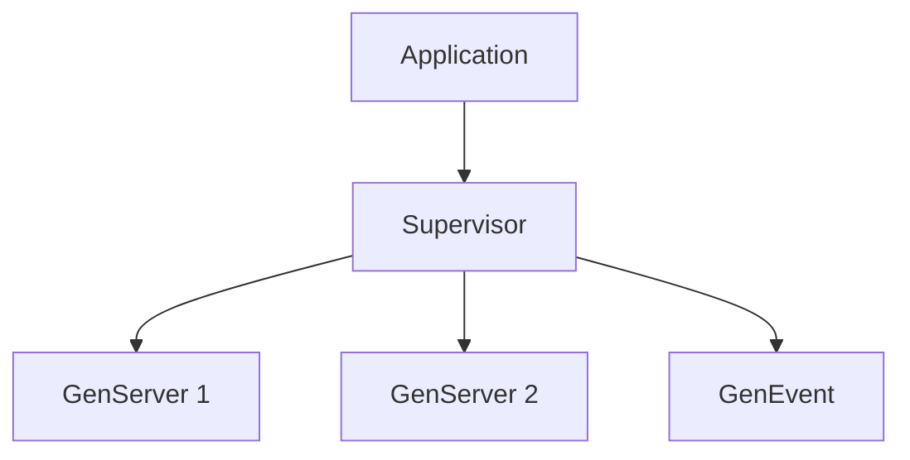

## 27.7. Ignoring OTP Principles

In the world of Elixir, the Open Telecom Platform (OTP) is a cornerstone for building robust, fault-tolerant applications. Ignoring OTP principles can lead to systems that are brittle, difficult to maintain, and prone to failure. This section delves into the importance of OTP, common mistakes developers make when they ignore its principles, and how adhering to OTP can lead to more reliable and maintainable systems.

### Importance of OTP

OTP provides a set of libraries and design principles that are essential for building concurrent and distributed systems. It offers a framework for building applications that can recover from failures, manage state, and handle concurrent processes efficiently. Here are some key reasons why OTP is crucial:

- **Fault Tolerance**: OTP's supervision trees allow applications to recover from failures gracefully, ensuring that a failure in one part of the system does not bring down the entire application.
- **Concurrency**: OTP provides abstractions like GenServer and Task that simplify the management of concurrent processes.
- **Scalability**: With OTP, applications can be designed to scale horizontally across multiple nodes, making them suitable for distributed systems.
- **Maintainability**: By adhering to OTP principles, developers can create systems that are easier to understand, extend, and maintain.

### Common Mistakes When Ignoring OTP Principles

Ignoring OTP principles often leads to several common mistakes that can compromise the reliability and maintainability of an application. Let's explore some of these pitfalls:

#### Writing Custom Process Loops Instead of Using GenServer

One of the most common mistakes is writing custom process loops instead of leveraging the GenServer behavior. GenServer abstracts the complexities of process management, message passing, and state handling, allowing developers to focus on the business logic.

**Example of a Custom Process Loop:**

```elixir
defmodule CustomProcess do
  def start_link(initial_state) do
    spawn_link(fn -> loop(initial_state) end)
  end

  defp loop(state) do
    receive do
      {:get_state, caller} ->
        send(caller, {:state, state})
        loop(state)

      {:set_state, new_state} ->
        loop(new_state)

      :stop ->
        :ok
    end
  end
end
```

**Problems with Custom Process Loops:**

- **Reinventing the Wheel**: Custom loops often replicate functionality that GenServer already provides, leading to unnecessary complexity.
- **Lack of Supervision**: Custom processes are not automatically supervised, making it harder to recover from failures.
- **Inconsistent Patterns**: Without a standardized approach, code can become inconsistent and harder to maintain.

**Using GenServer Instead:**

```elixir
defmodule MyGenServer do
  use GenServer

  # Client API
  def start_link(initial_state) do
    GenServer.start_link(__MODULE__, initial_state, name: __MODULE__)
  end

  def get_state do
    GenServer.call(__MODULE__, :get_state)
  end

  def set_state(new_state) do
    GenServer.cast(__MODULE__, {:set_state, new_state})
  end

  # Server Callbacks
  def init(initial_state) do
    {:ok, initial_state}
  end

  def handle_call(:get_state, _from, state) do
    {:reply, state, state}
  end

  def handle_cast({:set_state, new_state}, _state) do
    {:noreply, new_state}
  end
end
```

**Benefits of Using GenServer:**

- **Standardization**: GenServer provides a standardized way to manage state and handle messages.
- **Supervision**: GenServers can be easily supervised, allowing for automatic restarts in case of failures.
- **Code Clarity**: Using GenServer makes the code more readable and maintainable.

#### Ignoring Supervision Trees

Another common mistake is ignoring the importance of supervision trees. Supervision trees are a fundamental part of OTP that ensure fault tolerance by monitoring processes and restarting them when necessary.

**Example of a Simple Supervision Tree:**

```elixir
defmodule MyApp.Supervisor do
  use Supervisor

  def start_link do
    Supervisor.start_link(__MODULE__, :ok, name: __MODULE__)
  end

  def init(:ok) do
    children = [
      {MyGenServer, []}
    ]

    Supervisor.init(children, strategy: :one_for_one)
  end
end
```

**Common Mistakes:**

- **No Supervision**: Running processes without supervision means that failures can lead to system-wide crashes.
- **Improper Strategies**: Choosing the wrong supervision strategy can lead to unnecessary restarts or failure to recover from errors.

**Benefits of Supervision Trees:**

- **Fault Isolation**: Supervision trees isolate faults, ensuring that a failure in one process does not affect others.
- **Automatic Recovery**: Supervisors automatically restart failed processes, maintaining system stability.
- **Scalability**: Supervision trees can be nested, allowing for complex systems to be managed effectively.

#### Failing to Use OTP Behaviors

OTP behaviors like GenServer, GenEvent, and Supervisor provide powerful abstractions for building concurrent applications. Ignoring these behaviors often leads to reinventing solutions that OTP already provides.

**Example of Using OTP Behaviors:**

```elixir
defmodule MyEventHandler do
  use GenEvent

  def handle_event(event, state) do
    IO.inspect(event)
    {:ok, state}
  end
end
```

**Common Mistakes:**

- **Custom Implementations**: Developers often implement custom solutions for event handling, state management, and process supervision, leading to increased complexity.
- **Inconsistent Patterns**: Without OTP behaviors, code can become inconsistent, making it harder to maintain and extend.

**Benefits of Using OTP Behaviors:**

- **Simplified Code**: OTP behaviors simplify code by providing reusable patterns for common tasks.
- **Consistency**: Using OTP behaviors leads to consistent codebases, making it easier for teams to collaborate.
- **Reliability**: OTP behaviors are battle-tested and designed for reliability, reducing the likelihood of bugs.

### Adherence to OTP Principles

Adhering to OTP principles is essential for building reliable, maintainable, and scalable applications. Here are some key practices to follow:

#### Leveraging OTP Behaviors

Use OTP behaviors like GenServer, Supervisor, and GenEvent to manage processes, handle state, and implement event-driven architectures. These behaviors provide a solid foundation for building concurrent applications.

#### Designing Effective Supervision Trees

Design supervision trees that reflect the fault tolerance requirements of your application. Choose appropriate supervision strategies and ensure that critical processes are properly supervised.

#### Embracing the "Let It Crash" Philosophy

Adopt the "let it crash" philosophy, which encourages designing systems that can recover from failures automatically. This approach simplifies error handling and improves system resilience.

#### Using Elixir's Unique Features

Leverage Elixir's unique features, such as pattern matching, immutability, and the actor model, to build efficient and reliable systems. These features complement OTP principles and enhance the robustness of your applications.

### Visualizing OTP Principles

To better understand the role of OTP in building fault-tolerant systems, let's visualize a simple supervision tree using Mermaid.js:



**Diagram Description:**

- **Application**: Represents the top-level application that starts the supervision tree.
- **Supervisor**: Manages the lifecycle of child processes, restarting them as needed.
- **GenServer 1 and GenServer 2**: Represent worker processes that handle specific tasks.
- **GenEvent**: Represents an event handler that processes events asynchronously.

### Knowledge Check

Before we move on, let's reinforce our understanding with a few questions:

1. What are the benefits of using GenServer over custom process loops?
2. How do supervision trees contribute to fault tolerance in Elixir applications?
3. Why is it important to use OTP behaviors in your applications?

### Try It Yourself

Now that we've covered the importance of OTP principles, let's put our knowledge into practice. Try modifying the GenServer example to add a new feature, such as logging state changes. Experiment with different supervision strategies and observe how they affect the behavior of your application.

### References and Further Reading

For more information on OTP and Elixir, consider exploring the following resources:

- [Elixir's Official Documentation](https://elixir-lang.org/docs.html)
- [Learn You Some Erlang for Great Good!](https://learnyousomeerlang.com/)
- [Designing for Scalability with Erlang/OTP](https://www.amazon.com/Designing-Scalability-Erlang-OTP-Implement/dp/1449320732)

### Conclusion

Ignoring OTP principles can lead to systems that are difficult to maintain and prone to failure. By embracing OTP, developers can build applications that are robust, scalable, and easy to maintain. Remember, the key to success with Elixir is to leverage its powerful features and adhere to the principles that have made it a popular choice for building concurrent and distributed systems.

## Quiz: Ignoring OTP Principles



### What is one of the main benefits of using GenServer in Elixir?

- [x] It provides a standardized way to manage state and handle messages.
- [ ] It allows for direct manipulation of process memory.
- [ ] It eliminates the need for supervision trees.
- [ ] It automatically scales applications across multiple nodes.

> **Explanation:** GenServer provides a standardized way to manage state and handle messages, simplifying process management and improving code clarity.

### Why are supervision trees important in Elixir applications?

- [x] They ensure fault isolation and automatic recovery.
- [ ] They eliminate the need for error handling.
- [ ] They allow for direct communication between processes.
- [ ] They replace the need for GenServer.

> **Explanation:** Supervision trees ensure fault isolation and automatic recovery, maintaining system stability by restarting failed processes.

### What is a common mistake when ignoring OTP principles?

- [x] Writing custom process loops instead of using GenServer.
- [ ] Using too many supervision trees.
- [ ] Overusing pattern matching.
- [ ] Avoiding the use of immutability.

> **Explanation:** Writing custom process loops instead of using GenServer leads to unnecessary complexity and lack of supervision.

### What does the "let it crash" philosophy encourage?

- [x] Designing systems that can recover from failures automatically.
- [ ] Writing extensive error handling code.
- [ ] Avoiding the use of supervision trees.
- [ ] Implementing custom process loops.

> **Explanation:** The "let it crash" philosophy encourages designing systems that can recover from failures automatically, simplifying error handling.

### Which OTP behavior is used for event-driven architectures?

- [x] GenEvent
- [ ] GenServer
- [ ] Supervisor
- [ ] Task

> **Explanation:** GenEvent is used for event-driven architectures, providing a way to handle events asynchronously.

### What is a benefit of using OTP behaviors?

- [x] Simplified code and consistent patterns.
- [ ] Direct access to process memory.
- [ ] Elimination of supervision trees.
- [ ] Automatic horizontal scaling.

> **Explanation:** OTP behaviors simplify code by providing reusable patterns for common tasks, leading to consistent codebases.

### How do supervision trees contribute to scalability?

- [x] They can be nested to manage complex systems effectively.
- [ ] They eliminate the need for distributed systems.
- [ ] They allow for direct process communication.
- [ ] They replace the need for GenServer.

> **Explanation:** Supervision trees can be nested, allowing for complex systems to be managed effectively, contributing to scalability.

### What is a key feature of Elixir that complements OTP principles?

- [x] Pattern matching
- [ ] Direct memory access
- [ ] Mutable state
- [ ] Lack of concurrency

> **Explanation:** Pattern matching is a key feature of Elixir that complements OTP principles, enhancing the robustness of applications.

### What is the role of a supervisor in a supervision tree?

- [x] It manages the lifecycle of child processes and restarts them as needed.
- [ ] It directly handles all messages in the system.
- [ ] It eliminates the need for GenServer.
- [ ] It provides direct access to process memory.

> **Explanation:** A supervisor manages the lifecycle of child processes and restarts them as needed, ensuring system stability.

### True or False: Ignoring OTP principles can lead to systems that are difficult to maintain and prone to failure.

- [x] True
- [ ] False

> **Explanation:** Ignoring OTP principles can lead to systems that are difficult to maintain and prone to failure, as OTP provides essential conventions for building reliable systems.



Remember, mastering OTP principles is key to building robust, fault-tolerant systems in Elixir. Keep experimenting, stay curious, and enjoy the journey!
