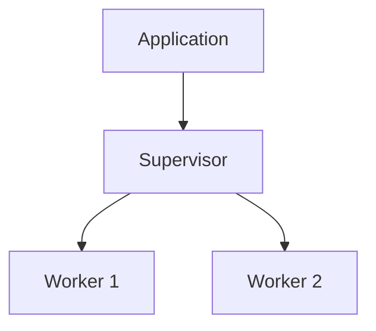

## 27.7. Ignoring OTP Principles

In the world of Elixir, the Open Telecom Platform (OTP) provides a set of frameworks and principles that are crucial for building robust, scalable, and fault-tolerant applications. Ignoring these principles can lead to a myriad of issues, from poor system reliability to increased maintenance overhead. In this section, we will delve into the importance of OTP, common mistakes developers make when ignoring its principles, and how to adhere to these principles effectively.

### Importance of OTP

The OTP framework is a cornerstone of the Elixir ecosystem, offering a suite of tools and libraries designed to facilitate the development of concurrent and distributed systems. Here are some key reasons why OTP is indispensable:

- **Reliability and Fault Tolerance**: OTP provides mechanisms such as supervisors and workers that automatically restart failed processes, ensuring system resilience.
- **Concurrency Management**: With OTP, managing thousands of lightweight processes becomes straightforward, thanks to abstractions like GenServer.
- **Code Organization and Maintainability**: OTP encourages a structured approach to code organization, making it easier to understand and maintain complex systems.
- **Scalability**: OTP's design principles naturally support horizontal and vertical scaling, allowing systems to handle increased loads efficiently.

### Common Mistakes When Ignoring OTP Principles

Ignoring OTP principles can lead to several pitfalls. Here are some common mistakes:

#### 1. Writing Custom Process Loops Instead of Using GenServer

A frequent error is bypassing GenServer in favor of custom process loops. This approach can lead to code that is harder to maintain and less reliable. GenServer abstracts many complexities, such as message handling and state management, which are crucial for robust process management.

#### 2. Neglecting Supervision Trees

Supervision trees are a fundamental concept in OTP, providing a hierarchical structure for managing processes. Ignoring them can result in systems that lack resilience, as there is no mechanism to automatically recover from process failures.

#### 3. Overlooking GenStage and Flow for Data Processing

For systems that require data processing, ignoring GenStage and Flow can lead to inefficient and hard-to-scale solutions. These tools provide backpressure and concurrency management, essential for handling large data streams.

#### 4. Mismanaging State with GenServer

Improper state management in GenServer can lead to inconsistent application behavior. It is crucial to understand how to initialize, update, and query state within a GenServer to maintain a consistent system state.

#### 5. Skipping OTP Behaviors for Custom Implementations

OTP behaviors like GenServer, GenEvent, and Supervisor provide standardized solutions for common problems. Skipping these in favor of custom implementations can result in reinventing the wheel and introducing bugs.

### Adherence to OTP Principles

To fully leverage OTP's power, it is essential to adhere to its principles. Here are some best practices:

#### Leveraging OTP Behaviors for Standardized Process Management

OTP behaviors are predefined modules that encapsulate common patterns of concurrent programming. Using them ensures that your application adheres to best practices for process management.

#### Implementing Supervision Trees

Supervision trees are critical for building fault-tolerant applications. They define a hierarchy of processes where supervisors manage workers, restarting them as needed. Here's a simple example:

```elixir
defmodule MyApp.Application do
  use Application

  def start(_type, _args) do
    children = [
      {MyApp.Worker, []}
    ]

    opts = [strategy: :one_for_one, name: MyApp.Supervisor]
    Supervisor.start_link(children, opts)
  end
end
```

In this example, `MyApp.Worker` is a worker process managed by a supervisor. If the worker crashes, the supervisor restarts it automatically.

#### Using GenServer for Process Management

GenServer is a generic server implementation that simplifies process management. Here's a basic example:

```elixir
defmodule MyApp.Server do
  use GenServer

  # Client API
  def start_link(initial_state) do
    GenServer.start_link(__MODULE__, initial_state, name: __MODULE__)
  end

  def get_state do
    GenServer.call(__MODULE__, :get_state)
  end

  # Server Callbacks
  def init(initial_state) do
    {:ok, initial_state}
  end

  def handle_call(:get_state, _from, state) do
    {:reply, state, state}
  end
end
```

This GenServer maintains a state that can be queried using the `get_state/0` function.

#### Utilizing GenStage and Flow for Data Processing

For systems that require data processing, GenStage and Flow offer powerful abstractions for handling data streams with backpressure. Here's a simple GenStage producer-consumer example:

```elixir
defmodule MyProducer do
  use GenStage

  def start_link(initial) do
    GenStage.start_link(__MODULE__, initial, name: __MODULE__)
  end

  def init(initial) do
    {:producer, initial}
  end

  def handle_demand(demand, state) do
    events = Enum.to_list(1..demand)
    {:noreply, events, state}
  end
end

defmodule MyConsumer do
  use GenStage

  def start_link do
    GenStage.start_link(__MODULE__, :ok, name: __MODULE__)
  end

  def init(:ok) do
    {:consumer, :ok}
  end

  def handle_events(events, _from, state) do
    for event <- events do
      IO.inspect(event)
    end
    {:noreply, [], state}
  end
end
```

In this example, `MyProducer` generates events, and `MyConsumer` processes them, demonstrating a simple producer-consumer model with backpressure management.

#### Adopting the "Let It Crash" Philosophy

One of the core philosophies of OTP is "let it crash." This approach encourages designing systems that can handle failures gracefully rather than trying to prevent them. By allowing processes to crash and be restarted by supervisors, systems can achieve greater reliability.

### Visualizing OTP Concepts

To better understand OTP concepts, let's visualize a simple supervision tree using Mermaid.js:


```mermaid
graph TD;
    A[Application] --> B[Supervisor]
    B --> C[Worker 1]
    B --> D[Worker 2]
```

In this diagram, the application has a supervisor that manages two worker processes. If any worker crashes, the supervisor restarts it, maintaining system stability.

### References and Further Reading

For more information on OTP and its principles, consider the following resources:

- [Official Elixir Documentation](https://elixir-lang.org/docs.html)
- [Learn You Some Erlang for Great Good!](https://learnyousomeerlang.com/)
- [Designing for Scalability with Erlang/OTP](https://www.oreilly.com/library/view/designing-for-scalability/9781449361556/)

### Knowledge Check

To reinforce your understanding of OTP principles, consider the following questions:

1. What are the advantages of using GenServer over custom process loops?
2. How do supervision trees contribute to system reliability?
3. Why is the "let it crash" philosophy beneficial in OTP systems?
4. What role do GenStage and Flow play in data processing within Elixir applications?

### Exercises

1. Implement a simple GenServer that maintains a counter state. Add functions to increment and decrement the counter.
2. Create a supervision tree with a supervisor managing two worker processes. Simulate a worker crash and observe the supervisor's behavior.
3. Develop a GenStage pipeline with a producer, a consumer, and a producer-consumer. Experiment with different demand values to see how backpressure is handled.

### Embrace the Journey

Remember, mastering OTP principles is a journey. As you continue to explore and experiment with these concepts, you'll gain deeper insights into building reliable and scalable systems. Keep experimenting, stay curious, and enjoy the journey!

## Quiz Time!



### What is one key advantage of using GenServer over custom process loops?

- [x] Simplifies process management and state handling
- [ ] Allows for direct manipulation of process memory
- [ ] Provides built-in logging capabilities
- [ ] Eliminates the need for supervision trees

> **Explanation:** GenServer abstracts complexities of process management and state handling, making it easier to build reliable systems.

### How do supervision trees contribute to system reliability?

- [x] By automatically restarting failed processes
- [ ] By preventing processes from crashing
- [ ] By reducing memory usage
- [ ] By eliminating the need for error handling

> **Explanation:** Supervision trees automatically restart failed processes, ensuring system resilience and reliability.

### Why is the "let it crash" philosophy beneficial in OTP systems?

- [x] It allows systems to recover from failures gracefully
- [ ] It prevents processes from crashing
- [ ] It eliminates the need for error handling
- [ ] It reduces system complexity

> **Explanation:** The "let it crash" philosophy encourages systems to handle failures gracefully by relying on supervisors to restart failed processes.

### What role do GenStage and Flow play in data processing within Elixir applications?

- [x] They provide backpressure and concurrency management
- [ ] They eliminate the need for supervision trees
- [ ] They simplify process management
- [ ] They provide built-in logging capabilities

> **Explanation:** GenStage and Flow offer backpressure and concurrency management, essential for handling large data streams efficiently.

### Which OTP behavior is used for implementing servers?

- [x] GenServer
- [ ] Supervisor
- [ ] GenStage
- [ ] GenEvent

> **Explanation:** GenServer is an OTP behavior used for implementing servers, providing abstractions for process management and state handling.

### What is the primary purpose of a supervisor in OTP?

- [x] To manage and restart worker processes
- [ ] To handle network communication
- [ ] To provide logging capabilities
- [ ] To reduce memory usage

> **Explanation:** The primary purpose of a supervisor is to manage and restart worker processes, ensuring system reliability.

### How does OTP help in building scalable systems?

- [x] By providing abstractions for concurrency and process management
- [ ] By eliminating the need for error handling
- [ ] By reducing memory usage
- [ ] By providing built-in logging capabilities

> **Explanation:** OTP provides abstractions for concurrency and process management, allowing systems to scale efficiently.

### What is a common mistake when ignoring OTP principles?

- [x] Writing custom process loops instead of using GenServer
- [ ] Using supervision trees
- [ ] Implementing the "let it crash" philosophy
- [ ] Utilizing GenStage for data processing

> **Explanation:** Writing custom process loops instead of using GenServer is a common mistake, leading to harder-to-maintain and less reliable code.

### What is the role of the "let it crash" philosophy in OTP?

- [x] To encourage systems to handle failures gracefully
- [ ] To prevent processes from crashing
- [ ] To eliminate the need for error handling
- [ ] To reduce system complexity

> **Explanation:** The "let it crash" philosophy encourages systems to handle failures gracefully by relying on supervisors to restart failed processes.

### True or False: Ignoring OTP principles can lead to increased maintenance overhead.

- [x] True
- [ ] False

> **Explanation:** Ignoring OTP principles can lead to increased maintenance overhead due to less reliable and harder-to-maintain systems.


