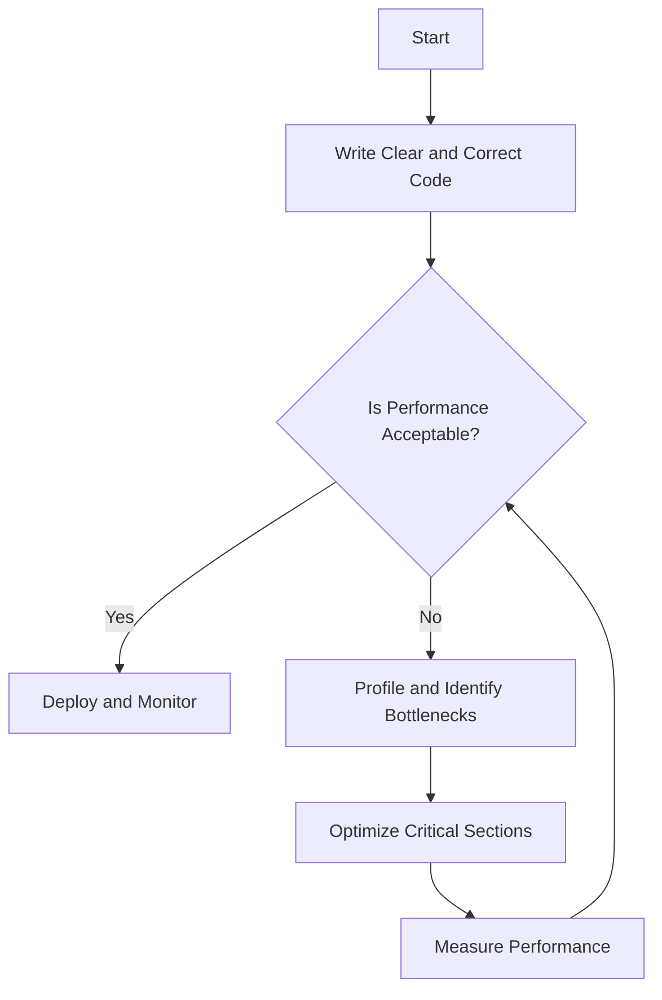

## 27.8. Premature Optimization

In the realm of software development, the phrase "premature optimization is the root of all evil" is often quoted. This adage, attributed to Donald Knuth, serves as a cautionary reminder against the pitfalls of optimizing code too early in the development process. In this section, we will delve into the concept of premature optimization, particularly in the context of Elixir, a functional programming language known for its concurrency and fault-tolerance capabilities. We will explore the downsides of premature optimization, strategies to avoid it, and how to focus on writing clear and correct code first before optimizing based on actual performance data.

### Understanding Premature Optimization

Premature optimization refers to the practice of trying to improve the performance of a program before it is necessary, often at the expense of code clarity and maintainability. This can lead to wasted effort on non-critical optimizations and can complicate the codebase, making it harder to understand and modify.

#### Downsides of Premature Optimization

1. **Wasting Time on Non-Critical Optimizations**: Developers may spend significant time optimizing parts of the code that do not have a substantial impact on overall performance. This time could be better spent on other aspects of the project, such as feature development or bug fixing.

2. **Complicating Code Unnecessarily**: Optimizations often involve complex algorithms or data structures that can obscure the original logic of the code. This can make the code harder to read, understand, and maintain.

3. **Introducing Bugs**: Optimizations can introduce subtle bugs, especially if they involve low-level operations or assumptions about the system's behavior that may not hold true in all cases.

4. **Misleading Priorities**: Focusing on optimization too early can lead to prioritizing performance over other important factors such as code readability, maintainability, and correctness.

### The Right Approach to Optimization

To avoid the pitfalls of premature optimization, it is crucial to adopt a disciplined approach to performance improvements. Here are some strategies to consider:

#### Focus on Writing Clear and Correct Code First

1. **Prioritize Clarity and Correctness**: Ensure that your code is correct and easy to understand before considering any optimizations. Clear code is easier to debug, test, and extend.

2. **Use Idiomatic Elixir**: Leverage Elixir's features and idioms to write expressive and concise code. This includes using pattern matching, the pipe operator, and higher-order functions.

3. **Embrace Functional Programming Principles**: Elixir is a functional language, so embrace immutability, pure functions, and function composition to write robust and maintainable code.

#### Optimize Based on Actual Performance Data

1. **Identify Bottlenecks**: Use profiling tools to identify the parts of your code that are actually causing performance issues. Focus your optimization efforts on these areas.

2. **Measure Before and After**: Always measure the performance of your code before and after making optimizations to ensure that your changes have the desired effect.

3. **Consider the Big Picture**: Performance improvements should be considered in the context of the entire system. Sometimes, optimizing a single component may not lead to significant overall gains.

4. **Iterate and Refine**: Optimization is an iterative process. Continuously refine your code based on feedback and performance data.

### Code Examples

Let's explore some code examples to illustrate these concepts.

#### Example 1: Premature Optimization with Complex Data Structures

Consider a scenario where you need to store and retrieve user data. A premature optimization might involve using a complex data structure like a binary search tree for fast lookups, even when the dataset is small.

```elixir
# Prematurely optimized code using a binary search tree
defmodule UserStore do
  defstruct users: %{}

  def add_user(store, user) do
    %{store | users: Map.put(store.users, user.id, user)}
  end

  def get_user(store, user_id) do
    Map.get(store.users, user_id)
  end
end
```

In this example, using a simple map is sufficient for most use cases. Introducing a more complex data structure would complicate the code without providing significant performance benefits.

#### Example 2: Focusing on Clarity and Correctness

Instead of optimizing prematurely, focus on writing clear and correct code. Use Elixir's pattern matching and functional features to simplify your logic.

```elixir
# Clear and correct code using pattern matching
defmodule UserStore do
  defstruct users: %{}

  def add_user(%UserStore{users: users} = store, user) do
    %{store | users: Map.put(users, user.id, user)}
  end

  def get_user(%UserStore{users: users}, user_id) do
    Map.get(users, user_id)
  end
end
```

This version of the code is easier to read and understand, making it more maintainable in the long run.

### Visualizing the Impact of Premature Optimization

To better understand the impact of premature optimization, let's visualize the process of identifying and addressing performance bottlenecks.



**Figure 1: Optimization Process Flowchart**

This flowchart illustrates a disciplined approach to optimization. Start by writing clear and correct code. If performance is not acceptable, profile the application to identify bottlenecks, optimize critical sections, and measure the impact of your changes.

### References and Further Reading

- [Elixir's Official Documentation](https://elixir-lang.org/docs.html) provides comprehensive resources on Elixir's features and best practices.
- [The Pragmatic Programmer](https://pragprog.com/titles/tpp20/the-pragmatic-programmer-20th-anniversary-edition/) by Andrew Hunt and David Thomas discusses the importance of writing clear and maintainable code.
- [Programming Elixir](https://pragprog.com/titles/elixir16/programming-elixir-1-6/) by Dave Thomas offers insights into idiomatic Elixir programming.

### Knowledge Check

1. What are the main downsides of premature optimization?
2. How can you identify performance bottlenecks in your Elixir code?
3. Why is it important to focus on writing clear and correct code before optimizing?
4. How can you measure the impact of your optimizations?

### Embrace the Journey

Remember, optimization is a journey, not a destination. By focusing on writing clear and correct code first, you lay a solid foundation for future improvements. As you gain experience, you'll develop an intuition for when and where optimizations are necessary. Keep experimenting, stay curious, and enjoy the process of refining your craft.

## Quiz: Premature Optimization



### What is a common downside of premature optimization?

- [x] Wasting time on non-critical optimizations
- [ ] Improving code readability
- [ ] Enhancing code maintainability
- [ ] Reducing code complexity

> **Explanation:** Premature optimization often leads to wasted time on optimizations that do not significantly impact performance.

### Why should you focus on writing clear and correct code first?

- [x] It ensures the code is easy to understand and maintain.
- [ ] It makes the code run faster.
- [ ] It guarantees the code is bug-free.
- [ ] It eliminates the need for future optimizations.

> **Explanation:** Clear and correct code is easier to understand, maintain, and extend, which is crucial before considering optimizations.

### How can you identify performance bottlenecks in your Elixir code?

- [x] Use profiling tools to analyze the code.
- [ ] Guess based on intuition.
- [ ] Optimize every part of the code equally.
- [ ] Ignore performance issues until deployment.

> **Explanation:** Profiling tools help identify specific areas of the code that are causing performance issues.

### What should you do after optimizing a section of code?

- [x] Measure the performance to ensure improvements.
- [ ] Assume the optimization was successful.
- [ ] Remove all comments from the code.
- [ ] Ignore any new bugs introduced.

> **Explanation:** Measuring performance after optimization ensures that the changes have the desired effect.

### Which of the following is a benefit of using idiomatic Elixir?

- [x] Writing expressive and concise code
- [ ] Increasing code complexity
- [ ] Making the code harder to read
- [ ] Reducing code performance

> **Explanation:** Idiomatic Elixir leverages the language's features to write expressive and concise code.

### What is the first step in the optimization process flowchart?

- [x] Write clear and correct code
- [ ] Profile the application
- [ ] Optimize critical sections
- [ ] Measure performance

> **Explanation:** The first step is to write clear and correct code before considering any optimizations.

### How can premature optimization affect code maintainability?

- [x] It can complicate the code, making it harder to understand.
- [ ] It simplifies the code structure.
- [ ] It ensures the code is bug-free.
- [ ] It makes the code easier to read.

> **Explanation:** Premature optimization often involves complex changes that can obscure the original logic, making the code harder to maintain.

### What is the role of profiling tools in optimization?

- [x] Identifying performance bottlenecks
- [ ] Automatically optimizing the code
- [ ] Writing documentation
- [ ] Testing the code for bugs

> **Explanation:** Profiling tools help identify specific areas of the code that need optimization.

### Why is it important to consider the big picture in optimization?

- [x] Optimizing a single component may not lead to significant overall gains.
- [ ] It ensures every line of code is optimized.
- [ ] It guarantees the code is bug-free.
- [ ] It eliminates the need for future optimizations.

> **Explanation:** Considering the big picture ensures that optimizations have a meaningful impact on the entire system.

### True or False: Premature optimization guarantees better performance.

- [ ] True
- [x] False

> **Explanation:** Premature optimization does not guarantee better performance and can lead to unnecessary complexity and wasted effort.


