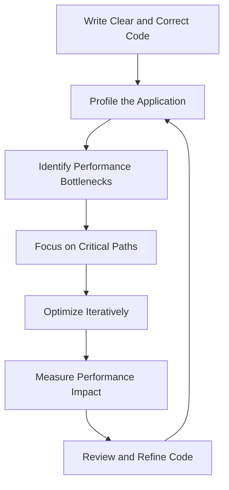

## 27.8. Premature Optimization

In the realm of software development, the phrase "premature optimization" is often cited to caution developers against the temptation to optimize code before its necessity is proven. This concept is particularly relevant in Elixir, where the functional programming paradigm and the BEAM virtual machine provide unique opportunities and challenges for performance optimization. In this section, we will delve into the pitfalls of premature optimization, explore strategies to avoid it, and provide guidance on when and how to optimize your Elixir applications effectively.

### Understanding Premature Optimization

Premature optimization refers to the practice of making code enhancements aimed at improving performance before there is a clear need or understanding of the performance bottlenecks. This can lead to several negative consequences, including:

- **Wasting Time on Non-Critical Optimizations**: Developers may spend significant time optimizing parts of the code that do not significantly impact overall performance.
- **Complicating Code Unnecessarily**: Optimizations can make code more complex, harder to understand, and maintain, which can introduce new bugs and make future development more challenging.

In Elixir, where clarity and maintainability are highly valued, premature optimization can be particularly detrimental. The idiomatic approach in Elixir emphasizes writing clear, correct, and expressive code first, and only optimizing when necessary.

### The Downsides of Premature Optimization

#### Wasting Time on Non-Critical Optimizations

One of the primary downsides of premature optimization is the potential waste of developer time and resources. Without concrete data to guide optimization efforts, developers may focus on optimizing parts of the code that have little impact on the overall performance of the application. This can lead to:

- **Misallocation of Resources**: Time spent on unnecessary optimizations could be better spent on other critical aspects of the project, such as feature development or bug fixing.
- **Delayed Project Timelines**: Focusing on optimizations too early can delay the delivery of working software, impacting project timelines and stakeholder satisfaction.

#### Complicating Code Unnecessarily

Another significant downside of premature optimization is the potential for increased code complexity. Optimizations often involve intricate changes to code logic, which can:

- **Reduce Code Readability**: Complex optimizations can make code harder to read and understand, especially for new team members or contributors.
- **Increase Maintenance Burden**: As code becomes more complex, maintaining and extending it becomes more challenging, potentially leading to more bugs and technical debt.
- **Obscure the Original Intent**: Optimizations can obscure the original intent of the code, making it difficult to determine if the code is correct or if it still meets the original requirements.

### The Approach: Focus on Clear and Correct Code First

To avoid the pitfalls of premature optimization, it is crucial to focus on writing clear and correct code first. This approach involves:

- **Prioritizing Code Clarity and Maintainability**: Write code that is easy to read, understand, and maintain. Use descriptive variable names, consistent formatting, and clear logic to ensure that your code is accessible to others.
- **Ensuring Correctness**: Before considering optimizations, make sure that your code is correct and meets the requirements. Use testing and code reviews to validate the correctness of your code.
- **Leveraging Elixir's Strengths**: Take advantage of Elixir's functional programming features, such as immutability, pattern matching, and higher-order functions, to write expressive and concise code.

By focusing on clear and correct code first, you lay a solid foundation for your application, making it easier to identify and address performance issues when they arise.

### Optimize Based on Actual Performance Data

Once you have a clear and correct codebase, you can begin to consider optimizations. However, it is essential to base these efforts on actual performance data. This involves:

- **Profiling and Benchmarking**: Use profiling and benchmarking tools to identify performance bottlenecks in your application. Tools like `:fprof`, `:eprof`, and `Benchee` can help you gather data on where your application spends the most time.
- **Focusing on Critical Paths**: Once you have identified performance bottlenecks, focus your optimization efforts on the critical paths that have the most significant impact on overall performance.
- **Iterative Optimization**: Approach optimization iteratively, making small changes and measuring their impact on performance. This allows you to gauge the effectiveness of your optimizations and avoid unnecessary complexity.

### Code Example: Profiling and Optimizing Elixir Code

Let's consider a simple Elixir module that performs a computationally intensive task. We'll demonstrate how to profile and optimize this code based on actual performance data.

```elixir
defmodule MathOperations do
  # A function that calculates the factorial of a number
  def factorial(n) when n >= 0 do
    Enum.reduce(1..n, 1, &*/2)
  end
end

# Profiling the factorial function
:timer.tc(fn -> MathOperations.factorial(10000) end)
```

In this example, we have a `factorial/1` function that calculates the factorial of a number using `Enum.reduce/3`. To profile this function, we use `:timer.tc/1` to measure the execution time.

#### Optimizing the Factorial Function

After profiling, we may find that the `factorial/1` function is a performance bottleneck. We can optimize it by using recursion and tail call optimization, which Elixir supports natively.

```elixir
defmodule MathOperations do
  # A tail-recursive function that calculates the factorial of a number
  def factorial(n), do: factorial(n, 1)

  defp factorial(0, acc), do: acc
  defp factorial(n, acc) when n > 0 do
    factorial(n - 1, n * acc)
  end
end

# Profiling the optimized factorial function
:timer.tc(fn -> MathOperations.factorial(10000) end)
```

In the optimized version, we use a tail-recursive approach with an accumulator to calculate the factorial. This reduces the overhead of `Enum.reduce/3` and takes advantage of Elixir's tail call optimization to improve performance.

### Visualizing the Optimization Process

To better understand the optimization process, let's visualize the steps involved in identifying and optimizing performance bottlenecks.


```mermaid
flowchart TD
    A[Write Clear and Correct Code] --> B[Profile the Application]
    B --> C[Identify Performance Bottlenecks]
    C --> D[Focus on Critical Paths]
    D --> E[Optimize Iteratively]
    E --> F[Measure Performance Impact]
    F --> G[Review and Refine Code]
    G --> B
```

This flowchart illustrates the iterative nature of the optimization process, emphasizing the importance of profiling and measuring performance impact before making changes.

### Elixir Unique Features for Optimization

Elixir offers several unique features that can aid in the optimization process:

- **Immutability**: Elixir's immutable data structures can help prevent unintended side effects and make code easier to reason about.
- **Pattern Matching**: Use pattern matching to write concise and efficient code, especially in function definitions and control structures.
- **Concurrency**: Leverage Elixir's concurrency model and the BEAM VM's ability to handle thousands of lightweight processes to improve performance in concurrent applications.

### Differences and Similarities with Other Languages

While the concept of premature optimization is universal, Elixir's functional programming paradigm and concurrency model provide unique opportunities and challenges compared to other languages:

- **Functional vs. Imperative**: In functional languages like Elixir, optimization often involves leveraging immutability and recursion, whereas imperative languages may focus more on loop unrolling and in-place modifications.
- **Concurrency**: Elixir's concurrency model allows for optimizations that take advantage of parallel processing, which may differ from thread-based models in other languages.

### Conclusion

Premature optimization is a common pitfall that can lead to wasted effort and increased code complexity. By focusing on writing clear and correct code first and optimizing based on actual performance data, you can build efficient and maintainable Elixir applications. Remember, optimization should be an iterative process guided by profiling and benchmarking, allowing you to focus on the critical paths that have the most significant impact on performance.

### Try It Yourself

Experiment with the provided code examples by modifying the factorial function to use different algorithms, such as memoization or parallel computation. Measure the performance impact of your changes using `:timer.tc/1` or other profiling tools.

### Key Takeaways

- Premature optimization can lead to wasted time and increased code complexity.
- Focus on writing clear and correct code first before considering optimizations.
- Use profiling and benchmarking to identify performance bottlenecks.
- Optimize iteratively, focusing on critical paths and measuring performance impact.
- Leverage Elixir's unique features, such as immutability and concurrency, for effective optimization.

## Quiz Time!



### What is premature optimization?

- [x] Optimizing code before understanding performance bottlenecks
- [ ] Optimizing code after profiling
- [ ] Writing clear and correct code
- [ ] Using Elixir's concurrency model

> **Explanation:** Premature optimization involves optimizing code without understanding where the actual performance bottlenecks are, which can lead to wasted effort and increased complexity.

### Why is premature optimization considered a pitfall?

- [x] It can lead to wasted time and increased code complexity
- [ ] It always improves performance
- [ ] It simplifies code
- [ ] It is necessary for all applications

> **Explanation:** Premature optimization can waste time on non-critical optimizations and make code more complex, which can introduce bugs and make maintenance harder.

### What should be prioritized before optimization?

- [x] Clear and correct code
- [ ] Complex algorithms
- [ ] Premature optimization
- [ ] Profiling tools

> **Explanation:** Before optimizing, it is important to ensure that the code is clear, correct, and maintainable, laying a solid foundation for future optimizations.

### How should optimization efforts be guided?

- [x] By actual performance data
- [ ] By developer intuition
- [ ] By focusing on all parts of the code equally
- [ ] By increasing code complexity

> **Explanation:** Optimization efforts should be based on actual performance data obtained through profiling and benchmarking to ensure that they address real bottlenecks.

### What is a common tool for profiling Elixir code?

- [x] :timer.tc
- [ ] Enum.reduce
- [ ] :eprof
- [ ] GenServer

> **Explanation:** `:timer.tc` is a common tool used for measuring the execution time of functions in Elixir, helping identify performance bottlenecks.

### What is a benefit of Elixir's immutability?

- [x] Prevents unintended side effects
- [ ] Increases code complexity
- [ ] Makes code harder to read
- [ ] Slows down performance

> **Explanation:** Immutability helps prevent unintended side effects, making code easier to reason about and reducing the likelihood of bugs.

### How can Elixir's concurrency model aid optimization?

- [x] By allowing parallel processing
- [ ] By increasing code complexity
- [ ] By reducing code readability
- [ ] By making code sequential

> **Explanation:** Elixir's concurrency model allows for parallel processing, which can improve performance in applications that can be executed concurrently.

### What is the purpose of tail call optimization in Elixir?

- [x] To improve performance of recursive functions
- [ ] To increase code complexity
- [ ] To make code harder to read
- [ ] To slow down execution

> **Explanation:** Tail call optimization in Elixir improves the performance of recursive functions by reusing stack frames, preventing stack overflow.

### What is the first step in the optimization process?

- [x] Write clear and correct code
- [ ] Optimize all code paths
- [ ] Increase code complexity
- [ ] Use macros extensively

> **Explanation:** The first step is to write clear and correct code, ensuring a solid foundation for future optimizations based on performance data.

### True or False: Premature optimization is necessary for all Elixir applications.

- [ ] True
- [x] False

> **Explanation:** Premature optimization is not necessary for all applications and can lead to wasted effort and increased complexity if done without understanding actual performance bottlenecks.



Remember, this is just the beginning. As you progress, you'll build more efficient and scalable Elixir applications. Keep experimenting, stay curious, and enjoy the journey!
