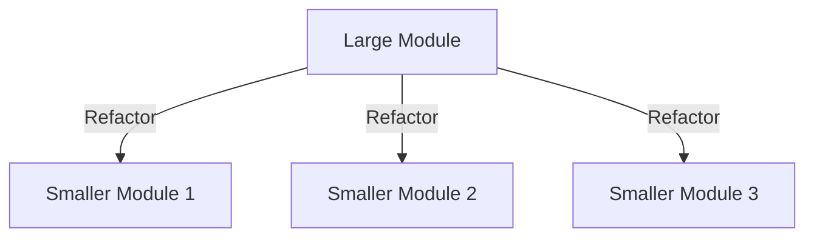
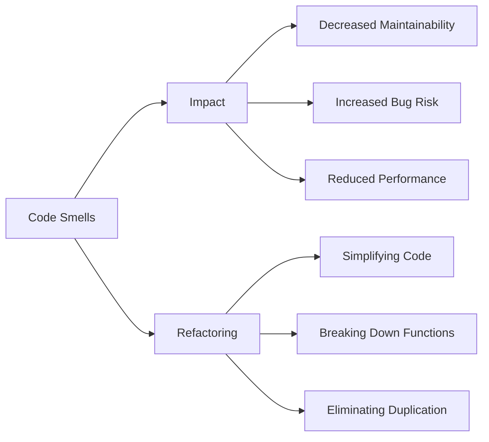

## 27.9. Code Smells in Elixir

In the world of software development, code smells are indicators of potential problems in the codebase that may hinder maintainability and increase the likelihood of bugs. In Elixir, a functional programming language known for its concurrency and fault-tolerance features, identifying and addressing code smells is crucial for building robust applications. This section will guide you through the common code smells in Elixir, their impact, and strategies for refactoring to improve code quality.

### Identifying Code Smells

Code smells are often subtle and can manifest in various forms. In Elixir, some common signs of code smells include:

- **Large Modules**: Modules that contain too much functionality, making them difficult to understand and maintain.
- **Duplicated Code**: Repeated code blocks that violate the DRY (Don't Repeat Yourself) principle.
- **Complex Functions**: Functions that are too long or have too many responsibilities.
- **Inconsistent Naming**: Variable and function names that do not clearly convey their purpose.
- **Excessive Use of Macros**: Over-reliance on macros can lead to code that is hard to read and debug.
- **Improper Use of Pattern Matching**: Misusing pattern matching can lead to code that is difficult to follow and maintain.

#### Large Modules

Large modules are a common code smell in Elixir. They often indicate that a module is doing too much and should be broken down into smaller, more focused modules. This can be visualized as follows:



**Impact**: Large modules can lead to code that is difficult to navigate and understand. They increase the cognitive load on developers and make it harder to identify and fix bugs.

**Refactoring Strategy**: Break down large modules into smaller, more focused modules. Each module should have a single responsibility and a clear purpose. Use Elixir's module system to organize related functions and data structures logically.

#### Duplicated Code

Duplicated code is another common code smell that can lead to maintenance challenges. It occurs when the same code logic is repeated in multiple places.

**Impact**: Duplicated code increases the risk of bugs because changes need to be made in multiple places. It also makes the codebase larger and more difficult to understand.

**Refactoring Strategy**: Identify duplicated code and extract it into a separate function or module. Use Elixir's powerful function abstraction capabilities to create reusable components.

```elixir
# Before refactoring
defmodule Example do
  def calculate_area(radius) do
    3.14 * radius * radius
  end

  def calculate_circumference(radius) do
    2 * 3.14 * radius
  end
end

# After refactoring
defmodule Circle do
  def area(radius) do
    pi() * radius * radius
  end

  def circumference(radius) do
    2 * pi() * radius
  end

  defp pi, do: 3.14
end
```

#### Complex Functions

Functions that are too long or have too many responsibilities are considered complex. They are difficult to test and maintain.

**Impact**: Complex functions can lead to bugs and make the codebase harder to understand. They often violate the Single Responsibility Principle.

**Refactoring Strategy**: Break down complex functions into smaller, more focused functions. Each function should perform a single task and have a clear purpose.

```elixir
# Before refactoring
defmodule Order do
  def process(order) do
    validate(order)
    |> calculate_total()
    |> apply_discount()
    |> finalize_order()
  end
end

# After refactoring
defmodule Order do
  def process(order) do
    order
    |> validate()
    |> calculate_total()
    |> apply_discount()
    |> finalize_order()
  end

  defp validate(order), do: # validation logic
  defp calculate_total(order), do: # total calculation logic
  defp apply_discount(order), do: # discount application logic
  defp finalize_order(order), do: # finalization logic
end
```

#### Inconsistent Naming

Inconsistent naming can lead to confusion and make the codebase harder to understand. Names should clearly convey the purpose of variables and functions.

**Impact**: Inconsistent naming can lead to misunderstandings and errors. It makes the codebase less readable and maintainable.

**Refactoring Strategy**: Use descriptive and consistent naming conventions throughout the codebase. Follow Elixir's naming conventions for modules, functions, and variables.

#### Excessive Use of Macros

Macros are a powerful feature in Elixir, but excessive use can lead to code that is difficult to read and debug.

**Impact**: Overusing macros can make the codebase complex and hard to maintain. It can also lead to unexpected behavior if not used carefully.

**Refactoring Strategy**: Use macros sparingly and only when necessary. Prefer functions over macros for most use cases. Ensure that macros are well-documented and tested.

#### Improper Use of Pattern Matching

Pattern matching is a powerful feature in Elixir, but improper use can lead to code that is difficult to follow and maintain.

**Impact**: Misusing pattern matching can lead to bugs and make the codebase harder to understand. It can also lead to performance issues if not used correctly.

**Refactoring Strategy**: Use pattern matching judiciously and ensure that patterns are clear and concise. Avoid complex patterns that are difficult to understand.

### Impact of Code Smells

Code smells can have a significant impact on the quality of a software project. They can lead to:

- **Decreased Maintainability**: Code smells make the codebase harder to understand and modify, leading to increased maintenance costs.
- **Increased Bug Risk**: Code smells can introduce bugs and make it harder to identify and fix them.
- **Reduced Performance**: Some code smells can lead to performance issues, such as inefficient algorithms or excessive memory usage.

### Refactoring Code Smells

Refactoring is the process of improving the structure of code without changing its external behavior. It is an essential practice for addressing code smells and improving code quality.

#### Simplifying Code

Simplifying code involves removing unnecessary complexity and making the codebase easier to understand and maintain.

**Strategies for Simplification**:
- Use Elixir's powerful abstractions, such as functions and modules, to encapsulate complexity.
- Follow the Single Responsibility Principle to ensure that each module and function has a clear purpose.
- Use descriptive naming conventions to make the code self-explanatory.

#### Breaking Down Functions

Breaking down functions involves dividing complex functions into smaller, more focused functions.

**Benefits**:
- Smaller functions are easier to test and maintain.
- They promote code reuse and reduce duplication.
- They make the codebase more modular and easier to understand.

#### Eliminating Duplication

Eliminating duplication involves identifying and removing repeated code blocks.

**Techniques**:
- Extract common logic into reusable functions or modules.
- Use Elixir's powerful pattern matching and function abstraction capabilities to create flexible and reusable components.

### Try It Yourself

To reinforce your understanding of code smells and refactoring in Elixir, try the following exercises:

1. **Identify Code Smells**: Review a codebase and identify instances of code smells, such as large modules, duplicated code, and complex functions.

2. **Refactor a Module**: Choose a module with identified code smells and refactor it to improve its structure and maintainability.

3. **Experiment with Pattern Matching**: Write functions that use pattern matching effectively and refactor any complex patterns to improve readability.

### Visualizing Code Smells

To better understand the impact of code smells, consider the following diagram that illustrates the relationship between code smells, their impact, and refactoring strategies:



### References and Links

For further reading on code smells and refactoring, consider the following resources:

- [Refactoring: Improving the Design of Existing Code](https://martinfowler.com/books/refactoring.html) by Martin Fowler
- [Elixir School: Pattern Matching](https://elixirschool.com/en/lessons/basics/pattern_matching/)
- [Elixir Documentation](https://elixir-lang.org/docs.html)

### Knowledge Check

To test your understanding of code smells in Elixir, consider the following questions:

1. What are some common signs of code smells in Elixir?
2. How can large modules impact the maintainability of a codebase?
3. What strategies can be used to refactor duplicated code?
4. Why is it important to use consistent naming conventions in a codebase?
5. How can excessive use of macros affect the readability of code?

### Embrace the Journey

Remember, identifying and refactoring code smells is an ongoing process. As you gain experience, you'll become more adept at recognizing and addressing these issues, leading to cleaner, more maintainable code. Keep experimenting, stay curious, and enjoy the journey!

## Quiz: Code Smells in Elixir



### Which of the following is a common code smell in Elixir?

- [x] Large modules
- [ ] Small functions
- [ ] Consistent naming
- [ ] Efficient algorithms

> **Explanation:** Large modules are a common code smell because they often contain too much functionality, making them difficult to maintain.

### What is the impact of duplicated code in a codebase?

- [x] Increased risk of bugs
- [ ] Improved performance
- [ ] Easier maintenance
- [ ] Reduced code size

> **Explanation:** Duplicated code increases the risk of bugs because changes need to be made in multiple places.

### How can complex functions affect a codebase?

- [x] They make the code harder to understand
- [ ] They improve code readability
- [ ] They reduce the need for documentation
- [ ] They enhance performance

> **Explanation:** Complex functions are difficult to understand and maintain, leading to a harder-to-read codebase.

### What is a recommended strategy for refactoring large modules?

- [x] Break them down into smaller, focused modules
- [ ] Combine them into a single module
- [ ] Add more functions to them
- [ ] Ignore them

> **Explanation:** Breaking down large modules into smaller, focused modules improves maintainability and readability.

### Why is consistent naming important in a codebase?

- [x] It improves readability and understanding
- [ ] It reduces code size
- [ ] It enhances performance
- [ ] It increases complexity

> **Explanation:** Consistent naming improves readability and understanding, making the codebase easier to navigate.

### What is the impact of excessive use of macros in Elixir?

- [x] It makes the code harder to read and debug
- [ ] It simplifies the codebase
- [ ] It improves performance
- [ ] It reduces complexity

> **Explanation:** Excessive use of macros can make the code harder to read and debug, leading to a more complex codebase.

### How can pattern matching be misused in Elixir?

- [x] By creating complex patterns that are hard to understand
- [ ] By using it for simple conditions
- [ ] By avoiding it altogether
- [ ] By using it only in functions

> **Explanation:** Creating complex patterns that are hard to understand can lead to misuse of pattern matching.

### What is a benefit of breaking down complex functions?

- [x] Easier testing and maintenance
- [ ] Increased complexity
- [ ] Reduced readability
- [ ] Larger codebase

> **Explanation:** Breaking down complex functions into smaller ones makes them easier to test and maintain.

### What is the purpose of refactoring code smells?

- [x] To improve code quality and maintainability
- [ ] To increase code size
- [ ] To add more features
- [ ] To reduce performance

> **Explanation:** Refactoring code smells improves code quality and maintainability, making the codebase easier to work with.

### True or False: Code smells always indicate a bug in the code.

- [ ] True
- [x] False

> **Explanation:** Code smells do not always indicate a bug, but they are indicators of potential problems that may lead to bugs.




