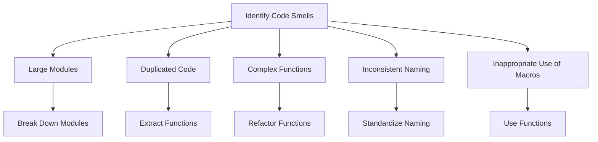

## 27.9. Code Smells in Elixir

In the world of software engineering, code smells refer to symptoms in the code that may indicate deeper problems. While not bugs themselves, they can lead to decreased maintainability, increased risk of bugs, and reduced readability. In Elixir, a functional programming language known for its concurrency and fault tolerance, identifying and addressing these code smells is crucial for building robust applications. In this section, we will explore common code smells in Elixir, their impacts, and strategies for refactoring them.

### Identifying Code Smells

Before we dive into specific code smells, it's important to understand the general signs that may indicate a problem in your Elixir codebase. These signs include:

- **Large Modules**: Modules that contain too much functionality can be difficult to understand and maintain.
- **Duplicated Code**: Repeated code across the application can lead to inconsistencies and make updates cumbersome.
- **Complex Functions**: Functions that are too long or have too many responsibilities can be hard to test and understand.
- **Inconsistent Naming**: Using inconsistent naming conventions can confuse developers and lead to misunderstandings.
- **Inappropriate Use of Macros**: Overusing macros can make the codebase harder to understand and maintain.

Let's explore these code smells in more detail, along with examples and refactoring techniques.

### Large Modules

Large modules often indicate that a module is doing too much. This can make the code difficult to navigate and understand, and it can also lead to tight coupling between different parts of the codebase.

#### Example of a Large Module

```elixir
defmodule UserManager do
  def create_user(params) do
    # logic to create user
  end

  def delete_user(user_id) do
    # logic to delete user
  end

  def update_user(user_id, params) do
    # logic to update user
  end

  def list_users do
    # logic to list users
  end

  def authenticate_user(username, password) do
    # logic to authenticate user
  end

  def reset_password(user_id) do
    # logic to reset password
  end
end
```

#### Refactoring Large Modules

To refactor a large module, consider breaking it down into smaller, more focused modules. For example, you might separate user authentication from user management.

```elixir
defmodule UserManagement do
  def create_user(params), do: # logic to create user
  def delete_user(user_id), do: # logic to delete user
  def update_user(user_id, params), do: # logic to update user
  def list_users, do: # logic to list users
end

defmodule UserAuthentication do
  def authenticate_user(username, password), do: # logic to authenticate user
  def reset_password(user_id), do: # logic to reset password
end
```

### Duplicated Code

Duplicated code is a common code smell that can lead to maintenance challenges. When the same logic is repeated in multiple places, it becomes difficult to update or fix bugs consistently.

#### Example of Duplicated Code

```elixir
def calculate_discount(price, discount) do
  price - (price * discount / 100)
end

def apply_discount_to_cart(cart) do
  Enum.map(cart, fn item ->
    item.price - (item.price * item.discount / 100)
  end)
end
```

#### Refactoring Duplicated Code

Identify the repeated logic and extract it into a separate function.

```elixir
defmodule DiscountCalculator do
  def calculate(price, discount) do
    price - (price * discount / 100)
  end
end

def apply_discount_to_cart(cart) do
  Enum.map(cart, fn item ->
    DiscountCalculator.calculate(item.price, item.discount)
  end)
end
```

### Complex Functions

Complex functions are those that are too long, have too many responsibilities, or contain deeply nested logic. These functions can be difficult to test and understand.

#### Example of a Complex Function

```elixir
def process_order(order) do
  if order.valid? do
    order
    |> calculate_total
    |> apply_discount
    |> send_confirmation_email
    |> update_inventory
  else
    {:error, "Invalid order"}
  end
end
```

#### Refactoring Complex Functions

Break down complex functions into smaller, more focused functions.

```elixir
def process_order(order) do
  with {:ok, total} <- calculate_total(order),
       {:ok, discounted_total} <- apply_discount(total),
       :ok <- send_confirmation_email(order),
       :ok <- update_inventory(order) do
    {:ok, discounted_total}
  else
    error -> error
  end
end
```

### Inconsistent Naming

Inconsistent naming can lead to confusion and misunderstandings among developers. It's important to establish and follow naming conventions throughout the codebase.

#### Example of Inconsistent Naming

```elixir
defmodule User do
  def create_user(params), do: # logic to create user
  def remove_user(user_id), do: # logic to remove user
end
```

#### Refactoring Inconsistent Naming

Standardize naming conventions to improve clarity and consistency.

```elixir
defmodule User do
  def create(params), do: # logic to create user
  def delete(user_id), do: # logic to delete user
end
```

### Inappropriate Use of Macros

Macros are a powerful feature in Elixir, but they can also lead to code that is difficult to understand and maintain if overused or used inappropriately.

#### Example of Inappropriate Use of Macros

```elixir
defmodule MyMacros do
  defmacro create_function(name) do
    quote do
      def unquote(name)(), do: IO.puts("Function #{unquote(name)} called")
    end
  end
end

defmodule MyModule do
  require MyMacros
  MyMacros.create_function(:hello)
  MyMacros.create_function(:goodbye)
end
```

#### Refactoring Inappropriate Use of Macros

Use functions instead of macros when possible, as they are easier to understand and maintain.

```elixir
defmodule MyModule do
  def hello, do: IO.puts("Function hello called")
  def goodbye, do: IO.puts("Function goodbye called")
end
```

### Impact of Code Smells

Code smells can have a significant impact on your codebase, including:

- **Decreased Maintainability**: Code smells can make the codebase harder to understand and maintain, leading to increased development time and cost.
- **Increased Bug Risk**: Code smells can lead to bugs and errors, as they often indicate deeper problems in the code.
- **Reduced Readability**: Code smells can make the code harder to read and understand, which can lead to misunderstandings and errors.

### Refactoring Code Smells

Refactoring is the process of improving the structure and readability of code without changing its external behavior. Here are some general strategies for refactoring code smells:

1. **Simplify Code**: Break down complex functions and modules into smaller, more focused pieces.
2. **Eliminate Duplication**: Identify and extract repeated logic into separate functions or modules.
3. **Improve Naming**: Use consistent and descriptive naming conventions throughout the codebase.
4. **Use Functions Instead of Macros**: When possible, use functions instead of macros to improve readability and maintainability.

### Visualizing Code Smells and Refactoring

To help visualize the process of identifying and refactoring code smells, let's use a Mermaid.js flowchart:


```mermaid
flowchart TD
    A[Identify Code Smells] --> B[Large Modules]
    A --> C[Duplicated Code]
    A --> D[Complex Functions]
    A --> E[Inconsistent Naming]
    A --> F[Inappropriate Use of Macros]
    B --> G[Break Down Modules]
    C --> H[Extract Functions]
    D --> I[Refactor Functions]
    E --> J[Standardize Naming]
    F --> K[Use Functions]
```

This flowchart illustrates the process of identifying common code smells and the corresponding refactoring strategies.

### Try It Yourself

To reinforce your understanding of code smells and refactoring in Elixir, try modifying the provided code examples. For instance, you can:

- Break down a large module into smaller modules.
- Extract duplicated logic into a separate function.
- Refactor a complex function using the `with` construct.
- Standardize naming conventions in a codebase.
- Replace macros with functions where applicable.

### References and Links

For further reading on code smells and refactoring, consider the following resources:

- [Refactoring: Improving the Design of Existing Code](https://martinfowler.com/books/refactoring.html) by Martin Fowler
- [Elixir School: Refactoring](https://elixirschool.com/en/lessons/advanced/refactoring/)
- [Code Smells](https://en.wikipedia.org/wiki/Code_smell) on Wikipedia

### Knowledge Check

To test your understanding of code smells and refactoring in Elixir, consider the following questions:

1. What are some common signs of code smells in Elixir?
2. How can large modules be refactored to improve maintainability?
3. What is the impact of duplicated code on a codebase?
4. How can complex functions be simplified?
5. Why is consistent naming important in a codebase?

### Embrace the Journey

Remember, identifying and refactoring code smells is an ongoing process that requires vigilance and attention to detail. As you continue to develop your skills in Elixir, you'll become more adept at recognizing and addressing these issues, leading to cleaner, more maintainable code. Keep experimenting, stay curious, and enjoy the journey!

## Quiz Time!



### What is a common sign of a code smell in Elixir?

- [x] Large modules
- [ ] Use of the pipe operator
- [ ] Use of pattern matching
- [ ] Small functions

> **Explanation:** Large modules can indicate that a module is doing too much, making it difficult to maintain.

### How can duplicated code be refactored?

- [x] By extracting repeated logic into a separate function
- [ ] By adding more comments
- [ ] By using macros
- [ ] By increasing module size

> **Explanation:** Extracting repeated logic into a separate function reduces duplication and improves maintainability.

### What is a potential impact of code smells?

- [x] Decreased maintainability
- [ ] Increased readability
- [ ] Improved performance
- [ ] Enhanced security

> **Explanation:** Code smells can make the codebase harder to understand and maintain, leading to decreased maintainability.

### Which refactoring strategy can be used for complex functions?

- [x] Breaking down into smaller functions
- [ ] Adding more comments
- [ ] Using macros
- [ ] Increasing function length

> **Explanation:** Breaking down complex functions into smaller, more focused functions improves readability and maintainability.

### Why is consistent naming important?

- [x] It improves clarity and reduces misunderstandings
- [ ] It increases code execution speed
- [ ] It enhances security
- [ ] It reduces memory usage

> **Explanation:** Consistent naming improves clarity and reduces misunderstandings among developers.

### What is a drawback of overusing macros?

- [x] It can make the code harder to understand
- [ ] It increases performance
- [ ] It simplifies code
- [ ] It enhances readability

> **Explanation:** Overusing macros can make the codebase harder to understand and maintain.

### How can large modules be refactored?

- [x] By breaking them down into smaller, focused modules
- [ ] By adding more functions
- [ ] By using macros
- [ ] By increasing module size

> **Explanation:** Breaking down large modules into smaller, more focused modules improves maintainability.

### What is a benefit of using functions instead of macros?

- [x] Improved readability and maintainability
- [ ] Increased performance
- [ ] Enhanced security
- [ ] Reduced memory usage

> **Explanation:** Functions are generally easier to understand and maintain compared to macros.

### What is the purpose of refactoring?

- [x] To improve the structure and readability of code
- [ ] To increase code execution speed
- [ ] To enhance security
- [ ] To reduce memory usage

> **Explanation:** Refactoring aims to improve the structure and readability of code without changing its external behavior.

### True or False: Code smells are bugs in the code.

- [ ] True
- [x] False

> **Explanation:** Code smells are not bugs themselves but symptoms that may indicate deeper problems in the code.


