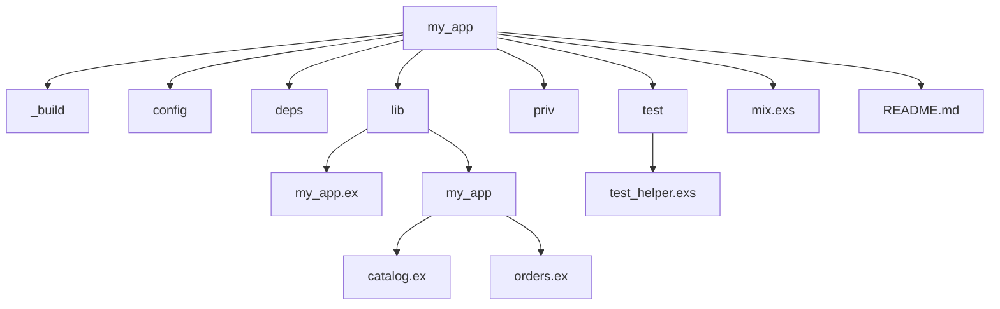

## 28.1. Project Structure and Organization

In the world of software development, a well-structured project is akin to a well-organized library. It allows developers to navigate the codebase efficiently, understand the flow of the application, and make modifications with confidence. In Elixir, a language known for its concurrency and functional programming paradigms, structuring your project effectively is crucial to harnessing its full potential. This section will guide you through best practices for organizing Elixir projects, ensuring they are maintainable, scalable, and easy to navigate.

### Consistent Structure

A consistent project structure is the foundation of any successful software project. It provides a predictable layout that helps developers quickly locate files and understand the project's architecture. In Elixir, adhering to standard conventions for directories and files is essential.

#### Standard Directory Layout

Elixir projects typically follow a standard directory layout, which is automatically generated when you create a new project using Mix, Elixir's build tool. Here's a typical structure:

```
my_app/
├── _build/          # Compiled files
├── config/          # Configuration files
├── deps/            # Dependencies
├── lib/             # Application code
│   ├── my_app.ex    # Main application module
│   └── my_app/      # Submodules
├── priv/            # Static assets and other resources
├── test/            # Test files
│   └── test_helper.exs
├── mix.exs          # Mix project file
└── README.md        # Project documentation
```

- **_build/**: Contains compiled files and artifacts. This directory is managed by Mix and should not be manually altered.
- **config/**: Holds configuration files, typically `config.exs`, which define environment-specific settings.
- **deps/**: Stores dependencies fetched by Mix. Like `_build/`, this directory is managed automatically.
- **lib/**: The heart of your application, where all the source code resides. This directory should be organized into modules and submodules.
- **priv/**: Used for static assets, such as images or database seeds, that need to be included in the release.
- **test/**: Contains test files, following the same structure as `lib/` to mirror the application code.

#### Module Organization

Organizing modules effectively is crucial for maintaining a clean and understandable codebase. In Elixir, modules are the primary building blocks, and grouping related functionalities together enhances readability and maintainability.

##### Grouping Related Functionalities

Modules should be organized by functionality or domain. For instance, if you're building an e-commerce application, you might have modules like `MyApp.Catalog`, `MyApp.Orders`, and `MyApp.Users`. Each module should encapsulate a specific aspect of the application's functionality.

```elixir
# lib/my_app/catalog.ex
defmodule MyApp.Catalog do
  # Functions related to product catalog
end

# lib/my_app/orders.ex
defmodule MyApp.Orders do
  # Functions related to order processing
end

# lib/my_app/users.ex
defmodule MyApp.Users do
  # Functions related to user management
end
```

##### Using Contexts

Contexts are a way to group related modules and functions under a single namespace. They provide a boundary around a particular domain or feature, making it easier to manage and understand the codebase. For example, in a blog application, you might have a `Blog` context that encompasses posts, comments, and tags.

```elixir
# lib/my_app/blog.ex
defmodule MyApp.Blog do
  alias MyApp.Blog.{Post, Comment, Tag}

  # Functions to manage blog posts
  def list_posts do
    # ...
  end

  # Functions to manage comments
  def list_comments do
    # ...
  end

  # Functions to manage tags
  def list_tags do
    # ...
  end
end
```

### Advantages of a Well-Organized Project

A well-organized project structure offers numerous advantages, including simplified navigation, enhanced comprehension, and improved collaboration among team members.

#### Simplifies Navigation

A consistent structure allows developers to quickly locate files and understand the project's architecture. This is especially important in large projects where the codebase can become unwieldy. By following standard conventions, developers can easily navigate the project and find the code they need to work on.

#### Enhances Comprehension

Organizing code into modules and contexts helps developers understand the relationships between different parts of the application. It provides a clear separation of concerns, making it easier to reason about the code and identify potential areas for improvement.

#### Improves Collaboration

A well-structured project facilitates collaboration among team members. It provides a common understanding of the project's architecture, making it easier for new developers to onboard and contribute effectively. By adhering to standard conventions, teams can avoid confusion and reduce the likelihood of errors.

### Code Examples

Let's explore some code examples that demonstrate how to structure an Elixir project effectively.

#### Example 1: Organizing Modules

In this example, we'll organize a simple e-commerce application into modules and contexts.

```elixir
# lib/my_app.ex
defmodule MyApp do
  use Application

  def start(_type, _args) do
    children = [
      # Define workers and child supervisors to be supervised
    ]

    opts = [strategy: :one_for_one, name: MyApp.Supervisor]
    Supervisor.start_link(children, opts)
  end
end

# lib/my_app/catalog.ex
defmodule MyApp.Catalog do
  alias MyApp.Catalog.Product

  def list_products do
    # Fetch products from the database
  end

  def get_product(id) do
    # Fetch a single product by ID
  end
end

# lib/my_app/orders.ex
defmodule MyApp.Orders do
  alias MyApp.Orders.Order

  def create_order(attrs) do
    # Create a new order
  end

  def list_orders do
    # List all orders
  end
end
```

#### Example 2: Using Contexts

In this example, we'll use contexts to group related functionalities in a blog application.

```elixir
# lib/my_app/blog.ex
defmodule MyApp.Blog do
  alias MyApp.Blog.{Post, Comment, Tag}

  def list_posts do
    # List all blog posts
  end

  def get_post(id) do
    # Get a single blog post by ID
  end

  def create_post(attrs) do
    # Create a new blog post
  end

  def list_comments(post_id) do
    # List comments for a specific post
  end
end

# lib/my_app/blog/post.ex
defmodule MyApp.Blog.Post do
  defstruct [:id, :title, :content, :author_id]

  # Functions related to blog posts
end

# lib/my_app/blog/comment.ex
defmodule MyApp.Blog.Comment do
  defstruct [:id, :content, :post_id, :author_id]

  # Functions related to comments
end
```

### Visualizing Project Structure

To better understand the organization of an Elixir project, let's visualize the directory structure using a Mermaid.js diagram.



This diagram illustrates the hierarchical structure of a typical Elixir project, highlighting the key directories and files.

### References and Links

For further reading on Elixir project structure and organization, consider exploring the following resources:

- [Elixir Getting Started Guide](https://elixir-lang.org/getting-started/introduction.html)
- [Mix and OTP Guide](https://elixir-lang.org/getting-started/mix-otp/introduction-to-mix.html)
- [Elixir School: Basics](https://elixirschool.com/en/lessons/basics/basics/)

### Knowledge Check

To reinforce your understanding of Elixir project structure and organization, consider the following questions:

1. What are the benefits of a consistent project structure in Elixir?
2. How do contexts help in organizing an Elixir project?
3. What is the purpose of the `priv/` directory in an Elixir project?
4. How can you use modules to group related functionalities in Elixir?

### Embrace the Journey

Remember, mastering project structure and organization in Elixir is a journey. As you gain experience, you'll develop your own best practices and conventions that suit your team's needs. Keep experimenting, stay curious, and enjoy the process of building robust and maintainable Elixir applications.

### Quiz: Project Structure and Organization



### What is the primary purpose of the `lib/` directory in an Elixir project?

- [x] To store application source code
- [ ] To store configuration files
- [ ] To store compiled files
- [ ] To store static assets

> **Explanation:** The `lib/` directory is where all the application source code resides.

### How do contexts help in organizing an Elixir project?

- [x] By grouping related functionalities under a single namespace
- [ ] By storing static assets
- [ ] By managing dependencies
- [ ] By compiling code

> **Explanation:** Contexts group related functionalities under a single namespace, providing a boundary around a particular domain or feature.

### What is the role of the `config/` directory in an Elixir project?

- [x] To hold configuration files
- [ ] To store application source code
- [ ] To store test files
- [ ] To store dependencies

> **Explanation:** The `config/` directory holds configuration files, typically defining environment-specific settings.

### Which directory is automatically managed by Mix and should not be manually altered?

- [x] `_build/`
- [ ] `lib/`
- [ ] `priv/`
- [ ] `test/`

> **Explanation:** The `_build/` directory contains compiled files and artifacts and is managed by Mix.

### What is the purpose of the `priv/` directory in an Elixir project?

- [x] To store static assets and other resources
- [ ] To store application source code
- [ ] To store test files
- [ ] To store dependencies

> **Explanation:** The `priv/` directory is used for static assets and other resources that need to be included in the release.

### How can modules be organized in an Elixir project?

- [x] By functionality or domain
- [ ] By file size
- [ ] By alphabetical order
- [ ] By creation date

> **Explanation:** Modules should be organized by functionality or domain to enhance readability and maintainability.

### What is the advantage of a well-organized project structure?

- [x] Simplifies navigation and enhances comprehension
- [ ] Increases file size
- [ ] Reduces code readability
- [ ] Complicates collaboration

> **Explanation:** A well-organized project structure simplifies navigation, enhances comprehension, and improves collaboration among team members.

### What is the role of the `mix.exs` file in an Elixir project?

- [x] To define the Mix project configuration
- [ ] To store application source code
- [ ] To hold test files
- [ ] To store static assets

> **Explanation:** The `mix.exs` file defines the Mix project configuration, including dependencies and build settings.

### What is the purpose of the `test/` directory in an Elixir project?

- [x] To contain test files
- [ ] To store application source code
- [ ] To hold configuration files
- [ ] To store static assets

> **Explanation:** The `test/` directory contains test files, following the same structure as `lib/` to mirror the application code.

### True or False: The `deps/` directory is where you should manually add dependencies.

- [ ] True
- [x] False

> **Explanation:** The `deps/` directory is managed by Mix and should not be manually altered.



By following these best practices for project structure and organization in Elixir, you'll be well-equipped to build scalable, maintainable, and efficient applications. Keep exploring, learning, and refining your skills as you continue your journey in the world of Elixir development.
