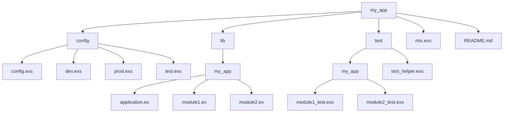

## 28.1. Project Structure and Organization

In the world of software development, especially in functional programming languages like Elixir, having a well-organized project structure is paramount. It not only enhances code readability and maintainability but also facilitates collaboration among team members. In this section, we will delve into the best practices for structuring and organizing Elixir projects, focusing on consistent directory structures, module organization, and the benefits of adhering to standard conventions.

### Consistent Structure

A consistent project structure is the backbone of any well-organized codebase. It provides a predictable layout that makes it easier for developers to navigate and understand the project, reducing the cognitive load when switching between different parts of the code.

#### Standard Directory Layout

Elixir projects typically follow a conventional directory layout, which is reinforced by tools like Mix. Here's a typical structure for an Elixir application:

```
my_app/
├── config/
│   ├── config.exs
│   ├── dev.exs
│   ├── prod.exs
│   └── test.exs
├── lib/
│   ├── my_app/
│   │   ├── application.ex
│   │   ├── module1.ex
│   │   └── module2.ex
│   └── my_app.ex
├── test/
│   ├── my_app/
│   │   ├── module1_test.exs
│   │   └── module2_test.exs
│   └── test_helper.exs
├── mix.exs
└── README.md
```

- **`config/`**: Contains configuration files for different environments (development, production, test).
- **`lib/`**: The main source directory where the application code resides. Each module typically has its own file.
- **`test/`**: Contains test files. Each module in `lib/` should have a corresponding test file.
- **`mix.exs`**: The Mix build file, which defines project configuration and dependencies.
- **`README.md`**: A markdown file for project documentation.

#### Benefits of a Consistent Structure

- **Simplifies Navigation**: Developers can easily find files and understand the project layout.
- **Facilitates Onboarding**: New team members can quickly get up to speed with the project.
- **Enhances Collaboration**: A common structure reduces misunderstandings and errors in team environments.

### Module Organization

Modules are the building blocks of Elixir applications. Proper organization of modules is crucial for maintaining a clean and scalable codebase.

#### Grouping Related Functionalities

Modules should be organized in a way that groups related functionalities together. This can be achieved by:

- **Namespace Hierarchies**: Use namespaces to logically group related modules. For example, if you have a module handling user authentication, it might be grouped under `MyApp.Auth`.
- **Functional Segmentation**: Divide modules based on their functionality, such as controllers, services, and repositories.

#### Example of Module Organization

```elixir
defmodule MyApp.Auth.User do
  defstruct [:id, :name, :email]

  def create_user(attrs) do
    # Implementation for creating a user
  end
end

defmodule MyApp.Auth.Session do
  def login(credentials) do
    # Implementation for user login
  end

  def logout(user) do
    # Implementation for user logout
  end
end
```

In this example, `MyApp.Auth` serves as a namespace for authentication-related modules, such as `User` and `Session`.

#### Advantages of Proper Module Organization

- **Improves Code Readability**: Grouping related functionalities makes the codebase easier to read and understand.
- **Enhances Maintainability**: Changes to one part of the system are less likely to affect unrelated parts.
- **Facilitates Reusability**: Well-organized modules can be easily reused across different projects.

### Advantages of Following Standard Conventions

Adhering to standard conventions in project structure and module organization offers several benefits:

- **Consistency Across Projects**: Following conventions ensures consistency across different projects, making it easier for developers to switch between them.
- **Leverages Community Tools and Libraries**: Many tools and libraries in the Elixir ecosystem are designed to work with standard project structures.
- **Simplifies Integration**: Standard conventions simplify the integration of external tools, such as CI/CD pipelines and testing frameworks.

### Code Example: Implementing a Consistent Structure

Let's implement a simple Elixir project with a consistent structure and organized modules.

```elixir
# lib/my_app.ex
defmodule MyApp do
  use Application

  def start(_type, _args) do
    children = [
      # List of supervised children
    ]

    opts = [strategy: :one_for_one, name: MyApp.Supervisor]
    Supervisor.start_link(children, opts)
  end
end

# lib/my_app/auth/user.ex
defmodule MyApp.Auth.User do
  defstruct [:id, :name, :email]

  def create_user(attrs) do
    # Implementation for creating a user
  end
end

# lib/my_app/auth/session.ex
defmodule MyApp.Auth.Session do
  def login(credentials) do
    # Implementation for user login
  end

  def logout(user) do
    # Implementation for user logout
  end
end

# test/my_app/auth/user_test.exs
defmodule MyApp.Auth.UserTest do
  use ExUnit.Case, async: true

  test "create_user/1 creates a new user" do
    attrs = %{name: "Jane Doe", email: "jane@example.com"}
    user = MyApp.Auth.User.create_user(attrs)
    assert user.name == "Jane Doe"
  end
end

# test/my_app/auth/session_test.exs
defmodule MyApp.Auth.SessionTest do
  use ExUnit.Case, async: true

  test "login/1 logs in a user" do
    credentials = %{email: "jane@example.com", password: "secret"}
    assert MyApp.Auth.Session.login(credentials) == :ok
  end
end
```

### Visualizing Project Structure

To better understand the organization of an Elixir project, let's visualize the directory structure using a Mermaid.js diagram.


```mermaid
graph TD;
    A[my_app] --> B[config]
    A --> C[lib]
    A --> D[test]
    A --> E[mix.exs]
    A --> F[README.md]
    B --> B1[config.exs]
    B --> B2[dev.exs]
    B --> B3[prod.exs]
    B --> B4[test.exs]
    C --> C1[my_app]
    C1 --> C2[application.ex]
    C1 --> C3[module1.ex]
    C1 --> C4[module2.ex]
    D --> D1[my_app]
    D1 --> D2[module1_test.exs]
    D1 --> D3[module2_test.exs]
    D --> D4[test_helper.exs]
```

### Try It Yourself

Encourage readers to experiment with the project structure by suggesting modifications:

- **Add a New Module**: Create a new module under `MyApp.Auth` for handling password resets.
- **Refactor Existing Code**: Move some functions from `MyApp.Auth.Session` to a new module `MyApp.Auth.Token`.

### References and Links

For further reading on Elixir project structure and organization, consider the following resources:

- [Elixir Getting Started Guide](https://elixir-lang.org/getting-started/introduction.html)
- [Mix and OTP Guide](https://elixir-lang.org/getting-started/mix-otp/introduction-to-mix.html)
- [Elixir School - Basics](https://elixirschool.com/en/lessons/basics/basics/)

### Knowledge Check

- **What are the benefits of a consistent project structure in Elixir?**
- **How can modules be organized to improve code readability?**
- **What are the advantages of following standard conventions in Elixir projects?**

### Embrace the Journey

Remember, mastering project structure and organization is just the beginning. As you progress, you'll build more complex and scalable applications. Keep experimenting, stay curious, and enjoy the journey!

### Quiz Time!



### What is the primary benefit of a consistent project structure in Elixir?

- [x] Simplifies navigation and comprehension for all team members
- [ ] Increases code execution speed
- [ ] Reduces the need for documentation
- [ ] Eliminates the need for testing

> **Explanation:** A consistent project structure simplifies navigation and comprehension, making it easier for team members to understand and work with the codebase.

### How are modules typically organized in an Elixir project?

- [x] By grouping related functionalities
- [ ] By file size
- [ ] By alphabetical order
- [ ] By developer name

> **Explanation:** Modules are typically organized by grouping related functionalities, which enhances code readability and maintainability.

### What is a common directory found in Elixir projects?

- [x] `lib/`
- [ ] `src/`
- [ ] `bin/`
- [ ] `dist/`

> **Explanation:** The `lib/` directory is a common directory in Elixir projects where the main source code resides.

### What is the purpose of the `mix.exs` file in an Elixir project?

- [x] To define project configuration and dependencies
- [ ] To store environment variables
- [ ] To contain test cases
- [ ] To hold application logs

> **Explanation:** The `mix.exs` file is used to define project configuration and dependencies in an Elixir project.

### Which of the following is a benefit of following standard conventions in Elixir projects?

- [x] Consistency across projects
- [ ] Increased file size
- [ ] Reduced code readability
- [ ] Decreased performance

> **Explanation:** Following standard conventions ensures consistency across projects, making it easier for developers to switch between them.

### What can be visualized using a Mermaid.js diagram in the context of Elixir project structure?

- [x] Directory structure
- [ ] Code execution flow
- [ ] Database schema
- [ ] User interface design

> **Explanation:** A Mermaid.js diagram can be used to visualize the directory structure of an Elixir project.

### What is the role of the `config/` directory in an Elixir project?

- [x] To contain configuration files for different environments
- [ ] To store binary files
- [ ] To hold user data
- [ ] To manage application logs

> **Explanation:** The `config/` directory contains configuration files for different environments (development, production, test) in an Elixir project.

### What is a key advantage of proper module organization in Elixir?

- [x] Improves code readability
- [ ] Increases application size
- [ ] Reduces the need for version control
- [ ] Eliminates the need for testing

> **Explanation:** Proper module organization improves code readability, making it easier to understand and maintain.

### Which tool is commonly used for building Elixir projects?

- [x] Mix
- [ ] Maven
- [ ] Gradle
- [ ] Ant

> **Explanation:** Mix is the build tool commonly used for building Elixir projects.

### True or False: A consistent project structure eliminates the need for documentation.

- [ ] True
- [x] False

> **Explanation:** While a consistent project structure simplifies navigation and comprehension, it does not eliminate the need for documentation.


