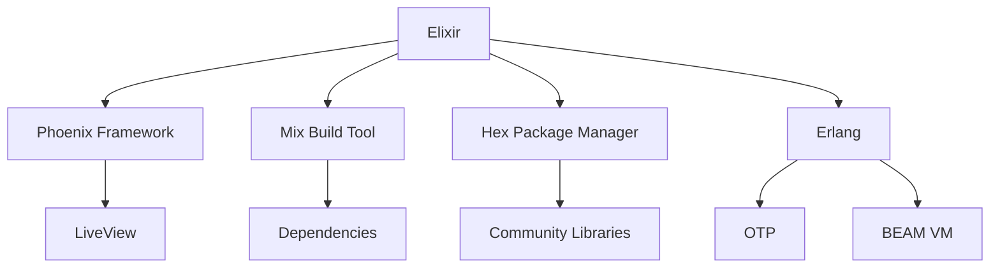

## 28.10. Keeping Up with the Elixir and Erlang Ecosystem

In the rapidly evolving world of software development, staying updated with the latest advancements in the Elixir and Erlang ecosystem is crucial for maintaining robust, efficient, and cutting-edge applications. This section provides expert developers with strategies and insights to effectively monitor releases, handle deprecations, and engage with the vibrant Elixir community.

### Monitoring Releases

Keeping track of new releases in the Elixir and Erlang ecosystem is essential for leveraging improvements, security patches, and new features. Here's how you can stay informed:

#### 1.1. Official Release Channels

- **Elixir and Erlang Websites**: Regularly visit the [Elixir](https://elixir-lang.org/) and [Erlang](https://www.erlang.org/) official websites for announcements on new releases.
- **GitHub Repositories**: Follow the [Elixir](https://github.com/elixir-lang/elixir) and [Erlang](https://github.com/erlang/otp) repositories on GitHub to receive notifications about new releases and changes.

#### 1.2. Release Notes and Changelogs

- **Review Release Notes**: Each new release comes with detailed release notes. These documents highlight new features, improvements, and bug fixes.
- **Changelogs**: Examine changelogs to understand the specific changes made in each version. This helps in assessing the impact on your projects.

#### 1.3. Automated Monitoring Tools

- **RSS Feeds**: Subscribe to RSS feeds from official sources to receive updates directly in your feed reader.
- **Version Tracking Tools**: Use tools like [Dependabot](https://dependabot.com/) or [Renovate](https://renovatebot.com/) to automate dependency updates and notifications.

#### 1.4. Upgrading to New Versions

- **Plan Upgrades**: Schedule regular intervals to review and upgrade dependencies in your projects.
- **Testing**: Ensure thorough testing of your application after upgrading to catch any breaking changes.

```elixir
# Example: Upgrading Elixir Version in mix.exs
defp elixir_version do
  "~> 1.15"
end

# Ensure you test your application thoroughly after upgrading.
```

### Deprecations

Handling deprecations is a critical aspect of maintaining a healthy codebase. As libraries and languages evolve, certain features may be deprecated in favor of better alternatives.

#### 2.1. Identifying Deprecations

- **Deprecation Warnings**: Pay attention to deprecation warnings during compilation. These warnings indicate features that will be removed in future releases.
- **Documentation**: Regularly check library documentation for deprecation notices and recommended alternatives.

#### 2.2. Refactoring Code

- **Gradual Refactoring**: Plan a phased approach to refactor code that relies on deprecated features.
- **Testing**: Implement comprehensive tests to ensure that refactoring does not introduce new bugs.

```elixir
# Example: Refactoring Deprecated Code
# Old approach using deprecated function
result = Enum.map(list, &String.to_atom/1)

# New approach using recommended alternative
result = Enum.map(list, &String.to_existing_atom/1)
```

#### 2.3. Tools for Managing Deprecations

- **Static Analysis Tools**: Use tools like [Credo](https://github.com/rrrene/credo) to identify deprecated code patterns.
- **Automated Refactoring Tools**: Explore tools that can assist in automated refactoring, reducing manual effort.

### Community Events

Engaging with the Elixir and Erlang community is invaluable for staying updated, sharing knowledge, and fostering collaboration.

#### 3.1. Conferences and Meetups

- **ElixirConf**: Attend [ElixirConf](https://elixirconf.com/), the largest conference dedicated to Elixir, to learn from industry leaders and network with peers.
- **Erlang User Conferences**: Participate in Erlang user conferences to gain insights into the latest developments in the ecosystem.
- **Local Meetups**: Join local Elixir and Erlang meetups to connect with developers in your area.

#### 3.2. Online Communities

- **Elixir Forum**: Engage with the [Elixir Forum](https://elixirforum.com/) to ask questions, share experiences, and learn from the community.
- **Slack and Discord Channels**: Join Elixir and Erlang Slack and Discord channels for real-time discussions and support.

#### 3.3. Contributing to Open Source

- **Open Source Contributions**: Contribute to open-source projects to gain deeper insights into the ecosystem and collaborate with other developers.
- **Hackathons**: Participate in hackathons to work on innovative projects and learn from others.

### Visualizing the Ecosystem

To better understand the Elixir and Erlang ecosystem, let's visualize the key components and their interactions.



**Diagram Description**: This diagram illustrates the relationship between Elixir, its core components, and the underlying Erlang ecosystem. Elixir interacts with the Phoenix Framework, Mix Build Tool, and Hex Package Manager, while Erlang provides the OTP and BEAM VM.

### Knowledge Check

- **Question**: What are the benefits of attending ElixirConf?
- **Challenge**: Refactor a piece of code in your project to remove deprecated features.

### Embrace the Journey

Remember, keeping up with the Elixir and Erlang ecosystem is an ongoing journey. By staying informed about releases, managing deprecations, and engaging with the community, you'll ensure that your skills and projects remain at the forefront of innovation. Keep experimenting, stay curious, and enjoy the journey!

### Summary

- **Monitor Releases**: Stay updated with new versions and improvements.
- **Handle Deprecations**: Refactor code to remove deprecated features.
- **Engage with the Community**: Participate in conferences, meetups, and online forums.

## Quiz: Keeping Up with the Elixir and Erlang Ecosystem



### What is a key benefit of monitoring Elixir and Erlang releases?

- [x] Access to new features and security patches
- [ ] Avoiding community engagement
- [ ] Reducing code complexity
- [ ] Eliminating the need for testing

> **Explanation:** Monitoring releases ensures you benefit from new features, improvements, and security patches.

### How can you identify deprecated features in your code?

- [x] Deprecation warnings during compilation
- [x] Checking library documentation
- [ ] Ignoring compiler messages
- [ ] Relying solely on community forums

> **Explanation:** Deprecation warnings and documentation are primary sources for identifying deprecated features.

### What is a recommended approach for handling deprecations?

- [x] Gradual refactoring
- [ ] Immediate removal without testing
- [ ] Ignoring warnings
- [ ] Relying on outdated libraries

> **Explanation:** Gradual refactoring ensures a smooth transition away from deprecated features.

### Which tool can help automate dependency updates?

- [x] Dependabot
- [ ] GitHub Issues
- [ ] Slack
- [ ] Elixir Forum

> **Explanation:** Dependabot automates dependency updates and notifications.

### What is a benefit of attending ElixirConf?

- [x] Networking with industry leaders
- [x] Learning from expert talks
- [ ] Avoiding new technologies
- [ ] Reducing project scope

> **Explanation:** ElixirConf provides opportunities for networking and learning from experts.

### How can you engage with the Elixir community online?

- [x] Elixir Forum
- [x] Slack and Discord channels
- [ ] Avoiding social media
- [ ] Ignoring online discussions

> **Explanation:** Online forums and channels are great for engaging with the community.

### What is the role of the Hex Package Manager?

- [x] Managing dependencies
- [ ] Compiling code
- [ ] Running tests
- [ ] Debugging applications

> **Explanation:** Hex is used for managing dependencies in Elixir projects.

### Why is it important to test your application after upgrading dependencies?

- [x] To catch any breaking changes
- [ ] To avoid using new features
- [ ] To reduce code size
- [ ] To eliminate testing

> **Explanation:** Testing ensures that upgrades do not introduce breaking changes.

### What is a key component of the Erlang ecosystem?

- [x] OTP
- [ ] Phoenix Framework
- [ ] Mix Build Tool
- [ ] Hex Package Manager

> **Explanation:** OTP is a core component of the Erlang ecosystem.

### True or False: Contributing to open-source projects can enhance your understanding of the Elixir ecosystem.

- [x] True
- [ ] False

> **Explanation:** Contributing to open-source projects provides insights and collaboration opportunities in the ecosystem.




