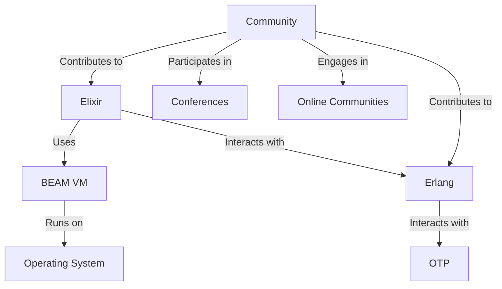

## 28.10. Keeping Up with the Elixir and Erlang Ecosystem

In the fast-paced world of software development, staying updated with the latest advancements in programming languages and their ecosystems is crucial. As an expert software engineer or architect, you must ensure that your skills and knowledge remain relevant and cutting-edge. This section will guide you through effective strategies for keeping up with the Elixir and Erlang ecosystem, focusing on monitoring releases, handling deprecations, and engaging with the community.

### Monitoring Releases

Keeping up with new releases of Elixir and Erlang is essential to take advantage of performance improvements, new features, and bug fixes. Here's how you can stay informed:

#### Understanding the Release Cycle

Elixir and Erlang follow a regular release cycle, with new versions typically released every six months. Understanding this cycle helps you anticipate when updates will become available.

- **Elixir Releases:** Elixir follows a predictable release schedule, with minor versions released every six months and patch versions as needed. Major versions are less frequent but bring significant changes.
- **Erlang Releases:** Erlang's release schedule is similar, with major releases approximately every six months.

#### Staying Informed About New Releases

- **Official Announcements:** Follow the official Elixir and Erlang websites and their respective GitHub repositories for release announcements.
- **RSS Feeds and Mailing Lists:** Subscribe to RSS feeds and mailing lists to receive notifications about new releases and updates.
- **Social Media and Forums:** Follow Elixir and Erlang communities on platforms like Twitter, Reddit, and the Elixir Forum for discussions about new releases.

#### Upgrading to New Versions

Upgrading to new versions of Elixir and Erlang ensures that your projects benefit from the latest improvements. Here's a step-by-step guide:

1. **Review the Release Notes:** Before upgrading, review the release notes to understand the changes and potential impacts on your projects.
2. **Test in a Staging Environment:** Always test new versions in a staging environment to identify any issues before deploying to production.
3. **Update Dependencies:** Ensure that all dependencies are compatible with the new version. Use tools like `mix deps.update` to manage dependencies.
4. **Monitor Performance:** After upgrading, monitor your application's performance to ensure that it meets expectations.

#### Code Example: Upgrading Elixir Version

```elixir
# Update your Elixir version in the mix.exs file
defmodule MyProject.MixProject do
  use Mix.Project

  def project do
    [
      app: :my_project,
      version: "0.1.0",
      elixir: "~> 1.15", # Update to the latest version
      start_permanent: Mix.env() == :prod,
      deps: deps()
    ]
  end

  # List your project dependencies here
  defp deps do
    [
      {:phoenix, "~> 1.6"},
      {:ecto, "~> 3.7"},
      # Add other dependencies
    ]
  end
end
```

### Deprecations

Handling deprecations is a critical aspect of maintaining a healthy codebase. As languages evolve, certain features may become deprecated, requiring you to refactor your code.

#### Identifying Deprecated Features

- **Release Notes and Documentation:** Carefully read the release notes and documentation for information about deprecated features.
- **Compiler Warnings:** Pay attention to compiler warnings, which often indicate deprecated features.

#### Refactoring Code

Refactoring code to remove deprecated features ensures compatibility with future versions and improves maintainability.

1. **Identify Deprecated Code:** Use tools like `mix xref` to identify deprecated functions and modules in your codebase.
2. **Plan the Refactoring:** Develop a plan for refactoring the deprecated code, considering the impact on your application.
3. **Implement Changes:** Gradually implement changes, testing thoroughly to ensure that the application continues to function correctly.
4. **Review and Optimize:** After refactoring, review the code for optimization opportunities.

#### Code Example: Refactoring Deprecated Code

```elixir
# Before refactoring: Using a deprecated function
defmodule MyModule do
  def old_function do
    :crypto.hash(:sha256, "data") # Deprecated in newer versions
  end
end

# After refactoring: Using the recommended alternative
defmodule MyModule do
  def new_function do
    :crypto.hash(:sha256, "data")
  end
end
```

### Community Events

Engaging with the Elixir and Erlang community is a valuable way to stay updated, share knowledge, and collaborate with other developers.

#### Conferences and Meetups

Participating in conferences and meetups provides opportunities to learn from experts, discover new tools and techniques, and network with peers.

- **ElixirConf:** The largest Elixir conference, held annually, featuring talks, workshops, and networking events.
- **Code BEAM:** A conference series focused on Erlang and Elixir, offering insights into the latest developments and best practices.
- **Local Meetups:** Join local Elixir and Erlang meetups to connect with developers in your area and participate in discussions and workshops.

#### Online Communities

Online communities offer a platform for continuous learning and collaboration.

- **Elixir Forum:** A popular forum for discussing Elixir-related topics, sharing knowledge, and seeking advice.
- **Slack and Discord Channels:** Join Elixir and Erlang channels on Slack and Discord to engage in real-time discussions with other developers.
- **GitHub:** Contribute to open-source projects on GitHub to gain experience, collaborate with others, and give back to the community.

### Try It Yourself

To solidify your understanding of keeping up with the Elixir and Erlang ecosystem, try the following exercises:

1. **Upgrade a Project:** Choose an existing Elixir project and upgrade it to the latest version. Document the process and any challenges you encounter.
2. **Refactor Deprecated Code:** Identify deprecated features in your codebase and refactor them. Share your experience with the community.
3. **Attend a Meetup:** Find a local Elixir or Erlang meetup and attend a session. Reflect on what you learned and how it can be applied to your work.

### Visualizing the Ecosystem

To better understand the Elixir and Erlang ecosystem, let's visualize the relationships between key components and community interactions.


```mermaid
graph TD;
    A[Elixir] -->|Uses| B[BEAM VM];
    A -->|Interacts with| C[Erlang];
    B -->|Runs on| D[Operating System];
    C -->|Interacts with| E[OTP];
    F[Community] -->|Contributes to| A;
    F -->|Contributes to| C;
    F -->|Participates in| G[Conferences];
    F -->|Engages in| H[Online Communities];
```

**Description:** This diagram illustrates the interactions between Elixir, Erlang, the BEAM VM, OTP, and the community. It highlights how the community contributes to and engages with the ecosystem.

### Key Takeaways

- **Stay Informed:** Regularly monitor new releases and understand the release cycle to keep your projects up-to-date.
- **Handle Deprecations:** Proactively refactor deprecated code to maintain compatibility and improve code quality.
- **Engage with the Community:** Participate in conferences, meetups, and online communities to learn, share, and collaborate.

### Embrace the Journey

Remember, staying updated with the Elixir and Erlang ecosystem is an ongoing journey. As you progress, you'll gain deeper insights into the language and its community. Keep experimenting, stay curious, and enjoy the journey!

## Quiz Time!



### What is the typical release cycle for Elixir and Erlang?

- [x] Approximately every six months
- [ ] Annually
- [ ] Every three months
- [ ] Every two years

> **Explanation:** Both Elixir and Erlang typically have a release cycle of approximately every six months.

### Which tool can be used to identify deprecated functions in your codebase?

- [x] `mix xref`
- [ ] `mix deps.get`
- [ ] `mix compile`
- [ ] `mix test`

> **Explanation:** `mix xref` is a tool that can help identify deprecated functions in your codebase.

### How can you stay informed about new Elixir releases?

- [x] Follow official announcements and subscribe to mailing lists
- [ ] Only rely on social media
- [ ] Wait for notifications from your IDE
- [ ] Check once a year

> **Explanation:** Following official announcements and subscribing to mailing lists are effective ways to stay informed about new releases.

### What is a benefit of upgrading to new versions of Elixir and Erlang?

- [x] Access to performance improvements and new features
- [ ] Increased application size
- [ ] Decreased compatibility with older systems
- [ ] More complex codebase

> **Explanation:** Upgrading to new versions provides access to performance improvements, new features, and bug fixes.

### What should you do before deploying a new version to production?

- [x] Test in a staging environment
- [ ] Directly deploy to production
- [ ] Ignore testing
- [ ] Only update dependencies

> **Explanation:** Testing in a staging environment helps identify issues before deploying to production.

### What is the purpose of community events like ElixirConf?

- [x] Learning from experts and networking with peers
- [ ] Selling products
- [ ] Avoiding new technologies
- [ ] Isolating from other developers

> **Explanation:** Community events like ElixirConf provide opportunities to learn from experts, discover new tools, and network with peers.

### How can you engage with the Elixir community online?

- [x] Join forums, Slack, and Discord channels
- [ ] Only read blogs
- [ ] Avoid social media
- [ ] Limit interactions to email

> **Explanation:** Joining forums, Slack, and Discord channels allows for real-time discussions and engagement with the community.

### What is a key benefit of refactoring deprecated code?

- [x] Improved maintainability and future compatibility
- [ ] Increased complexity
- [ ] Reduced performance
- [ ] More bugs

> **Explanation:** Refactoring deprecated code improves maintainability and ensures future compatibility.

### Which of the following is a recommended practice when upgrading Elixir versions?

- [x] Review release notes and update dependencies
- [ ] Ignore release notes
- [ ] Skip dependency updates
- [ ] Deploy without testing

> **Explanation:** Reviewing release notes and updating dependencies are essential steps in the upgrade process.

### True or False: Engaging with the community is not important for staying updated with Elixir and Erlang.

- [ ] True
- [x] False

> **Explanation:** Engaging with the community is crucial for staying updated, sharing knowledge, and collaborating with other developers.


