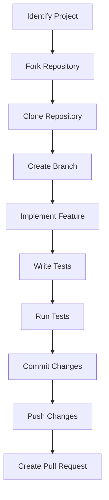

## 28.11. Contributing to Open Source Projects

Contributing to open source projects is a rewarding endeavor that not only enhances your skills as a developer but also allows you to give back to the community. As an Elixir developer, engaging with open source projects can help you deepen your understanding of the language, collaborate with other experts, and contribute to the growth of the Elixir ecosystem. In this section, we will explore the benefits of contributing to open source, how to find suitable projects, and best practices for making meaningful contributions.

### Benefits of Contribution

Contributing to open source projects offers numerous benefits that extend beyond personal growth. Here are some key advantages:

- **Skill Enhancement**: Working on open source projects exposes you to diverse codebases and challenges, allowing you to learn new techniques, tools, and best practices.
- **Building Reputation**: Contributing to well-known projects can enhance your professional reputation, showcasing your expertise and commitment to potential employers or collaborators.
- **Networking Opportunities**: Open source communities are vibrant and diverse, providing opportunities to connect with like-minded developers and industry leaders.
- **Improving Software**: By contributing to projects you use, you can directly influence their development, ensuring they meet your needs and those of the wider community.
- **Personal Fulfillment**: There is a sense of satisfaction and accomplishment in knowing that your contributions help others and advance the field of software development.

### Finding Projects

Finding the right open source project to contribute to can be a daunting task, especially given the vast number of projects available. Here are some strategies to help you identify projects that align with your interests and skills:

- **Identify Areas of Interest**: Start by considering the areas of software development that excite you the most. Whether it's web development, data processing, or machine learning, focusing on your interests will keep you motivated.
- **Explore Elixir Ecosystem**: Look for projects within the Elixir ecosystem. This could include libraries, frameworks, or tools that you use regularly or are curious about.
- **Check Project Activity**: Evaluate the activity level of potential projects. Active projects with regular commits and community engagement are more likely to provide a rewarding contribution experience.
- **Look for Help Wanted Tags**: Many projects label issues with tags like "help wanted" or "good first issue," indicating tasks that are suitable for new contributors.
- **Engage with the Community**: Join Elixir forums, mailing lists, or chat groups to discover projects and connect with maintainers who can guide you towards contribution opportunities.

### Contribution Guidelines

Once you've identified a project to contribute to, it's essential to follow the project's contribution guidelines. These guidelines ensure that your contributions align with the project's standards and expectations. Here are some general best practices:

- **Read the Documentation**: Familiarize yourself with the project's documentation, including the README, contribution guidelines, and code of conduct.
- **Understand the Codebase**: Spend time understanding the project's architecture and codebase. This will help you make informed contributions and avoid redundant work.
- **Communicate Effectively**: Engage with the project maintainers and community. Ask questions, seek feedback, and discuss your ideas before implementing significant changes.
- **Follow Coding Standards**: Adhere to the project's coding standards and style guides. Consistency in code style is crucial for maintaining a clean and readable codebase.
- **Write Clear Commit Messages**: Ensure your commit messages are descriptive and follow the project's conventions. This helps maintain a clear project history.
- **Test Your Changes**: Before submitting a pull request, thoroughly test your changes to ensure they don't introduce bugs or regressions.
- **Be Respectful and Patient**: Open source communities are diverse, and contributors may have different levels of experience. Be respectful in your interactions and patient when awaiting feedback or reviews.

### Code Examples

To illustrate the process of contributing to an open source project, let's walk through a simple example. Suppose you want to contribute a new feature to an Elixir library that provides utility functions for string manipulation.

#### Step 1: Fork the Repository

First, fork the repository to your GitHub account. This creates a personal copy of the project where you can make changes.

```bash
# Clone the forked repository to your local machine
git clone https://github.com/your-username/elixir-string-utils.git
cd elixir-string-utils
```

#### Step 2: Create a New Branch

Create a new branch for your feature. This keeps your changes organized and separate from the main codebase.

```bash
# Create and switch to a new branch
git checkout -b add-reverse-function
```

#### Step 3: Implement the Feature

Add your feature to the codebase. In this example, we'll add a function to reverse a string.

```elixir
defmodule StringUtils do
  @moduledoc """
  A collection of utility functions for string manipulation.
  """

  @doc """
  Reverses the given string.

  ## Examples

      iex> StringUtils.reverse("hello")
      "olleh"

  """
  def reverse(string) when is_binary(string) do
    string
    |> String.graphemes()
    |> Enum.reverse()
    |> Enum.join()
  end
end
```

#### Step 4: Write Tests

Write tests to verify your new feature works as expected.

```elixir
defmodule StringUtilsTest do
  use ExUnit.Case
  doctest StringUtils

  test "reverse/1 reverses a string" do
    assert StringUtils.reverse("elixir") == "rixile"
  end
end
```

#### Step 5: Run Tests

Run the tests to ensure everything is working correctly.

```bash
mix test
```

#### Step 6: Commit and Push Changes

Commit your changes with a descriptive message and push them to your forked repository.

```bash
git add .
git commit -m "Add reverse function to StringUtils"
git push origin add-reverse-function
```

#### Step 7: Create a Pull Request

Navigate to the original repository on GitHub and create a pull request from your branch. Provide a clear description of your changes and any relevant context.

### Visualizing the Contribution Process

To better understand the contribution process, let's visualize it using a flowchart. This diagram outlines the steps from forking a repository to submitting a pull request.



**Figure 1: Open Source Contribution Process**

### References and Links

For further reading and resources on contributing to open source projects, consider the following links:

- [GitHub's Guide to Open Source](https://opensource.guide/)
- [Elixir Forum](https://elixirforum.com/)
- [Open Source Guides](https://opensource.guide/how-to-contribute/)
- [Code of Conduct for Open Source Projects](https://www.contributor-covenant.org/)

### Knowledge Check

To reinforce your understanding of contributing to open source projects, consider the following questions:

- What are the key benefits of contributing to open source projects?
- How can you identify projects that align with your interests and skills?
- What are some best practices for making meaningful contributions to open source projects?

### Embrace the Journey

Remember, contributing to open source is a journey of continuous learning and growth. As you engage with projects and communities, you'll build valuable skills, forge meaningful connections, and make a lasting impact. Keep experimenting, stay curious, and enjoy the journey!

## Quiz: Contributing to Open Source Projects



### What is one of the primary benefits of contributing to open source projects?

- [x] Enhancing skills
- [ ] Earning money
- [ ] Gaining ownership of the project
- [ ] Avoiding collaboration

> **Explanation:** Contributing to open source projects enhances your skills by exposing you to diverse codebases and challenges.

### How can you find open source projects to contribute to?

- [x] Explore areas of interest
- [ ] Only contribute to projects with no activity
- [ ] Avoid projects with help wanted tags
- [ ] Ignore community engagement

> **Explanation:** Exploring areas of interest helps you find projects that align with your passions and skills.

### What should you do before submitting a pull request?

- [x] Test your changes
- [ ] Skip writing tests
- [ ] Ignore project guidelines
- [ ] Avoid communicating with maintainers

> **Explanation:** Testing your changes ensures they don't introduce bugs or regressions.

### Why is it important to follow a project's contribution guidelines?

- [x] To align with the project's standards
- [ ] To bypass community feedback
- [ ] To avoid writing documentation
- [ ] To ignore coding standards

> **Explanation:** Following contribution guidelines ensures your contributions align with the project's standards and expectations.

### What is a good practice when writing commit messages?

- [x] Write descriptive messages
- [ ] Use vague descriptions
- [ ] Avoid following conventions
- [ ] Skip commit messages

> **Explanation:** Descriptive commit messages help maintain a clear project history.

### What is the first step in contributing to an open source project?

- [x] Fork the repository
- [ ] Create a pull request
- [ ] Write tests
- [ ] Implement the feature

> **Explanation:** Forking the repository creates a personal copy where you can make changes.

### How can you engage with the open source community?

- [x] Join forums and chat groups
- [ ] Avoid asking questions
- [ ] Ignore feedback
- [ ] Only communicate through pull requests

> **Explanation:** Joining forums and chat groups helps you connect with the community and discover projects.

### What should you do if you're unsure about a contribution?

- [x] Ask questions and seek feedback
- [ ] Proceed without consulting anyone
- [ ] Ignore community input
- [ ] Avoid discussing your ideas

> **Explanation:** Asking questions and seeking feedback ensures your contributions are aligned with the project's goals.

### What is a common tag used to indicate tasks suitable for new contributors?

- [x] Help wanted
- [ ] Critical bug
- [ ] Do not merge
- [ ] Deprecated

> **Explanation:** The "help wanted" tag indicates tasks that are suitable for new contributors.

### True or False: Contributing to open source projects can enhance your professional reputation.

- [x] True
- [ ] False

> **Explanation:** Contributing to well-known projects can enhance your professional reputation by showcasing your expertise and commitment.


