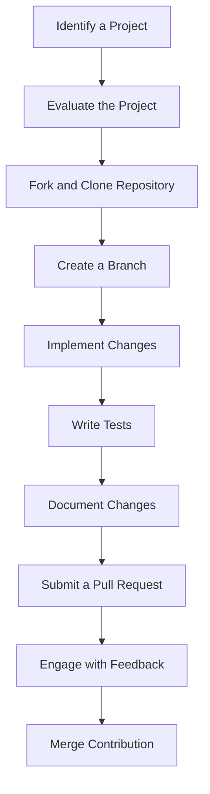

## 28.11. Contributing to Open Source Projects

Contributing to open source projects is a rewarding endeavor that not only benefits the community but also enhances your skills and broadens your professional network. For Elixir developers, engaging in open source projects can be particularly beneficial, given the language's vibrant community and its emphasis on collaboration and innovation.

### Benefits of Contribution

Before diving into the "how," let's explore the "why." Contributing to open source projects offers numerous advantages:

- **Skill Enhancement**: Working on open source projects exposes you to real-world coding challenges, helping you refine your skills in Elixir and other technologies.
- **Reputation Building**: Contributing to well-known projects can bolster your professional reputation, showcasing your abilities to potential employers or collaborators.
- **Networking Opportunities**: Open source projects are a gateway to meeting like-minded developers and industry leaders, fostering relationships that can lead to future opportunities.
- **Personal Satisfaction**: There's a unique sense of fulfillment in knowing that your contributions are helping improve software used by people worldwide.
- **Learning from Others**: By examining the code and practices of experienced developers, you gain insights into best practices and innovative solutions.

### Finding Projects

Identifying the right project to contribute to can be daunting, but it's crucial to ensure a fulfilling experience. Here are some strategies to help you find suitable projects:

#### Identifying Areas of Interest

Start by considering your interests and expertise. Are there specific domains or technologies within Elixir that excite you? Perhaps you're passionate about web development, data processing, or distributed systems. Focusing on areas that interest you will keep you motivated and engaged.

#### Searching for Projects

- **GitHub and GitLab**: These platforms host a plethora of open source projects. Use search filters to find Elixir projects that match your interests. Look for repositories with active issues and recent commits.
- **Elixir Forums and Communities**: Engage with the Elixir community through forums and chat platforms like Slack or Discord. Community members often share projects that need contributors.
- **Open Source Events and Hackathons**: Participate in events dedicated to open source contributions. These gatherings can introduce you to new projects and collaborators.

#### Evaluating Projects

Once you've identified potential projects, evaluate them to ensure they're a good fit:

- **Community Activity**: Check the project's activity level. Active projects with regular commits and discussions are more likely to provide a supportive environment.
- **Contribution Guidelines**: Look for projects with clear contribution guidelines. These guidelines indicate that the maintainers are open to contributions and have established processes for integrating them.
- **Issue Tracker**: Review the project's issue tracker for open issues labeled as "good first issue" or "help wanted." These labels often indicate tasks suitable for newcomers.

### Contribution Guidelines

Every open source project has its own set of contribution guidelines, which outline how contributions should be made. Adhering to these guidelines is crucial for a successful contribution. Here's how to navigate them effectively:

#### Understanding the Guidelines

- **Read the Documentation**: Most projects have a `CONTRIBUTING.md` file or similar documentation. Read it thoroughly to understand the project's expectations.
- **Coding Standards**: Familiarize yourself with the project's coding standards and style guides. Consistency in code style is important for maintainability.
- **Branching and Commit Messages**: Follow the project's conventions for branching and commit messages. This ensures that your contributions are easily understandable and traceable.

#### Making Your Contribution

- **Fork and Clone the Repository**: Start by forking the repository to your GitHub account and cloning it to your local machine.
- **Create a Branch**: Create a new branch for your contribution. This isolates your changes and makes it easier for maintainers to review them.
- **Implement Your Changes**: Make your changes in the new branch. Ensure your code adheres to the project's coding standards and passes all tests.
- **Write Tests**: If you're adding new functionality, write tests to ensure it works as expected. This demonstrates your commitment to quality.
- **Document Your Changes**: Update any relevant documentation to reflect your changes. Clear documentation helps other contributors understand your work.

#### Submitting a Pull Request

- **Create a Pull Request (PR)**: Once your changes are ready, submit a PR to the project's repository. Provide a clear and concise description of your changes and why they're necessary.
- **Engage with Feedback**: Be open to feedback from the maintainers and other contributors. Address any requested changes promptly and professionally.
- **Follow Up**: After your PR is merged, follow up to ensure everything is working as expected. This shows your dedication to the project's success.

### Code Examples

To illustrate the process of contributing to an open source project, let's walk through a simple example. Suppose you're contributing to a project that involves adding a new feature to an Elixir library.

```elixir
# Step 1: Fork and clone the repository
# In your terminal, run:
# git clone https://github.com/your-username/project-name.git

# Step 2: Create a new branch for your feature
# Navigate to the project directory and create a branch:
# git checkout -b add-new-feature

# Step 3: Implement your changes
defmodule MyLibrary.NewFeature do
  @moduledoc """
  This module implements a new feature for the library.
  """

  @doc """
  A function that demonstrates the new feature.
  """
  def new_feature do
    # Your code here
    :ok
  end
end

# Step 4: Write tests for your new feature
defmodule MyLibrary.NewFeatureTest do
  use ExUnit.Case
  alias MyLibrary.NewFeature

  test "new_feature/0 returns :ok" do
    assert NewFeature.new_feature() == :ok
  end
end

# Step 5: Run tests to ensure everything works
# In your terminal, run:
# mix test

# Step 6: Commit your changes
# git add .
# git commit -m "Add new feature to MyLibrary"

# Step 7: Push your branch to your forked repository
# git push origin add-new-feature

# Step 8: Submit a pull request
# Go to the original repository on GitHub and create a pull request from your branch.
```

### Visualizing the Contribution Process

To better understand the contribution process, let's visualize it using a flowchart. This diagram outlines the steps from identifying a project to successfully merging your contribution.


```mermaid
graph TD;
    A[Identify a Project] --> B[Evaluate the Project]
    B --> C[Fork and Clone Repository]
    C --> D[Create a Branch]
    D --> E[Implement Changes]
    E --> F[Write Tests]
    F --> G[Document Changes]
    G --> H[Submit a Pull Request]
    H --> I[Engage with Feedback]
    I --> J[Merge Contribution]
```

### Knowledge Check

To reinforce your understanding, consider the following questions:

- What are the key benefits of contributing to open source projects?
- How can you identify projects that align with your interests and skills?
- What are the essential steps to follow when making a contribution?
- Why is it important to adhere to a project's contribution guidelines?
- How can you effectively engage with feedback from maintainers?

### Embrace the Journey

Contributing to open source projects is a journey of continuous learning and growth. It's an opportunity to refine your skills, connect with a global community, and make a tangible impact on the software we all rely on. Remember, every contribution, no matter how small, is valuable. Keep experimenting, stay curious, and enjoy the journey!

### References and Links

- [GitHub Open Source Guides](https://opensource.guide/)
- [Elixir Forum](https://elixirforum.com/)
- [How to Contribute to Open Source](https://opensource.guide/how-to-contribute/)

## Quiz Time!



### What is a primary benefit of contributing to open source projects?

- [x] Enhancing your skills
- [ ] Receiving financial compensation
- [ ] Gaining exclusive access to software
- [ ] Avoiding collaboration with others

> **Explanation:** Contributing to open source projects enhances your skills by exposing you to real-world coding challenges.

### Which platform is commonly used to find open source projects?

- [x] GitHub
- [ ] LinkedIn
- [ ] Twitter
- [ ] Instagram

> **Explanation:** GitHub is a popular platform for hosting and finding open source projects.

### What should you look for in a project's issue tracker?

- [x] Issues labeled as "good first issue" or "help wanted"
- [ ] Issues with no labels
- [ ] Closed issues
- [ ] Issues with the most comments

> **Explanation:** Issues labeled as "good first issue" or "help wanted" are often suitable for newcomers.

### Why is it important to follow a project's contribution guidelines?

- [x] To ensure your contributions are accepted and integrated smoothly
- [ ] To avoid writing any documentation
- [ ] To bypass the need for testing
- [ ] To prevent other contributors from making changes

> **Explanation:** Following contribution guidelines ensures that your contributions are accepted and integrated smoothly.

### What is the first step in making a contribution to a project?

- [x] Fork and clone the repository
- [ ] Submit a pull request
- [ ] Write a test
- [ ] Create a new branch

> **Explanation:** The first step is to fork and clone the repository to your local machine.

### How can you engage with feedback from maintainers?

- [x] By addressing requested changes promptly and professionally
- [ ] By ignoring the feedback
- [ ] By arguing with the maintainers
- [ ] By withdrawing your contribution

> **Explanation:** Engaging with feedback involves addressing requested changes promptly and professionally.

### What should you do after your pull request is merged?

- [x] Follow up to ensure everything is working as expected
- [ ] Delete your GitHub account
- [ ] Stop contributing to the project
- [ ] Ignore any further communication

> **Explanation:** Following up ensures that everything is working as expected and shows your dedication to the project's success.

### What type of issues are suitable for newcomers?

- [x] Issues labeled as "good first issue"
- [ ] Issues with the most comments
- [ ] Closed issues
- [ ] Issues with no labels

> **Explanation:** Issues labeled as "good first issue" are often suitable for newcomers.

### True or False: Writing tests for new functionality is unnecessary.

- [ ] True
- [x] False

> **Explanation:** Writing tests for new functionality is necessary to ensure it works as expected and demonstrates your commitment to quality.

### What is the purpose of creating a new branch for your contribution?

- [x] To isolate your changes and make it easier for maintainers to review them
- [ ] To prevent other contributors from accessing your code
- [ ] To avoid writing documentation
- [ ] To bypass the need for testing

> **Explanation:** Creating a new branch isolates your changes and makes it easier for maintainers to review them.


