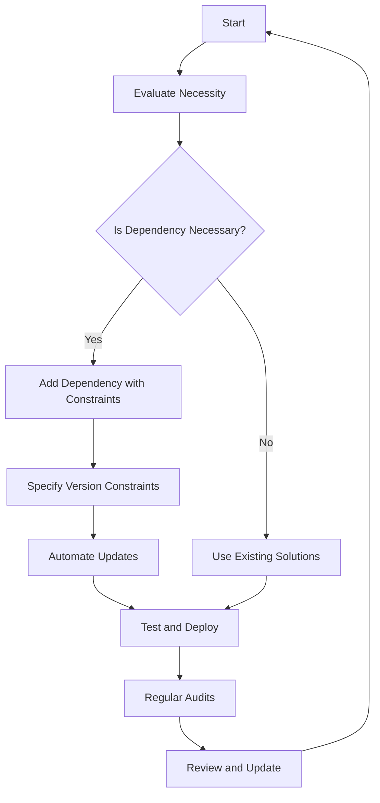

## 28.12. Managing Dependencies Effectively

In the world of software development, managing dependencies is a critical aspect of maintaining a healthy and scalable codebase. In Elixir, effective dependency management ensures that your applications remain robust, secure, and performant. This section will delve into the best practices for managing dependencies in Elixir projects, focusing on regular updates, version constraints, and minimizing dependencies.

### Introduction to Dependency Management

Dependencies are external libraries or packages that your application relies on to function. They can range from utility libraries to full-fledged frameworks. Proper management of these dependencies is crucial to avoid issues such as version conflicts, security vulnerabilities, and bloated codebases.

### Dependency Updates

Regularly updating dependencies is essential to benefit from the latest features, bug fixes, and security patches. However, updates must be handled with care to avoid breaking changes that could disrupt your application.

#### Why Update Dependencies?

1. **Security**: Older versions of libraries may contain vulnerabilities that can be exploited. Keeping dependencies up to date helps mitigate these risks.
2. **Performance**: Updates often include performance improvements that can enhance the efficiency of your application.
3. **New Features**: Staying current allows you to leverage new features and improvements in the libraries you use.
4. **Community Support**: Using the latest versions ensures better community support and access to documentation.

#### Strategies for Updating Dependencies

- **Automated Tools**: Use tools like Dependabot or Renovate to automate dependency updates. These tools can create pull requests for updates, making it easier to review and integrate changes.
- **Changelogs and Release Notes**: Always review the changelogs and release notes of dependencies before updating. This helps identify potential breaking changes.
- **Testing**: Implement comprehensive testing to ensure that updates do not introduce regressions or break existing functionality.
- **Staging Environment**: Test updates in a staging environment before deploying to production to catch any issues early.

### Version Constraints

Version constraints are used to specify which versions of a dependency your application is compatible with. They help prevent breaking changes by restricting updates to compatible versions.

#### Understanding Version Constraints

In Elixir, version constraints are specified in the `mix.exs` file using semantic versioning (semver). The format is typically `~> x.y.z`, where:

- `x` is the major version
- `y` is the minor version
- `z` is the patch version

#### Types of Version Constraints

- **Exact Version**: Specifies a single version, e.g., `1.2.3`. This is rarely used as it prevents any updates.
- **Caret (`^`)**: Allows updates that do not change the leftmost non-zero digit, e.g., `^1.2.3` allows `1.2.4` but not `2.0.0`.
- **Tilde (`~>`)**: Allows updates within the same minor version, e.g., `~> 1.2.3` allows `1.2.4` and `1.3.0` but not `2.0.0`.
- **Range**: Specifies a range of versions, e.g., `>= 1.2.3 and < 2.0.0`.

#### Best Practices for Version Constraints

- **Use Semantic Versioning**: Follow semver principles to ensure compatibility and predictability.
- **Be Conservative**: Use constraints that allow for minor and patch updates but avoid major version changes unless necessary.
- **Review Constraints Regularly**: Periodically review and adjust constraints to accommodate new features or changes in your application.

### Minimizing Dependencies

Reducing the number of dependencies in your project can lead to a more maintainable and less error-prone codebase. It also reduces the risk of security vulnerabilities and version conflicts.

#### Why Minimize Dependencies?

1. **Complexity**: Fewer dependencies mean less complexity and easier maintenance.
2. **Security**: Each dependency is a potential security risk. Fewer dependencies reduce the attack surface.
3. **Performance**: A leaner codebase can lead to better performance and faster build times.
4. **Reliability**: Reducing dependencies decreases the likelihood of conflicts and compatibility issues.

#### Strategies for Minimizing Dependencies

- **Evaluate Necessity**: Before adding a dependency, evaluate whether it is truly necessary. Can the functionality be achieved with existing libraries or custom code?
- **Use Standard Libraries**: Leverage Elixir's robust standard library whenever possible.
- **Regular Audits**: Conduct regular audits of your dependencies to identify and remove unused or redundant packages.
- **Custom Solutions**: Consider writing custom solutions for simple tasks rather than relying on external libraries.

### Code Examples

Let's explore some code examples to illustrate these concepts.

#### Example 1: Specifying Version Constraints

In your `mix.exs` file, you can specify dependencies with version constraints:

```elixir
defp deps do
  [
    {:phoenix, "~> 1.5.0"},
    {:ecto, "~> 3.5"},
    {:plug_cowboy, "~> 2.0"}
  ]
end
```

- **Explanation**: Here, we specify that our project depends on Phoenix version 1.5.x, Ecto version 3.5.x, and Plug Cowboy version 2.x. The `~>` operator ensures that we receive minor and patch updates without breaking changes.

#### Example 2: Automating Dependency Updates

Using Dependabot to automate updates:

```yaml
version: 2
updates:
  - package-ecosystem: mix
    directory: "/"
    schedule:
      interval: weekly
```

- **Explanation**: This configuration file for Dependabot specifies that dependency updates should be checked weekly for Elixir projects using Mix.

### Visualizing Dependency Management

Let's visualize the process of managing dependencies effectively using a flowchart.



- **Description**: This flowchart illustrates the process of evaluating, adding, and managing dependencies in an Elixir project. It emphasizes the importance of necessity evaluation, version constraints, automation, and regular audits.

### Knowledge Check

Let's reinforce our learning with some questions:

1. Why is it important to regularly update dependencies?
2. What are the benefits of using version constraints?
3. How can minimizing dependencies improve your project's security?
4. What are some strategies for evaluating the necessity of a dependency?

### Try It Yourself

Experiment with the code examples provided. Try modifying the version constraints in the `mix.exs` file to see how it affects your project's dependencies. Use Dependabot or a similar tool to automate updates and observe the process.

### Conclusion

Effective dependency management is a cornerstone of successful Elixir development. By regularly updating dependencies, using version constraints wisely, and minimizing unnecessary packages, you can maintain a secure, performant, and maintainable codebase. Remember, this is just the beginning. As you progress, you'll build more complex and interactive applications. Keep experimenting, stay curious, and enjoy the journey!

## Quiz: Managing Dependencies Effectively



### Why is it important to regularly update dependencies?

- [x] To benefit from security patches and performance improvements
- [ ] To increase the number of dependencies
- [ ] To make the codebase more complex
- [ ] To avoid using new features

> **Explanation:** Regular updates ensure that your application benefits from the latest security patches, performance improvements, and new features.

### What is the purpose of version constraints?

- [x] To specify compatible versions of dependencies
- [ ] To prevent any updates
- [ ] To increase the number of dependencies
- [ ] To make the codebase more complex

> **Explanation:** Version constraints help specify which versions of a dependency are compatible with your application, preventing breaking changes.

### How can minimizing dependencies improve your project's security?

- [x] By reducing the attack surface
- [ ] By increasing the number of dependencies
- [ ] By making the codebase more complex
- [ ] By avoiding security patches

> **Explanation:** Fewer dependencies mean a smaller attack surface, reducing the risk of security vulnerabilities.

### What is a benefit of using automated tools for dependency updates?

- [x] They simplify the update process
- [ ] They increase the number of dependencies
- [ ] They make the codebase more complex
- [ ] They prevent updates

> **Explanation:** Automated tools like Dependabot simplify the process of updating dependencies by creating pull requests for updates.

### What is the `~>` operator used for in version constraints?

- [x] To allow minor and patch updates
- [ ] To prevent any updates
- [ ] To specify an exact version
- [ ] To increase the number of dependencies

> **Explanation:** The `~>` operator allows for minor and patch updates, ensuring compatibility without breaking changes.

### Why should you review changelogs before updating dependencies?

- [x] To identify potential breaking changes
- [ ] To increase the number of dependencies
- [ ] To make the codebase more complex
- [ ] To avoid using new features

> **Explanation:** Reviewing changelogs helps identify potential breaking changes and ensures a smooth update process.

### What is a strategy for minimizing dependencies?

- [x] Evaluating the necessity of each dependency
- [ ] Increasing the number of dependencies
- [ ] Making the codebase more complex
- [ ] Avoiding security patches

> **Explanation:** Evaluating the necessity of each dependency helps minimize the number of dependencies, reducing complexity and potential security risks.

### How can regular audits help in dependency management?

- [x] By identifying and removing unused packages
- [ ] By increasing the number of dependencies
- [ ] By making the codebase more complex
- [ ] By avoiding updates

> **Explanation:** Regular audits help identify and remove unused or redundant packages, simplifying the codebase and reducing potential conflicts.

### What is the benefit of using Elixir's standard library?

- [x] It reduces the need for external dependencies
- [ ] It increases the number of dependencies
- [ ] It makes the codebase more complex
- [ ] It prevents updates

> **Explanation:** Using Elixir's robust standard library reduces the need for external dependencies, simplifying the codebase and reducing potential conflicts.

### True or False: Version constraints should always be as strict as possible.

- [ ] True
- [x] False

> **Explanation:** Version constraints should be flexible enough to allow for minor and patch updates, ensuring compatibility without breaking changes.


