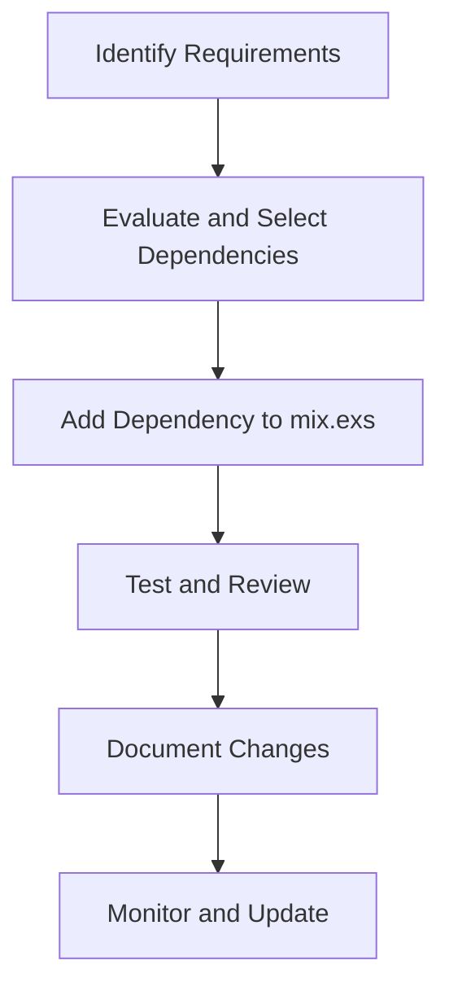

## 28.12. Managing Dependencies Effectively

In the world of software development, managing dependencies is a crucial aspect of maintaining a healthy and sustainable codebase. As Elixir developers, we have the luxury of a rich ecosystem of libraries and tools available through Hex, Elixir's package manager. However, with great power comes great responsibility. Effective dependency management is essential to ensure our applications remain stable, secure, and performant.

### Understanding Dependency Management

Dependency management involves the processes and practices that ensure your application has access to the libraries and packages it needs to function correctly. It includes tasks such as adding new dependencies, updating existing ones, and resolving conflicts between different versions.

#### Key Concepts in Dependency Management

- **Dependencies**: External libraries or packages that your application relies on.
- **Versioning**: The practice of assigning unique version numbers to different iterations of a package.
- **Semantic Versioning**: A versioning scheme that uses a three-part number (e.g., 1.2.3) to indicate major, minor, and patch changes.
- **Transitive Dependencies**: Dependencies that are not directly required by your application but are required by your direct dependencies.

### Dependency Updates

Regularly updating dependencies is crucial for benefiting from security patches, bug fixes, and performance improvements. However, updates can also introduce breaking changes, so it's important to approach them with caution.

#### Strategies for Updating Dependencies

1. **Regular Review**: Schedule regular intervals to review and update dependencies. This can be part of your sprint planning or a dedicated maintenance cycle.
2. **Changelog Review**: Before updating, review the changelog of the dependency to understand what changes have been made and assess any potential impact on your application.
3. **Automated Tools**: Use tools like Dependabot to automate dependency updates and receive notifications when new versions are available.
4. **Testing**: Ensure that your test suite is comprehensive and run it after updating dependencies to catch any regressions or issues.

#### Example: Updating a Dependency in Mix

```elixir
# mix.exs
defp deps do
  [
    {:phoenix, "~> 1.5"},
    {:ecto, "~> 3.5"},
    {:plug_cowboy, "~> 2.0"}
  ]
end
```

In this example, the `phoenix` dependency is specified with a version constraint of `~> 1.5`, allowing updates to any minor or patch version within the 1.x series.

### Version Constraints

Using version constraints effectively is key to maintaining compatibility and avoiding conflicts. Elixir's Mix tool provides several ways to specify version constraints.

#### Types of Version Constraints

- **Exact Version**: `{:package, "1.0.0"}` - Requires exactly version 1.0.0.
- **Caret Constraint**: `{:package, "~> 1.0"}` - Allows updates to any version within the 1.x series.
- **Range Constraint**: `{:package, ">= 1.0.0 and < 2.0.0"}` - Specifies a range of acceptable versions.

#### Best Practices for Version Constraints

- **Use Semantic Versioning**: Follow semantic versioning guidelines to ensure compatibility and predictability.
- **Be Conservative**: Start with stricter constraints and loosen them as necessary. This helps prevent unexpected breaking changes.
- **Document Changes**: Keep a changelog of dependency updates and version changes to aid future maintenance.

### Minimizing Dependencies

While dependencies can greatly enhance productivity, it's important to minimize them to reduce complexity and potential conflicts.

#### Strategies for Minimizing Dependencies

1. **Evaluate Necessity**: Before adding a new dependency, evaluate whether it's truly necessary. Consider if the functionality can be implemented in-house with reasonable effort.
2. **Review Alternatives**: Explore alternative libraries that may offer similar functionality with fewer dependencies or better compatibility.
3. **Remove Unused Dependencies**: Regularly audit your project's dependencies and remove any that are no longer needed.

#### Example: Evaluating a New Dependency

Before adding a dependency, consider the following:

- **Functionality**: Does the dependency provide essential functionality that cannot be easily implemented?
- **Community Support**: Is the dependency well-maintained and supported by a strong community?
- **Compatibility**: Does the dependency align with your project's existing dependencies and version constraints?

### Dependency Management Workflow

Implementing a structured workflow for managing dependencies can help streamline the process and ensure consistency.

#### Sample Workflow

1. **Identify Requirements**: Determine the functionality needed and research potential dependencies.
2. **Evaluate and Select**: Evaluate potential dependencies based on functionality, support, and compatibility.
3. **Add Dependency**: Add the selected dependency to your `mix.exs` file with appropriate version constraints.
4. **Test and Review**: Run your test suite to ensure the new dependency integrates smoothly.
5. **Document**: Update your project's documentation to reflect the new dependency and any changes made.
6. **Monitor and Update**: Regularly review and update dependencies as needed.

### Visualizing Dependency Management

To better understand the flow of dependency management, let's visualize the process using a flowchart.


```mermaid
graph TD;
    A[Identify Requirements] --> B[Evaluate and Select Dependencies];
    B --> C[Add Dependency to mix.exs];
    C --> D[Test and Review];
    D --> E[Document Changes];
    E --> F[Monitor and Update];
```

This flowchart illustrates the typical steps involved in managing dependencies effectively.

### Tools for Dependency Management

Several tools can assist with managing dependencies in Elixir projects:

- **Mix**: Elixir's built-in build tool for managing dependencies, compiling code, and running tests.
- **Hex**: The package manager for the Erlang ecosystem, used to publish and fetch packages.
- **Dependabot**: A tool for automating dependency updates and receiving notifications about new versions.
- **ExDoc**: A documentation generator for Elixir projects, useful for maintaining up-to-date documentation.

### Knowledge Check

To reinforce your understanding of dependency management, consider the following questions:

1. Why is it important to regularly update dependencies?
2. What are the benefits of using version constraints?
3. How can you minimize dependencies in your project?
4. What tools are available for managing dependencies in Elixir?

### Embrace the Journey

Remember, effective dependency management is an ongoing process. As you continue to develop and maintain your Elixir applications, keep refining your approach to ensure stability, security, and performance. Stay curious, keep experimenting, and enjoy the journey of building robust and maintainable software.

## Quiz Time!



### Why is it important to regularly update dependencies?

- [x] To benefit from security patches and bug fixes
- [ ] To increase the number of dependencies
- [ ] To reduce the size of the codebase
- [ ] To avoid using semantic versioning

> **Explanation:** Regularly updating dependencies ensures that your application benefits from security patches, bug fixes, and performance improvements.

### What is semantic versioning?

- [x] A versioning scheme with major, minor, and patch numbers
- [ ] A method of encrypting version numbers
- [ ] A way to reduce the number of dependencies
- [ ] A tool for automating dependency updates

> **Explanation:** Semantic versioning uses a three-part number (e.g., 1.2.3) to indicate major, minor, and patch changes, helping manage compatibility.

### How can you minimize dependencies in your project?

- [x] Evaluate necessity and remove unused dependencies
- [ ] Add as many dependencies as possible
- [ ] Avoid using version constraints
- [ ] Ignore community support

> **Explanation:** Minimizing dependencies involves evaluating their necessity and removing any that are unused or unnecessary.

### Which tool is used for managing dependencies in Elixir?

- [x] Mix
- [ ] Docker
- [ ] Kubernetes
- [ ] Git

> **Explanation:** Mix is Elixir's built-in build tool for managing dependencies, compiling code, and running tests.

### What is a transitive dependency?

- [x] A dependency required by another dependency
- [ ] A dependency that is directly required by your application
- [ ] A dependency that has no version constraints
- [ ] A dependency that is always up-to-date

> **Explanation:** Transitive dependencies are not directly required by your application but are required by your direct dependencies.

### What is the benefit of using version constraints?

- [x] Ensures compatibility and avoids conflicts
- [ ] Increases the number of dependencies
- [ ] Reduces the need for testing
- [ ] Eliminates the need for documentation

> **Explanation:** Version constraints help ensure compatibility and avoid conflicts between different versions of dependencies.

### What should you do before updating a dependency?

- [x] Review the changelog and run tests
- [ ] Remove all version constraints
- [ ] Ignore any potential impacts
- [ ] Document the changes immediately

> **Explanation:** Before updating a dependency, review the changelog to understand changes and run tests to catch any issues.

### How can you automate dependency updates?

- [x] Use tools like Dependabot
- [ ] Manually check for updates every day
- [ ] Avoid using any automation tools
- [ ] Use Docker for dependency management

> **Explanation:** Tools like Dependabot can automate dependency updates and notify you when new versions are available.

### What is the role of Hex in Elixir?

- [x] It is the package manager for the Erlang ecosystem
- [ ] It is a tool for encrypting dependencies
- [ ] It is a build tool for compiling code
- [ ] It is a testing framework for Elixir

> **Explanation:** Hex is the package manager for the Erlang ecosystem, used to publish and fetch packages.

### True or False: Dependencies should be added without evaluating their necessity.

- [ ] True
- [x] False

> **Explanation:** Dependencies should be evaluated for necessity before being added to ensure they are essential and compatible with the project.




