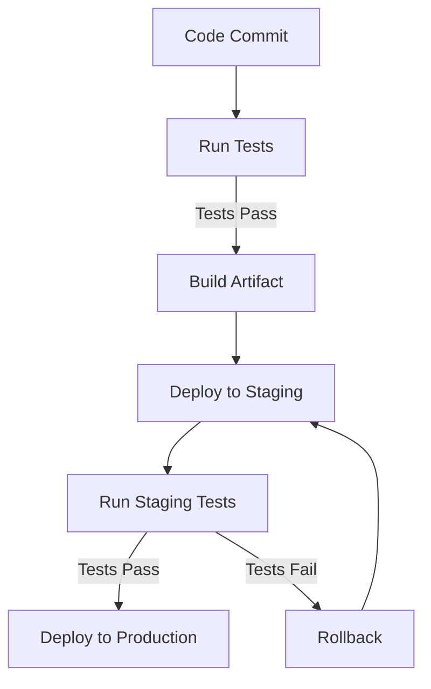

## 28.13. Automated Testing and Deployment Practices

In the fast-paced world of software development, ensuring code quality and rapid deployment are paramount. Automated testing and deployment practices are essential for maintaining high standards and delivering reliable software. In this section, we will explore how to integrate automated testing into your Elixir development workflow, implement continuous deployment, and leverage infrastructure as code to define consistent deployment environments.

### Test Automation in Elixir

Automated testing is a cornerstone of modern software development. It allows developers to verify that their code behaves as expected and prevents regressions. In Elixir, the ExUnit framework is the go-to tool for writing and running tests. Let's delve into how to effectively use ExUnit and other tools to automate testing in Elixir.

#### Integrating Tests into the Development Workflow

1. **Setting Up ExUnit**: ExUnit is included with Elixir, making it easy to get started with testing. To use it, create a `test` directory in your project and add test files with the `_test.exs` suffix.

    ```elixir
    defmodule MyApp.MathTest do
      use ExUnit.Case
      doctest MyApp.Math

      test "addition" do
        assert MyApp.Math.add(1, 2) == 3
      end
    end
    ```

    > **Explanation**: This simple test checks that the `add` function in `MyApp.Math` correctly adds two numbers.

2. **Running Tests**: Use the `mix test` command to run all tests in your project. This command will automatically compile your code and execute the tests.

3. **Test Coverage**: To ensure comprehensive testing, use tools like `mix test --cover` to generate coverage reports. This helps identify untested code paths.

4. **Continuous Integration (CI)**: Integrate your tests into a CI pipeline using services like GitHub Actions, Travis CI, or CircleCI. This ensures that tests run automatically on every commit or pull request.

    ```yaml
    name: Elixir CI

    on: [push, pull_request]

    jobs:
      build:
        runs-on: ubuntu-latest
        steps:
        - uses: actions/checkout@v2
        - name: Set up Elixir
          uses: actions/setup-elixir@v1
          with:
            elixir-version: '1.12'
            otp-version: '24'
        - name: Install dependencies
          run: mix deps.get
        - name: Run tests
          run: mix test
    ```

    > **Explanation**: This GitHub Actions workflow sets up Elixir, installs dependencies, and runs tests on every push or pull request.

5. **Property-Based Testing**: Use libraries like StreamData for property-based testing, which generates a wide range of inputs to test the robustness of your code.

    ```elixir
    use ExUnitProperties

    property "addition is commutative" do
      check all a <- integer(), b <- integer() do
        assert MyApp.Math.add(a, b) == MyApp.Math.add(b, a)
      end
    end
    ```

    > **Explanation**: This property-based test checks that addition is commutative for all integers.

### Continuous Deployment

Continuous Deployment (CD) is the practice of automatically deploying code that passes all tests to production. This ensures that new features and bug fixes reach users quickly and reliably.

#### Implementing Continuous Deployment

1. **Deployment Pipelines**: Set up a deployment pipeline that automatically deploys code after successful testing. Use tools like GitLab CI/CD, Jenkins, or AWS CodePipeline.

2. **Environment Configuration**: Use environment variables or configuration files to manage environment-specific settings. This allows the same codebase to be deployed to different environments (e.g., staging, production).

3. **Zero-Downtime Deployments**: Implement strategies like blue-green deployments or canary releases to ensure zero downtime during deployments.

    ```yaml
    deploy:
      stage: deploy
      script:
        - echo "Deploying to production..."
        - ./deploy.sh
      only:
        - master
    ```

    > **Explanation**: This GitLab CI/CD job deploys the application to production when changes are merged into the master branch.

4. **Monitoring and Rollback**: Implement monitoring to detect issues post-deployment and set up rollback mechanisms to revert to a previous stable state if necessary.

5. **Security Considerations**: Ensure that deployment processes are secure by using encrypted secrets and access controls.

### Infrastructure as Code

Infrastructure as Code (IaC) is the practice of defining deployment environments using code. This ensures consistency and repeatability across different environments.

#### Defining Deployment Environments in Code

1. **Terraform**: Use Terraform to define and provision infrastructure. Terraform allows you to describe your infrastructure in a declarative configuration file.

    ```hcl
    provider "aws" {
      region = "us-west-2"
    }

    resource "aws_instance" "web" {
      ami           = "ami-0c55b159cbfafe1f0"
      instance_type = "t2.micro"
    }
    ```

    > **Explanation**: This Terraform configuration creates an AWS EC2 instance in the `us-west-2` region.

2. **Docker**: Use Docker to containerize your application, ensuring that it runs consistently across different environments.

    ```dockerfile
    FROM elixir:1.12

    WORKDIR /app
    COPY . .

    RUN mix deps.get
    RUN mix compile

    CMD ["mix", "phx.server"]
    ```

    > **Explanation**: This Dockerfile sets up an Elixir environment and runs a Phoenix server.

3. **Kubernetes**: Use Kubernetes to orchestrate containerized applications. Define your application's deployment, service, and ingress in YAML files.

    ```yaml
    apiVersion: apps/v1
    kind: Deployment
    metadata:
      name: myapp
    spec:
      replicas: 3
      selector:
        matchLabels:
          app: myapp
      template:
        metadata:
          labels:
            app: myapp
        spec:
          containers:
          - name: myapp
            image: myapp:latest
            ports:
            - containerPort: 4000
    ```

    > **Explanation**: This Kubernetes deployment configuration runs three replicas of a containerized application.

4. **Version Control**: Store your infrastructure code in version control systems like Git to track changes and collaborate with team members.

5. **Automated Provisioning**: Use CI/CD pipelines to automate the provisioning and configuration of infrastructure, ensuring that environments are always up-to-date.

### Visualizing Automated Testing and Deployment

To better understand the flow of automated testing and deployment, let's visualize the process using a Mermaid.js diagram.



> **Explanation**: This diagram illustrates a typical CI/CD pipeline where code is tested, built, and deployed to staging and production environments.

### Knowledge Check

Before we wrap up, let's reinforce what we've learned with a few questions:

- What is the purpose of automated testing in the development workflow?
- How does continuous deployment benefit the software development process?
- Why is infrastructure as code important for deployment consistency?

### Embrace the Journey

Remember, mastering automated testing and deployment practices is a journey. As you implement these practices, you'll find that your development workflow becomes more efficient, your deployments more reliable, and your software more robust. Keep experimenting, stay curious, and enjoy the journey!

### Quiz: Automated Testing and Deployment Practices



### What is the primary purpose of automated testing in software development?

- [x] To verify that code behaves as expected and prevent regressions
- [ ] To replace manual testing entirely
- [ ] To increase the complexity of the codebase
- [ ] To reduce the need for code reviews

> **Explanation:** Automated testing ensures that code changes do not introduce new bugs and that the software behaves as expected.

### Which tool is commonly used for automated testing in Elixir?

- [x] ExUnit
- [ ] JUnit
- [ ] Mocha
- [ ] RSpec

> **Explanation:** ExUnit is the built-in testing framework for Elixir, designed to facilitate automated testing.

### What is the benefit of continuous deployment?

- [x] It ensures that new features and bug fixes reach users quickly and reliably.
- [ ] It eliminates the need for testing.
- [ ] It allows developers to skip code reviews.
- [ ] It increases the complexity of deployment processes.

> **Explanation:** Continuous deployment automates the release of software, ensuring that updates are delivered to users promptly.

### What is Infrastructure as Code (IaC)?

- [x] The practice of defining deployment environments using code
- [ ] A method for writing application code
- [ ] A tool for managing databases
- [ ] A framework for building user interfaces

> **Explanation:** Infrastructure as Code involves using code to define and manage infrastructure, ensuring consistency and repeatability.

### Which tool is used for containerizing applications?

- [x] Docker
- [ ] Terraform
- [ ] Kubernetes
- [ ] Ansible

> **Explanation:** Docker is a platform used to containerize applications, allowing them to run consistently across different environments.

### What is the role of a CI/CD pipeline?

- [x] To automate the process of testing and deploying code
- [ ] To manually review code changes
- [ ] To replace version control systems
- [ ] To manage user authentication

> **Explanation:** CI/CD pipelines automate the testing and deployment process, ensuring that code changes are verified and released efficiently.

### How does property-based testing differ from traditional testing?

- [x] It generates a wide range of inputs to test code robustness.
- [ ] It focuses on testing user interfaces.
- [ ] It only tests a single input at a time.
- [ ] It requires manual input from developers.

> **Explanation:** Property-based testing uses generated inputs to test code, ensuring that it handles a variety of scenarios.

### What is a zero-downtime deployment?

- [x] A deployment strategy that ensures no service interruption
- [ ] A deployment that occurs during off-peak hours
- [ ] A deployment that skips testing
- [ ] A deployment that requires manual intervention

> **Explanation:** Zero-downtime deployments ensure that users experience no service interruption during updates.

### Why is version control important for infrastructure code?

- [x] It tracks changes and facilitates collaboration.
- [ ] It replaces the need for documentation.
- [ ] It automates the deployment process.
- [ ] It manages user authentication.

> **Explanation:** Version control systems track changes to code, making it easier to collaborate and manage infrastructure configurations.

### True or False: Continuous deployment eliminates the need for testing.

- [ ] True
- [x] False

> **Explanation:** Continuous deployment relies on automated testing to ensure that code is ready for release, but it does not eliminate the need for testing.



By mastering these automated testing and deployment practices, you'll be well-equipped to build robust, reliable, and scalable applications in Elixir. Keep exploring, learning, and applying these concepts to your projects.
