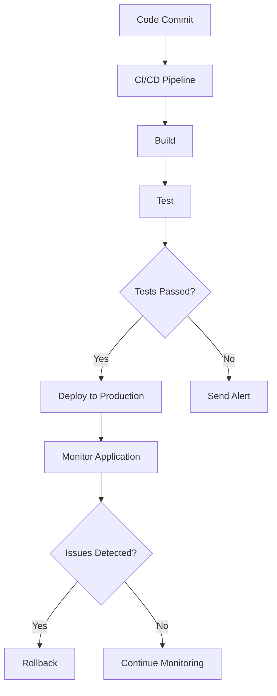

## 28.13. Automated Testing and Deployment Practices

In the fast-paced world of software development, ensuring the reliability and efficiency of your code is paramount. Automated testing and deployment practices are essential components of modern software engineering, particularly when working with Elixir. This section will delve into the intricacies of integrating automated testing into your development workflow, implementing continuous deployment, and defining deployment environments through infrastructure as code.

### Test Automation

Test automation is a critical aspect of maintaining code quality and reliability. By automating tests, developers can quickly identify issues and ensure that new changes do not break existing functionality. In Elixir, test automation can be seamlessly integrated into the development workflow using tools like ExUnit, the built-in testing framework.

#### Integrating Tests into the Development Workflow

1. **Setting Up ExUnit**: ExUnit is Elixir's built-in testing framework, providing a robust platform for writing and running tests. To get started, ensure that your project is set up with ExUnit by including it in your `mix.exs` file.

    ```elixir
    defp deps do
      [
        {:ex_unit, "~> 1.12", only: :test}
      ]
    end
    ```

2. **Writing Test Cases**: ExUnit allows you to write test cases using the `test` macro. Each test case should be independent and focus on a specific functionality.

    ```elixir
    defmodule MyApp.CalculatorTest do
      use ExUnit.Case

      test "addition of two numbers" do
        assert MyApp.Calculator.add(1, 2) == 3
      end

      test "subtraction of two numbers" do
        assert MyApp.Calculator.subtract(5, 3) == 2
      end
    end
    ```

3. **Running Tests**: Execute your tests using the `mix test` command. This will run all tests in your project and provide a summary of the results.

4. **Continuous Integration**: Integrate your tests with a continuous integration (CI) system like GitHub Actions, Travis CI, or CircleCI. This ensures that tests are automatically run whenever code is pushed to the repository.

    ```yaml
    name: Elixir CI

    on: [push, pull_request]

    jobs:
      build:
        runs-on: ubuntu-latest
        steps:
        - uses: actions/checkout@v2
        - name: Set up Elixir
          uses: actions/setup-elixir@v1
          with:
            elixir-version: '1.12'
        - run: mix deps.get
        - run: mix test
    ```

5. **Code Coverage**: Use tools like Coverex or ExCoveralls to measure code coverage. This helps identify untested parts of your codebase, ensuring comprehensive test coverage.

    ```elixir
    defp deps do
      [
        {:excoveralls, "~> 0.10", only: :test}
      ]
    end
    ```

    Run `mix coveralls.html` to generate a detailed coverage report.

#### Try It Yourself

Experiment with the provided test cases by adding new functions to the `MyApp.Calculator` module and writing corresponding tests. Modify the CI configuration to include additional checks, such as linting with Credo.

### Continuous Deployment

Continuous deployment (CD) is the practice of automatically deploying code that passes all tests to a production environment. This ensures that new features and bug fixes are delivered to users quickly and reliably.

#### Automatically Deploying Code That Passes All Tests

1. **Setting Up a Deployment Pipeline**: Use a CI/CD platform like GitHub Actions, GitLab CI/CD, or Jenkins to set up a deployment pipeline. This pipeline should include stages for building, testing, and deploying your application.

    ```yaml
    name: Elixir CD

    on:
      push:
        branches:
          - main

    jobs:
      deploy:
        runs-on: ubuntu-latest
        steps:
        - uses: actions/checkout@v2
        - name: Set up Elixir
          uses: actions/setup-elixir@v1
          with:
            elixir-version: '1.12'
        - run: mix deps.get
        - run: mix test
        - name: Deploy to Production
          if: success()
          run: ./deploy.sh
    ```

2. **Deployment Scripts**: Create deployment scripts to automate the deployment process. These scripts can handle tasks like building Docker images, pushing them to a container registry, and deploying them to a cloud provider.

    ```bash
    # deploy.sh
    docker build -t myapp:latest .
    docker push myregistry/myapp:latest
    kubectl apply -f k8s/deployment.yaml
    ```

3. **Environment Configuration**: Use environment variables and configuration files to manage different deployment environments (e.g., development, staging, production). Tools like Distillery or Mix Releases can help manage application configuration.

4. **Monitoring and Rollback**: Implement monitoring and logging to track the health of your application after deployment. Set up automated rollback procedures to revert to a previous version if issues are detected.

#### Try It Yourself

Create a simple Elixir application, set up a CI/CD pipeline, and deploy it to a cloud provider like AWS or Google Cloud. Experiment with different deployment strategies, such as blue-green deployments or canary releases.

### Infrastructure as Code

Infrastructure as code (IaC) is the practice of defining deployment environments in code, ensuring consistency and repeatability. IaC tools like Terraform, Ansible, and Chef allow you to manage infrastructure through code.

#### Defining Deployment Environments in Code for Consistency

1. **Using Terraform**: Terraform is a popular IaC tool that allows you to define cloud infrastructure using a declarative configuration language. Create a `main.tf` file to define your infrastructure.

    ```hcl
    provider "aws" {
      region = "us-west-2"
    }

    resource "aws_instance" "web" {
      ami           = "ami-0c55b159cbfafe1f0"
      instance_type = "t2.micro"
    }
    ```

2. **Version Control**: Store your IaC configurations in version control systems like Git. This allows you to track changes, collaborate with team members, and roll back to previous configurations if needed.

3. **Automated Provisioning**: Use CI/CD pipelines to automatically provision infrastructure based on your IaC configurations. This ensures that infrastructure changes are applied consistently across environments.

4. **Configuration Management**: Use tools like Ansible or Chef to manage configuration files and software installations on your infrastructure. This helps maintain consistency across servers and reduces manual configuration errors.

5. **Security and Compliance**: Implement security best practices in your IaC configurations, such as using secure access controls and encrypting sensitive data. Regularly audit your configurations to ensure compliance with industry standards.

#### Try It Yourself

Set up a Terraform configuration to provision a simple web server on AWS. Use Ansible to configure the server and deploy an Elixir application. Experiment with scaling the infrastructure to handle increased traffic.

### Visualizing the Continuous Deployment Pipeline

To better understand the flow of a continuous deployment pipeline, let's visualize the process using a Mermaid.js diagram.


```mermaid
graph TD;
    A[Code Commit] --> B[CI/CD Pipeline];
    B --> C[Build];
    C --> D[Test];
    D --> E{Tests Passed?};
    E -->|Yes| F[Deploy to Production];
    E -->|No| G[Send Alert];
    F --> H[Monitor Application];
    H --> I{Issues Detected?};
    I -->|Yes| J[Rollback];
    I -->|No| K[Continue Monitoring];
```

**Diagram Description**: This diagram illustrates the flow of a continuous deployment pipeline. It begins with a code commit, triggering the CI/CD pipeline. The code is built and tested, and if all tests pass, it is deployed to production. The application is then monitored for issues, with a rollback procedure in place if necessary.

### Key Takeaways

- **Test Automation**: Integrate automated tests into your development workflow to maintain code quality and reliability.
- **Continuous Deployment**: Implement a deployment pipeline to automatically deploy code that passes all tests, ensuring quick and reliable delivery of new features.
- **Infrastructure as Code**: Define deployment environments in code to ensure consistency and repeatability, leveraging tools like Terraform and Ansible.

### References and Links

- [ExUnit Documentation](https://hexdocs.pm/ex_unit/ExUnit.html)
- [GitHub Actions Documentation](https://docs.github.com/en/actions)
- [Terraform Documentation](https://www.terraform.io/docs/index.html)
- [Ansible Documentation](https://docs.ansible.com/ansible/latest/index.html)

## Quiz Time!



### What is the primary purpose of test automation in Elixir?

- [x] To quickly identify issues and ensure code reliability
- [ ] To replace manual testing entirely
- [ ] To eliminate the need for code reviews
- [ ] To increase the complexity of the codebase

> **Explanation:** Test automation helps quickly identify issues and ensures code reliability by running tests automatically.

### Which tool is commonly used for continuous integration in Elixir projects?

- [x] GitHub Actions
- [ ] Docker
- [ ] Terraform
- [ ] Ansible

> **Explanation:** GitHub Actions is a popular tool for setting up continuous integration pipelines in Elixir projects.

### What is the role of a deployment pipeline in continuous deployment?

- [x] To automate the process of building, testing, and deploying code
- [ ] To manually deploy code to production
- [ ] To replace the need for version control
- [ ] To increase the complexity of deployment processes

> **Explanation:** A deployment pipeline automates the process of building, testing, and deploying code, ensuring reliable delivery.

### What is Infrastructure as Code (IaC)?

- [x] The practice of defining deployment environments in code
- [ ] A tool for manual infrastructure management
- [ ] A method for writing application code
- [ ] A type of cloud service

> **Explanation:** Infrastructure as Code involves defining deployment environments in code for consistency and repeatability.

### Which tool is used for defining cloud infrastructure in a declarative configuration language?

- [x] Terraform
- [ ] ExUnit
- [ ] Ansible
- [ ] GitHub Actions

> **Explanation:** Terraform is a tool that allows you to define cloud infrastructure using a declarative configuration language.

### What is the purpose of using version control for IaC configurations?

- [x] To track changes and collaborate with team members
- [ ] To manually manage infrastructure
- [ ] To eliminate the need for CI/CD pipelines
- [ ] To increase the complexity of infrastructure management

> **Explanation:** Version control allows you to track changes and collaborate with team members on IaC configurations.

### What is a common practice for managing configuration files and software installations on infrastructure?

- [x] Using configuration management tools like Ansible
- [ ] Manually editing configuration files
- [ ] Using CI/CD pipelines
- [ ] Writing application code

> **Explanation:** Configuration management tools like Ansible help manage configuration files and software installations consistently.

### What is the benefit of implementing monitoring and rollback procedures in a deployment pipeline?

- [x] To track application health and revert to previous versions if issues are detected
- [ ] To manually deploy code to production
- [ ] To replace the need for automated tests
- [ ] To increase the complexity of deployment processes

> **Explanation:** Monitoring and rollback procedures help track application health and revert to previous versions if issues are detected.

### What is the role of Ansible in infrastructure management?

- [x] To manage configuration files and software installations
- [ ] To define cloud infrastructure
- [ ] To automate code testing
- [ ] To replace the need for CI/CD pipelines

> **Explanation:** Ansible is used to manage configuration files and software installations on infrastructure.

### True or False: Continuous deployment ensures that new features are delivered to users quickly and reliably.

- [x] True
- [ ] False

> **Explanation:** Continuous deployment automates the process of deploying code that passes all tests, ensuring quick and reliable delivery of new features.


