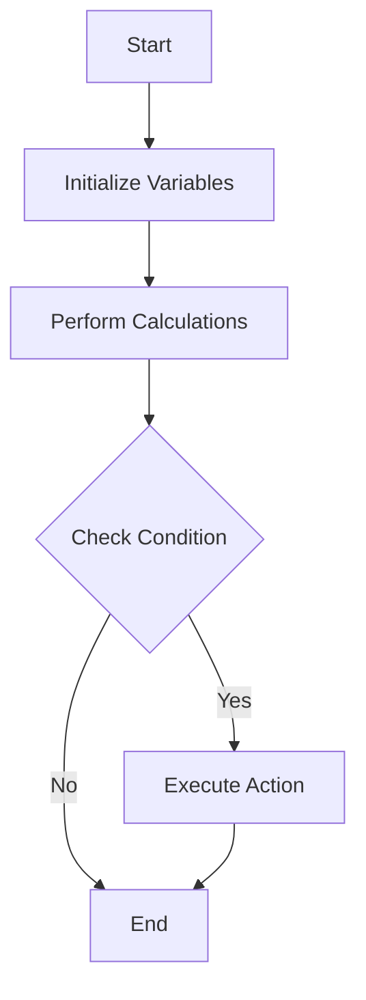

## 28.2. Code Readability and Maintainability

In the world of software development, writing code that is not only functional but also readable and maintainable is crucial. This is especially true in Elixir, where the functional programming paradigm and concurrent nature of the language can introduce complexities. In this section, we will explore best practices for enhancing code readability and maintainability in Elixir, focusing on clear naming conventions, formatting standards, and effective commenting and documentation.

### Clear Naming Conventions

#### Importance of Naming

Names are the first thing developers encounter when reading code. They serve as the primary means of communication between the code and its readers. Therefore, using descriptive and consistent names is essential for clarity and understanding.

#### Guidelines for Naming

1. **Descriptive Names**: Use names that clearly describe the purpose or function of the variable, function, or module. Avoid abbreviations unless they are widely understood.

   ```elixir
   # Bad
   def calc(x, y), do: x + y

   # Good
   def calculate_sum(a, b), do: a + b
   ```

2. **Consistent Naming Patterns**: Follow a consistent naming pattern throughout your codebase. For example, use snake_case for variables and functions, and PascalCase for modules.

3. **Avoid Generic Names**: Names like `data`, `info`, or `temp` are too generic and do not convey meaningful information.

4. **Use Contextual Names**: Provide context in names to make them more informative. For example, `user_email` is more descriptive than `email`.

5. **Naming Conventions for Modules and Functions**: Use nouns for module names and verbs for function names. This helps in understanding the role of each component.

#### Example of Good Naming Practices

```elixir
defmodule UserManager do
  def create_user(params) do
    # Logic to create a user
  end

  def delete_user(user_id) do
    # Logic to delete a user
  end
end
```

### Formatting Standards

#### Adhering to Community Style Guides

Elixir has a well-defined community style guide that helps maintain consistency across codebases. Adhering to these standards not only improves readability but also makes it easier for developers to collaborate.

1. **Indentation and Spacing**: Use two spaces for indentation. Ensure consistent spacing around operators and after commas.

   ```elixir
   # Bad
   def add(a,b),do: a+b

   # Good
   def add(a, b), do: a + b
   ```

2. **Line Length**: Keep lines to a maximum of 80 characters. This improves readability and ensures code is viewable on different devices.

3. **Function Definitions**: Place function definitions on separate lines, and use a blank line between functions for clarity.

4. **Pipe Operator Usage**: When using the pipe operator (`|>`), place each function call on a new line for better readability.

   ```elixir
   # Bad
   result = data |> process |> transform |> output

   # Good
   result =
     data
     |> process
     |> transform
     |> output
   ```

5. **Consistent Use of Parentheses**: Use parentheses in function calls for clarity, especially when passing multiple arguments.

#### Example of Well-Formatted Code

```elixir
defmodule MathOperations do
  def add(a, b) do
    a + b
  end

  def subtract(a, b) do
    a - b
  end

  def multiply(a, b) do
    a * b
  end
end
```

### Commenting and Documentation

#### The Role of Comments

Comments are essential for explaining non-obvious logic and decisions in the code. They should provide context and clarify complex sections, but not state the obvious.

1. **Explain Why, Not What**: Focus on explaining the reasoning behind a piece of code rather than what the code does.

   ```elixir
   # Bad
   # Increment the counter by 1
   counter = counter + 1

   # Good
   # Increment the counter to track the number of retries
   counter = counter + 1
   ```

2. **Use Comments Sparingly**: Over-commenting can clutter the code. Use comments only when necessary to explain complex logic or decisions.

3. **Keep Comments Up-to-Date**: Ensure comments are updated whenever the code changes. Outdated comments can be misleading.

#### Documentation with ExDoc

Elixir provides ExDoc, a tool for generating documentation from code comments. Proper documentation is crucial for maintainability and helps new developers understand the codebase.

1. **Module and Function Documentation**: Use `@moduledoc` and `@doc` attributes to document modules and functions. Include examples and descriptions of parameters and return values.

   ```elixir
   defmodule Calculator do
     @moduledoc """
     Provides basic arithmetic operations.
     """

     @doc """
     Adds two numbers.

     ## Examples

         iex> Calculator.add(2, 3)
         5

     """
     def add(a, b) do
       a + b
     end
   end
   ```

2. **Typespecs and Specs**: Use typespecs to define the expected types of function arguments and return values. This improves code readability and helps with static analysis.

   ```elixir
   @spec add(integer, integer) :: integer
   def add(a, b) do
     a + b
   end
   ```

### Visualizing Code Structure

To further enhance understanding, visualizing the structure and flow of code can be beneficial. Let's use Mermaid.js to create a simple flowchart representing a module's function interactions.



**Figure 1**: A flowchart illustrating the basic flow of a module's functions.

### Try It Yourself

To reinforce these concepts, try modifying the following code example to improve its readability and maintainability:

```elixir
defmodule Example do
  def run(x, y) do
    if x > y do
      IO.puts("X is greater")
    else
      IO.puts("Y is greater or equal")
    end
  end
end
```

**Suggestions**:
- Rename the module and function to be more descriptive.
- Use pattern matching to simplify the conditional logic.
- Add documentation and comments where necessary.

### References and Further Reading

- [Elixir Style Guide](https://github.com/christopheradams/elixir_style_guide)
- [ExDoc Documentation](https://hexdocs.pm/ex_doc/readme.html)
- [Elixir Naming Conventions](https://elixir-lang.org/getting-started/naming-conventions.html)

### Knowledge Check

- Why is it important to use descriptive names in your code?
- How can adhering to formatting standards improve code readability?
- What is the purpose of using comments in your code?
- How does ExDoc help in maintaining code documentation?

### Embrace the Journey

Remember, writing readable and maintainable code is an ongoing journey. As you continue to develop your skills in Elixir, keep experimenting with different techniques and approaches. Stay curious, and enjoy the process of crafting clean, efficient, and understandable code!

## Quiz: Code Readability and Maintainability



### What is the primary purpose of using descriptive names in code?

- [x] To make the code more understandable
- [ ] To reduce the number of lines of code
- [ ] To make the code run faster
- [ ] To comply with language syntax

> **Explanation:** Descriptive names help make the code more understandable by clearly conveying the purpose and function of variables, functions, and modules.

### Which of the following is a benefit of adhering to formatting standards?

- [x] Improved readability
- [ ] Increased execution speed
- [ ] Reduced memory usage
- [ ] Enhanced security

> **Explanation:** Adhering to formatting standards improves readability, making it easier for developers to understand and collaborate on the code.

### What should comments in code primarily explain?

- [x] The reasoning behind the code
- [ ] The syntax of the code
- [ ] The language features used
- [ ] The history of the codebase

> **Explanation:** Comments should focus on explaining the reasoning behind the code, providing context and clarifying complex logic or decisions.

### How does ExDoc contribute to code maintainability?

- [x] By generating documentation from code comments
- [ ] By optimizing code performance
- [ ] By enforcing coding standards
- [ ] By managing dependencies

> **Explanation:** ExDoc generates documentation from code comments, which helps in maintaining code by providing clear and accessible documentation for developers.

### What is a key feature of well-documented code?

- [x] It includes examples and descriptions of parameters and return values
- [ ] It uses complex language to describe functions
- [ ] It avoids using any comments
- [ ] It is written in a single line

> **Explanation:** Well-documented code includes examples and descriptions of parameters and return values, making it easier for developers to understand and use the code.

### Why is it important to keep comments up-to-date?

- [x] To prevent misleading information
- [ ] To increase code execution speed
- [ ] To reduce code size
- [ ] To comply with language syntax

> **Explanation:** Keeping comments up-to-date is important to prevent misleading information, ensuring that they accurately reflect the current state and logic of the code.

### What is the recommended maximum line length for Elixir code?

- [x] 80 characters
- [ ] 100 characters
- [ ] 120 characters
- [ ] 60 characters

> **Explanation:** The recommended maximum line length for Elixir code is 80 characters, which improves readability and ensures code is viewable on different devices.

### Which tool is used in Elixir for generating documentation from code comments?

- [x] ExDoc
- [ ] Mix
- [ ] Dialyzer
- [ ] Credo

> **Explanation:** ExDoc is the tool used in Elixir for generating documentation from code comments, helping in maintaining clear and accessible documentation.

### What is a benefit of using typespecs in Elixir?

- [x] They improve code readability and help with static analysis
- [ ] They increase code execution speed
- [ ] They reduce memory usage
- [ ] They enhance security

> **Explanation:** Typespecs improve code readability and help with static analysis by defining the expected types of function arguments and return values.

### True or False: Over-commenting can clutter the code.

- [x] True
- [ ] False

> **Explanation:** True. Over-commenting can clutter the code, making it harder to read. Comments should be used sparingly and only when necessary to explain complex logic or decisions.


