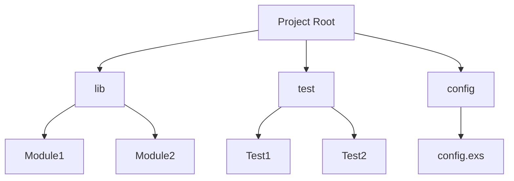

## 28.2. Code Readability and Maintainability

In the realm of software development, code readability and maintainability are paramount. They ensure that a codebase remains accessible, understandable, and adaptable over time. In the context of Elixir, a language known for its expressiveness and functional paradigm, adhering to best practices in these areas can significantly enhance the quality and longevity of your projects. Let's delve into the key aspects of achieving superior code readability and maintainability in Elixir.

### Clear Naming Conventions

**Explain the Importance of Naming Conventions**

Naming conventions are the foundation of code readability. They provide clarity and context, making it easier for developers to understand the purpose and functionality of various code components. In Elixir, where functional programming concepts are prevalent, clear naming becomes even more critical due to the declarative nature of the language.

**Using Descriptive and Consistent Names**

- **Modules and Functions**: Use descriptive names that convey the purpose and behavior of modules and functions. For instance, a module handling user authentication could be named `UserAuth`, and a function for logging in might be `login_user`.
  
- **Variables**: Choose variable names that reflect their role or the data they hold. Avoid generic names like `data` or `temp`. Instead, opt for names like `user_list` or `transaction_amount`.

- **Constants and Atoms**: Use uppercase for constants (e.g., `MAX_RETRIES`) and descriptive atoms (e.g., `:error`, `:ok`) to indicate their intended use.

**Consistency Across the Codebase**

- **Follow Established Patterns**: Consistency is key. Stick to a naming pattern across your codebase. If you use snake_case for variables, apply it uniformly. Similarly, maintain consistent naming for functions and modules.

- **Adopt Community Standards**: Elixir has a vibrant community with well-established naming conventions. Adopting these standards not only improves readability but also eases collaboration with other developers.

### Formatting Standards

**Adhering to Community Style Guides**

Elixir has a community-driven style guide that outlines best practices for formatting code. Following these guidelines ensures that your code is not only readable but also aligns with the broader Elixir ecosystem.

- **Indentation and Spacing**: Use two spaces for indentation. Ensure consistent spacing around operators and after commas for clarity.

- **Line Length**: Keep lines to a reasonable length, typically around 80 characters. This enhances readability, especially in environments with limited screen space.

- **Code Blocks and Structure**: Use blank lines to separate logical sections of code. This helps in visually organizing code and making it easier to follow.

**Using Tools for Automated Formatting**

- **`mix format`**: Elixir provides a built-in tool, `mix format`, to automatically format your code according to the community style guide. Regularly running this tool ensures that your code remains consistent and adheres to best practices.

```elixir
# Before formatting
defmodule Example do
  def add(a,b), do: a+b
end

# After running `mix format`
defmodule Example do
  def add(a, b), do: a + b
end
```

### Commenting and Documentation

**Explaining Non-Obvious Logic and Decisions**

Comments serve as a guide for future developers (including yourself) to understand the reasoning behind certain code decisions. However, comments should not be a crutch for poor code readability.

- **When to Comment**: Comment on complex algorithms, non-intuitive logic, or any decision that might not be immediately clear. Avoid commenting on obvious code, as it clutters the codebase.

- **How to Comment**: Use comments to explain the "why" rather than the "what". The code itself should be clear enough to convey its purpose.

```elixir
# This function calculates the factorial of a number using recursion.
def factorial(0), do: 1
def factorial(n) when n > 0, do: n * factorial(n - 1)
```

**Leveraging ExDoc for Documentation**

Elixir provides powerful tools for generating documentation, such as ExDoc. Proper documentation is essential for maintainability, especially in larger projects.

- **Module and Function Documentation**: Use `@moduledoc` and `@doc` attributes to document modules and functions. This provides an overview and detailed explanation of their purpose and usage.

```elixir
defmodule MathUtils do
  @moduledoc """
  Provides utility functions for mathematical operations.
  """

  @doc """
  Calculates the factorial of a given number.
  """
  def factorial(0), do: 1
  def factorial(n) when n > 0, do: n * factorial(n - 1)
end
```

- **Generating Documentation**: Use ExDoc to generate HTML documentation. This makes it easier for other developers to understand and use your code.

### Code Organization and Structure

**Modular Design**

- **Break Down Complex Modules**: Divide large modules into smaller, focused modules. This not only enhances readability but also promotes code reuse and easier testing.

- **Use Contexts in Phoenix**: In Phoenix applications, use contexts to group related functionality. This creates a clear boundary between different parts of your application.

**Consistent Project Structure**

- **Follow Standard Project Layouts**: Adhere to the standard Elixir project structure. This includes organizing files into directories like `lib`, `test`, and `config`.

- **Use Mix for Project Management**: Leverage Mix, Elixir's build tool, to manage dependencies, compile code, and run tests. This keeps your project organized and manageable.

### Effective Use of Pattern Matching

Pattern matching is a powerful feature in Elixir that can enhance code readability when used effectively.

- **Descriptive Patterns**: Use pattern matching to destructure complex data structures. This makes it clear what kind of data is expected and how it is used.

```elixir
def process_user(%User{name: name, age: age}) do
  IO.puts("Processing user #{name}, aged #{age}")
end
```

- **Avoid Overcomplicating Patterns**: While pattern matching is powerful, avoid overly complex patterns that can reduce readability. Keep patterns simple and focused.

### Error Handling and Resilience

**The "Let It Crash" Philosophy**

Elixir embraces the "let it crash" philosophy, which promotes building resilient systems that can recover from failures.

- **Use Supervisors**: In OTP applications, use supervisors to manage process lifecycles. This ensures that processes are restarted automatically in case of failure.

- **Graceful Error Handling**: While letting processes crash is encouraged, ensure that critical errors are handled gracefully to maintain system stability.

### Visualizing Code Structure

To better understand and maintain a codebase, visualizing its structure can be immensely helpful. Here, we'll use Mermaid.js to create a simple diagram illustrating a typical Elixir project structure.


```mermaid
graph TD;
    A[Project Root] --> B[lib]
    A --> C[test]
    A --> D[config]
    B --> E[Module1]
    B --> F[Module2]
    C --> G[Test1]
    C --> H[Test2]
    D --> I[config.exs]
```

**Description**: This diagram represents a typical Elixir project structure, with directories for libraries (`lib`), tests (`test`), and configuration (`config`).

### Try It Yourself

To solidify your understanding of these concepts, try the following exercises:

1. **Refactor Code**: Take a piece of code from a previous project and refactor it to improve readability and maintainability. Focus on naming conventions, formatting, and documentation.

2. **Use `mix format`**: Run `mix format` on your codebase and observe the changes. Consider how these changes improve readability.

3. **Document a Module**: Choose a module from your project and write comprehensive documentation using `@moduledoc` and `@doc` attributes. Generate the documentation using ExDoc and review it.

### Knowledge Check

Before moving on, let's review some key points:

- Naming conventions are crucial for code readability. Use descriptive and consistent names for all code components.
- Adhering to formatting standards, such as those provided by the Elixir community, ensures a clean and readable codebase.
- Comments should explain non-obvious logic and decisions, focusing on the "why" rather than the "what".
- Proper documentation using tools like ExDoc is essential for maintainability.
- Visualizing code structure can aid in understanding and maintaining complex projects.

### Summary

In this section, we've explored the importance of code readability and maintainability in Elixir development. By adhering to clear naming conventions, formatting standards, and effective commenting, you can create a codebase that is not only easy to read but also easy to maintain and extend. Remember, the goal is to write code that others can understand and build upon, fostering collaboration and innovation.

## Quiz Time!



### What is the primary purpose of using clear naming conventions in code?

- [x] To enhance code readability and provide context.
- [ ] To reduce the number of lines of code.
- [ ] To make the code run faster.
- [ ] To adhere to legal requirements.

> **Explanation:** Clear naming conventions improve readability by providing context and understanding of the code's purpose.

### Which tool in Elixir helps automate code formatting according to community standards?

- [x] `mix format`
- [ ] `elixir format`
- [ ] `code beautifier`
- [ ] `style guide`

> **Explanation:** `mix format` is the tool provided by Elixir to format code according to community standards.

### What should comments in code primarily explain?

- [x] The "why" behind the code decisions.
- [ ] The "what" of every line of code.
- [ ] The "how" the code is executed.
- [ ] The "when" the code was written.

> **Explanation:** Comments should explain the reasoning behind code decisions, not describe what the code does.

### What is the purpose of using ExDoc in Elixir?

- [x] To generate HTML documentation for modules and functions.
- [ ] To execute Elixir scripts.
- [ ] To format Elixir code.
- [ ] To compile Elixir projects.

> **Explanation:** ExDoc is used to generate HTML documentation for Elixir modules and functions.

### Why is it important to keep line lengths reasonable in code?

- [x] To enhance readability, especially in environments with limited screen space.
- [ ] To make the code execute faster.
- [ ] To comply with legal standards.
- [ ] To reduce file size.

> **Explanation:** Reasonable line lengths improve readability, making it easier to read code on various devices.

### Which Elixir philosophy promotes building resilient systems that can recover from failures?

- [x] "Let It Crash"
- [ ] "Fail Fast"
- [ ] "Never Fail"
- [ ] "Recover Quickly"

> **Explanation:** The "Let It Crash" philosophy encourages building systems that can recover from failures automatically.

### What is the role of supervisors in OTP applications?

- [x] To manage process lifecycles and restart processes in case of failure.
- [ ] To execute Elixir scripts.
- [ ] To format Elixir code.
- [ ] To compile Elixir projects.

> **Explanation:** Supervisors manage process lifecycles, ensuring processes are restarted automatically if they fail.

### What is a key benefit of breaking down complex modules into smaller ones?

- [x] It enhances readability and promotes code reuse.
- [ ] It makes the code run faster.
- [ ] It reduces the number of lines of code.
- [ ] It adheres to legal requirements.

> **Explanation:** Breaking down complex modules enhances readability and promotes code reuse and easier testing.

### What should be avoided when using pattern matching in Elixir?

- [x] Overly complex patterns that reduce readability.
- [ ] Simple patterns that are easy to understand.
- [ ] Using pattern matching in function definitions.
- [ ] Using pattern matching with guards.

> **Explanation:** Overly complex patterns can reduce readability, making the code harder to understand.

### True or False: Visualizing code structure can aid in understanding and maintaining complex projects.

- [x] True
- [ ] False

> **Explanation:** Visualizing code structure helps in understanding and maintaining complex projects by providing a clear overview.



Remember, this is just the beginning. As you progress, you'll build more complex and interactive Elixir projects. Keep experimenting, stay curious, and enjoy the journey!
