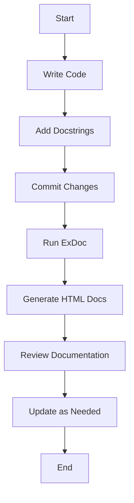

## 28.3. Effective Use of Documentation

In the world of software development, documentation is as crucial as the code itself. For Elixir developers, effective documentation not only aids in understanding and maintaining code but also enhances collaboration and knowledge sharing. In this section, we will delve into the best practices for documenting Elixir projects, focusing on writing docstrings, leveraging the ExDoc tool, and maintaining up-to-date documentation.

### Writing Docstrings

Docstrings are the backbone of any well-documented codebase. They provide essential context, usage examples, and insights into the functionality of code components. Let's explore how to write effective docstrings in Elixir.

#### Providing Context and Usage Examples

When writing docstrings, it's important to provide context and usage examples to help other developers understand the purpose and functionality of your code. Here are some guidelines:

1. **Start with a Brief Description**: Begin with a concise summary of what the function or module does. This should be a high-level overview that gives readers a quick understanding of the purpose.

2. **Include Parameter Descriptions**: Clearly describe each parameter, including its type and any constraints or expectations. This helps users understand how to use the function correctly.

3. **Explain the Return Value**: Describe what the function returns, including the type and any special cases or exceptions.

4. **Provide Usage Examples**: Include examples of how to use the function in practice. This is especially helpful for complex functions or those with multiple use cases.

5. **Highlight Important Notes**: If there are any caveats, limitations, or important considerations, make sure to highlight them in the docstring.

Here is an example of a well-documented function in Elixir:

```elixir
@doc """
Calculates the factorial of a given number.

## Parameters

  - `n`: An integer representing the number for which the factorial is to be calculated. Must be a non-negative integer.

## Returns

  - An integer representing the factorial of the given number.

## Examples

    iex> MyModule.factorial(5)
    120

    iex> MyModule.factorial(0)
    1

## Notes

  - The function will raise an `ArgumentError` if `n` is negative.
"""
def factorial(n) when n < 0 do
  raise ArgumentError, "n must be a non-negative integer"
end

def factorial(0), do: 1
def factorial(n), do: n * factorial(n - 1)
```

### ExDoc Tool

ExDoc is a powerful tool for generating HTML documentation from your Elixir codebase. It automatically extracts docstrings and compiles them into a user-friendly format. Let's explore how to use ExDoc effectively.

#### Generating HTML Documentation Automatically

1. **Install ExDoc**: Add ExDoc as a dependency in your `mix.exs` file:

   ```elixir
   defp deps do
     [
       {:ex_doc, "~> 0.25", only: :dev, runtime: false}
     ]
   end
   ```

2. **Configure ExDoc**: Configure ExDoc in your `mix.exs` file to specify the project name, version, and source URL:

   ```elixir
   def project do
     [
       app: :my_app,
       version: "0.1.0",
       elixir: "~> 1.12",
       start_permanent: Mix.env() == :prod,
       deps: deps(),
       docs: [
         main: "MyApp",
         source_url: "https://github.com/username/my_app"
       ]
     ]
   end
   ```

3. **Generate Documentation**: Run the following command to generate HTML documentation:

   ```bash
   mix docs
   ```

   This will create a `doc` directory containing the HTML files.

4. **View Documentation**: Open the `index.html` file in the `doc` directory to view the generated documentation in your web browser.

ExDoc provides a clean and organized interface for navigating through modules, functions, and types, making it easy for developers to find the information they need.

### Keeping Docs Updated

Maintaining up-to-date documentation is crucial for ensuring that your codebase remains understandable and usable. Here are some strategies for keeping your documentation current:

1. **Integrate Documentation into Your Workflow**: Make documentation a part of your development process. Update docstrings whenever you modify or add new functionality.

2. **Use Version Control**: Track changes to your documentation using version control systems like Git. This allows you to review changes and ensure consistency.

3. **Conduct Regular Reviews**: Periodically review your documentation to ensure accuracy and completeness. This can be done as part of code reviews or dedicated documentation sprints.

4. **Encourage Team Collaboration**: Foster a culture of collaboration where team members contribute to and maintain documentation. This can be facilitated through documentation guidelines and shared responsibilities.

5. **Automate Documentation Generation**: Use tools like ExDoc to automate the generation of documentation, ensuring that it is always up-to-date with the latest code changes.

### Visualizing Documentation Workflow

To better understand the documentation workflow, let's visualize the process using a flowchart.



**Description**: This flowchart illustrates the documentation workflow, starting from writing code and adding docstrings, to generating and reviewing HTML documentation using ExDoc.

### Knowledge Check

Before we move on, let's reinforce what we've learned with a few questions:

- Why is it important to provide usage examples in docstrings?
- How does ExDoc help in maintaining documentation?
- What are some strategies for keeping documentation up-to-date?

### Try It Yourself

To solidify your understanding, try the following exercises:

1. **Document a New Function**: Write a new function in Elixir and create a comprehensive docstring for it. Include parameter descriptions, return values, and usage examples.

2. **Generate Documentation with ExDoc**: Use ExDoc to generate documentation for an existing Elixir project. Explore the generated HTML files and identify areas for improvement.

3. **Review and Update Documentation**: Choose a module in your codebase and review its documentation. Update any outdated information and ensure consistency with the current code.

### Embrace the Journey

Remember, effective documentation is a journey, not a destination. As you continue to develop and maintain your Elixir projects, keep refining your documentation skills. Stay curious, collaborate with your team, and enjoy the process of creating clear and valuable documentation.

## Quiz: Effective Use of Documentation



### Why is it important to provide usage examples in docstrings?

- [x] They help users understand how to use the function in practice.
- [ ] They make the code run faster.
- [ ] They are required by ExDoc.
- [ ] They replace the need for comments in the code.

> **Explanation:** Usage examples demonstrate how to use the function, making it easier for others to understand its application.

### How does ExDoc help in maintaining documentation?

- [x] It generates HTML documentation automatically from docstrings.
- [ ] It writes docstrings for you.
- [ ] It updates the codebase automatically.
- [ ] It provides a spell-check feature.

> **Explanation:** ExDoc extracts docstrings and compiles them into HTML documentation, ensuring consistency with the codebase.

### What is a key benefit of using version control for documentation?

- [x] It allows tracking changes and ensuring consistency.
- [ ] It automatically generates docstrings.
- [ ] It provides a backup of the codebase.
- [ ] It integrates with ExDoc to generate HTML files.

> **Explanation:** Version control helps track changes in documentation, ensuring it remains consistent with code changes.

### What should be included in a docstring for a function?

- [x] A brief description, parameter descriptions, return value, usage examples, and important notes.
- [ ] Only the function's name and parameters.
- [ ] The entire function's code.
- [ ] A list of all other functions in the module.

> **Explanation:** A comprehensive docstring includes a description, parameter details, return value, examples, and notes.

### How can you ensure documentation is part of your workflow?

- [x] Update docstrings whenever modifying or adding functionality.
- [ ] Write documentation only at the end of the project.
- [ ] Use ExDoc to write docstrings.
- [ ] Ignore documentation until a major release.

> **Explanation:** Integrating documentation updates into your workflow ensures it remains current and relevant.

### What is the purpose of conducting regular documentation reviews?

- [x] To ensure accuracy and completeness.
- [ ] To generate more HTML files.
- [ ] To remove outdated code.
- [ ] To automate the documentation process.

> **Explanation:** Regular reviews help maintain the accuracy and completeness of documentation.

### How can team collaboration improve documentation?

- [x] By fostering a culture of shared responsibility and contribution.
- [ ] By assigning documentation to a single person.
- [ ] By using ExDoc exclusively.
- [ ] By avoiding documentation altogether.

> **Explanation:** Collaboration encourages team members to contribute to and maintain documentation, improving its quality.

### What is a benefit of automating documentation generation?

- [x] It ensures documentation is always up-to-date with code changes.
- [ ] It eliminates the need for docstrings.
- [ ] It writes code for you.
- [ ] It provides a spell-check feature.

> **Explanation:** Automation keeps documentation current with the latest code changes, reducing manual effort.

### What is the first step in the documentation workflow?

- [x] Write Code
- [ ] Generate HTML Docs
- [ ] Review Documentation
- [ ] Commit Changes

> **Explanation:** Writing code is the initial step in the documentation workflow, followed by adding docstrings.

### True or False: ExDoc can automatically update your codebase.

- [ ] True
- [x] False

> **Explanation:** ExDoc generates documentation from existing code but does not update the codebase itself.


