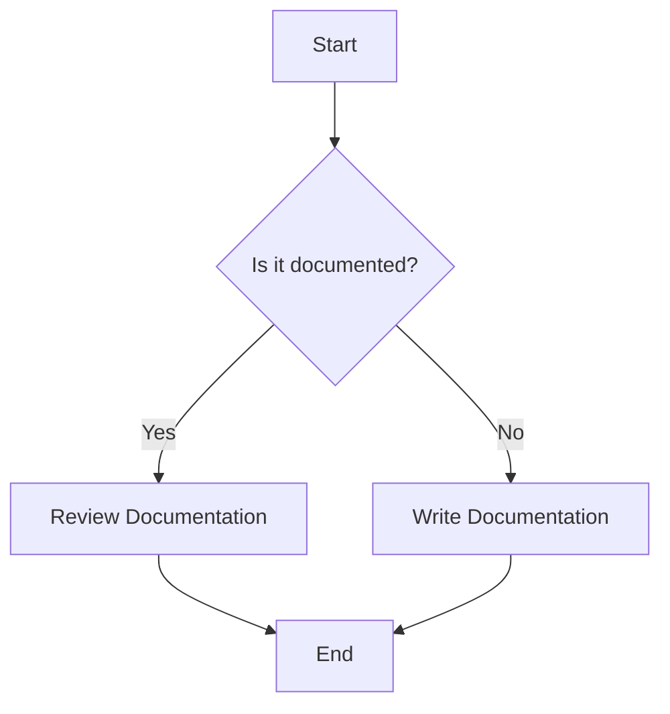

## 28.3. Effective Use of Documentation

In the realm of software development, documentation is often the unsung hero that bridges the gap between code and its users. For expert software engineers and architects working with Elixir, effective documentation is not just a best practice; it's a necessity. This section delves into the nuances of writing impactful documentation in Elixir, leveraging tools like ExDoc, and maintaining documentation that evolves with your codebase.

### Writing Docstrings

Docstrings serve as the primary method for embedding documentation directly within your code. They provide immediate context and usage examples, making it easier for developers to understand the purpose and functionality of the code at a glance.

#### Providing Context and Usage Examples

When crafting docstrings, it's crucial to provide context that explains the "why" behind the code. This involves detailing the function's purpose, its parameters, return values, and any side effects. Usage examples are equally important, as they demonstrate how to implement the function in real-world scenarios.

**Example of a Well-Documented Function:**

```elixir
defmodule MathUtils do
  @moduledoc """
  A utility module for performing basic mathematical operations.
  """

  @doc """
  Adds two numbers together.

  ## Parameters

    - `a`: The first number.
    - `b`: The second number.

  ## Examples

      iex> MathUtils.add(2, 3)
      5

      iex> MathUtils.add(-1, 1)
      0

  """
  def add(a, b) do
    a + b
  end
end
```

In this example, the `@doc` attribute provides a clear explanation of what the `add/2` function does, lists its parameters, and includes examples that illustrate its usage. This level of detail is invaluable for both current and future developers who interact with your code.

### ExDoc Tool

Elixir offers a powerful tool called ExDoc, which automatically generates HTML documentation from your codebase's docstrings. This tool is essential for creating comprehensive and navigable documentation that can be easily shared with others.

#### Generating HTML Documentation Automatically

To use ExDoc, you must first add it as a dependency in your `mix.exs` file:

```elixir
defp deps do
  [
    {:ex_doc, "~> 0.27", only: :dev, runtime: false}
  ]
end
```

After adding ExDoc, you can generate HTML documentation by running the following command:

```bash
mix docs
```

This command will create a `doc/` directory containing the generated HTML files. You can then view the documentation in your web browser, providing a user-friendly interface to explore your codebase.

**Key Features of ExDoc:**

- **Search Functionality:** Quickly find functions and modules.
- **Customizable Themes:** Tailor the look and feel of your documentation.
- **Cross-Referencing:** Link related modules and functions for easy navigation.

#### Customizing ExDoc Output

ExDoc allows for customization to fit your project's branding and needs. You can modify the generated documentation's appearance by providing a custom logo, changing the color scheme, or adding additional pages for tutorials or guides.

**Example of Customizing ExDoc:**

```elixir
# In your mix.exs file
defp docs do
  [
    main: "readme", # The main page in the generated documentation
    logo: "path/to/logo.png",
    extras: ["README.md", "CONTRIBUTING.md"]
  ]
end
```

### Keeping Docs Updated

Documentation is only as valuable as it is accurate. As your codebase evolves, it's crucial to ensure that your documentation remains up-to-date.

#### Ensuring Documentation Reflects Current Codebase

To maintain accurate documentation, consider the following practices:

- **Regular Reviews:** Schedule periodic reviews of your documentation to ensure it aligns with the current state of the code.
- **Automated Checks:** Use tools like Credo to enforce documentation standards and catch missing or outdated docstrings.
- **Version Control:** Track changes to your documentation alongside your code using Git or another version control system.

By integrating these practices into your development workflow, you can ensure that your documentation remains a reliable resource for all stakeholders.

### Visualizing Documentation

Incorporating visual elements such as diagrams, tables, or charts can significantly enhance the comprehensibility of your documentation. Visual aids help clarify complex concepts and provide a quick reference for developers.

#### Using Mermaid.js for Diagrams

Mermaid.js is a versatile tool for creating diagrams in markdown files. It supports various types of diagrams, including flowcharts, sequence diagrams, and class diagrams, making it an excellent choice for visualizing Elixir applications.

**Example of a Flowchart Using Mermaid.js:**


```mermaid
graph TD;
    A[Start] --> B{Is it documented?};
    B -- Yes --> C[Review Documentation];
    B -- No --> D[Write Documentation];
    C --> E[End];
    D --> E[End];
```

This flowchart illustrates a simple process for ensuring documentation is up-to-date. By embedding such diagrams in your documentation, you provide a visual guide that complements the written content.

### References and Further Reading

To deepen your understanding of documentation practices in Elixir, consider exploring the following resources:

- [Elixir Official Documentation](https://elixir-lang.org/docs.html)
- [ExDoc GitHub Repository](https://github.com/elixir-lang/ex_doc)
- [Credo - A Static Code Analysis Tool for Elixir](https://github.com/rrrene/credo)

These resources offer valuable insights and tools to enhance your documentation skills and ensure your Elixir projects are well-documented.

### Knowledge Check

To reinforce your understanding of effective documentation practices, consider the following questions:

1. What are the key components of a well-documented function in Elixir?
2. How can ExDoc be used to generate HTML documentation?
3. What practices can help ensure your documentation remains up-to-date?
4. How can visual elements like diagrams enhance your documentation?

### Embrace the Journey

Remember, effective documentation is a journey, not a destination. As you continue to develop your skills in Elixir, keep experimenting with different documentation techniques, stay curious, and enjoy the process of creating clear and comprehensive documentation that benefits everyone who interacts with your code.

## Quiz Time!



### What is the primary purpose of docstrings in Elixir?

- [x] To provide context and usage examples for functions and modules.
- [ ] To execute code at runtime.
- [ ] To generate random data for testing.
- [ ] To enforce coding standards.

> **Explanation:** Docstrings are used to document the purpose, parameters, and usage of functions and modules, providing context and examples.

### Which tool is used to generate HTML documentation from Elixir code?

- [x] ExDoc
- [ ] Credo
- [ ] Dialyzer
- [ ] Mix

> **Explanation:** ExDoc is the tool used to generate HTML documentation from Elixir code, based on the docstrings provided.

### How can you ensure your documentation remains up-to-date?

- [x] Regularly review and update documentation.
- [x] Use automated checks to enforce documentation standards.
- [ ] Ignore changes in the codebase.
- [ ] Only update documentation during major releases.

> **Explanation:** Regular reviews and automated checks help maintain accurate and up-to-date documentation.

### What is a benefit of using visual elements like diagrams in documentation?

- [x] They enhance understanding by providing a visual representation of concepts.
- [ ] They replace the need for written documentation.
- [ ] They increase the complexity of the documentation.
- [ ] They are only useful for beginners.

> **Explanation:** Visual elements like diagrams complement written documentation by providing a clear visual representation of complex concepts.

### What is the purpose of the `@doc` attribute in Elixir?

- [x] To document the purpose and usage of a function.
- [ ] To define a function's return type.
- [ ] To execute code during compilation.
- [ ] To enforce coding style.

> **Explanation:** The `@doc` attribute is used to provide documentation for a function, including its purpose and usage.

### Which of the following is a key feature of ExDoc?

- [x] Search functionality
- [ ] Code execution
- [ ] Data encryption
- [ ] Automated testing

> **Explanation:** ExDoc includes search functionality, allowing users to quickly find functions and modules in the generated documentation.

### How can you customize the output of ExDoc?

- [x] By modifying the `docs` function in `mix.exs`.
- [ ] By editing the source code of ExDoc.
- [ ] By using a different programming language.
- [ ] By disabling ExDoc features.

> **Explanation:** You can customize ExDoc output by modifying the `docs` function in your `mix.exs` file, specifying options like the main page and logo.

### Why is version control important for documentation?

- [x] It tracks changes to documentation alongside code changes.
- [ ] It automatically generates documentation.
- [ ] It replaces the need for written documentation.
- [ ] It enforces coding standards.

> **Explanation:** Version control is important for tracking changes to documentation, ensuring it evolves with the codebase.

### What is a common practice to maintain accurate documentation?

- [x] Schedule periodic reviews of documentation.
- [ ] Ignore documentation until the end of the project.
- [ ] Only document public functions.
- [ ] Use documentation as a substitute for code comments.

> **Explanation:** Scheduling periodic reviews helps ensure documentation remains accurate and reflects the current state of the code.

### True or False: ExDoc can be used to generate documentation for private functions.

- [ ] True
- [x] False

> **Explanation:** ExDoc is typically used to generate documentation for public functions and modules, not private ones.



By mastering the art of documentation in Elixir, you not only enhance your own understanding of the code but also contribute to a culture of clarity and collaboration within your team. Keep these principles in mind as you continue your journey in Elixir development, and you'll find that effective documentation becomes a powerful tool in your software engineering arsenal.
