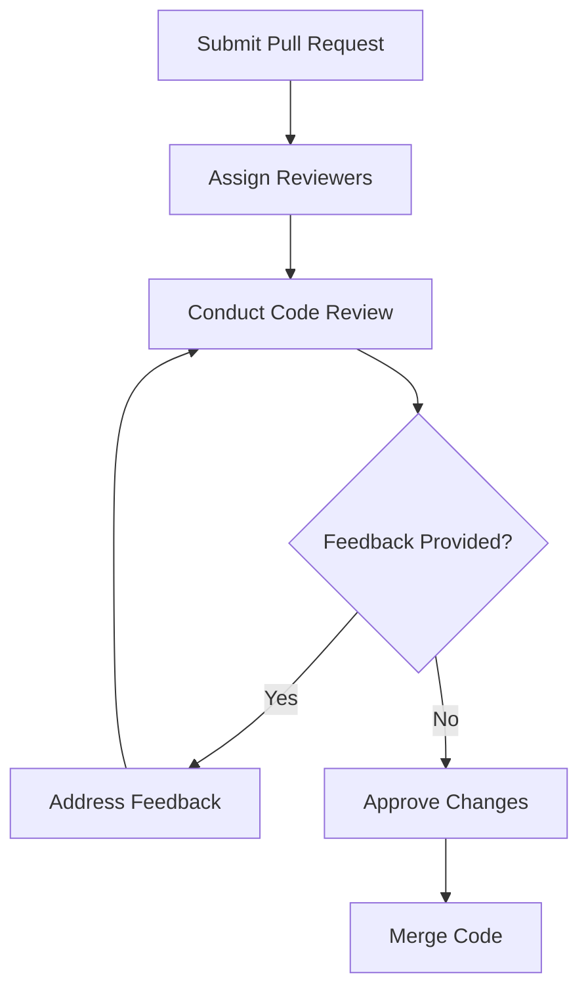

## 28.4. Collaboration and Code Review

In the realm of software development, collaboration and code review are pivotal in ensuring high-quality code and fostering a culture of continuous learning and improvement. This section delves into the best practices for collaboration and code review in Elixir development, focusing on peer reviews, communication tools, and team standards. By the end of this guide, you'll have a comprehensive understanding of how to effectively collaborate with your team and conduct thorough code reviews to enhance the quality of your Elixir projects.

### Peer Reviews

Peer reviews are a cornerstone of effective software development. They encourage knowledge sharing, catch issues early, and improve code quality. Let's explore how to conduct effective peer reviews in Elixir development.

#### Encouraging Knowledge Sharing

Peer reviews are an excellent opportunity for team members to share knowledge and learn from each other. They provide a platform for discussing different approaches to solving problems and understanding the nuances of the Elixir language.

- **Explain the Code**: Encourage developers to explain their code during reviews. This not only helps the reviewer understand the code better but also allows the author to reflect on their implementation.
- **Ask Questions**: Foster a culture where asking questions is encouraged. This can lead to deeper insights and uncover potential issues that might have been overlooked.
- **Share Insights**: Use peer reviews as a platform to share insights about Elixir's unique features and idiomatic patterns. This can help the team grow collectively and write more idiomatic Elixir code.

#### Catching Issues Early

One of the primary goals of peer reviews is to catch issues early in the development process. This can save time and resources by preventing bugs from reaching production.

- **Focus on Logic and Design**: While syntax and style are important, the primary focus of a code review should be on the logic and design of the code. Ensure that the code is solving the right problem and doing so efficiently.
- **Identify Edge Cases**: Encourage reviewers to think about edge cases and potential failure points. This can help identify scenarios that the original author might not have considered.
- **Check for Consistency**: Ensure that the code is consistent with the team's coding standards and conventions. This includes naming conventions, file structure, and use of Elixir's features like pattern matching and pipelines.

#### Providing Constructive Feedback

Providing constructive feedback is crucial for effective peer reviews. It helps developers improve their skills and fosters a positive team environment.

- **Be Specific**: Provide specific feedback rather than general comments. For example, instead of saying "This function is too complex," suggest ways to simplify it or break it down into smaller functions.
- **Be Respectful**: Always be respectful and considerate in your feedback. Remember that the goal is to improve the code, not criticize the developer.
- **Highlight Positives**: Don't forget to highlight the positive aspects of the code. Acknowledging good practices and clever solutions can boost morale and encourage developers to continue writing high-quality code.

### Communication Tools

Effective communication is key to successful collaboration and code review. Utilizing the right tools can streamline the process and ensure that everyone is on the same page.

#### Utilizing Platforms like GitHub and GitLab

Platforms like GitHub and GitLab offer robust tools for collaboration and code review. They provide features like pull requests, inline comments, and issue tracking that can enhance the review process.

- **Pull Requests**: Use pull requests to propose changes and request feedback from your team. This allows for a structured review process and keeps a record of discussions and decisions.
- **Inline Comments**: Take advantage of inline comments to provide feedback directly on specific lines of code. This makes it easier for the author to understand the context of the feedback.
- **Issue Tracking**: Use issue tracking to document bugs, feature requests, and other tasks. This helps keep the team organized and ensures that nothing falls through the cracks.

#### Real-Time Communication Tools

In addition to code review platforms, real-time communication tools like Slack or Microsoft Teams can facilitate quick discussions and decision-making.

- **Channels for Code Reviews**: Create dedicated channels for code reviews where team members can discuss feedback and ask questions. This keeps conversations organized and easily accessible.
- **Video Calls for Complex Discussions**: For complex discussions or when clarity is needed, consider using video calls. This allows for more nuanced conversations and can help resolve misunderstandings quickly.

### Team Standards

Establishing team standards is essential for maintaining consistency and quality across your codebase. It ensures that everyone is aligned and working towards the same goals.

#### Agreeing on Coding Practices and Conventions

Agreeing on coding practices and conventions is crucial for a cohesive codebase. It reduces friction during code reviews and makes it easier for team members to understand each other's code.

- **Define a Style Guide**: Create a style guide that outlines the team's coding conventions. This should cover aspects like naming conventions, indentation, and use of Elixir's features.
- **Use Linting Tools**: Use linting tools like Credo to enforce coding standards automatically. This can catch issues early and reduce the burden on reviewers.
- **Regularly Review and Update Standards**: Regularly review and update your team's standards to reflect new learnings and best practices. This ensures that your codebase remains modern and efficient.

#### Emphasizing the Importance of Documentation

Documentation is a critical aspect of collaboration and code review. It provides context and clarity, making it easier for team members to understand and work with the code.

- **Document Code Thoroughly**: Encourage developers to document their code thoroughly, including comments and documentation for functions and modules. This can help reviewers understand the code's purpose and logic.
- **Use ExDoc for Project Documentation**: Use ExDoc to generate project documentation. This provides a centralized resource for team members to reference and can improve onboarding for new developers.
- **Maintain a Knowledge Base**: Maintain a knowledge base or wiki where team members can document processes, decisions, and best practices. This can serve as a valuable resource for the team.

### Code Review Workflow

Establishing a clear code review workflow is essential for efficient collaboration. It ensures that reviews are conducted consistently and that feedback is actionable.

#### Defining the Review Process

Define a clear review process that outlines the steps involved in a code review. This should include who is responsible for reviewing code, how feedback is provided, and how changes are approved.

- **Assign Reviewers**: Assign reviewers based on expertise and availability. This ensures that the right people are reviewing the code and that reviews are conducted in a timely manner.
- **Set Review Criteria**: Define criteria for what constitutes a successful review. This can include aspects like code quality, adherence to standards, and test coverage.
- **Establish a Feedback Loop**: Establish a feedback loop where authors can respond to feedback and reviewers can verify changes. This ensures that feedback is addressed and that the code meets the team's standards.

#### Automating the Review Process

Automation can streamline the review process and reduce the burden on reviewers. Use tools and scripts to automate repetitive tasks and ensure consistency.

- **Continuous Integration (CI)**: Use CI tools to automatically run tests and checks on new code. This can catch issues early and ensure that code is always in a releasable state.
- **Automated Code Analysis**: Use tools like Dialyzer for static code analysis. This can identify potential issues and ensure that code is type-safe.
- **Pre-Commit Hooks**: Use pre-commit hooks to enforce coding standards and run tests before code is committed. This can prevent issues from entering the codebase and reduce the burden on reviewers.

### Visualizing the Code Review Process

To better understand the code review process, let's visualize it using a flowchart. This diagram illustrates the typical steps involved in a code review, from submitting a pull request to merging the code.

**Figure 1: Code Review Process Flowchart**

This flowchart provides a high-level overview of the code review process. It highlights the iterative nature of reviews, where feedback is addressed and verified before changes are approved and merged.

### Try It Yourself

To reinforce your understanding of collaboration and code review, try implementing a code review process in your team. Use the following steps as a guide:

1. **Define Your Review Process**: Outline the steps involved in a code review, including who is responsible for reviewing code and how feedback is provided.
2. **Set Up Tools**: Set up tools like GitHub or GitLab for code reviews, and configure CI tools to automate tests and checks.
3. **Conduct a Review**: Conduct a code review with your team, focusing on providing constructive feedback and catching issues early.
4. **Iterate and Improve**: Regularly review and improve your code review process to ensure it remains effective and efficient.

### Knowledge Check

Before we wrap up, let's do a quick knowledge check to reinforce what we've learned.

- **What are the benefits of peer reviews in Elixir development?**
- **How can communication tools enhance collaboration and code review?**
- **Why is it important to establish team standards for coding practices?**
- **What are some ways to automate the code review process?**

### Summary

In this section, we've explored the best practices for collaboration and code review in Elixir development. We've discussed the importance of peer reviews, the role of communication tools, and the need for team standards. By implementing these practices, you can enhance the quality of your codebase and foster a culture of continuous learning and improvement.

Remember, collaboration and code review are ongoing processes. As you continue to work with your team, keep refining your approach and embracing new tools and techniques. This is just the beginning of your journey towards mastering collaboration and code review in Elixir development.

## Quiz: Collaboration and Code Review



### What is one of the primary goals of peer reviews?

- [x] Catching issues early in the development process
- [ ] Increasing the number of lines of code
- [ ] Reducing the number of team meetings
- [ ] Eliminating the need for testing

> **Explanation:** Peer reviews aim to catch issues early, saving time and resources by preventing bugs from reaching production.

### Which tool can be used for inline comments during code reviews?

- [x] GitHub
- [ ] Slack
- [ ] Microsoft Teams
- [ ] Zoom

> **Explanation:** GitHub provides features like inline comments, which allow reviewers to provide feedback directly on specific lines of code.

### What is a benefit of using real-time communication tools like Slack?

- [x] Facilitating quick discussions and decision-making
- [ ] Replacing all email communication
- [ ] Automating code reviews
- [ ] Eliminating the need for documentation

> **Explanation:** Real-time communication tools like Slack facilitate quick discussions and decision-making, complementing the code review process.

### Why is it important to define team standards for coding practices?

- [x] To maintain consistency and quality across the codebase
- [ ] To increase the complexity of the code
- [ ] To reduce the number of team members
- [ ] To eliminate the need for code reviews

> **Explanation:** Team standards ensure consistency and quality across the codebase, making it easier for team members to understand each other's code.

### What is one way to automate the code review process?

- [x] Using Continuous Integration (CI) tools
- [ ] Increasing the number of reviewers
- [ ] Reducing the number of tests
- [ ] Eliminating feedback loops

> **Explanation:** CI tools can automate tests and checks on new code, catching issues early and ensuring that code is always in a releasable state.

### What should be the primary focus of a code review?

- [x] Logic and design of the code
- [ ] The number of comments in the code
- [ ] The length of variable names
- [ ] The number of lines of code

> **Explanation:** The primary focus of a code review should be on the logic and design of the code to ensure it solves the right problem efficiently.

### What is the purpose of using a style guide?

- [x] To outline the team's coding conventions
- [ ] To increase the number of lines of code
- [ ] To eliminate the need for documentation
- [ ] To reduce the number of team members

> **Explanation:** A style guide outlines the team's coding conventions, ensuring consistency and reducing friction during code reviews.

### How can peer reviews encourage knowledge sharing?

- [x] By providing a platform for discussing different approaches
- [ ] By reducing the number of team meetings
- [ ] By eliminating the need for documentation
- [ ] By increasing the number of lines of code

> **Explanation:** Peer reviews provide a platform for discussing different approaches, allowing team members to share knowledge and learn from each other.

### What is a benefit of using ExDoc for project documentation?

- [x] It provides a centralized resource for team members
- [ ] It eliminates the need for code comments
- [ ] It increases the number of lines of code
- [ ] It reduces the number of team members

> **Explanation:** ExDoc generates project documentation, providing a centralized resource for team members to reference and improving onboarding for new developers.

### True or False: Automating the review process can reduce the burden on reviewers.

- [x] True
- [ ] False

> **Explanation:** Automation can streamline the review process, reducing the burden on reviewers by handling repetitive tasks and ensuring consistency.


