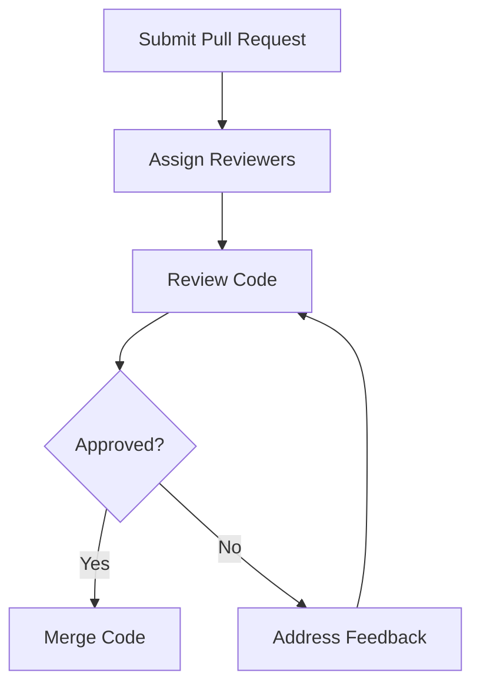

## 28.4. Collaboration and Code Review

In the world of software development, especially when working with a powerful language like Elixir, collaboration and code review are not just best practices—they are essential components of a successful project. They ensure that code is not only functional but also maintainable, scalable, and efficient. This section will guide you through the intricacies of collaboration and code review in Elixir development, providing you with strategies to enhance your team's productivity and code quality.

### Peer Reviews

Peer reviews are a cornerstone of collaborative software development. They involve having one or more colleagues examine your code before it is merged into the main codebase. The primary goals of peer reviews are to catch bugs early, ensure adherence to coding standards, and facilitate knowledge sharing among team members.

#### Benefits of Peer Reviews

1. **Knowledge Sharing**: Peer reviews are an excellent opportunity for team members to learn from each other. They expose developers to different coding styles and problem-solving approaches, fostering a culture of continuous learning.

2. **Early Bug Detection**: By having multiple eyes on the code, potential issues can be identified and addressed before they become larger problems. This leads to more stable and reliable software.

3. **Consistency and Standards**: Peer reviews help ensure that all code adheres to the team's coding standards and best practices, resulting in a more consistent and maintainable codebase.

4. **Improved Code Quality**: Regular reviews encourage developers to write cleaner, more efficient code, knowing that their work will be scrutinized by peers.

#### Conducting Effective Peer Reviews

To maximize the benefits of peer reviews, it is important to conduct them effectively. Here are some tips:

- **Set Clear Objectives**: Before starting a review, clarify what you are looking for. This could include checking for adherence to coding standards, identifying potential bugs, or suggesting performance improvements.

- **Focus on the Code, Not the Coder**: Keep the review objective and constructive. Focus on the code itself rather than the person who wrote it.

- **Limit the Scope**: Reviewing too much code at once can be overwhelming and counterproductive. Limit the scope of each review to a manageable amount of code.

- **Use a Checklist**: Having a checklist of common issues to look for can help streamline the review process and ensure consistency.

- **Encourage Discussion**: Use the review process as an opportunity to discuss different approaches and solutions. This can lead to better code and a more cohesive team.

### Communication Tools

Effective communication is crucial for successful collaboration and code review. Utilizing the right tools can facilitate seamless communication and ensure that everyone is on the same page.

#### GitHub and GitLab

Platforms like GitHub and GitLab are popular choices for code hosting and collaboration. They offer a range of features that make them ideal for managing code reviews and facilitating team communication.

- **Pull Requests**: These allow developers to propose changes to the codebase, which can then be reviewed and discussed by the team. Pull requests provide a centralized place for feedback and discussions.

- **Issue Tracking**: Both GitHub and GitLab offer robust issue tracking systems that help teams manage tasks, bugs, and feature requests. This ensures that everyone is aware of what needs to be done and can prioritize accordingly.

- **Code Comments**: Inline comments on pull requests enable reviewers to provide specific feedback on individual lines of code, making it easier to address issues and suggestions.

- **Notifications and Mentions**: These features help keep team members informed about relevant discussions and changes, ensuring that nothing falls through the cracks.

#### Other Communication Tools

In addition to code hosting platforms, other tools can enhance team communication and collaboration:

- **Slack**: A popular messaging platform that allows for real-time communication and integration with other tools, making it easy to keep everyone connected.

- **Trello**: A visual project management tool that helps teams organize tasks and track progress.

- **Zoom**: Video conferencing software that enables face-to-face meetings, which can be particularly useful for remote teams.

### Team Standards

Establishing team standards is essential for maintaining consistency and quality across the codebase. These standards should cover coding practices, conventions, and processes for collaboration and code review.

#### Developing Team Standards

1. **Involve the Team**: When developing standards, involve the entire team in the process. This ensures buy-in and helps create standards that are practical and applicable to everyone’s workflow.

2. **Document Standards**: Clearly document all standards and make them easily accessible to the team. This could be in the form of a style guide or a shared document.

3. **Regularly Review and Update**: Standards should be reviewed and updated regularly to reflect changes in technology, team structure, or project requirements.

#### Key Areas for Team Standards

- **Coding Style**: Define a consistent coding style that covers aspects such as indentation, naming conventions, and file organization. This makes the codebase easier to read and maintain.

- **Commit Messages**: Establish guidelines for writing clear and informative commit messages. This helps team members understand the history and context of changes.

- **Branching Strategy**: Decide on a branching strategy that suits your team's workflow, whether it's Git Flow, GitHub Flow, or another approach.

- **Code Review Process**: Outline the process for code reviews, including who should review code, what to look for, and how to provide feedback.

### Code Example: Implementing a Code Review Checklist

To illustrate the concept of a code review checklist, let's create a simple checklist in Elixir. This checklist can be used by developers to ensure that their code meets the team's standards before submitting it for review.

```elixir
defmodule CodeReviewChecklist do
  @moduledoc """
  A checklist for code reviews to ensure consistency and quality.
  """

  @checklist [
    "Adheres to coding style",
    "Includes tests for new features",
    "No hard-coded values",
    "Proper error handling",
    "No commented-out code",
    "Descriptive variable names",
    "Clear and concise commit messages"
  ]

  @doc """
  Prints the code review checklist.
  """
  def print_checklist do
    IO.puts("Code Review Checklist:")
    Enum.each(@checklist, fn item ->
      IO.puts("- #{item}")
    end)
  end
end

# Usage
CodeReviewChecklist.print_checklist()
```

This simple module provides a checklist that developers can use to self-review their code before submitting it for peer review. By incorporating such checklists, teams can ensure that all code meets a minimum standard of quality and consistency.

### Visualizing the Code Review Process

To better understand the code review process, let's visualize it using a flowchart. This diagram will illustrate the typical steps involved in a code review, from submitting a pull request to merging the code into the main branch.


```mermaid
graph TD;
    A[Submit Pull Request] --> B[Assign Reviewers];
    B --> C[Review Code];
    C --> D{Approved?};
    D -- Yes --> E[Merge Code];
    D -- No --> F[Address Feedback];
    F --> C;
```

**Diagram Description**: This flowchart illustrates the code review process. It begins with submitting a pull request, followed by assigning reviewers. The code is then reviewed, and if approved, it is merged into the main branch. If not approved, feedback is addressed, and the code is reviewed again.

### Encouraging a Collaborative Culture

Creating a collaborative culture is key to successful code reviews and overall team success. Here are some strategies to foster collaboration:

- **Encourage Open Communication**: Create an environment where team members feel comfortable sharing ideas and feedback. This can lead to more innovative solutions and a stronger team dynamic.

- **Recognize Contributions**: Acknowledge and celebrate the contributions of team members, whether it's a successful code review or a creative solution to a problem.

- **Provide Learning Opportunities**: Encourage team members to learn from each other through pair programming, workshops, or mentorship programs.

- **Foster Inclusivity**: Ensure that all team members, regardless of experience level or background, feel valued and included in the development process.

### Try It Yourself: Enhance the Code Review Checklist

Now that we've covered the basics of a code review checklist, try enhancing it with additional items that are relevant to your team's standards. Consider including items related to security, performance, or specific project requirements.

```elixir
defmodule EnhancedCodeReviewChecklist do
  @moduledoc """
  An enhanced checklist for code reviews with additional items.
  """

  @checklist [
    "Adheres to coding style",
    "Includes tests for new features",
    "No hard-coded values",
    "Proper error handling",
    "No commented-out code",
    "Descriptive variable names",
    "Clear and concise commit messages",
    "Security considerations",
    "Performance optimizations",
    "Documentation updated"
  ]

  @doc """
  Prints the enhanced code review checklist.
  """
  def print_checklist do
    IO.puts("Enhanced Code Review Checklist:")
    Enum.each(@checklist, fn item ->
      IO.puts("- #{item}")
    end)
  end
end

# Usage
EnhancedCodeReviewChecklist.print_checklist()
```

### Knowledge Check

To reinforce your understanding of the concepts covered in this section, consider the following questions:

- What are the key benefits of peer reviews?
- How can communication tools like GitHub and Slack enhance collaboration?
- Why is it important to establish team standards for coding style and commit messages?
- How can a code review checklist improve the quality of code?

### Summary

In this section, we've explored the importance of collaboration and code review in Elixir development. By implementing effective peer reviews, utilizing communication tools, and establishing team standards, you can enhance your team's productivity and code quality. Remember, collaboration is not just about sharing code—it's about sharing knowledge, ideas, and a commitment to excellence.

### Embrace the Journey

As you continue your journey in Elixir development, remember that collaboration and code review are ongoing processes. They require continuous learning, adaptation, and a willingness to embrace feedback. Keep experimenting, stay curious, and enjoy the journey!

## Quiz Time!



### What is one of the primary goals of peer reviews?

- [x] Early bug detection
- [ ] Increasing code complexity
- [ ] Reducing team communication
- [ ] Encouraging individual work

> **Explanation:** Peer reviews help catch bugs early, ensuring more stable and reliable software.

### Which tool is commonly used for hosting code and facilitating code reviews?

- [x] GitHub
- [ ] Microsoft Word
- [ ] Adobe Photoshop
- [ ] Google Sheets

> **Explanation:** GitHub is a popular platform for code hosting and collaboration, offering features like pull requests and issue tracking.

### What should be the focus of a code review?

- [x] The code itself
- [ ] The person who wrote the code
- [ ] The project manager
- [ ] The company's financials

> **Explanation:** Code reviews should focus on the code, not the coder, to maintain objectivity and constructiveness.

### What is a benefit of using a code review checklist?

- [x] Ensures consistency and quality
- [ ] Increases code size
- [ ] Decreases team morale
- [ ] Reduces code readability

> **Explanation:** A code review checklist helps ensure that all code meets a minimum standard of quality and consistency.

### Which of the following is a communication tool that can enhance team collaboration?

- [x] Slack
- [ ] Notepad
- [ ] Paint
- [ ] Solitaire

> **Explanation:** Slack is a messaging platform that allows for real-time communication and integration with other tools.

### What is an important aspect of developing team standards?

- [x] Involving the entire team
- [ ] Ignoring team input
- [ ] Focusing only on individual preferences
- [ ] Avoiding documentation

> **Explanation:** Involving the entire team in developing standards ensures buy-in and practicality.

### How can peer reviews facilitate knowledge sharing?

- [x] By exposing developers to different coding styles
- [ ] By keeping code secret
- [ ] By reducing communication
- [ ] By focusing only on individual work

> **Explanation:** Peer reviews expose developers to different coding styles and problem-solving approaches, fostering a culture of continuous learning.

### What should be included in a code review checklist?

- [x] Adherence to coding style
- [ ] Personal opinions
- [ ] Project deadlines
- [ ] Financial reports

> **Explanation:** A code review checklist should include items like adherence to coding style, proper error handling, and descriptive variable names.

### What is a key benefit of using communication tools like GitHub and Slack?

- [x] Facilitating seamless communication
- [ ] Increasing project costs
- [ ] Reducing code quality
- [ ] Limiting team interaction

> **Explanation:** Communication tools like GitHub and Slack facilitate seamless communication, ensuring that everyone is on the same page.

### True or False: A collaborative culture is not important for successful code reviews.

- [ ] True
- [x] False

> **Explanation:** A collaborative culture is essential for successful code reviews, as it encourages open communication and knowledge sharing.


