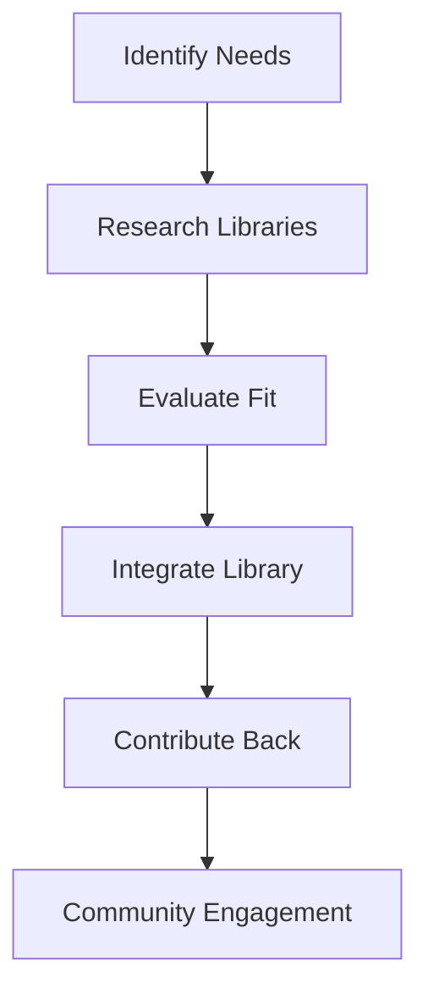

## 28.5. Leveraging Community Libraries and Tools

In the vibrant ecosystem of Elixir, community libraries and tools play a pivotal role in accelerating development, enhancing code quality, and fostering innovation. As expert software engineers and architects, understanding how to effectively leverage these resources can significantly impact the success of your projects. This section delves into the best practices for utilizing community libraries and tools in Elixir development, focusing on reusing solutions, assessing libraries, and contributing to the community.

### Reusing Solutions

#### Leveraging Existing Libraries

One of the primary advantages of using community libraries is the ability to avoid reinventing the wheel. By leveraging existing solutions, you can focus on the unique aspects of your application rather than spending time on common functionalities. Here are some key points to consider:

- **Identify Common Needs**: Determine the common functionalities in your application that can be addressed by existing libraries, such as authentication, data validation, or API integration.
- **Research Available Libraries**: Explore platforms like [Hex.pm](https://hex.pm/) to find libraries that match your needs. Hex is the package manager for the Erlang ecosystem, including Elixir, and provides a comprehensive repository of community-contributed packages.
- **Evaluate Library Fit**: Ensure the library aligns with your project's architecture and design patterns. Consider factors such as compatibility with your Elixir version, ease of integration, and the library's API design.

#### Code Example: Using a JSON Library

Let's consider an example of using a JSON library in Elixir. The `Jason` library is a popular choice for JSON parsing and encoding.

```elixir
# Add Jason to your mix.exs dependencies
defp deps do
  [
    {:jason, "~> 1.2"}
  ]
end

# Run mix deps.get to fetch the library
# Use Jason to encode and decode JSON

# Encoding a map to JSON
map = %{name: "Elixir", type: "Programming Language"}
json = Jason.encode!(map)
IO.puts(json) # Output: {"name":"Elixir","type":"Programming Language"}

# Decoding JSON to a map
decoded_map = Jason.decode!(json)
IO.inspect(decoded_map) # Output: %{"name" => "Elixir", "type" => "Programming Language"}
```

In this example, we demonstrate how to add the `Jason` library to your project and use it for JSON encoding and decoding. This simple integration saves time and effort compared to implementing JSON handling from scratch.

#### Try It Yourself

Experiment with the `Jason` library by modifying the code to handle more complex JSON structures, such as nested objects or arrays. This exercise will help you understand the library's capabilities and limitations.

### Assessing Libraries

#### Checking for Community Adoption

Before integrating a library into your project, it's crucial to assess its community adoption. A well-adopted library is more likely to be reliable, well-documented, and actively maintained. Consider the following factors:

- **Popularity**: Check the number of downloads and stars on platforms like Hex and GitHub. A popular library is often a sign of trust and reliability.
- **Community Engagement**: Look for active discussions, issues, and pull requests on the library's GitHub repository. An engaged community indicates ongoing support and development.

#### Maintenance and Documentation

A library's maintenance status and documentation quality are critical for long-term success. Here's how to evaluate these aspects:

- **Maintenance**: Check the frequency of commits and releases. A regularly updated library is more likely to be compatible with the latest Elixir versions and security patches.
- **Documentation**: Review the library's documentation for clarity and completeness. Well-documented libraries provide clear usage examples, API references, and troubleshooting guides.

#### Code Example: Assessing a Library

Let's assess the `Plug` library, a popular choice for building web applications in Elixir.

```elixir
# Visit the Plug GitHub repository: https://github.com/elixir-plug/plug
# Check the number of stars, forks, and contributors
# Review the issues and pull requests for community engagement
# Examine the documentation at https://hexdocs.pm/plug/Plug.html

# Example of using Plug in a simple web application
defmodule MyApp do
  use Plug.Router

  plug :match
  plug :dispatch

  get "/" do
    send_resp(conn, 200, "Welcome to MyApp!")
  end

  # Start the Plug adapter
  def start do
    Plug.Cowboy.http MyApp, []
  end
end
```

In this example, we demonstrate how to assess the `Plug` library by reviewing its GitHub repository and documentation. We also provide a simple code snippet to illustrate its usage in a web application.

#### Try It Yourself

Explore the `Plug` library further by implementing additional routes and middleware in the example application. Experiment with different Plug modules to understand their functionality and use cases.

### Contribution

#### Submitting Improvements or Reporting Issues

Contributing to community libraries is a valuable way to give back to the Elixir ecosystem and improve the tools you rely on. Here are some ways to contribute:

- **Submit Improvements**: If you identify areas for improvement in a library, consider submitting a pull request with your changes. Ensure your contributions align with the library's coding standards and guidelines.
- **Report Issues**: If you encounter bugs or issues, report them to the library maintainers. Provide detailed information, including steps to reproduce the issue, expected behavior, and any relevant code snippets.

#### Code Example: Contributing to a Library

Let's consider contributing to the `Ecto` library, a popular database wrapper and query generator for Elixir.

```elixir
# Fork the Ecto repository on GitHub: https://github.com/elixir-ecto/ecto
# Clone your forked repository to your local machine
git clone https://github.com/your-username/ecto.git

# Create a new branch for your changes
git checkout -b my-feature-branch

# Make your changes and commit them
git commit -m "Add feature X to Ecto"

# Push your changes to your forked repository
git push origin my-feature-branch

# Submit a pull request to the original Ecto repository
```

In this example, we outline the steps for contributing to the `Ecto` library by forking the repository, making changes, and submitting a pull request.

#### Try It Yourself

Identify a library you frequently use and explore its GitHub repository. Look for open issues or feature requests that align with your expertise and consider contributing to the project.

### Visualizing the Process

To better understand the process of utilizing community libraries and tools, let's visualize the workflow using a Mermaid.js diagram.



**Figure 1: Workflow for Utilizing Community Libraries and Tools**

This diagram illustrates the process of identifying needs, researching and evaluating libraries, integrating them into your project, and contributing back to the community. Engaging with the community is an ongoing process that fosters collaboration and innovation.

### References and Links

- [Hex.pm](https://hex.pm/): The package manager for the Erlang ecosystem, including Elixir.
- [GitHub](https://github.com/): A platform for hosting and collaborating on open-source projects.
- [Plug Documentation](https://hexdocs.pm/plug/Plug.html): Official documentation for the Plug library.
- [Ecto GitHub Repository](https://github.com/elixir-ecto/ecto): The GitHub repository for the Ecto library.

### Knowledge Check

- What are the benefits of leveraging existing libraries in Elixir development?
- How can you assess the community adoption of a library?
- What are some ways to contribute to community libraries?

### Embrace the Journey

Remember, utilizing community libraries and tools is just the beginning. As you progress, you'll discover new ways to enhance your development process and contribute to the Elixir ecosystem. Keep experimenting, stay curious, and enjoy the journey!

### Summary

In this section, we've explored the best practices for utilizing community libraries and tools in Elixir development. By reusing solutions, assessing libraries, and contributing to the community, you can enhance your productivity, code quality, and impact on the Elixir ecosystem.

## Quiz: Leveraging Community Libraries and Tools



### What is one primary advantage of using community libraries in Elixir development?

- [x] Avoiding reinventing the wheel
- [ ] Increasing code complexity
- [ ] Reducing code readability
- [ ] Limiting project scalability

> **Explanation:** Community libraries provide existing solutions to common problems, allowing developers to focus on unique aspects of their applications.

### Which platform is commonly used to find Elixir libraries?

- [x] Hex.pm
- [ ] NPM
- [ ] Maven
- [ ] PyPI

> **Explanation:** Hex.pm is the package manager for the Erlang ecosystem, including Elixir, and provides a repository of community-contributed packages.

### What should you check to assess a library's community adoption?

- [x] Number of downloads and stars
- [ ] Library's color scheme
- [ ] Number of lines of code
- [ ] Library's logo design

> **Explanation:** The number of downloads and stars on platforms like Hex and GitHub indicate a library's popularity and trustworthiness.

### What is a sign of a well-maintained library?

- [x] Regular updates and commits
- [ ] Lack of documentation
- [ ] High number of issues
- [ ] Infrequent releases

> **Explanation:** Regular updates and commits suggest that a library is actively maintained and likely to be compatible with the latest Elixir versions.

### How can you contribute to a community library?

- [x] Submitting pull requests
- [ ] Ignoring issues
- [x] Reporting bugs
- [ ] Deleting the repository

> **Explanation:** Contributing to a library can involve submitting pull requests with improvements or reporting bugs to maintainers.

### What is the first step in the workflow for utilizing community libraries?

- [x] Identify common needs
- [ ] Integrate the library
- [ ] Contribute back
- [ ] Evaluate fit

> **Explanation:** Identifying common needs helps determine which functionalities can be addressed by existing libraries.

### What tool is used for JSON parsing and encoding in Elixir?

- [x] Jason
- [ ] Plug
- [x] Poison
- [ ] Ecto

> **Explanation:** Jason is a popular library for JSON parsing and encoding in Elixir.

### What should you do if you encounter a bug in a library?

- [x] Report it to the maintainers
- [ ] Ignore it
- [ ] Delete the library
- [ ] Rewrite the library

> **Explanation:** Reporting bugs to maintainers helps improve the library and benefits the community.

### What is the purpose of the Mermaid.js diagram in this section?

- [x] Visualizing the workflow for utilizing libraries
- [ ] Displaying code snippets
- [ ] Illustrating JSON parsing
- [ ] Showing library documentation

> **Explanation:** The Mermaid.js diagram visualizes the process of identifying needs, researching libraries, evaluating fit, integrating libraries, and contributing back to the community.

### True or False: Contributing to community libraries is only beneficial for the library maintainers.

- [ ] True
- [x] False

> **Explanation:** Contributing to community libraries benefits both the maintainers and the contributors by improving the tools and fostering collaboration.


